## MongoDB

### Install

* mongodb-org-4.0.5-1.el7.x86_64
* mongodb-org-server-4.0.5-1.el7.x86_64
* mongodb-org-mongos-4.0.5-1.el7.x86_64
* mongodb-org-tools-4.0.5-1.el7.x86_64
* mongodb-org-shell-4.0.5-1.el7.x86_64

```
[root@dc01 ~]# rpm -ql mongodb-org-4.0.5-1.el7.x86_64
(没有包含文件)
[root@dc01 ~]# 
[root@dc01 ~]# rpm -ql mongodb-org-server-4.0.5-1.el7.x86_64
/etc/mongod.conf
/lib/systemd/system/mongod.service
/usr/bin/mongod
/usr/share/doc/mongodb-org-server-4.0.5
/usr/share/doc/mongodb-org-server-4.0.5/LICENSE-Community.txt
/usr/share/doc/mongodb-org-server-4.0.5/MPL-2
/usr/share/doc/mongodb-org-server-4.0.5/README
/usr/share/doc/mongodb-org-server-4.0.5/THIRD-PARTY-NOTICES
/usr/share/man/man1/mongod.1
/var/lib/mongo
/var/log/mongodb
/var/log/mongodb/mongod.log
/var/run/mongodb
[root@dc01 ~]# 
[root@dc01 ~]# rpm -ql mongodb-org-mongos-4.0.5-1.el7.x86_64
/usr/bin/mongos
/usr/share/man/man1/mongos.1
[root@dc01 ~]# 
[root@dc01 ~]# rpm -ql mongodb-org-tools-4.0.5-1.el7.x86_64
/usr/bin/bsondump
/usr/bin/install_compass
/usr/bin/mongodump
/usr/bin/mongoexport
/usr/bin/mongofiles
/usr/bin/mongoimport
/usr/bin/mongorestore
/usr/bin/mongostat
/usr/bin/mongotop
/usr/share/man/man1/bsondump.1
/usr/share/man/man1/mongodump.1
/usr/share/man/man1/mongoexport.1
/usr/share/man/man1/mongofiles.1
/usr/share/man/man1/mongoimport.1
/usr/share/man/man1/mongorestore.1
/usr/share/man/man1/mongostat.1
/usr/share/man/man1/mongotop.1
[root@dc01 ~]# 
[root@dc01 ~]# rpm -ql mongodb-org-shell-4.0.5-1.el7.x86_64
/usr/bin/mongo
/usr/share/man/man1/mongo.1
[root@dc01 ~]# 
[root@dc01 ~]# 

```

### Cluster

MongoDB Cluster Architecture：



```
# 在每台机器上执行下列命令启动相应进程

mkdir -p /var/lib/mongodb/set01
mkdir -p /var/lib/mongodb/set02
mkdir -p /var/lib/mongodb/set03
mkdir -p /var/lib/mongodb/set04
mkdir -p /var/lib/mongodb/set05
touch /var/log/mongodb/set01-24001.log
touch /var/log/mongodb/set02-24002.log
touch /var/log/mongodb/set02-24003.log
touch /var/log/mongodb/set02-24004.log
touch /var/log/mongodb/set02-24005.log
mkdir -p /var/lib/mongodb/config
touch /var/log/mongodb/config.log
touch /var/log/mongodb/mongos.log

# 启动数据进程（不同版本支持的命令选项有可能不一样）
nohup mongod --shardsvr --replSet set01 --port 24001 --dbpath /var/lib/mongodb/set01 --logpath /var/log/mongodb/set01-24001.log --logappend --oplogSize 1024 &

nohup mongod --shardsvr --replSet set02 --port 24002 --dbpath /var/lib/mongodb/set02 --logpath /var/log/mongodb/set02-24002.log --logappend --oplogSize 1024 &

nohup mongod --shardsvr --replSet set03 --port 24003 --dbpath /var/lib/mongodb/set03 --logpath /var/log/mongodb/set02-24003.log --logappend --oplogSize 1024 &

nohup mongod --shardsvr --replSet set04 --port 24004 --dbpath /var/lib/mongodb/set04 --logpath /var/log/mongodb/set02-24004.log --logappend --oplogSize 1024 &

nohup mongod --shardsvr --replSet set05 --port 24005 --dbpath /var/lib/mongodb/set05 --logpath /var/log/mongodb/set02-24005.log --logappend --oplogSize 1024 &

# 启动配置进程
nohup mongod --configsvr --port 28017 --dbpath /var/lib/mongodb/config --logpath /var/log/mongodb/config.log &

# 启动路由进程（直接添加配置进程）
nohup mongos --port 27017 --configdb "conf/mongos-01:28017,mongos-02:28017,mongos-03:28017" --logpath /var/log/mongodb/mongos.log & 

# 配置分片
mongo --port 28017
> sh.addShard("set01/127.0.0.1:24001")
> sh.addShard("set02/127.0.0.1:24002")
> sh.addShard("set03/127.0.0.1:24003")
> sh.addShard("set04/127.0.0.1:24004")
> sh.addShard("set05/127.0.0.1:24005")

# 配置数据库启用分片和设置分片键
mongo --port 28017
> db.runCommand({enableSharding: "database_name"})
> db.runCommand({shardCollection: "database_name.table_name", key: {"field_name": 1}})


mongos-01：10.12.109.175
mongos-01：10.12.109.176
mongos-01：10.12.109.178

# 在每台机器上执行下列命令 Create the Config Server Replica Set
nohup mongod --configsvr --bind_ip_all --port 28017 --replSet configSet --dbpath /var/lib/mongodb/config --logpath /var/log/mongodb/config.log &

# Connect to one of the config servers
mongo --host 10.12.109.176 --port 28017

# Initiate the replica set
rs.initiate(
  {
    _id: "configSet",
    configsvr: true,
    members: [
      { _id : 0, host : "10.12.109.175:28017" },
      { _id : 1, host : "10.12.109.176:28017" },
      { _id : 2, host : "10.12.109.178:28017" }
    ]
  }
)

# 在每台机器上执行下列命令 Create the Shard Replica Sets
nohup mongod --shardsvr --replSet set01 --bind_ip_all --port 24001 --dbpath /var/lib/mongodb/set01 --logpath /var/log/mongodb/set01-24001.log --logappend --oplogSize 1024 &

nohup mongod --shardsvr --replSet set02 --bind_ip_all --port 24002 --dbpath /var/lib/mongodb/set02 --logpath /var/log/mongodb/set02-24002.log --logappend --oplogSize 1024 &

nohup mongod --shardsvr --replSet set03 --bind_ip_all --port 24003 --dbpath /var/lib/mongodb/set03 --logpath /var/log/mongodb/set02-24003.log --logappend --oplogSize 1024 &

nohup mongod --shardsvr --replSet set04 --bind_ip_all --port 24004 --dbpath /var/lib/mongodb/set04 --logpath /var/log/mongodb/set02-24004.log --logappend --oplogSize 1024 &

nohup mongod --shardsvr --replSet set05 --bind_ip_all --port 24005 --dbpath /var/lib/mongodb/set05 --logpath /var/log/mongodb/set02-24005.log --logappend --oplogSize 1024 &

# Connect to one member of the shard replica set
mongo --host 10.12.109.176 --port 24001

# Initiate the replica set
rs.initiate(
  {
    _id : "set01",
    members: [
	  { _id : 0, host : "10.12.109.175:24001" },
      { _id : 1, host : "10.12.109.176:24001" },
      { _id : 2, host : "10.12.109.178:24001" }
    ]
  }
)

# Connect to one member of the shard replica set
mongo --host 10.12.109.176 --port 24002

# Initiate the replica set
rs.initiate(
  {
    _id : "set02",
    members: [
	  { _id : 0, host : "10.12.109.175:24002" },
      { _id : 1, host : "10.12.109.176:24002" },
      { _id : 2, host : "10.12.109.178:24002" }
    ]
  }
)

# Connect to one member of the shard replica set
mongo --host 10.12.109.176 --port 24003

# Initiate the replica set
rs.initiate(
  {
    _id : "set03",
    members: [
	  { _id : 0, host : "10.12.109.175:24003" },
      { _id : 1, host : "10.12.109.176:24003" },
      { _id : 2, host : "10.12.109.178:24003" }
    ]
  }
)

# Connect to one member of the shard replica set
mongo --host 10.12.109.176 --port 24004

# Initiate the replica set
rs.initiate(
  {
    _id : "set04",
    members: [
	  { _id : 0, host : "10.12.109.175:24004" },
      { _id : 1, host : "10.12.109.176:24004" },
      { _id : 2, host : "10.12.109.178:24004" }
    ]
  }
)

# Connect to one member of the shard replica set
mongo --host 10.12.109.176 --port 24005

# Initiate the replica set
rs.initiate(
  {
    _id : "set05",
    members: [
	  { _id : 0, host : "10.12.109.175:24005" },
      { _id : 1, host : "10.12.109.176:24005" },
      { _id : 2, host : "10.12.109.178:24005" }
    ]
  }
)


# Connect a mongos to the Sharded Cluster
nohup mongos --bind_ip_all --port 27017 --configdb "configSet/10.12.109.175:28017,10.12.109.176:28017,10.12.109.178:28017" --logpath /var/log/mongodb/mongos.log & 

# Connect to one of the mongos servers
mongo --host 10.12.109.176 --port 27017

# Add Shards to the Cluster
sh.addShard( "set01/10.12.109.175:24001")
sh.addShard( "set01/10.12.109.176:24001")
sh.addShard( "set01/10.12.109.178:24001")

sh.addShard( "set02/10.12.109.175:24002")
sh.addShard( "set02/10.12.109.176:24002")
sh.addShard( "set02/10.12.109.178:24002")

sh.addShard( "set03/10.12.109.175:24003")
sh.addShard( "set03/10.12.109.176:24003")
sh.addShard( "set03/10.12.109.178:24003")

sh.addShard( "set04/10.12.109.175:24004")
sh.addShard( "set04/10.12.109.176:24004")
sh.addShard( "set04/10.12.109.178:24004")

sh.addShard( "set05/10.12.109.175:24005")
sh.addShard( "set05/10.12.109.176:24005")
sh.addShard( "set05/10.12.109.178:24005")

# Enable Sharding for a Database
sh.enableSharding("<database>")

# Shard a Collection
sh.shardCollection("<database>.<collection>", { <key> : <direction> } )

```

