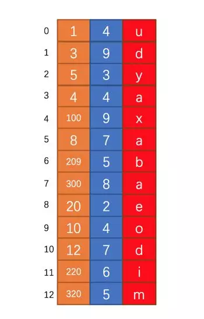
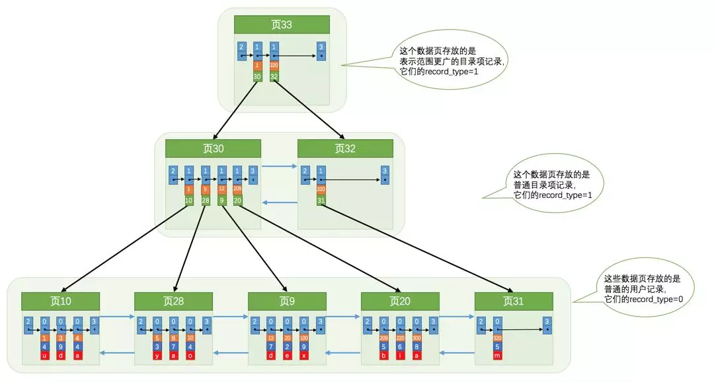

## MyISAM 和 InnoDB 的区别

### MyISAM

### InnoDB

1. MySQL默认采用的是MyISAM。

2. MyISAM不支持事务，而InnoDB支持。InnoDB的AUTOCOMMIT默认是打开的，即每条SQL语句会默认被封装成一个事务，自动提交，这样会影响速度，所以最好是把多条SQL语句显示放在begin和commit之间，组成一个事务去提交。

3. InnoDB支持数据行锁定，MyISAM不支持行锁定，只支持锁定整个表。即MyISAM同一个表上的读锁和写锁是互斥的，MyISAM并发读写时如果等待队列中既有读请求又有写请求，默认写请求的优先级高，即使读请求先到，所以MyISAM不适合于有大量查询和修改并存的情况，那样查询进程会长时间阻塞。因为MyISAM是锁表，所以某项读操作比较耗时会使其他写进程饿死。

4. InnoDB支持外键，MyISAM不支持。

5. InnoDB的主键范围更大，最大是MyISAM的2倍。

6. InnoDB不支持全文索引，而MyISAM支持。全文索引是指对char、varchar和text中的每个词（停用词除外）建立倒排序索引。MyISAM的全文索引其实没啥用，因为它不支持中文分词，必须由使用者分词后加入空格再写到数据表里，而且少于4个汉字的词会和停用词一样被忽略掉。

7. MyISAM支持GIS数据，InnoDB不支持。即MyISAM支持以下空间数据对象：Point,Line,Polygon,Surface等。

8. 没有where的count(*)使用MyISAM要比InnoDB快得多。因为MyISAM内置了一个计数器，count(*)时它直接从计数器中读，而InnoDB必须扫描全表。所以在InnoDB上执行count(*)时一般要伴随where，且where中要包含主键以外的索引列。为什么这里特别强调“主键以外”？因为InnoDB中primary index是和raw data存放在一起的，而secondary index则是单独存放，然后有个指针指向primary key。所以只是count(*)的话使用secondary index扫描更快，而primary key则主要在扫描索引同时要返回raw data时的作用较大。
