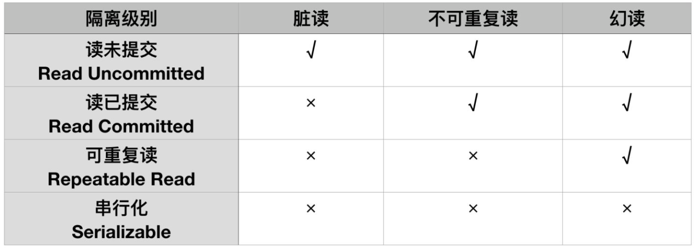
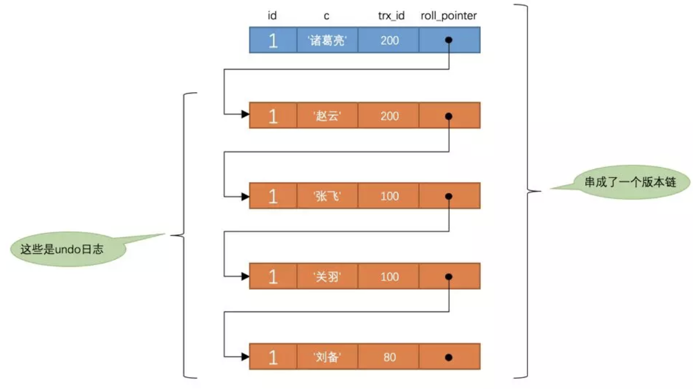
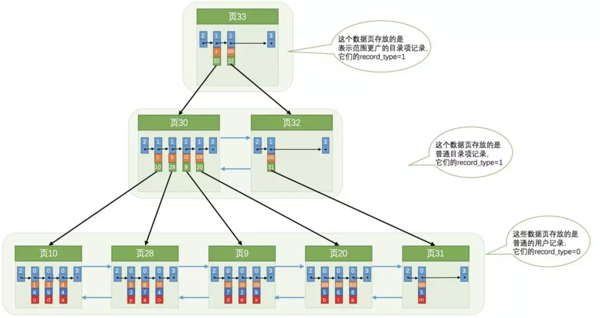
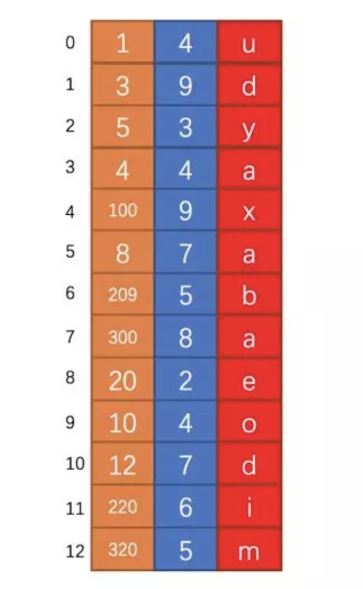
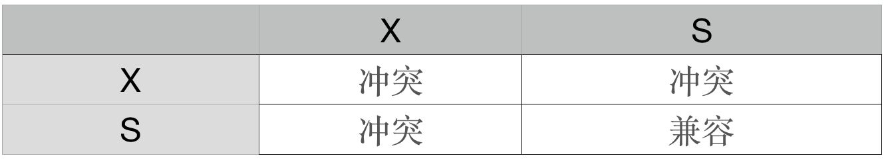

# MySQL

## MySQL 事务

1. [MySQL 事务特征：原子性、隔离性、一致性、持久性](https://mp.weixin.qq.com/s?__biz=MzIxNTQ3NDMzMw==&mid=2247484093&idx=1&sn=b6c607e7d7845ad963fe2b0e1fa771e6&chksm=97968b4fa0e102595cfee0ed4bd9ba83a938e49914163c94ed2d22659b083daea58040c62113&mpshare=1&scene=23&srcid=#rd)
2. [MySQL 事务的状态：活动状态、部分提交状态、提交状态、失败状态、中止状态](https://mp.weixin.qq.com/s?__biz=MzIxNTQ3NDMzMw==&mid=2247484093&idx=1&sn=b6c607e7d7845ad963fe2b0e1fa771e6&chksm=97968b4fa0e102595cfee0ed4bd9ba83a938e49914163c94ed2d22659b083daea58040c62113&mpshare=1&scene=23&srcid=#rd)
3. MySQL 事务隔离级别


	* 脏读：事务A读取了事务B未提交的数据
	* 不可重复读：对于一条记录，事务A两次读取的数据变了
	* 幻读：事务A按照相同的查询条件，读取到了新增的数据

PS：丢失更新：多个事务操作同一行，后面的更新覆盖了前面的更新值。需要在应用级别加锁来避免。

4. [会话(Session)](https://mp.weixin.qq.com/s?__biz=MzIxNTQ3NDMzMw==&mid=2247484119&idx=1&sn=e3637553f3e813f1e2f7f6a3bcd270a9&scene=19#wechat_redirect)
5. [版本链](https://mp.weixin.qq.com/s?__biz=MzIxNTQ3NDMzMw==&mid=2247484119&idx=1&sn=e3637553f3e813f1e2f7f6a3bcd270a9&scene=19#wechat_redirect)

6. [ReadView](https://mp.weixin.qq.com/s?__biz=MzIxNTQ3NDMzMw==&mid=2247484119&idx=1&sn=e3637553f3e813f1e2f7f6a3bcd270a9&scene=19#wechat_redirect)
7. [MVCC（Multi-Version Concurrency Control ，多版本并发控制）](https://mp.weixin.qq.com/s?__biz=MzIxNTQ3NDMzMw==&mid=2247484119&idx=1&sn=e3637553f3e813f1e2f7f6a3bcd270a9&scene=19#wechat_redirect)
8. [MySQL Innodb 行格式 Compact、Redundant、Dynamic 和 Compressed](https://mp.weixin.qq.com/s?__biz=MzIxNTQ3NDMzMw==&mid=2247483670&idx=1&sn=751d84d0ce50d64934d636014abe2023&scene=19#wechat_redirect)


## MySQL Innodb 索引



**聚簇索引**

1. 使用记录主键值的大小进行记录和页的排序，这包括三个方面的含义：
	- 页内的记录是按照主键的大小顺序排成一个单向链表。
	- 各个存放用户记录的页也是根据页中记录的主键大小顺序排成一个双向链表。
	- 各个存放目录项的页也是根据页中记录的主键大小顺序排成一个双向链表。

2. `B+`树的叶子节点存储的是完整的用户记录。

所谓完整的用户记录，就是指这个记录中存储了所有列的值。所有完整的用户记录都存放在这个`聚簇索引`的叶子节点处。这种`聚簇索引`并不需要我们在`MySQL`语句中显式的去创建，`InnoDB`存储引擎会自动的为我们创建聚簇索引。另外有趣的一点是，在`InnoDB`存储引擎中，`聚簇索引`就是数据的存储方式（所有的用户记录都存储在了`叶子节点`），也就是所谓的索引即数据。

**二级索引**

* B+树的叶子节点存储的并不是完整的用户记录，而只是索引列+主键这两个列的值。

* 目录项记录中不再是主键+页号的搭配，而变成了索引列+页号的搭配。

* 二级索引、辅助索引

* 会表

**联合索引**


## MyISAM 中的索引方案

* 将表中的记录按照插入时间顺序存储在一块存储空间上，我们可以通过行号而快速访问到一条记录，如图所示：



* MyISAM 会单独为表的主键创建一个 B+ 树索引，只不过在 B+ 树的叶子节点中存储的不是完整的用户记录，而是**主键值 + 行号**的组合。也就是先通过索引找到对应的行号，再通过行号去找对应的记录！这一点和 InnoDB 是完全不相同的，在 InnoDB 存储引擎中，我们只需要根据主键值对聚簇索引进行一次查找能找到对应的记录，而在 MyISAM 中却需要进行一次回表操作，意味着MyISAM 中建立的索引全部都是**二级索引**！

* 也可以对其它的列分别建立索引或者建立联合索引，原理和 InnoDB 中的索引是一样的，只不过在叶子节点处存储的是**相应的列 + 行号**而已。这些索引也全部都是二级索引。


## B+树索引适用的条件

* 全值匹配
* 匹配左边的列
* 匹配列前缀
* 匹配范围值
* 精确匹配某一列并范围匹配另外一列
* 用于排序
* 用于分组

## 如何挑选索引

* 只为用于搜索、排序或分组的列创建索引
* 考虑列的基数
* 索引列的类型尽量小
* 索引字符串值的前缀
* 尽量使用联合索引
* 让索引列在比较表达式中单独出现
* 主键插入顺序
* 冗余和重复索引
* 覆盖索引

## 锁机制

版本说明：MySQL 5.7.19、Innodb、Repeatable-Read(可重复读)

锁的分类


**加锁机制**

1. 乐观锁：先修改，保存时判断是否被更新过，应用级别
2. 悲观锁：先获取锁，再操作修改，数据库级别

**锁粒度**

1. 表级锁：开销小，加锁快，粒度大，锁冲突概率大，并发度低，适用于读多写少的情况。
2. 页级锁：BDB 存储引擎
3. 行级锁：Innodb 存储引擎，默认选项

**兼容性**

1. S 锁，也叫做读锁、共享锁，对应于我们常用的 `select * from users where id =1 lock in share mode`

2. X 锁，也叫做写锁、排它锁、独占锁、互斥锁，对应对于 `select * from users where id =1 for update`

下面这个表格是锁冲突矩阵，可以看到只有读锁和读锁之间兼容的，写锁和读锁、写锁都是冲突的。冲突的时候会阻塞当前会话，直到拿到锁或者超时.



PS：S 锁和 X 锁是可以是表锁，也可以是行锁

**锁模式**

1. 记录锁：单行记录上的锁

2. gap：间隙锁

用于普通索引读数据和写数据的情况

3. next-key：记录锁 + 间隙锁

4. 意向锁( Intention Locks )

意向锁是表级锁，意向锁产生的主要目的是为了处理行锁和表锁之间的冲突，用于表明“某个事务正在某一行上持有了锁，或者准备去持有锁”。比如，表中的某一行上加了X锁，就不能对这张表加X锁。如果不在表上加意向锁，对表加锁的时候，就要去检查表中的每一行上是否加有行锁。

5. 插入意向锁(Insert Intention Lock)

insert 操作会对插入成功的行加上排它锁，这个排它锁是个记录锁，间隙加上一个插入意向锁，不会阻止其他并发的事务往这条记录之前插入 。

**常见语句的加锁分析**

1. 普通select

```
select * from user where id =1;

begin;
select * from user where id =1;
commit;
```

普通的 select 语句是不加锁的。select 包裹在事务中，同样也是不加锁的。where后面的条件不管多少，普通的select是不加锁的。

2. 显式加锁

```
select  * from user where id =1 lock in share mode;

select  * from user where id =1 for update;
```

显式指出要加什么样的锁。上面一个加的是共享锁，下面的是互斥锁。需要明确在事务中是用这些锁，不在事务中是没有意义的。

3. 隐式加锁

```
update user set address = '北京' where id=1;
delete from user where id=1;
```
update和delete也会对查询出的记录加X锁，隐式加互斥锁。加锁类型和for update 类似

4. 按索引类型

* 主键：在聚集索引上对查询出的记录加 X 锁

* 唯一索引：会在辅助索引上把对应的索引加 X 锁，因为是唯一的，所以不是 next-key 锁。然后在主键上，也会在这条记录上加 X 锁。

* 普通索引：因为不是唯一的，会在辅助索引上把对应的索引加 next-key 锁。然后在主键加 X 锁。

* 无索引：首先，聚簇索引上的所有记录，都被加上了 X 锁。其次，聚簇索引每条记录间的间隙也同时被加上了 GAP 锁。

5. 记录不存在的情况

如果对应记录不存在会加间隙锁，不允许插入。mysql 要保证没有其他人可以插入，所以锁住间隙。

6. 普通 insert 语句

在插入之前，会先在插入记录所在的间隙加上一个插入意向锁。insert 会对插入成功的行加上排它锁，不会阻止其他并发的事务往这条记录之前插入 。

7. 先查询后插入

```
# 将 select 查询的结果集，插入到另一张表中，或者使用结果集，创建一个新表。
insert into target_table select * from source_table ...
create target_table select * from source_table ...
```

和简单插入的情况类似，间隙加上一个插入意向锁，已插入成功的数据加X锁。
