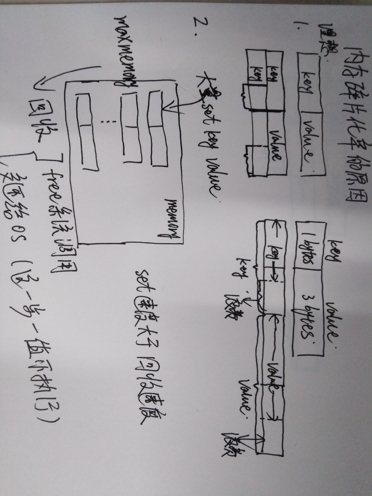

## Redis 内存碎片化严重

```bash
# redis 的内存使用统计信息如下
10.1.36.33:6379> info memory
# Memory
used_memory:856560  # Redis 分配器分配的内存总量（单位是字节），包括使用的虚拟内存（即swap），用于数据、缓冲内存
used_memory_human:836.48K  # used_memory_human只是显示更友好
used_memory_rss:5710807040  # OS 看到的 Redis 使用的内存
used_memory_rss_human:5.32G  # used_memory_rss 的友好显示
used_memory_peak:6762095536
used_memory_peak_human:6.30G
used_memory_peak_perc:0.01%
used_memory_overhead:843578
used_memory_startup:790928
used_memory_dataset:12982
used_memory_dataset_perc:19.78%
allocator_allocated:2691760
allocator_active:3207168
allocator_resident:6795239424
total_system_memory:14694866944
total_system_memory_human:13.69G
used_memory_lua:41984
used_memory_lua_human:41.00K
used_memory_scripts:296
used_memory_scripts_human:296B
number_of_cached_scripts:1
maxmemory:0
maxmemory_human:0B
maxmemory_policy:noeviction
allocator_frag_ratio:1.19
allocator_frag_bytes:515408
allocator_rss_ratio:2118.77
allocator_rss_bytes:6792032256
rss_overhead_ratio:0.84
rss_overhead_bytes:-1084432384
mem_fragmentation_ratio:7002.45  # 内存碎片化率 mem_fragmentation_ratio = used_memory_rss/used_memory
mem_fragmentation_bytes:5709991496
mem_not_counted_for_evict:2660
mem_replication_backlog:0
mem_clients_slaves:0
mem_clients_normal:49694
mem_aof_buffer:2660
mem_allocator:jemalloc-5.1.0  # 内存分配器
active_defrag_running:0
lazyfree_pending_objects:0
10.1.36.33:6379>
```

### Redis 内存碎片化的原因

1. 当使用类似于 set key value 的指令向 Redis 写入数据时，Redis 服务器会使用内存分配器向操作系统申请内存，一旦内存申请成功，Redis 服务器会记录申请到的内存大小，这个值就是 used_memory，操作系统也会记录 Redis 进程使用的内存大小，也就是 used_memory_rss 值。

2. 当 key 过期或者客户端主动删除 key 时，正常情况下，Redis 服务器会回收（free系统调用）相关的内存，减少 used_memory 值，然后将回收的内存交还给操作系统，操作系统接收到内存后会减少 used_memory_rss 值。使用 free -m 等指令查看会发现可用的内存会增加。

3. 如果 Redis 服务器将回收的内存不交还给操作系统（Redis 服务器将回收的内存交还给操作系统是有条件的），就会出现 used_memory 很少，而 used_memory_rss 很大的情况。操作系统认为自己可用的内存很少，下次 Redis 申请分配内存时操作系统认为没有足够的内存进行分配。



### 解决问题的方法

1. 由于 Redis 使用 docker 容器的方法安装，所以直接停止容器，删除容器，重新部署一个新的容器。在部署新容器时删除了 Redis 中的备份数据，相当于启动一个全新的容器。

2. 这种方法会导致 Redis 中数据的丢失。

3. 一般来说会把 Redis 中的数据备份，重新启动 Redis 服务后会从备份文件中加载数据。这就能初步保证数据不会丢失。但是数据本身存在的问题还是有可能导致新 Redis 服务产生内存碎片。

4. 在物理机上部署 Redis 和恢复数据的方法和 docker 方法是一样的。
