## Redis Sentinel And Cluster

### 配置主从复制和哨兵

| 编号 | IP           | 角色 | port |
| :--: | :----------: | :--: | :--: |
| 1 | 192.168.0.31 | Master、Sentinel-1 | 6379、26379 |
| 2 | 192.168.0.32 | Slave-1、Sentinel-2 | 6379、26379 |
| 3 | 192.168.0.33 | Slave-2、Sentinel-3 | 6379、26379 |

```bash
## step 1：修改所有机器的配置文件 redis.conf 选项 bind
bind 0.0.0.0

## step 2：修改 Slave-1 和 Slave-1 上的配置文件 redis.conf 选项 slaveof
slaveof 192.168.0.31 6379

## step 3：在所有的机器上启动 redis 服务
$ redis-server redis.conf

## step 4：在所有的机器上拷贝 redis 源码中的 sentinel.conf 文件作为 sentinel 进程的配置文件，并且需要保证运行 sentinel 的进程的用户具有写入 sentinel.conf 文件的权限，sentinel 进程启动后会向配置文件中写入一些信息
$ cat sentinel.conf
port 26379
dir /tmp
sentinel monitor mymaster 192.168.0.31 6379 2
sentinel down-after-milliseconds mymaster 30000
sentinel parallel-syncs mymaster 1
sentinel failover-timeout mymaster 180000
sentinel deny-scripts-reconfig yes

## 在所有机器上启动 sentinel 进程
$ redis-server sentinel.conf --sentinel

## 观察日志和sentinel.conf文件，sentinel.conf文件会写入新的信息

## 管理 sentinel，无论连接那台机器的 26379 端口进程都可以
$ redis-cli -h 192.168.0.33 -p 26379
192.168.0.33:26379> sentinel 
```


### 配置 Redis Cluster





```bash
## step 1：重命名所有机器上的redis服务的配置文件 redis.conf
192.168.1.57
redis-master-6379.conf
redis-slave-6381.conf

192.168.1.59
redis-master-6380.conf
redis-slave-6379.conf

192.168.1.58
redis-master-6381.conf
redis-slave-6380.conf

## step 2：修改配置文件内容，确保如下选项配置正确
################################## NETWORK #####################################
bind 0.0.0.0
port

################################# GENERAL #####################################
daemonize yes
pidfile
loglevel notice
logfile ""

################################ SNAPSHOTTING  ################################
save 900 1
save 300 10
save 60 10000
stop-writes-on-bgsave-error yes
rdbcompression yes
rdbchecksum yes
dbfilename dump.rdb
dir

################################ REDIS CLUSTER  ###############################
cluster-enabled yes
cluster-config-file
cluster-node-timeout 15000

## step 3：在所有的机器上使用对应的配置文件启动相应的redis服务

## step 4：确定生成的集群配置文件是否正常

## step 5：在所有的机器上检查集群相关信息和日志信息
192.168.1.57> INFO CLUSTER

## step 6：在任意一台机器上上执行 CLUSTER MEET 操作，连接所有的 redis 服务以便集群发现其他节点
$ redis-cli -h 192.168.1.57 -p 6381 CLUSTER MEET 192.168.1.57 6379
$ redis-cli -h 192.168.1.57 -p 6381 CLUSTER MEET 192.168.1.57 6381
$ redis-cli -h 192.168.1.57 -p 6381 CLUSTER MEET 192.168.1.59 6380
$ redis-cli -h 192.168.1.57 -p 6381 CLUSTER MEET 192.168.1.59 6379
$ redis-cli -h 192.168.1.57 -p 6381 CLUSTER MEET 192.168.1.58 6381
$ redis-cli -h 192.168.1.57 -p 6381 CLUSTER MEET 192.168.1.59 6380

## step 7：在三台机器上分别选择一个redis服务分配数据槽
$ for i in {0..5400}; do redis-cli -h 192.168.1.57 -p 6379 CLUSTER ADDSLOTS ${i}; done

$ for i in {5401..11000}; do redis-cli -h 192.168.1.59 -p 6380 CLUSTER ADDSLOTS ${i}; done

$ for i in {11001..16383}; do redis-cli -h 192.168.1.58 -p 6381 CLUSTER ADDSLOTS ${i}; done

## step 8：在任意一个redis服务中查看集群节点信息 node-id
$ redis-cli -h 192.168.1.57 -p 6381 CLUSTER NODES

## step 9：设置主从复制信息，将6个redis服务两两设置为主从关系
$ redis-cli -h 192.168.1.59 -p 6379 CLUSTER REPLICATE 582

$ redis-cli -h 192.168.1.58 -p 6380 CLUSTER REPLICATE 2ff

$ redis-cli -h 192.168.1.57 -p 6381 CLUSTER REPLICATE eee

## step 10：在任意一个redis服务中查看集群节点的主从信息
$ redis-cli -h 192.168.1.57 -p 6381 CLUSTER NODES


127.0.0.1:6379> help @cluster

  CLUSTER ADDSLOTS slot [slot ...]
  summary: Assign new hash slots to receiving node
  since: 3.0.0

  CLUSTER COUNT-FAILURE-REPORTS node-id
  summary: Return the number of failure reports active for a given node
  since: 3.0.0

  CLUSTER COUNTKEYSINSLOT slot
  summary: Return the number of local keys in the specified hash slot
  since: 3.0.0

  CLUSTER DELSLOTS slot [slot ...]
  summary: Set hash slots as unbound in receiving node
  since: 3.0.0

  CLUSTER FAILOVER [FORCE|TAKEOVER]
  summary: Forces a slave to perform a manual failover of its master.
  since: 3.0.0

  CLUSTER FORGET node-id
  summary: Remove a node from the nodes table
  since: 3.0.0

  CLUSTER GETKEYSINSLOT slot count
  summary: Return local key names in the specified hash slot
  since: 3.0.0

  CLUSTER INFO -
  summary: Provides info about Redis Cluster node state
  since: 3.0.0

  CLUSTER KEYSLOT key
  summary: Returns the hash slot of the specified key
  since: 3.0.0

  CLUSTER MEET ip port
  summary: Force a node cluster to handshake with another node
  since: 3.0.0

  CLUSTER NODES -
  summary: Get Cluster config for the node
  since: 3.0.0

  CLUSTER REPLICATE node-id
  summary: Reconfigure a node as a slave of the specified master node
  since: 3.0.0

  CLUSTER RESET [HARD|SOFT]
  summary: Reset a Redis Cluster node
  since: 3.0.0

  CLUSTER SAVECONFIG -
  summary: Forces the node to save cluster state on disk
  since: 3.0.0

  CLUSTER SET-CONFIG-EPOCH config-epoch
  summary: Set the configuration epoch in a new node
  since: 3.0.0

  CLUSTER SETSLOT slot IMPORTING|MIGRATING|STABLE|NODE [node-id]
  summary: Bind an hash slot to a specific node
  since: 3.0.0

  CLUSTER SLAVES node-id
  summary: List slave nodes of the specified master node
  since: 3.0.0

  CLUSTER SLOTS -
  summary: Get array of Cluster slot to node mappings
  since: 3.0.0

  READONLY -
  summary: Enables read queries for a connection to a cluster slave node
  since: 3.0.0

  READWRITE -
  summary: Disables read queries for a connection to a cluster slave node
  since: 3.0.0

127.0.0.1:6379> 

```


```bash
$ cat redis.conf
################################## INCLUDES ###################################
# include /path/to/local.conf
# include /path/to/other.conf

################################## MODULES #####################################
# loadmodule /path/to/my_module.so
# loadmodule /path/to/other_module.so

################################## NETWORK #####################################
bind 127.0.0.1
protected-mode yes
port 6379
tcp-backlog 511
timeout 0
tcp-keepalive 300

################################# GENERAL #####################################
daemonize no
supervised no
pidfile /var/run/redis_6379.pid
loglevel notice
logfile ""
# syslog-enabled no
# syslog-ident redis
# syslog-facility local0
databases 16
always-show-logo yes

################################ SNAPSHOTTING  ################################
save 900 1
save 300 10
save 60 10000
stop-writes-on-bgsave-error yes
rdbcompression yes
rdbchecksum yes
dbfilename dump.rdb
dir ./

################################# REPLICATION #################################
# slaveof <masterip> <masterport>
# masterauth <master-password>
slave-serve-stale-data yes
slave-read-only yes
repl-diskless-sync no
repl-diskless-sync-delay 5
# repl-ping-slave-period 10
# repl-timeout 60
repl-disable-tcp-nodelay no
# repl-backlog-size 1mb
# repl-backlog-ttl 3600
slave-priority 100
# min-slaves-to-write 3
# min-slaves-max-lag 10
# slave-announce-ip 5.5.5.5
# slave-announce-port 1234

################################## SECURITY ###################################
# requirepass foobared
# rename-command CONFIG ""

################################### CLIENTS ####################################
# maxclients 10000

############################## MEMORY MANAGEMENT ################################
# maxmemory <bytes>
# LRU means Least Recently Used
# LFU means Least Frequently Used
# maxmemory-policy noeviction
# maxmemory-samples 5

############################# LAZY FREEING ####################################
lazyfree-lazy-eviction no
lazyfree-lazy-expire no
lazyfree-lazy-server-del no
slave-lazy-flush no

############################## APPEND ONLY MODE ###############################
appendonly no
appendfilename "appendonly.aof"
appendfsync everysec
no-appendfsync-on-rewrite no
auto-aof-rewrite-percentage 100
auto-aof-rewrite-min-size 64mb
aof-load-truncated yes
aof-use-rdb-preamble no

################################ LUA SCRIPTING  ###############################
lua-time-limit 5000

################################ REDIS CLUSTER  ###############################
# cluster-enabled yes
# cluster-config-file nodes-6379.conf
# cluster-node-timeout 15000
# cluster-slave-validity-factor 10
# cluster-migration-barrier 1
# cluster-require-full-coverage yes
# cluster-slave-no-failover no

########################## CLUSTER DOCKER/NAT support  ########################
# cluster-announce-ip 10.1.1.5
# cluster-announce-port 6379
# cluster-announce-bus-port 6380

################################## SLOW LOG ###################################
slowlog-log-slower-than 10000
slowlog-max-len 128

################################ LATENCY MONITOR ##############################
latency-monitor-threshold 0

############################# EVENT NOTIFICATION ##############################
notify-keyspace-events ""

############################### ADVANCED CONFIG ###############################
hash-max-ziplist-entries 512
hash-max-ziplist-value 64
list-max-ziplist-size -2
list-compress-depth 0
set-max-intset-entries 512
zset-max-ziplist-entries 128
zset-max-ziplist-value 64
hll-sparse-max-bytes 3000
activerehashing yes
client-output-buffer-limit normal 0 0 0
client-output-buffer-limit slave 256mb 64mb 60
client-output-buffer-limit pubsub 32mb 8mb 60
# client-query-buffer-limit 1gb
# proto-max-bulk-len 512mb
hz 10
aof-rewrite-incremental-fsync yes
# lfu-log-factor 10
# lfu-decay-time 1

########################### ACTIVE DEFRAGMENTATION #######################
# activedefrag yes
# active-defrag-ignore-bytes 100mb
# active-defrag-threshold-lower 10
# active-defrag-threshold-upper 100
# active-defrag-cycle-min 25
# active-defrag-cycle-max 75


```


```bash
$ cat sentinel.conf 
# bind 127.0.0.1 192.168.1.1
# protected-mode no
port 26379
# sentinel announce-ip <ip>
# sentinel announce-port <port>
dir /tmp
sentinel monitor mymaster 127.0.0.1 6379 2
# sentinel auth-pass mymaster MySUPER--secret-0123passw0rd
sentinel down-after-milliseconds mymaster 30000
sentinel parallel-syncs mymaster 1
sentinel failover-timeout mymaster 180000
# sentinel notification-script mymaster /var/redis/notify.sh
# sentinel client-reconfig-script mymaster /var/redis/reconfig.sh
sentinel deny-scripts-reconfig yes


```

