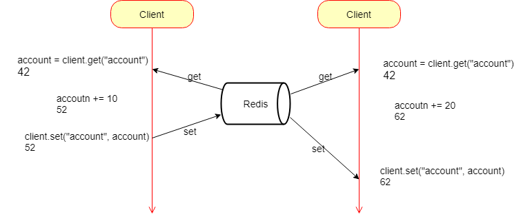

## Redis 实现分布式锁

分布式应用进行逻辑处理时经常会遇到并发问题。如下图所示：一个操作要修改用户的状态。修改状态需要先读出用户的状态，在内存里进行修改，改完了再存回去。



如果这样的操作同时进行，就会出现并发问题，因为 “读取” 和 “保存状态” 这两个操作不是原子操作。（**原子操作** 是指不会被线程调度机制打断的操作。这种操作一旦开始，就会一直运行到结束，中间不会有任何线程的切换。）

### 分布式锁的简单实现

```bash
> setnx lock true  # setnx(set if not exists)
(integer) 1

... do something critical ...

> del lock
(integer) 1
```

这个简单的分布式锁实现有个问题，如果逻辑执行到中间出现异常，可能会导致 del 指令没有被调用，这样就会陷入死锁，锁永远得不到释放。

为了避免逻辑执行异常导致锁不能释放，于是在拿到锁之后，再给锁加上一个过期时间，这样即使中间出现异常也可以保证在过期时间之后锁会自动释放。

```bash
> setnx lock true  # setnx(set if not exists)
(integer) 1

> expire lock 10
(integer) 1

... do something critical ...

> del lock
(integer) 1
```

上述加上过期时间的锁还是有问题。

1. 如果在 setnx 指令和 expire 指令之间服务器进程突然挂掉了，就会导致 expire 得不到执行，还是会造成死锁。

2. 超时问题，如果在加锁和释放锁之间的逻辑执行的太长，以至于超出了锁的超时限制，这时第一个线程还没有执行完，锁已经释放，第二个线程提前持有了该锁，有可能导致临界区的代码得不到严格的串行执行。

3. 在锁被当前线程释放之前，没有办法确保其他线程不主动删除该锁，如果有第三方线程直接删除了该锁，也会导致临界区的代码得不到严格的串行执行。

4. 在 Sentinel 集群中，当主节点挂掉时，从节点会取而代之，但客户端却没有明显感知。比如，原先第一个客户端在主节点上申请成功了一把锁，但是这把锁还没来得及同步到从节点，主节点突然就挂掉了，然后从节点变成了主节点，这个新的主节点内部没有这个锁，所以当另一个客户端过来请求加锁时，立即就批准了。这样就会导致系统中同样一把锁被两个客户端同时持有，不安全性由此产生。

###### 对于第一个问题：使用 set 指令的扩展参数，使得 setnx 指令和 expire 指令原子执行。

```bash
> set lock true ex 10 nx
OK

... do something critical ...

> del lock
(integer) 1
```

###### 对于第二个超时问题目前还没有很好的解决方案。

###### 对于第三个锁被意外删除的问题，初步的解决方案是将 set 指令的 value 参数设置为一个随机数，释放锁时先匹配随机数是否一直，一致后才删除 key。

```python
tag = random.nextint()
if redis.set(key, tag, nx=True, ex=10):
    do_something()
    value = redis.get(key)
    if(tag == value):
        redis.del(key)
```

上述方案中 redis.get(key) 和 redis.del(key) 两个操作不是原子操作，可以使用 Lua 脚本保证多个连续的指令原子性执行。

```python
tag = random.nextint()
if redis.set(key, tag, nx=True, ex=10):
    do_something()
    redis.delifequals(key, tag)  # delifequals 指令由 lua 脚本提供
```

```lua
# delifequals
if redis.call("get", KEYS[1]) == ARGV[1] then
    return redis.call("del", KEYS[1])
else
    return 0
end
```

###### 对于第四个在集群环境中的问题，采用 Redlock 算法解决

```python
import redlock

addrs = [
    {"host": "localhost", "port": 6379, "db": 0},
    {"host": "localhost", "port": 6479, "db": 0},
    {"host": "localhost", "port": 6579, "db": 0}
]

dlm = redlock.Redlock(addrs)
success = dlm.lock("user-lck", 5000)
if success:
    print("lock success")
    dlm.unlock("user-lck")
else:
    print("lock failed")
```

同大多数分布式算法一样，Redlock 也使用 “大多数机制”。

加锁时，它会向过半节点发送 set(key, tag, nx=True, ex=xxx) 指令，只要**过半节点** set 成功，就认为加锁成功。释放锁时，需要向**所有节点**发送 del 指令，
