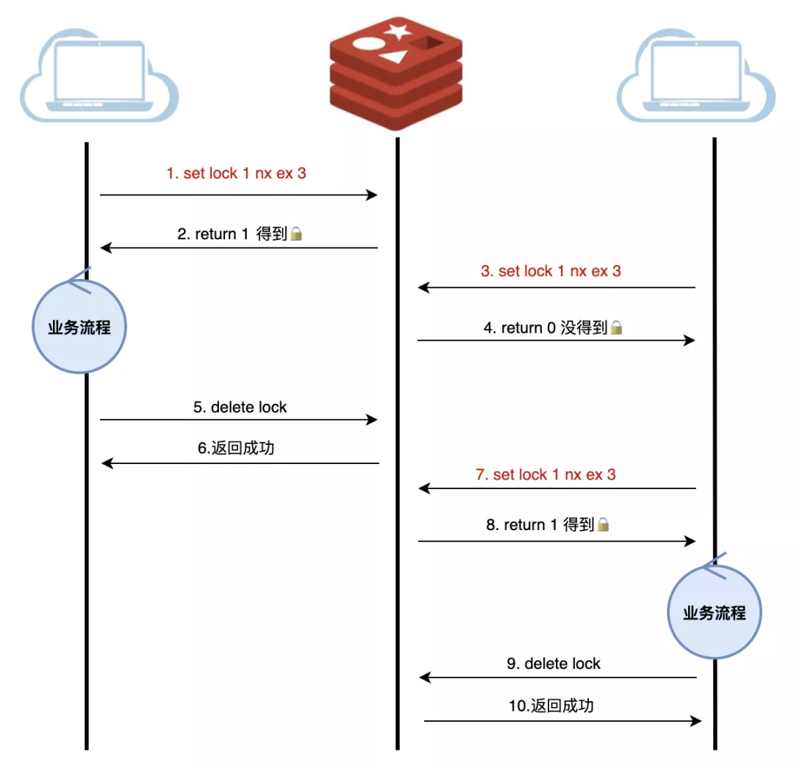

# Redis怎么实现原子性分布式锁

## 分布式锁是什么

在计算机领域，锁可以理解为针对某项资源使用权限的管理，它通常用来控制共享资源，比如一个进程内有多个线程竞争一个数据的使用权限，解决方式之一就是加锁。

那分布式锁是什么呢？

顾名思义，分布式锁就是分布式场景下的锁，比如多台不同机器上的进程，去竞争同一项资源，就是分布式锁。

## 分布式锁有哪些特性

具备哪些特性的分布式锁才是一个优秀的分布式锁？要从如下几方面来看：

- **互斥性**：锁的目的是获取资源的使用权，所以只让一个竞争者持有锁，这一点要尽可能保证

- **安全性**：避免死锁情况发生。当一个竞争者在持有锁期间内，由于意外崩溃而导致未能主动解锁，其持有的锁也能够被正常释放，并保证后续其它竞争者也能加锁

- **对称性**：同一个锁，加锁和解锁必须是同一个竞争者。不能把其他竞争者持有的锁给释放了，这又称为锁的可重入性

- **可靠性**：需要有一定程度的异常处理能力、容灾能力

## 分布式锁的常用实现方式

分布式锁，一般会依托第三方组件来实现，而利用 Redis 实现则是工作中应用最多的一种。

### 最简化版本

首先，当然是搭建一个最简单的实现方式，直接用 Redis 的 setnx 命令，这个命令的语法是：

**setnx key value**

如果 key 不存在，则会将 key 设置为 value，并返回 1；如果 key 存在，不会有任务影响，返回 0。

基于这个特性，我们就可以用 setnx 实现加锁的目的：通过 setnx 加锁，加锁之后其他服务无法加锁，用完之后，再通过 delete 解锁。

### 支持过期时间

最简化版本有一个问题：如果获取锁的服务挂掉了，那么锁就一直得不到释放，就像石沉大海，杳无音信。所以，我们需要一个超时来兜底。

Redis 中有 expire 命令，用来设置一个 key 的超时时间。但是 setnx 和 expire 不具备原子性，如果setnx 获取锁之后，服务挂掉，依旧是泥牛入海。

很自然，我们会想到，set 和 expire，有没有原子操作？

当然有，Redis 早就考虑到了这种场景，推出了如下执行语句：

**set key value nx ex seconds**

nx 表示具备 setnx 特性，ex 表示增加了过期时间，最后一个参数就是过期时间的值。

### 加上 owner

能够支持过期时间，目前这个锁基本上是能用了。

但是存在一个问题：会存在服务 A 释放掉服务 B 的锁的可能。我们来试想一下如下场景：服务 A 获取了锁，由于业务流程比较长，或者网络延迟、GC 卡顿等原因，导致锁过期，而业务还会继续进行。这时候，业务 B 已经拿到了锁，准备去执行，这个时候服务 A 恢复过来并做完了业务，就会释放锁，而 B 却还在继续执行。在真实的分布式场景中，可能存在几十个竞争者，那么上述情况发生概率就很高，导致同一份资源频繁被不同竞争者同时访问，分布式锁也就失去了意义。

基于这个场景，我们可以发现，问题关键在于，竞争者可以释放其他人的锁。那么在异常情况下，就会出现问题，所以我们可以进一步给出解决方案：分布式锁需要满足谁申请谁释放原则，不能释放别人的锁，也就是说，分布式锁，是要有归属的。

### 引入Lua

加入 owner 后的版本可以称得上是完善了吗？还有没有什么隐患呢？

牛牛也不卖关子了，到这一步其实还存在一个小问题，我们完整的流程是竞争者获取锁执行任务，执行完毕后检查锁是不是自己的，最后进行释放。

流程一梳理，你们肯定明白了，执行完毕后，检查锁，再释放，这些操作不是原子化的。

可能锁获取时还是自己的，删除时却已经是别人的了。这可怎么办呢？

Redis 可没有直接提供这种场景原子化的操作啊。遇事不要慌，仔细想一想，Redis 是不是还有个特性，专门整合原子操作，对，就是它 —— **Lua**。

Redis + Lua，可以说是专门为解决原子问题而生。

有了 Lua 的特性，Redis 才真正在分布式锁、秒杀等场景，有了用武之地，下面便是改造之后的流程：

## 可靠性如何保证

其实到了这一步，分布式锁的前三个特性：**对称性、安全性、可靠性**，就满足了。可以说是一个可用的分布式锁了，能满足大多数场景的需要。

分布式锁的四大特性还剩下可靠性没有解决。

针对一些异常场景，包括 Redis 挂掉了、业务执行时间过长、网络波动等情况，我们来一起分析如何处理。

### 容灾考虑

前面我们谈及的内容，基本是基于单机考虑的，如果 Redis 挂掉了，那锁就不能获取了。这个问题该如何解决呢？

一般来说，有两种方法：**主从容灾**和**多级部署**。

#### 主从容灾

最简单的一种方式，就是为 Redis 配置从节点，当主节点挂了，用从节点顶包。

但是主从切换，需要人工参与，会提高人力成本。不过 Redis 已经有成熟的解决方案，也就是哨兵模式，可以灵活自动切换，不再需要人工介入。

通过增加从节点的方式，虽然一定程度解决了单点的容灾问题，但并不是尽善尽美的，由于同步有时延，Slave 可能会损失掉部分数据，分布式锁可能失效，这就会发生短暂的多机获取到执行权限。

有没有更可靠的办法呢？

#### 多机部署

如果对一致性的要求高一些，可以尝试多机部署，比如 Redis 的 RedLock，大概的思路就是多个机器，通常是奇数个，达到一半以上同意加锁才算加锁成功，这样，可靠性会向 ETCD 靠近。

现在假设有 5 个 Redis 主节点，基本保证它们不会同时宕掉，获取锁和释放锁的过程中，客户端会执行以下操作：

1. 向 5 个 Redis 申请加锁

2. 只要超过一半，也就是 3 个 Redis 返回成功，那么就是获取到了锁。如果超过一半失败，需要向每个 Redis 发送解锁命令

3. 由于向 5 个 Redis 发送请求，会有一定时耗，所以锁剩余持有时间，需要减去请求时间。这个可以作为判断依据，如果剩余时间已经为 0，那么也是获取锁失败

4. 使用完成之后，向 5 个 Redis 发送解锁请求

这种模式的好处在于，如果挂了 2 台 Redis，整个集群还是可用的，给了运维更多时间来修复。

另外，多说一句，单点 Redis 的所有手段，这种多机模式都可以使用，比如为每个节点配置哨兵模式，由于加锁是一半以上同意就成功，那么如果单个节点进行了主从切换，单个节点数据的丢失，就不会让锁失效了。这样增强了可靠性。

## 可靠性深究

是不是有 RedLock，就一定能保证可靠的分布式锁？

这里牛牛先说结论：由于分布式系统中的三大困境（简称NPC），所以没有完全可靠的分布式锁！

让我们来看看 RedLock 在 NPC 下的表现。

### N：Network Delay（网络延迟）

当分布式锁获得返回包的时间过长，此时可能虽然加锁成功，但是已经时过境迁，锁可能很快过期。

### P：Process Pause（进程暂停）

比如发生 GC，获取锁之后 GC 了，处于 GC 执行中，然后锁超时。其他锁获取，这种情况几乎无解。这时候 GC 回来了，那么两个进程就获取到了同一个分布式锁。

也许你会说，在 GC 回来之后，可以再去查一次啊？

这里有两个问题，首先你怎么知道 GC 回来了？这个可以在做业务之前，通过时间，进行一个粗略判断，但也是很吃场景经验的；第二，如果你判断的时候是 o k的，但是判断完 GC 了呢？这点 RedLock 是无法解决的。

### C：Clock Drift（时钟漂移）

如果竞争者 A，获得了 RedLock，在 5 台分布式机器上都加上锁。为了方便分析，我们直接假设 5 台机器都发生了时钟漂移，锁瞬间过期了。这时候竞争者 B 拿到了锁，此时 A 和 B 拿到了相同的执行权限。

根据上述的分析，可以看出，RedLock 也不能扛住 NPC 的挑战，因此，单单从分布式锁本身出发，完全可靠是不可能的。要实现一个相对可靠的分布式锁机制，还是需要和业务的配合，业务本身要幂等可重入，这样的设计可以省却很多麻烦。

