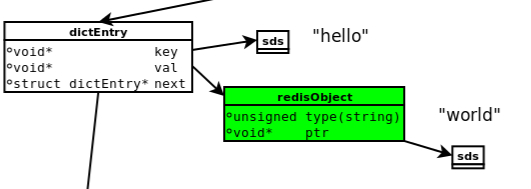
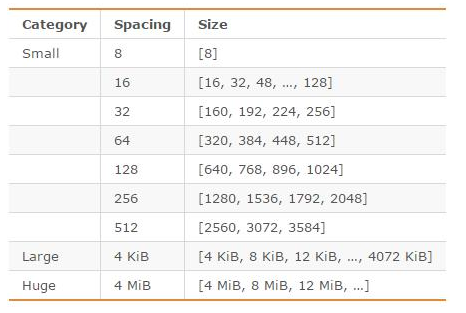
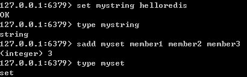
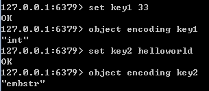
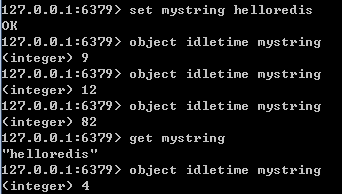
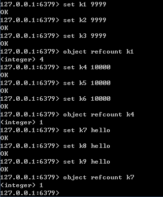

## Redis 内存模型

- [redis 内存划分](#redis内存划分)
	- [数据](#数据)
	- [进程本身运行需要的内存](#进程本身运行需要的内存)
	- [缓冲内存](#缓冲内存)
	- [内存碎片](#内存碎片)
- [redis 内存统计](#redis内存统计)
- [redis 数据存储的细节](#redis-数据存储的细节)
	- [概述](#概述)
	- [jemalloc](#jemalloc)
	- [redisobject](#redisobject)
	- [简单动态字符串 sds](#简单动态字符串sds)
- [redis 的对象类型与内部编码](#redis的对象类型与内部编码)

### Redis 内存划分

Redis作为内存数据库，在内存中存储的内容主要是数据（键值对）；此外，除了数据以外，Redis的其他部分也会占用内存。

Redis的内存占用主要可以划分为以下几个部分：
* 数据

* 进程本身运行需要的内存

* 缓冲内存

* 内存碎片

##### 数据

作为数据库，数据是最主要的部分；这部分占用的内存会统计在 used_memory 中。

Redis 使用键值对存储数据，其中的值（对象）包括5种类型，即字符串、哈希、列表、集合、有序集合。这5种类型是Redis对外提供的，实际上，在Redis内部，每种类型可能有2种或更多的**内部编码**实现；此外，Redis在存储对象时，并不是直接将数据扔进内存，而是会对对象进行各种包装：如 redisObject、SDS 等**数据结构**。

##### 进程本身运行需要的内存

Redis 主进程本身运行肯定需要占用内存，如代码、常量池等等；这部分内存大约几兆，在大多数生产环境中与 Redis 数据占用的内存相比可以忽略。这部分内存不是由内存分配器分配，因此不会统计在 used_memory 中。

除了主进程外，Redis 创建的子进程运行也会占用内存，如 Redis 执行 AOF、RDB 重写时创建的子进程。当然，这部分内存不属于 Redis 主进程，也不会统计在 used_memory 和 used_memory_rss 中。

##### 缓冲内存

缓冲内存包括**客户端缓冲区**、**复制积压缓冲区**、**AOF 缓冲区**等；其中，客户端缓冲存储客户端连接的输入输出缓冲；复制积压缓冲用于部分复制功能；AOF 缓冲区用于在进行 AOF 重写时，保存最近的写入命令。这部分内存由内存分配器分配，因此会统计在 used_memory 中。

##### 内存碎片

内存碎片是 Redis 在分配、回收物理内存过程中产生的。例如，如果对数据的更改频繁，而且数据之间的大小相差很大，可能导致 redis 释放的空间在物理内存中并没有释放，但 redis 又无法有效利用，这就形成了内存碎片。内存碎片不会统计在 used_memory 中。

内存碎片的产生与对数据进行的操作、数据的特点等都有关；此外，与使用的内存分配器也有关系：如果内存分配器设计合理，可以尽可能的减少内存碎片的产生。

如果 Redis 服务器中的内存碎片已经很大，可以通过安全重启的方式减小内存碎片：因为重启之后，Redis 重新从备份文件中读取数据，在内存中进行重排，为每个数据重新选择合适的内存单元，减小内存碎片。

### Redis内存统计

```bash
127.0.0.1:6379> info memory
# Memory
used_memory:248897744  # Redis 分配器分配的内存总量（单位是字节），包括使用的虚拟内存（即swap），用于数据、缓冲内存
used_memory_human:237.37M  # used_memory_human只是显示更友好

used_memory_rss:257400832  # OS 看到的 Redis 使用的内存
used_memory_rss_human:245.48M

used_memory_peak:248958888
used_memory_peak_human:237.43M
used_memory_peak_perc:99.98%
used_memory_overhead:74343704
used_memory_startup:509680
used_memory_dataset:174554040
used_memory_dataset_perc:70.27%
allocator_allocated:248877560
allocator_active:249143296
allocator_resident:256606208
total_system_memory:1044770816
total_system_memory_human:996.37M
used_memory_lua:37888
used_memory_lua_human:37.00K
maxmemory:0
maxmemory_human:0B
maxmemory_policy:noeviction
allocator_frag_ratio:1.00
allocator_frag_bytes:265736
allocator_rss_ratio:1.03
allocator_rss_bytes:7462912
rss_overhead_ratio:1.00
rss_overhead_bytes:794624
mem_fragmentation_ratio:1.03  # 内存碎片比率，该值是 used_memory_rss/ used_memory 的比值
mem_fragmentation_bytes:8586096
mem_allocator:jemalloc-4.0.3  # 内存分配器
active_defrag_running:0
lazyfree_pending_objects:0
127.0.0.1:6379> 

```

Here is the meaning of all fields in the memory section:

* used_memory: Total number of bytes allocated by Redis using its allocator (either standard libc, jemalloc, or an alternative allocator such as tcmalloc)  Redis使用其分配器（标准libc，jemalloc或替代分配器，如tcmalloc）分配的总字节数

* used_memory_human: Human readable representation of previous value

* used_memory_rss: Number of bytes that Redis allocated as seen by the operating system (a.k.a resident set size). This is the number reported by tools such as top(1) and ps(1)  操作系统看到的Redis分配的字节数（a.k.a常驻集大小）。 这是 top(1) 和 ps(1) 等工具报告的数字

* used_memory_rss_human: Human readable representation of previous value

* used_memory_peak: Peak memory consumed by Redis (in bytes)  Redis消耗的峰值内存（以字节为单位）

* used_memory_peak_human: Human readable representation of previous value

* used_memory_peak_perc: The percentage 百分比 of used_memory_peak out of used_memory

* used_memory_overhead: The sum in bytes of all overheads that the server allocated for managing its internal data structures  服务器为管理其内部数据结构而分配的所有开销的总和（以字节为单位）

* used_memory_startup: Initial amount of memory consumed by Redis at startup in bytes  Redis在启动时消耗的初始内存量（以字节为单位）

* used_memory_dataset: The size in bytes of the dataset (used_memory_overhead subtracted from used_memory)  used_memory 减去 used_memory_overhead

* used_memory_dataset_perc: The percentage of used_memory_dataset out of the net memory usage (used_memory minus used_memory_startup)

* total_system_memory: The total amount of memory that the Redis host has

* total_system_memory_human: Human readable representation of previous value

* used_memory_lua: Number of bytes used by the Lua engine

* used_memory_lua_human: Human readable representation of previous value

* maxmemory: The value of the maxmemory configuration directive

* maxmemory_human: Human readable representation of previous value

* maxmemory_policy: The value of the maxmemory-policy configuration directive

* mem_fragmentation_ratio: Ratio between used_memory_rss and used_memory

* mem_allocator: Memory allocator, chosen at compile time

* active_defrag_running: Flag indicating if active defragmentation is active

* lazyfree_pending_objects: The number of objects waiting to be freed (as a result of calling UNLINK, or FLUSHDB and FLUSHALL with the ASYNC option)

Ideally, the used_memory_rss value should be only slightly higher than used_memory. When rss >> used, a large difference means there is memory fragmentation (internal or external), which can be evaluated by checking mem_fragmentation_ratio. When used >> rss, it means part of Redis memory has been swapped off by the operating system: expect some significant latencies.  理想情况下，used_memory_rss 值应仅略高于 used_memory。 当 rss >>used 时，差异很大意味着存在内存碎片（内部或外部），可以通过检查 mem_fragmentation_ratio 来评估。 当使用 used >> rss 时，它意味着Redis内存的一部分已被操作系统交换：期望一些重要的延迟。

mem_fragmentation_ratio = used_memory_rss  / used_memory
mem_fragmentation_ratio 一般大于1，且该值越大，内存碎片比例越大。mem_fragmentation_ratio < 1，说明Redis使用了虚拟内存，由于虚拟内存的媒介是磁盘，比内存速度要慢很多，当这种情况出现时，应该及时排查，如果内存不足应该及时处理，如增加Redis节点、增加Redis服务器的内存、优化应用等。

Because Redis does not have control over how its allocations are mapped to memory pages, high used_memory_rss is often the result of a spike in memory usage.  由于 Redis 无法控制其分配如何映射到内存页面，因此高 used_memory_rss 通常是内存使用量激增的结果。

When Redis frees memory, the memory is given back to the allocator, and the allocator may or may not give the memory back to the system. There may be a discrepancy between the used_memory value and memory consumption as reported by the operating system. It may be due to the fact memory has been used and released by Redis, but not given back to the system. The used_memory_peak value is generally useful to check this point.  当 Redis 释放内存时，内存将返回给分配器，分配器可能会也可能不会将内存返回给系统。 use_memory 值与操作系统报告的内存消耗之间可能存在差异。 这可能是由于 Redis 已经使用和释放了内存，但没有返回给系统。 used_memory_peak 值通常用于检查此点。

Additional introspective information about the server's memory can be obtained by referring to the MEMORY STATS command and the MEMORY DOCTOR.  可以通过参考 MEMORY STATS 命令和 MEMORY DOCTOR 获得有关服务器内存的其他内省信息。

### Redis 数据存储的细节

#### 概述

关于 Redis 数据存储的细节，涉及到内存分配器（如jemalloc）、简单动态字符串（SDS）、5种对象类型及内部编码、redisObject。在讲述具体内容之前，先说明一下这几个概念之间的关系。

下图是执行 **set hello world** 时，所涉及到的数据模型。



1. dictEntry：Redis 是 Key-Value 数据库，因此对每个键值对都会有一个 dictEntry，里面存储了指向 Key 和 Value 的指针；next 指向下一个 dictEntry，与本 Key-Value 无关。

2. Key：图中右上角可见，Key（”hello”）并不是直接以字符串存储，而是存储在 SDS 结构中。

3. redisObject：Value(“world”) 既不是直接以字符串存储，也不是像 Key 一样直接存储在 SDS中，而是存储在 redisObject 中。实际上，不论 Value 是5种类型的哪一种，都是通过 redisObject 来存储的；而 redisObject 中的 type 字段指明了 Value 对象的类型，ptr 字段则指向对象所在的地址。不过，字符串对象虽然经过了 redisObject 的包装，但仍然需要通过 SDS 存储。实际上，redisObject 除了 type 和 ptr 字段以外，还有其他字段图中没有给出，如用于指定对象内部编码的字段；后面会详细介绍。

4. jemalloc：无论是 DictEntry 对象，还是 redisObject、SDS 对象，都需要内存分配器（如jemalloc）分配内存进行存储。以 DictEntry 对象为例，有3个指针组成，在64位机器下占24个字节，jemalloc会为它分配32字节大小的内存单元。

#### jemalloc

Redis 在编译时便会指定内存分配器；内存分配器可以是 libc 、jemalloc 或者 tcmalloc，默认是jemalloc。

jemalloc 作为 Redis 的默认内存分配器，在减小内存碎片方面做的相对比较好。jemalloc在64位系统中，将内存空间划分为小、大、巨大三个范围；每个范围内又划分了许多小的内存块单位；当Redis 存储数据时，会选择大小最合适的内存块进行存储。

jemalloc 划分的内存单元如下图所示：



例如，如果需要存储大小为130字节的对象，jemalloc会将其放入160字节的内存单元中。

#### redisObject

前面说到，Redis 对象有5种类型；无论是哪种类型，Redis 都不会直接存储，而是通过 redisObject对象进行存储。

redisObject 对象非常重要，Redis 对象的类型、内部编码、内存回收、共享对象等功能，都需要redisObject 支持，下面将通过 redisObject 的结构来说明它是如何起作用的。

redisObject 的定义如下（不同版本的Redis可能稍稍有所不同）：

```c
typedef struct redisObject {
　　unsigned type:4;
　　unsigned encoding:4;
　　unsigned lru:REDIS_LRU_BITS; /* lru time (relative to server.lruclock) */
　　int refcount;
　　void *ptr;
} robj;

struct RedisObject {
  int4 type;
  int4 encoding;
  int24 lru;
  int32 refcount;
  void *ptr;
} robj;

```

1. type

type 字段表示对象的类型，占4个比特；目前包括 REDIS_STRING(字符串)、REDIS_LIST (列表)、REDIS_HASH(哈希)、REDIS_SET(集合)、REDIS_ZSET(有序集合)。

当我们执行 type 命令时，便是通过读取 RedisObject 的 type 字段获得对象的类型；如下图所示：



2. encoding

encoding 表示对象的内部编码，占4个比特。

对于 Redis 支持的每种类型，都有至少两种内部编码，例如对于字符串，有 int、embstr、raw 三种编码。通过 encoding 属性，Redis 可以根据不同的使用场景来为对象设置不同的编码，大大提高了Redis 的灵活性和效率。以列表对象为例，有压缩列表和双端链表两种编码方式；如果列表中的元素较少，Redis倾向于使用压缩列表进行存储，因为压缩列表占用内存更少，而且比双端链表可以更快载入；当列表对象元素较多时，压缩列表就会转化为更适合存储大量元素的双端链表。

通过 object encoding 命令，可以查看对象采用的编码方式，如下图所示：



3. lru

lru 记录的是对象最后一次被命令程序访问的时间，占据的比特数不同的版本有所不同（如4.0版本占24比特，2.6版本占22比特）。

通过对比 lru 时间与当前时间，可以计算某个对象的空转时间；object idletime 命令可以显示该空转时间（单位是秒）。object idletime 命令的一个特殊之处在于它不改变对象的 lru 值。



lru 值除了通过 object idletime 命令打印之外，还与 Redis 的内存回收有关系：如果 Redis 打开了maxmemory 选项，且内存回收算法选择的是 volatile-lru 或 allkeys-lru，那么当 Redis 内存占用超过 maxmemory 指定的值时，Redis 会优先选择空转时间最长的对象进行释放。

4. refcount

###### refcount 与共享对象

refcount 记录的是该对象被引用的次数，类型为整型。

refcount 的作用，主要在于对象的引用计数和内存回收。当创建新对象时，refcount 初始化为1；当有新程序使用该对象时，refcount 加1；当对象不再被一个新程序使用时，refcount 减1；当 refcount 变为0时，对象占用的内存会被释放。

Redis中被多次使用的对象(refcount>1)，称为共享对象。Redis 为了节省内存，当有一些对象重复出现时，新的程序不会创建新的对象，而是仍然使用原来的对象。这个被重复使用的对象，就是共享对象。**目前共享对象仅支持整数值的字符串对象**。

###### 共享对象的具体实现

Redis 的共享对象目前只支持整数值的字符串对象。之所以如此，实际上是对内存和CPU（时间）的平衡：共享对象虽然会降低内存消耗，但是判断两个对象是否相等却需要消耗额外的时间。对于整数值，判断操作复杂度为O(1)；对于普通字符串，判断复杂度为O(n)；而对于哈希、列表、集合和有序集合，判断的复杂度为O(n^2)。

虽然共享对象只能是整数值的字符串对象，但是5种类型都可能使用共享对象（如哈希、列表等的元素可以使用）。

就目前的实现来说，Redis 服务器在初始化时，会创建 10000 个字符串对象，值分别是 0~9999 的整数值；当 Redis 需要使用值为 0~9999 的字符串对象时，可以直接使用这些共享对象。10000 这个数字可以通过调整参数 REDIS_SHARED_INTEGERS（4.0中是OBJ_SHARED_INTEGERS）的值进行改变。

共享对象的引用次数可以通过 object refcount 命令查看，如下图所示。命令执行的结果页佐证了只有 0~9999 之间的整数会作为共享对象。



5. ptr

ptr指针指向具体的数据，如前面的例子中，set hello world，ptr 指向包含字符串 world 的 SDS。

6. 总结

综上所述，redisObject 的结构与对象类型、编码、内存回收、共享对象都有关系；一个redisObject 对象的大小为16字节：

4bit + 4bit + 24bit + 4Byte + 8Byte=16Byte。

#### 简单动态字符串（SDS）

Redis 中的字符串是可以修改的字符串，在内存中它是以字节数组的形式存在的。

```c
struct SDS<T> {
  T capacity;      // 数组容量
  T len;           // 数组长度
  byte flags;      // 特殊标志位，暂时没有作用
  byte[] content;  // 数组内容
}

struct SDS {
  int8 capacity;
  int8 len;
  int8 flags;
  byte[] content;
}

```

capacity 表示所分配的数组长度，len 表示字符串的实际长度。Redis 中的字符串是可以修改的字符串，支持 append 操作，如果数组没有冗余空间，那么追加操作必然涉及分配新数组，然后将旧内容复制过来，在 append 新内容，如果字符串的长度非常长，内存的分配和复制的开销就会非常大。

Redis 规定字符串的长度不得超过 512M。

Redis 的字符串有两种存储方式，在长度特别短时，使用 **embstr** 形式存储，当长度超过 44 字节时，使用 **raw** 形式存储。

### Redis的对象类型与内部编码

| 类型 | 编码 | 对象 |
| ---- | ---- | ---- |
| REDIS_STRING | REDIS_ENCODING_INT | 使用整数值实现的字符串对象 |
| REDIS_STRING | REDIS_ENCODING_EMBSTR | 使用 embstr 编码实现 SDS |
| REDIS_STRING | REDIS_ENCODING_RAW | 使用 raw 编码实现 SDS |
|      |      |      |
| REDIS_LIST | REDIS_ENCODING_ZIPLIST | 压缩列表 |
| REDIS_LIST | REDIS_ENCODING_LINKEDLIST | 双端链表 |
| REDIS_LIST | REDIS_ENCODING_QUICKLIST | 快速列表 |
|      |      |      |
| REDIS_HASH | REDIS_ENCODING_ZIPLIST | 压缩列表 |
| REDIS_HASH | REDIS_ENCODING_HASHTABLE | hashtable |
|      |      |      |
| REDIS_SET | REDIS_ENCODING_INTSET | 小整数集合 |
| REDIS_SET | REDIS_ENCODING_ZIPLIST | 压缩列表 |
| REDIS_SET | REDIS_ENCODING_HASHTABLE | hashtable |
|      |      |      |
| REDIS_ZSET | REDIS_ENCODING_ZIPLIST | 压缩列表 |
| REDIS_ZSET | REDIS_ENCODING_HASHTABLE | 跳跃列表、hashtable |

notes: 不同 Redis 版本支持的编码方式不一样


[参考](http://www.cnblogs.com/kismetv/p/8654978.html)