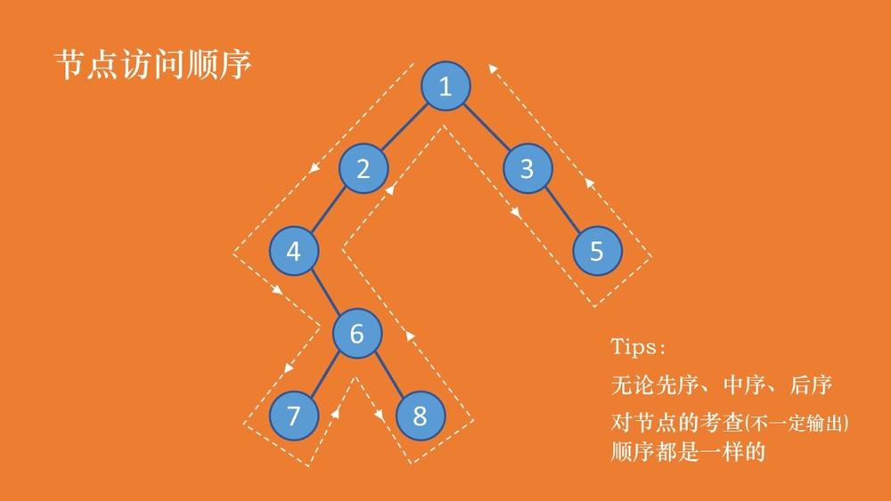

## 树结构

* 二叉树
* 二叉搜索树（二叉查找树）
* 平衡查找树（防止二叉查找树退化为线性列表）
	* 2-3查找树
	* 红黑树
* B树和B+树（B Tree/B+ Tree）

### 二叉搜索树（二叉查找树）

二叉查找树（BinarySearch Tree，也叫二叉搜索树，或称二叉排序树Binary Sort Tree）或者是一棵空树，或者是具有下列性质的二叉树：

* 若任意节点的左子树不空，则左子树上所有结点的值均小于它的根结点的值；

* 若任意节点的右子树不空，则右子树上所有结点的值均大于它的根结点的值；

* 任意节点的左、右子树也分别为二叉查找树。


二叉查找树性质：对二叉查找树进行`中序遍历`，即可得到有序的数列。

二叉树的插入操作

二叉树的删除操作

### 2-3查找树

一颗2-3查找树或为一颗空树，或由以下节点组成：

* 2-节点：含有一个键值对和两条链接，左链接指向的2-3树中的键都小于该节点，右链接反之。
* 3-节点：含有两个键值对和三条链接，左链接指向的2-3树中的键都小于该节点，中链接指向的2-3树中的键都位于该节点的两个键之间，右链接反之。

https://juejin.im/post/5b7e00456fb9a01a0b3193c7


### 红黑树

1. 根节点为黑色
2. 每个节点有两个 NIL 黑色子节点
3. 新节点为红色

将要插入的节点标为N，N的父节点标为P，N的祖父节点标为G，N的叔父节点标为U。

情形1 : 新节点N位于树的根上，没有父节点，标记为黑色。
情形2 : 新节点的父节点P是黑色，在这种情形下，树仍是有效的。
情形3：



* https://juejin.im/post/5bcd19fbe51d457a964d08d7
* https://zh.wikipedia.org/wiki/%E7%BA%A2%E9%BB%91%E6%A0%91

B 树

B+ 树
https://juejin.im/post/5b9073f9f265da0acd209624

https://zhuanlan.zhihu.com/p/27700617


### 遍历方法

* 深度优先遍历
  * 核心：循环 + 递归
* 广度优先遍历
  * 核心：队列的出对、入队
* 先序遍历
* 中序遍历
* 后序遍历

#### 先序、中序、后序遍历方法示例：



```
先序：
1、获取节点
2、打印
3、递归左节点
4、递归右节点
先序：1 2 4 6 7 8 3 5

中序：
1、获取节点
2、递归左节点
3、打印
4、递归右节点
中序：4 7 6 8 2 1 3 5

后序：
1、获取节点
2、递归左节点
3、递归右节点
4、打印
后序：7 8 6 4 2 5 3 1

```


参考：

* http://www.cnblogs.com/maybe2030/p/4715035.html