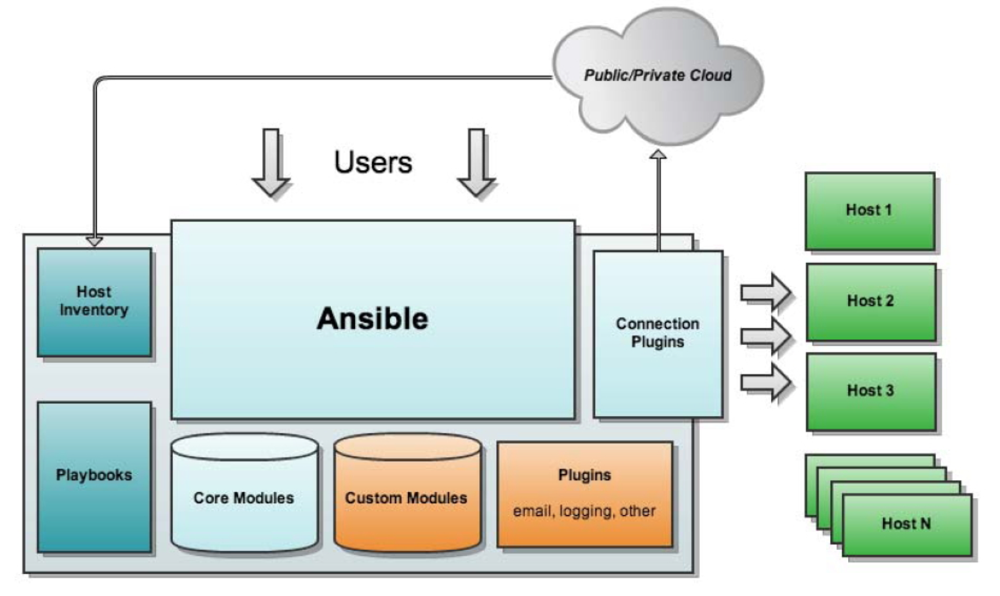

## Ansible 常见模块



[参考](https://my.oschina.net/u/3413282/blog/876231)

```bash
ansible <host-pattern> [-i hosts] [-f forks] [-m module_name] [-a args] [options]
```
* host-pattern：这次的命令对哪些主机生效；
* -f forks：启动的并发线程数，就是一次并行处理多少主机；
* -m module_name：要使用的模块；
* -a args：模块特有的参数。

```bash
ansible-doc -l

# 查看 module 模块详细信息
ansible-doc module_name 

# 查看 module 模块详细用法
ansible-doc -s module_name
```

* ping

检查指定节点机器是否还能连通

* raw

执行原始的命令，而不是通过模块子系统

* yum
* apt
* pip
* npm

* synchronize

使用rsync同步文件，将主控方目录推送到指定节点的目录下

* template
* copy

主控端向目标主机copy文件

* user、group
* service

* get_url

该模块主要用于从http、ftp、https服务器上下载文件（类似于wget）

* fetch

它用于从远程机器获取文件

* file

* archive

用于在远端压缩文件。当然，前提是在远端主机上要有对应的压缩工具。支持zip/gz/tar/bz2

* unarchive

用于解压文件

* command、shell

[参考](https://blog.csdn.net/pushiqiang/article/details/78249665)

* cron

任务计划模块

* setup

收集远程主机的信息

* script

在远程主机执行本地脚本

* stat

获取远程文件信息

[参考](https://www.cnblogs.com/cloudos/p/8329300.html)

* mount

挂载文件系统

* set_fact

set_fact模块可以自定义facts

[参考](https://www.cnblogs.com/guxiaobei/p/8316903.html)
[参考](https://www.cnblogs.com/zhaojiankai/p/7606445.html)

* replace

一个替换功能的模块，会将指定的字符替换成新字符

* filesystem

文件系统模块

* hostname

设置系统的主机名

* git

* yum_repository

用于配置yum源。可以实现非常完整的yum仓库配置

* authorzied_key

* debug

* wait_for

有些时候任务之间对状态、文件、端口等资源是有依赖关系的，只有满足了前提，任务才会继续。wait_for模块就是用于判断任务在满足什么条件的情况下会继续。主要用来判断端口是否开启、文件是否存在、文件中是否存在某些字符串

[参考](https://www.iyunv.com/thread-430845-1-1.html)

* sysctl

sysctl包管理模块，用于远程主机sysctl的配置

* async_status

检查作业状态

* ini_file

ini 文件管理模块

* uri

Web请求模块，uri模块主要用于发送HTTP协议，通过使用uri模块，可以让目标主机向指定的网站发送如Get、Post这样的HTTP请求，并且能得到返回的状态码


```
a10_server                         管理A10 Networks AX / SoftAX / Thunder / vThunder设备
a10_service_group                  管理A10网络设备的服务组
a10_virtual_server                 管理A10网络设备的虚拟服务器
acl                                设置和检索文件ACL信息。
add_host                           将主机（以及组）添加到ansible-playbook内存库存中
airbrake_deployment                通知airbrake有关应用程序部署的信息
alternatives                       管理常用命令的替代程序
apache2_mod_proxy                  设置和/或获取Apache httpd 2.4 mod_proxy平衡器池的成员属性
apache2_module                     启用/禁用Apache2 webserver的模块
apk                                管理apk包
apt                                管理apt-packages
apt_key                            添加或删除apt键
apt_repository                     添加和删​​除APT存储库
apt_rpm                            apt_rpm软件包管理器
asa_acl                            管理Cisco ASA上的访问列表
asa_command                        在Cisco ASA设备上运行任意命令。
asa_config                         管理Cisco ASA配置部分
assemble                           从片段组装配置文件
assert                             断言给定表达式为true
async_status                       获取异步任务的状态
at                                 通过at命令计划执行命令或脚本文件。
atomic_host                        管理原子主机平台
atomic_image                       管理原子主机平台上 的容器映像
authorized_key                     添加或删除SSH授权密钥
azure                              在azure中
azure_rm_deployment                创建或终止虚拟机 创建或销毁Azure Resource Manager模板部署
azure_rm_networkinterface          管理Azure网络接口。
azure_rm_networkinterface_facts    获取网络接口事实。
azure_rm_publicipaddress           管理Azure公共IP地址。
azure_rm_publicipaddress_facts     获取公共知识产权事实
azure_rm_resourcegroup             管理Azure资源组。
azure_rm_resourcegroup_facts       获取资源组事实。
azure_rm_securitygroup             管理Azure网络安全组。
azure_rm_securitygroup_facts       获取安全组事实。
azure_rm_storageaccount            管理Azure存储帐户。
azure_rm_storageaccount_facts      获取存储帐户事实。
azure_rm_storageblob               管理blob容器和blob对象。
azure_rm_subnet                    管理Azure子网。
azure_rm_virtualmachine            管理Azure虚拟机。
azure_rm_virtualmachineimage_facts 获取虚拟机映像事实。
azure_rm_virtualnetwork            管理Azure虚拟网络。
azure_rm_virtualnetwork_facts      获取虚拟网络事实。
bigip_device_dns                   管理BIG-IP设备DNS设置
bigip_device_ntp                   管理BIG-IP上的NTP服务器管理BIG-IP
bigip_device_sshd                  的SSHD设置
bigip_facts                        从F5 BIG-IP设备收集事实
bigip_gtm_datacenter               管理BIG-IP 管理中的数据中心配置
bigip_gtm_virtual_server           F5 BIG-IP GTM虚拟服务器
bigip_gtm_wide_ip                  管理F5 BIG-IP GTM宽IP
bigip_irule                        在BIG-IP上跨不同模块管理iRule。
bigip_monitor_http                 管理F5 BIG-IP LTM http监视器
bigip_monitor_tcp                  管理F5 BIG-IP LTM tcp监视器
bigip_node                         管理F5 BIG-IP LTM节点
bigip_pool                         管理F5 BIG-IP LTM池
bigip_pool_member                  管理F5 BIG-IP LTM池成员
bigip_routedomain                  管理BIG-IP上的路由域
bigip_selfip                       管理BIG-IP系统上的自身IP
bigip_ssl_certificate              从BIG-IP
bigip_sys_db                       管理BIG-IP系统数据库变量 导入/删除证书
bigip_virtual_server               管理F5 BIG-IP LTM虚拟服务器
bigip_vlan                         管理BIG-IP系统上的VLAN
bigpanda                           通知BigPanda有关部署
blockinfile                        插入/更新/删除由标记线包围的文本块。
boundary_meter                     管理边界仪表
bower                              使用bower管理bower软件包
bundler                            使用Bundler管理Ruby Gem依赖项
bzr                                从bzr分支部署软件（或文件）
campfire                           向Campfire发送消息
capabilities                       管理Linux功能
circonus_annotation                在circonus中创建注释在
cl_bond                            Cumulus Linux上
cl_bridge                          配置绑定端口在Cumulus Linux上 配置网桥端口
cl_img_install                     安装不同的Cumulus Linux版本。
cl_interface                       配置Cumulus Linux上的前面板端口，环回或管理端口。
cl_interface_policy                在Cumulus Linux上配置接口强制策略
cl_license                         安装Cumulus Linux许可证
cl_ports                           配置Cumulus Switch端口属性（ports.conf）
clc_aa_policy                      在CenturyLink Cloud上创建或删除Anti Affinity策略。
clc_alert_policy                   在CenturyLink Cloud上创建或删除警报策略。
clc_blueprint_package              在CenturyLink Cloud中的一组服务器上部署蓝色打印包。
clc_firewall_policy                创建/删除/更新防火墙策略
clc_group                          在Centurylink Cloud上
clc_loadbalancer                   创建/删除服务器组 创建，删除CenturyLink Cloud中的共享负载均衡器。
clc_modify_server                  修改CenturyLink Cloud中的服务器。
clc_publicip                       在CenturyLink Cloud中的服务器上添加和删除公共ips。
clc_server                         在CenturyLink Cloud中创建，删除，启动和停止服务器。
clc_server_snapshot                在CenturyLink Cloud中创建，删除和还原服务器快照。
cloudflare_dns                     管理Cloudflare DNS记录
cloudformation                     创建或删除AWS CloudFormation堆栈
cloudformation_facts               获取有关AWS CloudFormation堆栈的事实
cloudtrail                         管理CloudTrail创建和删除
cloudwatchevent_rule               管理CloudWatch事件规则和目标
command                            在远程节点上执行命令
composer                           Dependency Manager for PHP
consul                             在consul集群中添加，修改和删除服务。
consul_acl                         操纵领事密钥和规则
consul_kv                          处理consul集群的键/值存储中的条目。
consul_session                     操纵consul会话将
copy                               文件复制到远程位置。
cpanm                              管理Perl库依赖项。
cron                               管理cron.d和crontab条目。
cronvar                            用crontabs管理变量
crypttab                           加密的Linux块设备
cs_account                         管理基于Apache CloudStack的云上的帐户。
cs_affinitygroup                   管理基于Apache CloudStack的云上的关联组。
cs_cluster                         在基于Apache CloudStack的云上管理主机群集。
cs_configuration                   管理基于Apache CloudStack的云的配置。
cs_domain                          管理基于Apache CloudStack的云上的域。
cs_facts                           收集有关基于Apache CloudStack的云实例的事实。
cs_firewall                        管理基于Apache CloudStack的云的防火墙规则。
cs_instance                        管理基于Apache CloudStack的云上的实例和虚拟机。
cs_instance_facts                  从基于Apache CloudStack的云的实例API中收集事实。
cs_instancegroup                   管理基于Apache CloudStack的云上的实例组。
cs_ip_address                      管理基于Apache CloudStack的云上的公共IP地址关联。
cs_iso                             在基于Apache CloudStack的云上管理ISO映像。
cs_loadbalancer_rule               管理基于Apache CloudStack的云的负载均衡器规则。
cs_loadbalancer_rule_member        管理基于Apache CloudStack的云上的负载均衡器规则成员。
cs_network                         在基于Apache CloudStack的云上管理网络。
cs_pod                             管理基于Apache CloudStack的云上的pod。
cs_portforward                     管理基于Apache CloudStack的云的端口转发规则。
cs_project                         管理基于Apache CloudStack的云上的项目。
cs_resourcelimit                   管理基于Apache CloudStack的云的资源限制。
cs_router                          管理基于Apache CloudStack的云上的路由器。
cs_securitygroup                   管理基于Apache CloudStack的云上的安全组。
cs_securitygroup_rule              管理基于Apache CloudStack的云的安全组规则。
cs_snapshot_policy                 管理基于Apache CloudStack的云上的卷快照策略。
cs_sshkeypair                      在基于Apache CloudStack的云上管理SSH密钥。
cs_staticnat                       在基于Apache CloudStack的云上管理静态NAT。
cs_template                        管理基于Apache CloudStack的云上的模板。
cs_user                            管理基于Apache CloudStack的云上的用户。
cs_vmsnapshot                      在基于Apache CloudStack的云上管理VM快照。
cs_volume                          管理基于Apache CloudStack的云上的卷。
cs_zone                            管理基于Apache CloudStack的云上的区域。
cs_zone_facts                      从基于Apache CloudStack的云收集区域的事实。
datadog_event                      将事件发布到DataDog服务
datadog_monitor                    管理Datadog监视器 在执行期间
debconf                            配置.deb程序包
debug                              打印语句
dellos10_command                   在运行Dell OS10的远程设备上运行命令
dellos10_config                    管理Dell OS10配置部分
dellos10_facts                     从运行Dell OS10的远程设备收集事实运行Dell OS6的远程设备上
dellos6_command                    运行命令
dellos6_config                     管理Dell OS6配置部分
dellos6_facts                      从运行Dell OS6的远程设备收集事实
dellos9_command                    在运行Dell OS9的远程设备上运行命令
dellos9_config                     管理Dell OS9配置部分
dellos9_facts                      从运行Dell OS9的远程设备收集事实
deploy_helper                      管理部署项目中常见的一些步骤。
digital_ocean                      在DigitalOcean中创建/删除Droplet / SSH_key在DigitalOcean中
digital_ocean_block_storage        创建/销毁或附加/分离块存储卷
digital_ocean_domain               在DigitalOcean中
digital_ocean_sshkey               创建/删除DNS记录在DigitalOcean中 创建/删除SSH密钥
digital_ocean_tag                  创建和删除标签到DigitalOcean资源。
django_manage                      管理Django应用程序。
dladm_etherstub                    管理Solaris / illumos系统上的etherstubs。
dladm_vnic                         在Solaris / illumos系统上管理VNIC。
dnf                                使用
dnsimple                           带有dnsimple.com（DNS托管服务）的'dnf'包管理器接口管理包 。
dnsmadeeasy                        与dnsmadeeasy.com（DNS托管服务）的接口。
docker                             管理docker容器
docker_container                   管理docker容器
docker_image                       管理docker镜像。
docker_image_facts                 检查docker镜像
docker_login                       登录Docker注册表。
docker_network                     管理Docker网络
docker_service                     管理docker服务和容器。
docker_swarm_service               管理Docker网络
dpkg_selections                    Dpkg包选择选项
dynamodb_table                     创建，更新或删除AWS Dynamo数据库表。
easy_install                       安装Python库
ec2                                创建，终止，启动或停止ec2中的实例
ec2_ami                            创建或销毁ec2中 的图像
ec2_ami_copy                       复制AWS区域之间的AMI，返回新图像ID
ec2_ami_find                       搜索AMI以获取AMI ID和其他信息
ec2_asg                            创建或删除AWS Autoscaling Groups
ec2_asg_facts                      在AWS中收集有关ec2 Auto Scaling组（ASG）的事实
ec2_customer_gateway               管理AWS客户网关
ec2_eip                            管理EC2弹性IP（EIP）地址。
ec2_elb                            从EC2 ELB取消注册或注册实例
ec2_elb_facts                      在AWS中收集有关EC2 Elastic Load Balancers的事实
ec2_elb_lb                         创建或销毁Amazon ELB。
ec2_eni                            创建并可选地将弹性网络接口（ENI）附加到实例
ec2_eni_facts                      在AWS
ec2_facts                          收集有关ec2 ENI接口的 事实关于ec2（aws）中的远程主机的事实
ec2_group                          维护ec2 VPC安全组。
ec2_key                            保持ec2密钥对。
ec2_lc                             创建或删除AWS Autoscaling启动配置
ec2_lc_find                        查找AWS Autoscaling启动配置
ec2_metric_alarm                   创建/更新或删除AWS Cloudwatch'度量标准警报'
ec2_remote_facts                   在AWS中收集有关ec2实例的事实
ec2_scaling_policy                 创建或删除Autoscaling组的AWS扩展策略可
ec2_snapshot                       从现有卷创建快照
ec2_snapshot_facts                 在AWS中收集有关ec2卷快照的事实
ec2_tag                            创建并删除标记到ec2资源。
ec2_vol                            创建和附加卷，返回卷ID和设备映射
ec2_vol_facts                      在AWS中收集有关ec2卷的事实
ec2_vpc                            配置AWS虚拟私有云
ec2_vpc_dhcp_options               管理DHCP选项，并确保给定VPC的DHCP选项与请求的匹配
ec2_vpc_dhcp_options_facts         在AWS中收集有关dhcp选项集的事实
ec2_vpc_igw                        管理AWS VPC Internet网关
ec2_vpc_nacl                       创建和删除网络ACL。
ec2_vpc_nacl_facts                 在AWS VPC中收集有关网络ACL的事实
ec2_vpc_nat_gateway                管理AWS VPC NAT网关。
ec2_vpc_net                        配置AWS虚拟私有云
ec2_vpc_net_facts                  在AWS中收集有关ec2 VPC的事实
ec2_vpc_peer                       创建，删除，接受和拒绝两个VPC之间的VPC对等连接。
ec2_vpc_route_table                管理AWS虚拟私有云的路由表
ec2_vpc_route_table_facts          收集AWS中的 ec2 VPC路由表的事实
ec2_vpc_subnet                     在AWS虚拟私有云中管理子网在AWS中
ec2_vpc_subnet_facts               收集有关ec2 VPC子网的事实
ec2_vpc_vgw                        创建和删除AWS VPN虚拟网关。
ec2_win_password                   获取ec2 windows实例的默认管理员密码
ecs_cluster                        创建或终止ecs集群
ecs_service                        创建，终止，启动或停止ecs
ecs_service_facts                  列表中的服务或描述ecs 中的服务
ecs_task                           运行，启动或停止ecs中的任务
ecs_taskdefinition                 在ecs中注册任务定义
efs                                创建和维护EFS文件系统
efs_facts                          获取有关Amazon EFS文件系统的信息
ejabberd_user                      管理ejabberd服务器的用户
elasticache                        在Amazon Elasticache中管理缓存集群。
elasticache_subnet_group           管理Elasticache子网组
elasticsearch_plugin               管理Elasticsearch插件
eos_command                        在Arista EOS设备上运行任意命令
eos_config                         管理Arista EOS配置部分
eos_eapi                           管理和配置Arista EOS eAPI。
eos_facts                          从运行Arista EOS的远程设备收集事实
execute_lambda                     执行AWS Lambda函数
exo_dns_domain                     管理Exoscale DNS API上的域记录。
exo_dns_record                     管理Exoscale DNS上的DNS记录。
expect                             执行命令并响应提示
facter                             在远程系统上运行发现程序'facter'
fail                               使用自定义消息时失败
fetch                              从远程节点获取文件
file                               设置文件的属性
filesystem                         使块设备上的文件系统
find                               根据特定条件返回文件列表
firewalld                          使用firewalld
flowadm                            管理任意端口/服务 管理协议，服务和区域的带宽资源控制和优先级。
flowdock                           发送消息给flowdock
gc_storage                         此模块管理Google云端存储中的对象/存储桶。
gcdns_record                       在Google Cloud DNS中创建或删除资源记录在Google Cloud DNS中
gcdns_zone                         创建或删除区域
gce                                创建或终止GCE实例
gce_img                            使用GCE图像资源
gce_lb                             创建/销毁GCE负载均衡器资源
gce_mig                            创建，更新或销毁托管实例组（MIG）。
gce_net                            创建/销毁GCE网络和防火墙规则
gce_pd                             利用GCE持久磁盘资源
gce_tag                            向GCE实例添加标签或从GCE实例中删除标签
gem                                管理Ruby gems将
get_url                            文件从HTTP，HTTPS或FTP下载到节点
getent                             unix getent实用程序的包装器
git                                从git checkouts部署软件（或文件）
git_config                         读取和写入git配置
github_hooks                       管理github服务挂钩。
github_key                         管理GitHub访问密钥。
github_release                     与GitHub版本互动
gitlab_group                       创建/更新/删除Gitlab组
gitlab_project                     创建/更新/删除Gitlab项目
gitlab_user                        创建/更新/删除Gitlab用户
gluster_volume                     管理GlusterFS卷
group                              添加或删除
group_by                           组根据事实创建Ansible组
grove                              向grove.io频道
hall                               发送通知向Hall发送通知
haproxy                            使用套接字命令启用，禁用和设置HAProxy后端服务器的权重。
hg                                 管理Mercurial（hg）存储库。
hipchat                            发送消息给hipchat。
homebrew                           Homebrew的包管理器
homebrew_cask                      安装/卸载自制垃圾桶。
homebrew_tap                       点击Homebrew存储库。
honeybadger_deployment             通知Honeybadger.io有关应用程序部署的信息
hostname                           管理主机名
htpasswd                           管理用户文件以进行基本身份验证
iam                                管理IAM用户，组，角色和密钥
iam_cert                           管理在ELB和CloudFront上使用的服务器证书
iam_mfa_device_facts               列出为用户注册的MFA（多重身份验证）设备
iam_policy                         管理用户，组和角色的IAM策略
iam_server_certificate_facts       检索服务器证书的事实
include                            包括播放或任务列表。
include_role                       加载并执行角色
include_vars                       在任务中动态加载文件中的变量。
influxdb_database                  管理InfluxDB数据库
influxdb_retention_policy          管理InfluxDB保留策略
ini_file                           调整INI文件中的设置在
ios_command                        运行Cisco IOS的​​远程设备上运行命令
ios_config                         管理Cisco IOS配置部分
ios_facts                          从
iosxr_command                      运行Cisco iosxr的远程设备上运行IOS Run命令的远程设备 收集事实
iosxr_config                       管理Cisco IOS XR配置部分
iosxr_facts                        从运行IOS-XR的远程设备收集事实
ipadm_if                           管理Solaris / illumos系统上的IP接口。
ipadm_prop                         管理Solaris / illumos系统上的协议属性。
ipify_facts                        检索Internet网关的公共IP。
ipmi_boot                          管理启动设备的顺序
ipmi_power                         机器的电源管理
iptables                           修改系统iptables
irc                                向IRC频道
jabber                             发送消息向jabber用户或聊天室发送消息
jboss                              将应用程序部署到JBoss
jenkins_job                        管理jenkins作业
jenkins_plugin                     添加或删除Jenkins插件
jira                               在JIRA实例中创建和修改问题在
junos_command                      运行Junos的远程设备上执行任意命令在
junos_config                       运行Juniper JUNOS的设备上管理配置
junos_facts                        从运行Junos的远程设备收集事实
junos_netconf                      配置Junos Netconf系统服务
junos_package                      在运行Junos
kernel_blacklist                   Blacklist内核模块的 远程设备上安装软件包
kibana_plugin                      管理Kibana插件
kinesis_stream                     管理Kinesis Stream。
known_hosts                        在'known_hosts'文件中添加或删除主机
kubernetes                         Manage Kubernetes资源。
lambda                             管理AWS Lambda函数
lambda_alias                       创建，更新或删除AWS Lambda函数别名。
lambda_event                       创建，更新或删除AWS Lambda函数事件映射。
lambda_facts                       将AWS Lambda函数详细信息收集为Ansible事实
layman                             管理Gentoo覆盖
letsencrypt                        使用Let's Encrypt创建SSL证书
librato_annotation                 在librato中创建注释
lineinfile                         确保特定行位于文件中，或使用反向引用的正则表达式替换现有行。
linode                             在Linode Public Cloud中创建/删除/停止/重启实例
lldp                               获取lldp报告的详细信息
locale_gen                         创建或删除区域设置。
logentries                         通过logentries.com跟踪日志的模块
logicmonitor                       通过Ansible Playbooks管理LogicMonitor帐户
logicmonitor_facts                 收集有关LogicMonitor对象的事实
lvg                                配置LVM卷组
lvol                               配置LVM逻辑卷
lxc_container                      管理LXC容器
lxd_container                      管理LXD容器
lxd_profile                        管理LXD配置文件
macports                           MacPorts的软件包管理器
mail                               发送电子邮件
make                               在Makefile中运行目标
maven_artifact                     从Maven存储库下载工件
meta                               执行Ansible'actions'
modprobe                           添加或删除内核模块
mongodb_parameter                  更改MongoDB服务器上的管理参数。
mongodb_user                       从MongoDB数据库添加或删除用户。
monit                              管理通过Monit监控的程序的状态
mount                              控制活动和已配置的装入点
mqtt                               在ITT的MQTT主题上发布消息
mssql_db                           从远程主机添加或删除MSSQL数据库。
mysql_db                           从远程主机添加或删除MySQL数据库。
mysql_replication                  管理MySQL复制
mysql_user                         在MySQL数据库中添加或删除用户。
mysql_variables                    管理MySQL全局变量
nagios                             在Nagios中执行与停机和通知相关的常见任务。
netapp_e_amg                       创建，删除和更新异步镜像组
netapp_e_amg_role                  更新异步镜像组（AMG）中存储阵列的角色。
netapp_e_amg_sync                  对异步成员组执行同步操作。
netapp_e_auth                      设置或更新存储阵列的密码。
netapp_e_facts                     获取有关NetApp E系列阵列的信息
netapp_e_flashcache                管理NetApp SSD缓存
netapp_e_host                      管理eseries主机
netapp_e_hostgroup                 管理NetApp存储阵列主机组
netapp_e_lun_mapping               创建或删除LUN映射
netapp_e_snapshot_group            管理快照组
netapp_e_snapshot_images           创建和删除快照映像
netapp_e_snapshot_volume           管理E / EF系列快照卷。
netapp_e_storage_system            从Web服务代理添加/删除阵列
netapp_e_storagepool               管理磁盘组和磁盘池
netapp_e_volume                    管理存储卷（标准和精简）
netapp_e_volume_copy               创建卷拷贝对
netconf_config                     netconf设备配置
netscaler                          管理Citrix NetScaler实体
newrelic_deployment                通知有关应用程序部署的新内容
nexmo                              通过nexmo发送SMS使用npm
nmcli                              管理网络
npm                                管理node.js软件包
nxos_aaa_server                    管理AAA服务器全局配置。
nxos_aaa_server_host               管理AAA服务器主机特定的配置。
nxos_acl                           管理ACL的访问列表条目。
nxos_acl_interface                 管理将ACL应用于接口。
nxos_bgp                           管理BGP配置。
nxos_bgp_af                        管理BGP地址族配置。
nxos_bgp_neighbor                  管理BGP邻居配置。
nxos_bgp_neighbor_af               管理BGP地址族的邻居配置。
nxos_command                       在Cisco NXOS设备上运行任意命令
nxos_config                        管理Cisco NXOS配置部分
nxos_evpn_global                   处理VXLAN的EVPN控制平面。
nxos_evpn_vni                      管理Cisco EVPN VXLAN网络标识符（VNI）。
nxos_facts                         获取有关NX-OS交换机的事实
nxos_feature                       管理NX-OS交换机中的功能。
nxos_file_copy                     通过SCP将文件复制到远程NXOS设备。
nxos_gir                           触发开关的正常移除或插入（GIR）。
nxos_gir_profile_management        为GIR创建维护模式或正常模式配置文件。
nxos_hsrp                          管理NX-OS交换机上的HSRP配置。
nxos_igmp                          管理IGMP全局配置。
nxos_igmp_interface                管理IGMP接口配置。
nxos_igmp_snooping                 管理IGMP Snooping全局配置。
nxos_install_os                    设置启动选项，如启动映像和kickstart映像。
nxos_interface                     管理接口的物理属性。
nxos_interface_ospf                管理OSPF接口实例的配置。
nxos_ip_interface                  管理IPv4和IPv6接口的L3属性。
nxos_mtu                           管理Nexus交换机上的MTU设置。
nxos_ntp                           管理核心NTP配置。
nxos_ntp_auth                      管理NTP身份验证。
nxos_ntp_options                   管理NTP选项。
nxos_nxapi                         在NXOS设备上管理NXAPI配置。
nxos_ospf                          管理ospf实例的配置。
nxos_ospf_vrf                      管理OSPF路由器的VRF。
nxos_overlay_global                配置交换机的任播网关MAC。
nxos_pim                           管理PIM实例的配置。
nxos_pim_interface                 管理PIM接口配置。
nxos_pim_rp_address                管理PIM静态RP地址实例的配置。
nxos_ping                          使用Nexus交换机的ping测试可达性。
nxos_portchannel                   管理端口通道接口。
nxos_reboot                        重新启动网络设备。
nxos_rollback                      设置检查点或回滚到检查点。
nxos_smu                           在Cisco NX-OS设备上执行SMU。
nxos_snapshot                      管理所选功能的运行状态的快照。
nxos_snmp_community                管理SNMP社区配置。
nxos_snmp_contact                  管理SNMP联系信息。
nxos_snmp_host                     管理SNMP主机配置。
nxos_snmp_location                 管理SNMP位置信息。
nxos_snmp_traps                    管理SNMP陷阱。
nxos_snmp_user                     管理SNMP用户进行监控。
nxos_static_route                  管理静态路由配置
nxos_switchport                    管理第2层交换机端口接口。
nxos_udld                          管理UDLD全局配置参数。
nxos_udld_interface                管理UDLD接口配置参数。
nxos_vlan                          管理VLAN资源和属性。
nxos_vpc                           管理全局VPC配置
nxos_vpc_interface                 管理接口VPC配置
nxos_vrf                           管理全局VRF配置。
nxos_vrf_af                        管理VRF AF。
nxos_vrf_interface                 管理特定于接口的VRF配置。
nxos_vrrp                          管理NX-OS交换机上的VRRP配置。
nxos_vtp_domain                    管理VTP域配置。
nxos_vtp_password                  管理VTP密码配置。
nxos_vtp_version                   管理VTP版本配置。
nxos_vxlan_vtep                    管理VXLAN网络虚拟化端点（NVE）。
nxos_vxlan_vtep_vni                创建虚拟网络标识符成员（VNI）
ohai                               从“Ohai”返回库存数据
open_iscsi                         使用open-iscsi管理iscsi目标
openbsd_pkg                        在OpenBSD上管理包。
opendj_backendprop                 将通过dsconfig set-backend-prop命令更新OpenDJ的后端配置。
openvswitch_bridge                 管理Open vSwitch网桥
openvswitch_db                     配置打开的vswitch数据库。
openvswitch_port                   管理Open vSwitch端口
opkg                               OpenWrt的软件包管理器
ops_command                        在OpenSwitch设备上运行任意命令。
ops_config                         使用CLI管理OpenSwitch配置
ops_facts                          从OpenSwitch收集设备特定事实
os_auth                            检索身份验证令牌
os_client_config                   获取OpenStack客户端配置
os_flavor_facts                    检索有关一种或多种口味的事实
os_floating_ip                     从实例添加/删除浮动IP
os_group                           管理OpenStack标识组
os_image                           从OpenStack Cloud添加/删除图像
os_image_facts                     检索有关OpenStack中图像的事实。
os_ironic                          从OpenStack创建/删除裸金属资源
os_ironic_inspect                  讽刺地明确触发裸机节点内省。
os_ironic_node                     从OpenStack激活/取消激活裸金属资源从OpenStack
os_keypair                         添加/删除密钥对
os_keystone_domain                 管理OpenStack身份域
os_keystone_domain_facts           检索有关一个或多个OpenStack域的事实
os_keystone_role                   管理OpenStack身份角色
os_keystone_service                管理OpenStack身份服务
os_network                         从OpenStack创建/删除网络
os_networks_facts                  检索有关一个或多个OpenStack网络的事实。
os_nova_flavor                     管理OpenStack计算风格
os_object                          从OpenStack创建或删除对象和容器从
os_port                            OpenStack云添加/更新/删除端口。
os_port_facts                      检索有关OpenStack中端口的事实。
os_project                         管理OpenStack项目
os_project_facts                   检索有关一个或多个OpenStack项目的事实
os_recordset                       管理OpenStack DNS记录集
os_router                          从OpenStack创建或删除路由器从
os_security_group                  OpenStack云添加/删除安全组。
os_security_group_rule             从现有安全组添加/删除规则
os_server                          从OpenStack创建/删除计算实例从OpenStack
os_server_actions                  执行计算实例的操作
os_server_facts                    检索有关一个或多个计算实例的事实
os_server_group                    管理OpenStack服务器组
os_server_volume                   从OpenStack VM的
os_stack                           添加/删除热堆栈 附加/分离卷
os_subnet                          向OpenStack网络添加/删除子网
os_subnets_facts                   检索有关一个或多个OpenStack子网的事实。
os_user                            管理OpenStack身份用户
os_user_facts                      检索有关一个或多个OpenStack用户的事实
os_user_group                      关联OpenStack身份用户和组
os_user_role                       关联OpenStack身份用户和角色
os_volume                          创建/删除Cinder卷
os_zone                            管理OpenStack DNS区域
osx_defaults                       osx_defaults允许用户从Ansible读取，写入和删除Mac OS X用户默认值
osx_say                            使OSX计算机发言。
ovh_ip_loadbalancing_backend       管理OVH IP LoadBalancing后端
ovirt                              oVirt / RHEV平台管理
ovirt_auth                         用于管理oVirt身份验证的模块。
ovirt_disks                        用于管理oVirt中的虚拟机和浮动磁盘的模块。
ovirt_vms                          用于管理oVirt中的虚拟机的模块。
pacemaker_docker_ocf               管理Docker网络
pacemaker_service                  管理Docker网络
pacemaker_vip                      管理Docker网络
package                            通用OS包
pacman                             管理器使用'pacman'管理包
pagerduty                          创建PagerDuty维护窗口
pagerduty_alert                    触发，确认或解决PagerDuty事件
pam_limits                         修改Linux PAM限制
patch                              使用GNU修补程序工具应用修补程序文件。
pause                              暂停playbook执行
pear                               管理pear / pecl包
ping                               尝试连接到主机，验证可用的python并在成功时返回“pong”。
pingdom                            暂停/取消暂停Pingdom警报
pip                                管理Python库依赖项。
pkg5                               使用Solaris 11映像包管理系统管理包
pkg5_publisher                     管理Solaris 11映像
pkgin                              包管理系统发布 者SmartOS包管理器，NetBSD等。
pkgng                              FreeBSD的软件包管理器> = 9.0
pkgutil                            在Solaris
pn_cluster                         CLI命令上管理CSW-Packages 以创建/删除集群。
pn_ospf                            CLI命令用于向vRouter添加/删除ospf协议。
pn_ospfarea                        CLI命令用于向/从vrouter添加/删除ospf区域。
pn_show                            在nvOS设备上运行show命令。
pn_trunk                           CLI命令用于创建/删除/修改中继。
pn_vlag                            CLI命令用于创建/删除/修改vlag。
pn_vlan                            CLI命令用于创建/删除VLAN。
pn_vrouter                         CLI命令用于创建/删除/修改vrouter。
pn_vrouterbgp                      用于添加/删除/修改vrouter-bgp的CLI命令。
pn_vrouterif                       CLI命令添加/删除/修改vrouter-interface。
pn_vrouterlbif                     CLI命令用于添加/删除vrouter-loopback-interface。
portage                            Gentoo的软件包管理
portinstall                        器从FreeBSD的ports系统安装软件包从
postgresql_db                      远程主机添加或删除PostgreSQL数据库。
postgresql_ext                     从数据库添加或删除PostgreSQL扩展。
postgresql_lang                    使用PostgreSQL数据库添加，删除或更改过程语言。
postgresql_privs                   授予或撤消PostgreSQL数据库对象的权限。
postgresql_user                    从PostgreSQL数据库添加或删除用户（角色）。
profitbricks                       创建，销毁，启动，停止和重新启动ProfitBricks虚拟机。
profitbricks_datacenter            创建或销毁ProfitBricks虚拟数据中心。
profitbricks_nic                   创建或删除NIC。
profitbricks_volume                创建或销毁卷。
profitbricks_volume_attachments    连接或分离卷。
proxmox                            在Proxmox实例的管理VE集群
proxmox_template                   的Proxmox OS模板管理VE集群
puppet                             运行的傀儡
pushbullet                         向Pushbullet
pushover                           发送通知通过https://pushover.net发送通知
rabbitmq_binding                   此模块管理rabbitMQ绑定
rabbitmq_exchange                  此模块管理rabbitMQ交换
rabbitmq_parameter                 向RabbitMQ
rabbitmq_plugin                    添加或删除参数向RabbitMQ 添加或删除插件
rabbitmq_policy                    管理RabbitMQ中的策略状态。
rabbitmq_queue                     此模块管理rabbitMQ队列
rabbitmq_user                      向RabbitMQ添加或删除用户在RabbitMQ中
rabbitmq_vhost                     管理虚拟主机的状态
raw                                执行低位且脏的SSH命令
rax                                在Rackspace Public Cloud中创建/删除实例
rax_cbs                            操纵Rackspace Cloud Block存储卷
rax_cbs_attachments                操作Rackspace Cloud Block存储卷附件
rax_cdb                            创建/删除或调整Rackspace Cloud数据库实例
rax_cdb_database                   创建/删除云数据库中的数据库
rax_cdb_user                       创建/删除Rackspace Cloud Database
rax_clb                            在Rackspace Public Cloud中创建/删除负载均衡器
rax_clb_nodes                      从Rackspace Cloud Load Balancer添加，修改和删除节点
rax_clb_ssl                        管理Rackspace Cloud Load Balancer的 SSL终止。
rax_dns                            管理Rackspace Cloud DNS上的域管理Rackspace Cloud上的DNS
rax_dns_record                     记录DNS
rax_facts                          收集Rackspace云服务器的事实
rax_files                          操作Rackspace云文件容器
rax_files_objects                  在Rackspace云文件中上载，下载和删除对象
rax_identity                       加载Rackspace Cloud Identity
rax_keypair                        创建用于Rackspace云服务器的密钥对
rax_meta                           操作Rackspace云服务器的 元数据
rax_mon_alarm                      创建或删除Rackspace Cloud Monitoring警报。
rax_mon_check                      为现有实体创建或删除Rackspace Cloud Monitoring检查。
rax_mon_entity                     创建或删除Rackspace Cloud Monitoring实体
rax_mon_notification               创建或删除Rackspace Cloud Monitoring通知。
rax_mon_notification_plan          创建或删除Rackspace Cloud Monitoring通知计划。
rax_network                        在Rackspace公共云中
rax_queue                          创建/删除隔离网络在Rackspace Public Cloud中 创建/删除队列
rax_scaling_group                  操作Rackspace Cloud Autoscale Groups
rax_scaling_policy                 操作Rackspace Cloud Autoscale Scaling Policy
rds                                创建，删除或修改Amazon rds实例
rds_param_group                    管理RDS参数组
rds_subnet_group                   管理RDS数据库子网组
redhat_subscription                使用'subscription-manager'命令管理RHSM的注册和订阅
redis                              各种redis命令，slave和flush
redshift                           创建，删除或修改Amazon Redshift实例
redshift_subnet_group              管理Redshift集群子网组
replace                            使用反向引用的正则表达式替换文件中特定字符串的所有实例。
rhevm                              RHEV / oVirt自动化
rhn_channel                        添加或删除Red Hat软件通道
rhn_register                       使用'rhnreg_ks'命令管理Red Hat Network注册
riak                               此模块处理一些常见的Riak操作
rocketchat                         向Rocket Chat
rollbar_deployment                 通知滚动条发送通知 有关应用程序部署
route53                            在Amazons Route53 DNS服务中添加或删除条目
route53_facts                      使用AWS方法检索route53详细信息 在Amazons Route53 DNS服务中
route53_health_check               添加或删除健康检查
route53_zone                       添加或删除Route53区域 在S3中
rpm_key                            的rpm db
s3                                 管理对象中添加或删除gpg密钥 。
s3_bucket                          在AWS，Ceph，Walrus和FakeS3中管理S3存储桶在AWS中
s3_lifecycle                       管理s3存储桶生命周期规则在AWS中
s3_logging                         管理s3存储桶的日志记录工具
s3_website                         将s3存储桶配置为网站
script                             在传输后，在远程节点上 运行本地脚本
seboolean                          切换SELinux布尔值。
sefcontext                         管理SELinux文件上下文映射定义
selinux                            更改
selinux_permissive                 SELinux策略中SELinux 更改许可域的 策略和状态
sendgrid                           使用SendGrid API发送电子邮件
sensu_check                        管理Sensu检查
sensu_subscription                 管理Sensu订阅
seport                             管理SELinux网络端口类型定义
service                            管理服务。
set_fact                           从任务中设置主机事实
setup                              收集有关远程主机的事实
shell                              在节点中执行命令。
sl_vm                              在SoftLayer中创建或取消虚拟实例
slack                              发送Slack通知
slackpkg                           Slackware包管理器> = 12.2
slurp                              从远程节点中刷新文件
smartos_image_facts                获取SmartOS图像详细信息。
snmp_facts                         使用SNMP检索设备的事实。
sns                                发送Amazon Simple Notification Service（SNS）消息
sns_topic                          管理AWS SNS主题和订阅
solaris_zone                       管理Solaris区域
sqs_queue                          创建或删除AWS SQS队列。
sros_command                       在运行Nokia SR OS的远程设备上运行命令
sros_config                        管理Nokia SR OS设备配置
sros_rollback                      配置Nokia SR OS回滚
stackdriver                        将代码部署和注释事件发送到stackdriver
stat                               检索文件或文件系统状态
statusio_maintenance               为status.io仪表板创建维护窗口
sts_assume_role                    使用AWS Security Token Service承担角色并获取临时凭证
sts_session_token                  从AWS Security Token Service获取会话令牌
subversion                         部署Subversion存储库。
supervisorctl                      管理通过supervisord
svc                                管理daemontools服务运行的程序或程序组的状态 。
svr4pkg                            管理Solaris SVR4软件包
swdepot                            使用swdepot包管理器（HP-UX）管理包
synchronize                        使用rsync可以快速轻松地在手册中同步文件路径。
sysctl                             管理sysctl.conf中的条目。
systemd                            管理服务。
taiga_issue                        创建/删除Taiga项目管理平台
telegram                           模块中的问题，以 通过电报发送通知
template                           将文件模板到远程服务器。
timezone                           配置时区设置
twilio                             通过Twilio向手机发送短信。
typetalk                           发送消息到typetalk
udm_dns_record                     管理univention公司服务器上的dns条目管理univention公司服务器
udm_dns_zone                       上的dns区域
udm_group                          管理posix组
udm_share                          在univention公司服务器上管理samba共享管理univention公司服务器
udm_user                           上的posix用户
ufw                                使用UFW管理防火墙
unarchive                          在（可选）从本地计算机复制存档后解压缩存档。
uptimerobot                        暂停并启动Uptime Robot监控
uri                                与webservices交互
urpmi                              Urpmi管理器
user                               管理用户帐户
vca_fw                             在vca中的网关中添加删除防火墙规则在vca中的网关中
vca_nat                            添加删除nat规则
vca_vapp                           管理vCloud Air vApp实例。
vertica_configuration              更新Vertica配置参数。
vertica_facts                      收集Vertica数据库事实。
vertica_role                       添加或删除Vertica数据库角色并为其分配角色。
vertica_schema                     添加或删除Vertica数据库架构和角色。
vertica_user                       添加或删除Vertica数据库用户并分配角色。
virt                               管理libvirt支持的虚拟机
virt_net                           管理libvirt网络配置
virt_pool                          管理libvirt存储池
vmware_cluster                     创建VMware vSphere群集
vmware_datacenter                  管理VMware vSphere数据中心
vmware_dns_config                  管理VMware ESXi DNS配置
vmware_dvs_host                    在分布式虚拟交换机中添加或删除主机
vmware_dvs_portgroup               创建或删除分布式vSwitch端口组
vmware_dvswitch                    创建或删除分布式vSwitch
vmware_guest                       在
vmware_host                        vCenter中管理虚拟机在 vCenter上添加/删除ESXi主机
vmware_local_user_manager          管理ESXi主机上的本地用户
vmware_maintenancemode             将主机置于维护模式
vmware_migrate_vmk                 将VMK接口从VSS迁移到VDS
vmware_portgroup                   创建VMware端口组
vmware_target_canonical_facts      从ESXi主机返回规范（NAA）
vmware_vm_facts                    返回与vSphere虚拟机guest虚拟机相关的基本事实
vmware_vm_shell                    在VM中执行进程
vmware_vm_vss_dvs_migrate          将虚拟机从标准vswitch迁移到分布式
vmware_vmkernel                    创建VMware VMkernel接口
vmware_vmkernel_ip_config          配置VMkernel IP地址
vmware_vmotion                     使用vMotion移动虚拟机
vmware_vsan_cluster                在ESXi主机上配置VSAN群集
vmware_vswitch                     将VMware标准交换机添加到ESXi主机
vsphere_copy                       将文件复制到vCenter数据存储
vsphere_guest                      通过VMware vSphere创建/删除/管理来宾VM。
vyos_command                       在VyOS设备上运行一个或多个命令在远程设备上
vyos_config                        管理VyOS配置
vyos_facts                         从运行OS的远程设备 收集事实
wait_for                           在继续之前等待条件。
wakeonlan                          发送魔术网络唤醒（WoL）广播数据包
webfaction_app                     在Webfaction主机上添加或删除应用程序在Webfaction上
webfaction_db                      添加或删除数据库在Webfaction上
webfaction_domain                  添加或删除域和子域在Webfaction上
webfaction_mailbox                 添加或删除邮箱在
webfaction_site                    Webfaction主机上 添加或删除网站
win_acl                            为系统用户或组设置文件/目录权限。
win_acl_inheritance                更改ACL继承
win_chocolatey                     使用chocolatey安装软件包
win_command                        在远程Windows节点上执行命令将
win_copy                           文件复制到Windows主机上的远程位置。
win_dotnet_ngen                    在.NET更新后运行ngen以重新编译DLL
win_environment                    在Windows主机上修改环境变量。
win_feature                        在Windows Server上安装和卸载Windows功能
win_file                           创建，触摸或删除文件或目录。
win_file_version                   获取DLL或EXE文件构建版本
win_firewall_rule                  Windows防火墙自动化
win_get_url                        从给定URL获取文件
win_group                          添加和删​​除本地组
win_iis_virtualdirectory           在IIS中配置虚拟目录。
win_iis_webapplication             配置IIS Web应用程序。
win_iis_webapppool                 配置IIS Web应用程序池。
win_iis_webbinding                 配置IIS网站。
win_iis_website                    配置IIS网站。
win_lineinfile                     确保特定行位于文件中，或使用反向引用的正则表达式替换现有行。
win_msi                            安装和卸载Windows MSI文件
win_nssm                           NSSM - 非吸吮服务管理器
win_owner                          集所有者
win_package                        从本地文件系统或URL安装/卸载可安装程序包
win_ping                           经典ping模块的Windows版本。
win_reboot                         重启Windows机器
win_regedit                        添加，编辑或删除注册表项和值
win_regmerge                       将注册表文件的内容合并到Windows注册表中
win_robocopy                       使用Robocopy同步两个目录的内容。
win_scheduled_task                 管理计划任务
win_service                        管理Windows服务
win_share                          管理Windows共享
win_shell                          在目标主机上执行shell命令。
win_stat                           返回有关Windows文件的信息将文件
win_template                       模板发送到远程服务器。
win_timezone                       设置Windows机器时区
win_unzip                          在Windows节点上解压缩压缩文件和存档
win_updates                        下载并安装Windows更新
win_uri                            与webservices交互。
win_user                           管理本地Windows用户帐户
win_webpicmd                       使用Web Platform Installer安装程序包命令行
xattr                              设置/检索扩展属性
xenserver_facts                    获取在xenserver上报告的事实
yum                                使用'yum'包管理器管理包
yum_repository                     添加和删​​除YUM存储库
zabbix_group                       Zabbix主机组创建/删除
zabbix_host                        Zabbix主机创建/更新/删除
zabbix_hostmacro                   Zabbix主机宏创建/更新/删除
zabbix_maintenance                 创建Zabbix维护窗口
zabbix_screen                      Zabbix屏幕创建/更新/删除
zfs                                管理zfs
znode                              使用ZooKeeper创建，删除，检索和更新znodes。
zypper                             管理SUSE和openSUSE上的软件包
zypper_repository                  添加和删​​除Zypper存储库
accelerate                         在远程节点
docker                             管理docker容器 上启用加速模式
ec2_ami_search                     检索给定操作系统的AWS AMI信息。
eos_template                       管理Arista EOS设备配置
fireball                           在远程节点上启用火球模式
glance_image                       从一瞥添加/删除图像
ios_template                       通过SSH
iosxr_template                     管理Cisco IOS设备配置通过SSH 管理Cisco IOSXR设备配置
junos_template                     管理运行Junos的远程设备上的配置
keystone_user                      管理OpenStack身份（keystone）用户，租户和角色
nova_compute                       从OpenStack创建/删除VM
nova_keypair                       从nova添加/删除密钥对
nxos_template                      管理Cisco NXOS设备配置将配置
ops_template                       推送到OpenSwitch
quantum_floating_ip                从实例添加/删除浮动IP
quantum_floating_ip_associate      将特定浮动IP与实例 关联或取消关联
quantum_network                    从OpenStack创建/删除网络
quantum_router                     从openstack创建或删除路由器
quantum_router_gateway             设置/取消设置具有指定外部网络的路由器的网关接口
quantum_router_interface           连接/分离子网的接口到路由器
quantum_subnet                     从网络添加/删除子网


```