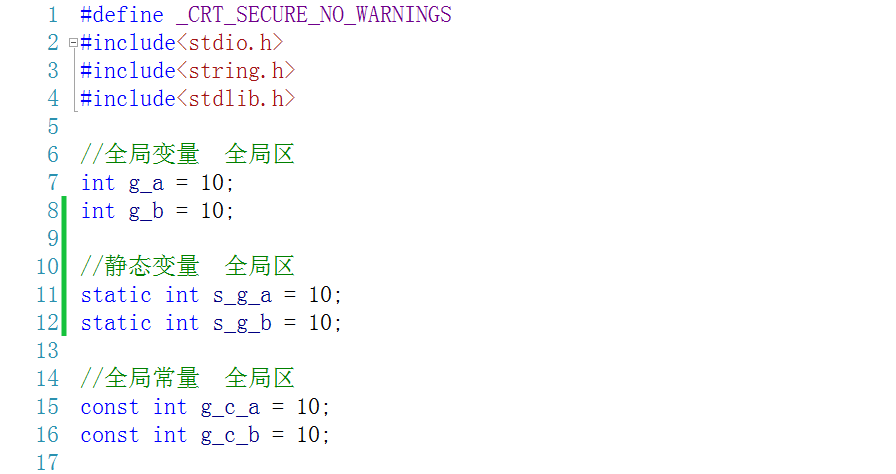
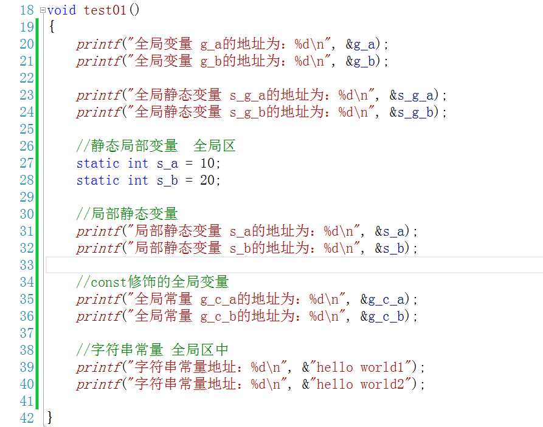
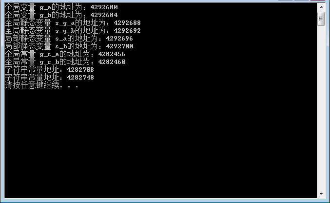
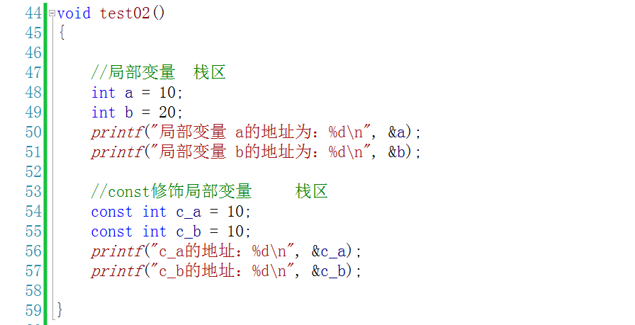
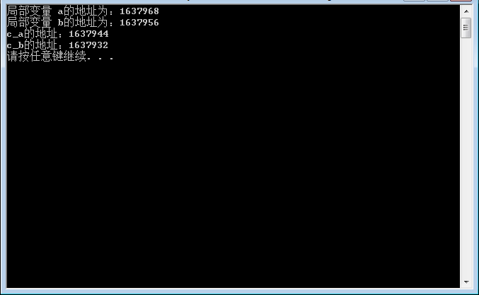
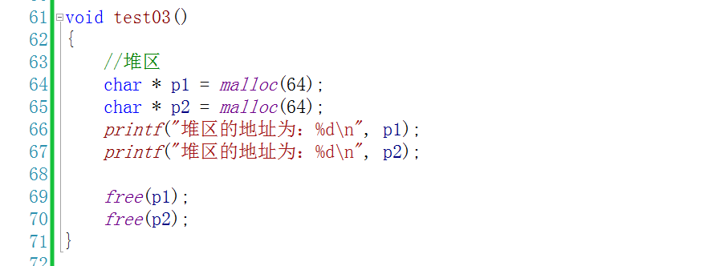
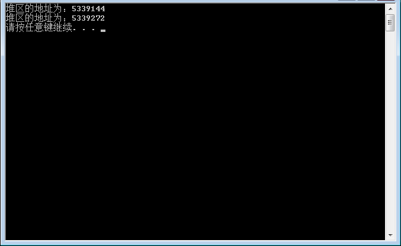
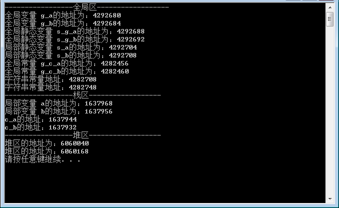

# C/C++中的内存分布

## 代码区

存放 CPU 执行的机器指令。通常代码区是可共享的（即另外的执行程序可以调用它），使其可共享的目的是对于频繁被执行的程序，只需要在内存中有一份代码即可。代码区通常是只读的，使其只读的原因是防止程序意外地修改了它的指令。另外，**代码区还规划了局部变量的相关信息**。

总结：你所写的所有代码都会放入到代码区中，**代码区的特点是共享和只读**。

## 全局区

全局区中主要存放的数据有：全局变量、静态变量、常量（如字符串常量）

全局区的叫法有很多：全局区、静态区、数据区、全局静态区、静态全局区

这部分可以细分为 data 区和 bss 区

### data 区

data 区里主要存放的是已经初始化的全局变量、静态变量和常量

### bss 区

bss 区主要存放的是未初始化的全局变量、静态变量，这些未初始化的数据在程序执行前会自动被系统初始化为 0 或者 NULL

### 常量区

常量区是全局区中划分的一个小区域，里面存放的是常量，如 const 修饰的全局变量、字符串常量等

在VS下运行结果如下：

总结：全局区存放的是全局变量、静态变量和常量

在程序运行后由产生了两个区域，栈区和堆区

## 栈区 stack

栈是一种先进后出的内存结构，由编译器自动分配释放，存放函数的参数值、返回值、局部变量等。在程序运行过程中实时加载和释放，因此，局部变量的生存周期为申请到释放该段栈空间。

vs运行效果如下：

## 堆区 heap

堆是一个大容器，它的容量要远远大于栈，但没有栈那样先进后出的顺序。用于动态内存分配。堆在内存中位于BSS区和栈区之间。一般由程序员分配和释放，若程序员不释放，程序结束时由操作系统回收。

vs运行效果如下：

当我们把几个案例放在一起执行，就可以看到内存将每个区域划分的很有条理。每个区域互不干涉，区域中的数据地址也是非常接近的

## 总结

如图所示，用户空间内存，从低到高分别是五种不同的内存段。

1. 只读段，包括代码和常量等。
2. 数据段，包括全局变量等。
3. 堆，包括动态分配的内存，从低地址开始向上增长。
4. 文件映射段，包括动态库、共享内存等，从高地址开始向下增长。
5. 栈，包括局部变量和函数调用的上下文等。栈的大小是固定的，一般是 8 MB。

在这五个内存段中，堆和文件映射段的内存是动态分配的。比如说，使用 C 标准库的 malloc() 或者 mmap() ，就可以分别在堆和文件映射段动态分配内存。

