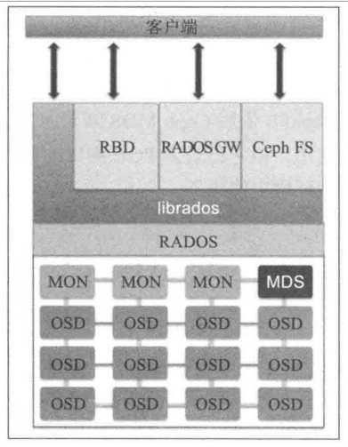

## Ceph


### Ceph 架构




### 部署 Ceph 集群

#### 集群节点信息

| 编号 |       IP       |   hostname   |                功能                |
| :--: | :------------: | :----------: | :--------------------------------: |
|  1   | 192.168.57.101 |  ceph-node1  | ceph-deploy，momtor，OSD，RBD，MDS |
|  2   | 192.168.57.102 |  ceph-node2  |             momtorOSD              |
|  3   | 192.168.57.103 |  ceph-node3  |            momtor，OSD             |
|  4   | 192.168.57.200 | ceph-client1 |    RADOS 块设备客户端， CephFS     |
|  5   | 192.168.57.110 |   ceph-rgw   |              RADOS GW              |

#### 部署过程

1. 在 ceph-node1 节点上安装 `ceph-deploy` 工具

2. 使用 ceph-deploy 工具创建一个 ceph 集群 。 在 ceph-nodel 上执行下面的命令:

```bash
# ceph-deploy new ceph-nodel
## Create a directory for ceph
# mkdir /etc/ceph
# cd /etc/ceph
```

ceph-deploy 工具的 new 命令会部署一个默认名称为 ceph 的新的 ceph 集群；它生成集群配置和keying 文件 。 如果你用 ls 命令查看当前工作目录，会发现生成的 `ceph.conf` 和 `ceph.mon.keyring` 文件 。

3. 用 ceph-deploy 工具将 Ceph 软件的二进制包安装到所有的节点上，在 ceph-node1 上执行以下命令:

```bash
# ceph-deploy install --release emperor ceph-node1 ceph-node2 ceph-node3
```
ceph-deploy 工具将首先安装 Ceph Emperor 二进制包的所有依赖库 。 一旦这个命令成功完成.就可以执行以下命令检查 Ceph 版本以及 Ceph 集群健康状况 。
```bash
# ceph -v
```

4. 在 ceph-node1 上创建第一个 `momtor`:

```bash
# ceph-deploy mon create-initial
```
一旦创建成功，执行以下命令检查集群状态 。 在这阶段集群不会处于健康状态 。
```bash
# ceph status
```

5. 执行下列步骤，在 ceph-node1 节点上创建一个对象存储设备( `OSD` )，并将其加入 Ceph 集群中

```bash
# ceph-deploy disk list ceph-node1 # 列出物理磁盘
# ceph-deploy disk zap ceph-node1:sdb ceph-node1:sdc cephnode1:sdd # 清除分区表和数据
# ceph-deploy osd create ceph-node1:sdb ceph-node1:sdc cephnode1:sdd # 创建 OSD 
# ceph status
```
6. 在 ceph-node1上执行下列命令在 ceph-node2 和 ceph-node3 上部署 `monitor` 和 `OSD` :

```bash
在 ceph-node2 和 ceph-node3 上部署 monitor:
# ceph-deploy mon create ceph-node2
# ceph-deploy mon create ceph-node3

在 ceph-node2 和 ceph-node3 上添加 Ceph OSD
# ceph-dep1oy disk 1ist ceph-node2 ceph-node3

# ceph-dep1oy disk zap ceph-node2:sdb ceph-node2:sdc ceph-node2:sdd
# ceph-dep1oy disk zap ceph-node3:sdb ceph-node3:sdc ceph-node3:sdd

# ceph-dep1oy osd create ceph-node2:sdb ceph-node2:sdc ceph-node2:sdd
# ceph-dep1oy osd create ceph-node3:sdb ceph-node3:sdc ceph-node3:sdd
# ceph status

```

7. Ceph 存储配置- 部署 `RADOS 块设备( Ceph 块设备 )`
```bash
## 登陆 ceph-node1 在 ceph-node1 上创建块设备
# rbd create ceph-c1ient1-rbd1 --size 10240 
# rbd ls
# rbd --image ceph-c1ient1-rbd1 info
# rbd --image ceph-c1ient1-rbd1 info -p rbd

## 在 ceph-node1 上安装为 ceph-client1 安装 Ceph 二进制包
# ceph-dep1oy inatall ceph-client1
# ceph-dep1oy admin ceph-client1 # 将 ceph.conf 和 ceph.mon.keyring 文件复制到 ceph-client1 上

## 登陆 ceph-client1，映射名为 ceph-c1ient1-rbd1 的 RBD 镜像到 ceph-client1 上
# rbd map --image ceph-c1ient1-rbd1
# rbd showmapped # 查找映射名，假设映射名为 /dev/rbd0

## 创建文件系统，挂载
# fdisk -l /dev/rbd0
# mkfs.xfs /dev/rbd0
# mkdir /mnt/ceph-vo11
# mount /dev/rbd0 /mnt/ceph-vo11

## 向 Ceph RBD 上存放数据
# dd if=/dev/zero of=/mnt/ceph-vo11/fi1e1 count=100 bs=lM

## 调整 Ceph RBD 的大小
## Ceph RBD 快照
## 复制 Ceph RBD
```

8. 部署 `CephFS` 和 `MDS`
```bash
## 在 ceph-node1 上部署 Ceph 元数据服务器( Ceph Metadata Server, MDS) 
# ceph-deploy mds create ceph-node1
# cat /etc/ceph/ceph.mon.keyring # 查看管理员密钥

## 方法一：使用内核驱动程序挂载 CephFS
# mkdir /mnt/kernel_cephfs
# mount -t ceph 192.168.57.101:6789:/ /mnt/kernel_cephfs -o name=admin,secret=QAinltT8AhAAS93FrXLrrnVp8/sQhjvTIg==

## 方法二：通过 FUSE 方式挂载 CephFS
# yum install ceph-fuse
# mkdir /mnt/kernel_cephfs
# ceph-fuse -m 192.168.57.101:6789 /mnt/kernel_cephfs

## 修改 /etc/fstab 文件确保开机挂载
```

9. 部署 `RADOS GW`
```bash
## 方法一：
# ceph-deploy rgw create ceph-rgw

## 方法二：也就是 ceph-deploy rgw create ceph-rgw 命令的具体过程

## 在 ceph-rgw 节点上安装下列软件
# yum install httpd mod_fastcgi ceph-radosgw ceph

## 配置 hostname
# cat /etc/hosts
192.168.57.110 ceph-rgw.objectstore.com ceph-rgw

## 编辑 /etc/httpd/conf/httpd.conf 文件以配置 Apache

## 创建 Ceph 对象网关脚本 s3gw.fcgi
# cat /var/www/html/s3gw.fcgi
#!/bin/sh
exec /usr/bin/radosgw -c /etc/ceph/ceph.conf -n client.radosgw.gateway

## 在 /etc/httpd/conf.d 目录下创建网关配置文件 rgw.conf

## 在任意一台 Ceph monitor 节点上为 Ceph 创建 RADOS 网关用户及密钥环


```

