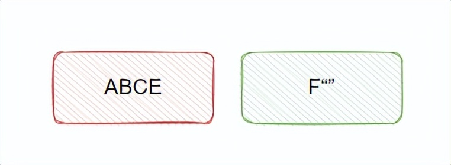

# 粘包与半包

## 通俗的例子

这里先举个可能不太恰当，但是很容易理解的例子。

比如，平时我们要寄快递，如果东西太大的话，那么就需要拆成几个包裹来邮寄。

收件人仅收到个别包裹的时候，东西是不完整的，对应到网络传输中， 这种情况就叫**半包** 。

只有等接收到全部包裹时，这个东西（传输的信息）才完整，所以半包情况下无法解析出完整的数据，需要等，等接收到全部包裹。

那么问题来了，如何知晓已经收到全部包裹了呢？下文我们再作分析。

再比如，快过年了，我打算给家里的亲戚送点礼物，给每位长辈送个手表，我们都知道手表的体积不大，并且我家里人都住在一个村，所以把给各长辈的礼物打包在一个包裹里邮寄，这样能节省运费。

这种把本应该分多个包传输的数据合成一个包发送的情况，对应到网络传输中， 就叫**粘包** 。

看完这个例子之后，应该对粘包与半包有点感觉了，接下来我们看下网络中实际的情况。

## 实际情况

**粘包与半包只有在 TCP 传输的时候才会有**，像 UDP 是不会有这种情况的 ，原因是因为 TCP 是面向流的，数据之间没有界限的，而 UDP 是有的界限的。

如果熟悉 TCP 和 UDP 报文格式的同学肯定知道，**TCP 的包没有报文长度，而 UDP 的包有报文长度** ，这也说明了 TCP 为什么是流式。

所以我为什么说上面的例子不太恰当，因为现实生活中快递的包裹之间其实是有界限的，TCP 则像流水，没有明确的界限。

然后 **TCP 有发送缓冲区的概念**，UDP 实际上是没这个概念。

假设 TCP 一次传输的数据大小超过发送缓冲区大小，那么一个完整的报文就需要被拆分成两个或更多的小报文，这可能会产生**半包**的情况，当接收端收到不完整的数据，是无法解析成功的。

如果 TCP 一次传输的数据大小小于发送缓冲区，那么可能会跟别的报文合并起来一块发送，这就是**粘包**。

此时接收端也无法正常解析报文，需要将其拆成多个正确的报文，才能正常解析。

关于粘包与半包，我还看到有拿 MTU （最大传输单元）说事的，如果发送的数据大于 MTU 那就会出现拆包，导致半包的情况。

我个人觉得这里有点不对，简单理解下，UDP 也是要遵循 MTU 的呀，对吧？那它咋不会发生半包呢？

我们接着来看如何解决粘包与半包。

## 那如何解决粘包与半包问题呢？

- 粘包 ：这个思路其实很清晰，就是把它拆开呗，具体就是看怎么拆了，比如我们可以固定长度，我们规定每个包都是10个字节，那么就10个字节切一刀，这样拆开解析就 ok 了。

- 半包 ：半包其实就是信息还不完整，我们需要等接收到全部的信息之后再作处理，当我们识别这是一个不完整的包时候，我们先 hold 住，不作处理，等待数据完整再处理。这里关键点在于，我们如何才能知道此时完整了？上面说的固定长度其实也是一点，当然还有更多更好的解决方案，我们接着往下看。

实际常见解决粘包与半包问题有三个方案：

- 固定长度

- 分隔符

- 固定长度字段+内容

为了说明方便，以下没有按二进制的位等单位来描述。

### 固定长度

这个其实很简单，比如现在要传输 ABC、EF 这两个包，如果不做处理接收端很可能收到的是 AB、CEF 或者 ABCE、F 等等。

这时候我们固定长度，我们规定每个报文长度都是 3，如果一个报文实际数据不足 3，那么就用空字符填充一下 。

所以我们发送的报文是 ：

接收到的情况可能是：

但我们是按照 3 位来处理的，所以一次只会按照 3 位来解析，所以第一次虽然收到的数据是 ABCE，但我们就解析 3 位，即解析出 ABC，留着了个 E，等我们要继续解析 3 位的时候，发现长度不足 3，所以我们暂时先不管，先等等。

后面等到了 F“” ，我们发现当下数据又满足 3 位了，所以我们接着解析 EF“” 。

这样就解决了粘包与半包问题。

对应到 Netty 中的实现就是 `FixedLengthFrameDecoder`，这个类来实现固定长度的解码。

固定长度的优点：简单。

缺点：固定长度很僵硬，不易于扩展，且如果设置过大来满足业务场景的话，会导致空间浪费，因为不足长度的需要填充。

### 分隔符

这个应该很好理解， 还是拿 ABC、EF 这两个包举例，我在写完 ABC后，插入一个分号，组成 ABC; ，EF 同理：

这样以分隔符为界限来切分无界限的 TCP 流，来解决粘包与半包问题，这个应该很好理解，既然你 TCP 没界限，我业务上给你搞个界限。

对应到 Netty 中的实现就是 `DelimiterBasedFrameDecoder`。

一直解析，等识别到分隔符之后，说明前面的数据完整了，于是解析前面的数据，然后继续往后扫描解析。

分隔符的优点：简单，也不会浪费空间。

缺点：需要对内容本身进行处理，防止内容内出现分隔符，这样就会导致错乱，所以需要扫描一遍传输的数据将其转义，或者可以用 base64 编码数据，用 64 个之外的字符作为分隔符即可。

分隔符的处理方式在业界也是常用的，比如 Redis 就用换行符来分隔。

### 固定长度字段+内容

这个也很好理解，比如协议规定固定 4 位存放内容的长度，这样内容就可以伸缩：

还是拿 ABC、EF 这两个包举例：

解析流程是：先获取 4 位，如果当前收到的数据不够 4 位，那就再等等，够 4 位之后解析得到长度是 3，所以我再往后取 3 位，同样数据如果不够 3 位就再等等，够了的话就解析，这样就获取一个完整的包了。

然后接着往后获取 4 位，解析得到 2，同理根据 2 往后再取 2 位，解析得到 EF。

这种方式就是先解析固定长度的字段，获得后面内容的长度，根据内容长度来获取内容，从而得到一个完整的报文。

对应到 Netty 中的实现就是 `LengthFieldBasedFrameDecoder`。

固定长度字段+内容的优点：可以根据固定字段精准定位，也不用扫描转义字符。

缺点：固定长度字段的设计比较困难，大了浪费空间，毕竟每个报文都带这个长度，小了可能不够用。

