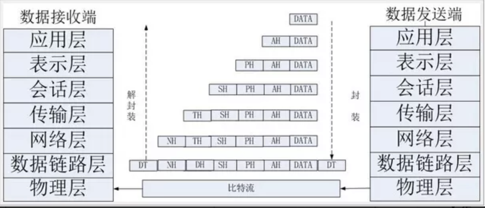
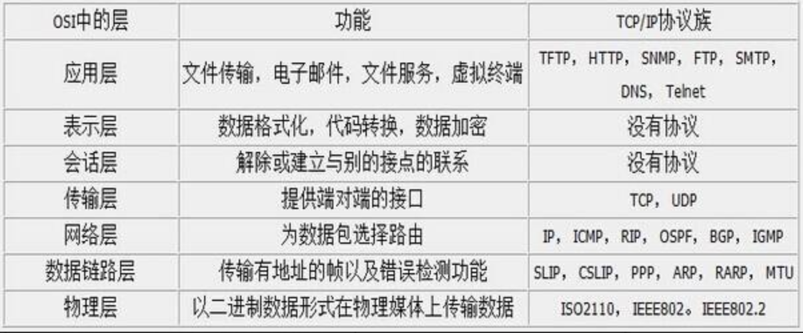
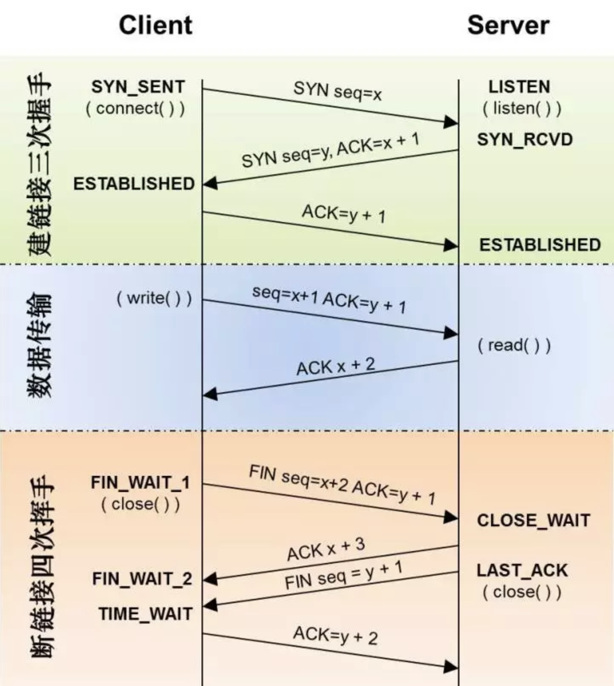
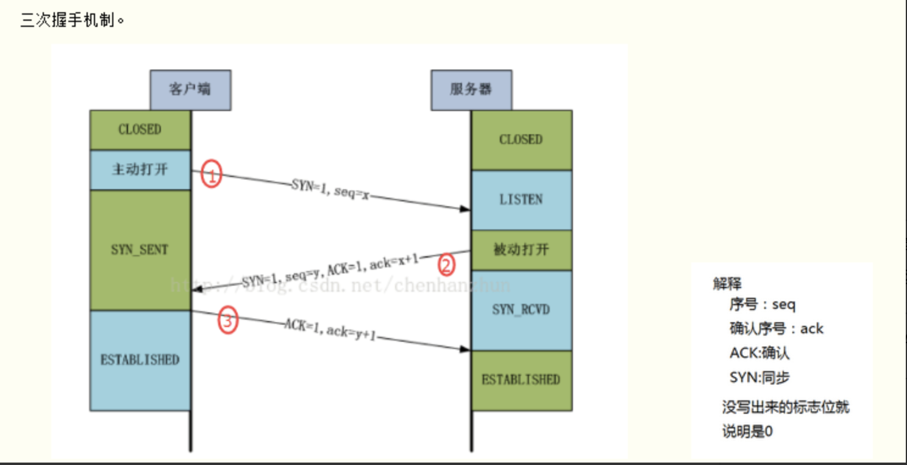
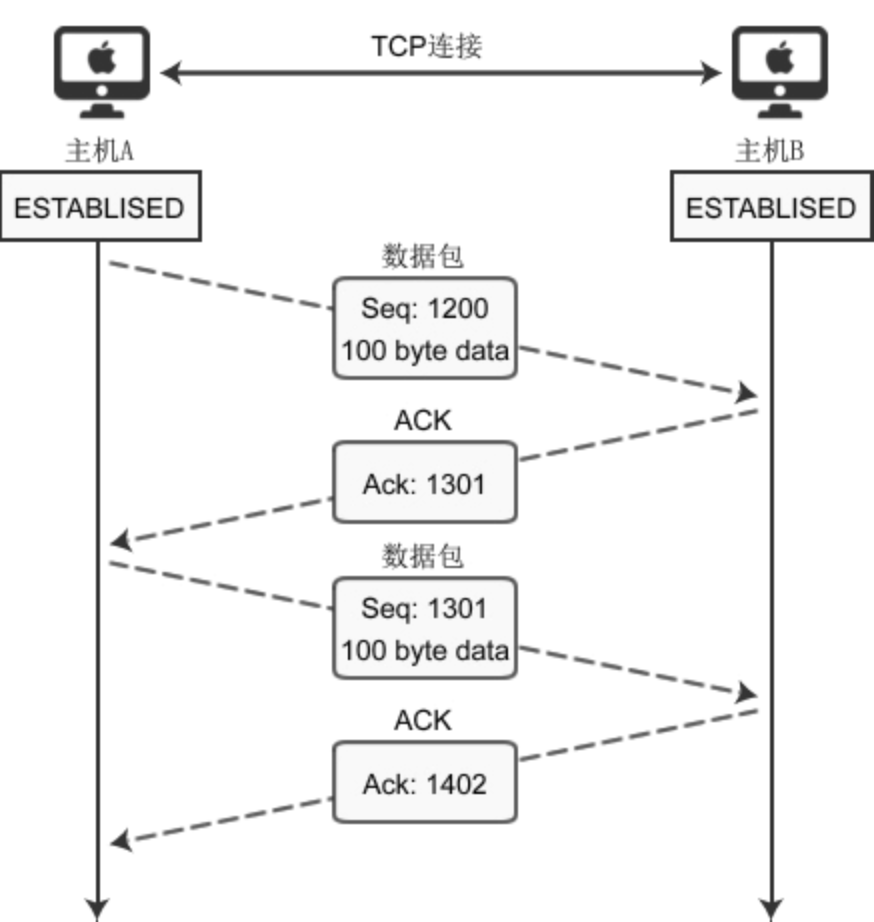
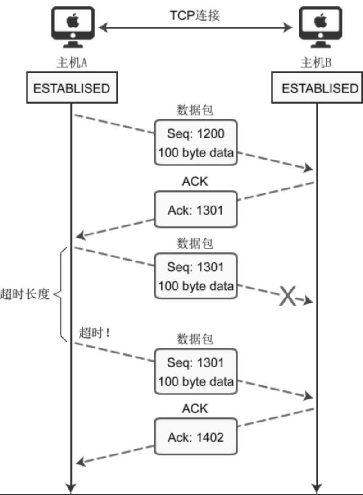
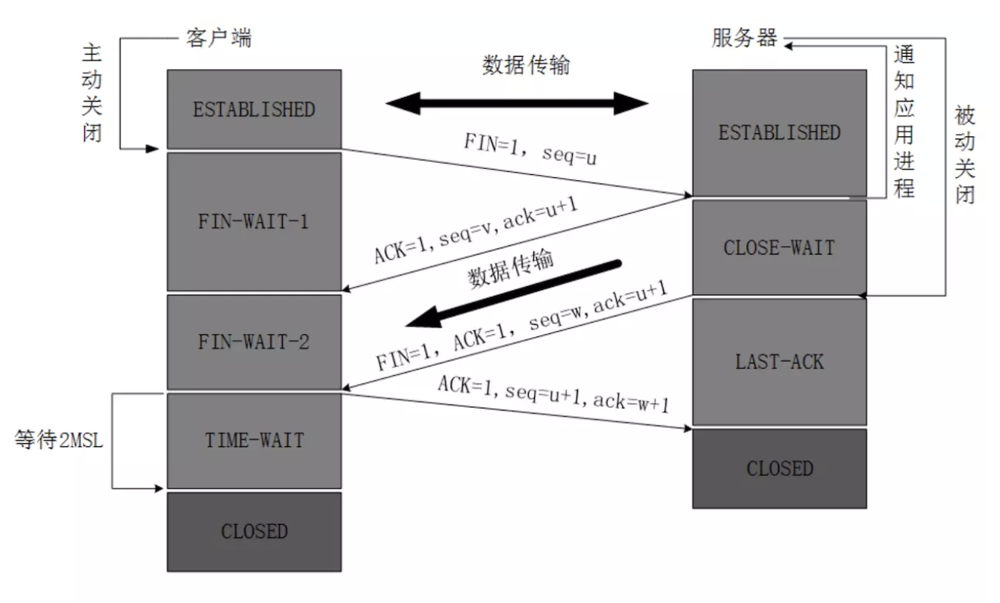

# TCP 协议基础

## TCP 概念

`TCP(Transmission Control Protocol 传输控制协议)`是一种面向连接(连接导向)的、可靠的、 基于 IP 的传输层协议。 首先来看看 OSI 的七层模型

我们需要知道`TCP`工作在网络 OSI 的七层模型中的第四层——传输层，IP 在第三层——网络层，ARP 在第二层——数据链路层;同时，我们需要简单的知道，数据从应用层发下来，会在每一层都会加上**头部信息**，进行 封装，然后再发送到数据接收端。这个基本的流程你需要知道，就是每个数据都会经过数据的封装和解封 装的过程。在 OSI 七层模型中，每一层的作用和对应的协议如下：

**标志位** 要理解三次握手四次挥手，首先要理解几个比较重要的标示如 SYN、ACK，如下面的表格所示：

| 字段 |                             含义                             |
| :--: | :----------------------------------------------------------: |
| SYN  | 请求建立连接，并在其序列号的字段进行序列号的初始值设定。建立连接，设置为 1 |
| ACK  |                 确认号是否有效，一般置为 1。                 |
| FIN  |                        释放一个连接。                        |
| PSH  |       提示接收端应用程序立即从 TCP 缓冲区把数据读走。        |
| RST  |                 对方要求重新建立连接，复位。                 |
| URG  |               紧急指针（urgent pointer）有效。               |

**序号**

- 序号：Seq 序号，占 32 位，用来标识从 TCP 源端向目的端发送的字节流，发起方发送数据时对此进行标记。
- 确认序号：Ack 序号，占 32 位，只有 ACK 标志位为 1 时，确认序号字段才有效，Ack=Seq+1。

三次握手四次挥手整体的流程如下图所示：

## 三次握手

三次握手的过程大致如下图所示：

大致步骤如下：

### 第一次握手

**客户端向服务器发出连接请求报文**，这时报文首部中的同部位SYN=1，同时随机生成初始序列号 seq=x，此时，TCP 客户端进程进入了 SYN-SENT（同步已发送状态）状态。TCP 规定，SYN 报文段（SYN=1 的报文段）不能携带数据，但需要消耗掉一个序号。这个三次握手中的开始。表示客户端想要和服务端建立连接。

### 第二次握手

**`TCP`服务器收到请求报文后**，如果同意连接，则发出确认报文。确认报文中应该 ACK=1，SYN=1，确认号是ack=x+1，同时也要为自己随机初始化一个序列号 seq=y，此时，TCP 服务器进程进入了SYN-RCVD（同步收到）状态。这个报文也不能携带数据，但是同样要消耗一个序号。这个报文带有SYN(建立连接)和ACK(确认)标志，询问客户端是否准备好。

### 第三次握手

**`TCP`客户进程收到确认后，还要向服务器给出确认**。确认报文的 ACK=1，ack=y+1，此时，TCP 连接建立，客户端进入ESTABLISHED（已建立连接）状态。TCP 规定，ACK 报文段可以携带数据，但是如果不携带数据则不消耗序号。这里客户端表示我已经准备好。

### 为什么要三次握手

> 在谢希仁著《计算机网络》第四版中讲“三次握手”的目的是“为了防止已失效的连接请求报文段突然又传送到了服务端，因而产生错误”。在另一部经典的《计算机网络》一书中讲“三次握手”的目的是为了解决“网络中存在延迟的重复分组”的问题。

**样例** 在谢希仁著《计算机网络》书中同时举了一个例子，如下：

> “已失效的连接请求报文段”的产生在这样一种情况下：client 发出的第一个连接请求报文段并没有丢失，而是在某个网络结点长时间的滞留了，以致延误到连接释放以后的某个时间才到达 server。本来这是一个早已失效的报文段。但 server 收到此失效的连接请求报文段后，就误认为是 client 再次发出的一个新的连接请求。于是就向 client 发出确认报文段，同意建立连接。假设不采用“三次握手”，那么只要 server 发出确认，新的连接就建立了。由于现在 client 并没有发出建立连接的请求，因此不会理睬 server 的确认，也不会向 server 发送数据。但 server 却以为新的运输连接已经建立，并一直等待 client 发来数据。这样，server 的很多资源就白白浪费掉了。采用“三次握手”的办法可以防止上述现象发生。例如刚才那种情况，client 不会向 server 的确认发出确认。server 由于收不到确认，就知道 client 并没有要求建立连接。”

总结一下就是为了**防止服务端的等待浪费资源**。

## 数据传输过程

建立连接后，两台主机就可以相互传输数据了。如下图所示：

- **主机 A 初始 seq 为 1200,滑动窗体为 100,向主机 B 传递数据的过程**。
- 假设主机 B 在完全成功接收数据的基础上,那么主机 B 为了确认这一点，向主机 A 发送 ACK 包，并将 Ack 号设置为 1301。因此按如下的公式确认 Ack 号：Ack 号 = Seq 号 + 传递的字节数 + 1 （这是在完全接受成功的情况下）
- 主机 A 获得 B 传来的 ack(1301)后,开始发送 seq 为 1301,滑动窗体为 100 的数据。

与三次握手协议相同，最后加 1 是为了告诉对方要传递的 Seq 号。上面说了，主机 B 完全成功接收 A 发来的数据才是这样的,如果存在丢包该如何。下面分析传输过程中数据包丢失的情况，如下图所示：

上图表示通过 Seq 1301 数据包向主机 B 传递 100 字节的数据，但中间发生了错误，主机 B 未收到。经过一段时间后，主机 A 仍未收到对于 Seq 1301 的 ACK 确认，因此尝试重传数据。为了完成数据包的重传，TCP 套接字每次发送数据包时都会启动定时器，如果在一定时间内没有收到目标机器传回的 ACK 包，那么定时器超时，数据包会重传。

## 四次挥手

四次挥手流程大致如下图所示：

### 第一次挥手

客户端发送一个 FIN(结束)，用来关闭客户到服务端的连接。 客户端进程发出连接释放报文，并且停止发送数据。释放数据报文首部，FIN=1，其序列号为 seq=u（等于前面已经传送过来的数据的最后一个字节的序号加 1），此时，客户端进入 FIN-WAIT-1（终止等待 1）状态。 TCP 规定，FIN 报文段即使不携带数据，也要消耗一个序号。

### 第二次挥手

服务端收到这个 FIN，他发回一个 ACK(确认)，确认收到序号为收到序号+1，和 SYN 一样，一个 FIN 将占用一个序号。 服务器收到连接释放报文，发出确认报文，ACK=1，ack=u+1，并且带上自己的序列号 seq=v，此时，服务端就进入了CLOSE-WAIT（关闭等待）状态。TCP 服务器 通知高层的应用进程，客户端向服务器的方向就释放了，这时候处于半关闭状态，即客户端已经没有数据要发送了，但是服务器若发送数据，客户端依然要接受。这个状态还要持续一段时间，也就是整个 CLOSE-WAIT 状态持续的时间。

> 客户端收到服务器的确认请求后，此时，客户端就进入 FIN-WAIT-2（终止等待 2）状态，等待服务器发送连接释放报文（在这之前还需要接受服务器发送的最后的数据）。

### 第三次挥手

服务端发送一个 FIN(结束)到客户端，服务端关闭客户端的连接。 服务器将最后的数据发送完毕后，就向客户端发送连接释放报文，FIN=1，ack=u+1，由于在半关闭状态，服务器很可能又发送了一些数据，假定此时的序列号为 seq=w，此时，服务器就进入了LAST-ACK（最后确认）状态，等待客户端的确认。

### 第四次挥手

客户端发送 ACK(确认)报文确认，并将确认的序号+1，这样关闭完成。 **客户端收到服务器的连接释放报文后，必须发出确认，ACK=1，ack=w+1，而自己的序列号是 seq=u+1，此时，客户端就进入了 TIME-WAIT（时间等待）状态。注意此时 TCP 连接还没有释放，必须经过 2∗∗MSL（最长报文段寿命）的时间后，当客户端撤销相应的 TCB 后，才进入 CLOSED 状态**。

> 服务器只要收到了客户端发出的确认，立即进入 CLOSED 状态。同样，撤销 TCB 后，就结束了这次的 TCP 连接。可以看到，服务器结束 TCP 连接的时间要比客户端早一些。

## 常见的问题

- **为什么要三次握手**
- **为什么是 4 次挥手**
- **TCP 和 UDP 的区别**
- **客户端突然挂掉了怎么办**
- **为什么 TIME_WAIT 状态需要经过 2MSL(最大报文段生存时间)才能返回到 CLOSE 状态**
- **浏览器同时可以开启多少个 http 链接**

### 为什么要三次握手（两次握手可以吗？）

client 发送了第一个连接的请求报文，但是由于网络不好，这个请求没有立即到达服务端，而是在某个网络节点中滞留了，直到某个时间才到达 server，本来这已经是一个失效的报文，但是 server 端接收到这个请求报文后，还是会想 client 发出确认的报文，表示同意连接。假如不采用三次握手，那么只要 server 发出确认，新的建立就连接了，但其实这个请求是失效的请求，client 是不会理睬 server 的确认信息，也不会向服务端发送确认的请求，但是 server 认为新的连接已经建立起来了，并一直等待 client 发来数据，这样，server 的很多资源就没白白浪费掉了，采用三次握手就是为了防止这种情况的发生，server 会因为收不到确认的报文，就知道 client 并没有建立连接。这就是三次握手的作用。

简单来说，就是为了**防止服务端的等待浪费资源**

### 为什么是 4 次挥手

握手的时候，A 和 B 打个招呼，B 可以直接把自己的 SYN 信息和对 A 的回应 ACK 信息一起带上，但是挥手的时候，A 说我要断开了，B 还没发完最后的数据，因此需要先回应一下 A，我收到你的断开的请求了，但是你要等我把最后的内容给你，所以这里分开了 2 步： （1）回应 A； （2）发送自己的最后一个数据

**为了确保数据能够完成传输。**

### TCP 和 UDP 的区别

- TCP 是面向连接的，udp 是无连接的即发送数据前不需要先建立链接。
- TCP 保证数据正确性，UDP 可能丢包，TCP 保证数据顺序，UDP 不保证。也就是说，通过 TCP 连接传送的数据，无差错，不丢失，不重复，且按序到达;UDP 尽最大努力交付，即不保证可靠交付 Tcp 通过校验和，重传控制，序号标识，滑动窗口、确认应答实现可靠传输。如丢包时的重发控制，还可以对次序乱掉的分包进行顺序控制。
- **TCP 只能是 1 对 1 的，UDP 支持 1 对 1,1 对多**。
- **TCP 是面向字节流，UDP 面向报文，UDP 具有较好的实时性，工作效率比 TCP 高**.并且网络出现拥塞不会使得发送速率降低（因此会出现丢包，对实时的应用比如 IP 电话和视频会议等）。
- **TCP 对系统资源要求较多，UDP 对系统资源要求较少**。
- **TCP 的首部较大为 20 字节，而 UDP 只有 8 字节**。

### 客户端突然挂掉了怎么办

正常连接时，客户端突然挂掉了，如果没有措施处理这种情况，那么就会出现客户端和服务器端出现**长时期的空闲**。解决办法是在**服务器端设置保活计时器**，每当服务器收到客户端的消息，就将计时器复位。**超时时间通常设置为 2 小时**。若服务器超过 2 小时没收到客户的信息，他就发送**探测报文段**。若发送了 10 个探测报文段，每一个相隔 75 秒，还没有响应就认为客户端出了故障，因而终止该连接。 **设置保活计时器**

### 为什么 TIME_WAIT 状态需要经过 2MSL(最大报文段生存时间)才能返回到 CLOSE 状态

**TIME_WAIT 状态就是用来重发可能丢失的 ACK 报文** 原因是，担心网络不可靠而导致的丢包，最后一个回应 B 的 ACK 万一丢了怎么办，在这个时间内，A 是可以重新发包的，但是超过了最大等待时间的话，就算收不到也没用了，所以就可以关闭了。

### 浏览器同时可以开启多少个 http 链接

浏览器对于同一个域名，一般 PC 端浏览器会针对单个域名的 server同时建立 6 ～ 8 个连接，手机端的连接数则一般控制在4 ～ 6 个（这个根据浏览器内核不同可能会有所差异），超过浏览器最大连接数限制，后续请求就会被阻塞。

## 参考

作者：asyncnode
链接：https://juejin.im/post/5d7085f6f265da03dd3d92f6
来源：掘金
著作权归作者所有。商业转载请联系作者获得授权，非商业转载请注明出处。