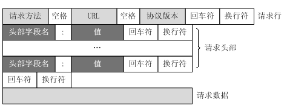
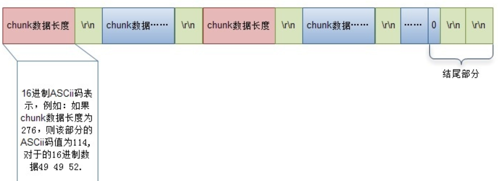

# HTTP 包式处理和流式处理


## HTTP 包数据示例

```
POST /wp-content/uploads/2010/03/hello-kitty-darth-vader-pink.jpg HTTP/1.0\r\n
HOST: www.kittyhell.com\r\n
User-Agent: Mozilla/5.0 (Macintosh; U; Intel Mac OS X 10.6; ja-JP-mac; rv:1.9.2.3) \r\n
Accept: text/html,application/xhtml+xml,application/xml;q=0.9,*/*;q=0.8\r\n
Accept-Language: ja,en-us;q=0.7,en;q=0.3\r\n
Accept-Encoding: gzip,deflate\r\n
Accept-Charset: Shift_JIS,utf-8;q=0.7,*;q=0.7\r\n
Keep-Alive: 115\r\n
Cookie: wp_ozh_wsa_visits=2; \r\n
\r\n
Hello there

GET /body HTTP/1.1\r\n
Content-Length: 12\r\n
\r\n
Hello World!
```

## HTTP 流数据示例
```
POST /chunked HTTP/1.1\r\n
Transfer-Encoding: chunked\r\n
\r\n
4\r\n
Wiki\r\n
5\r\n
pedia\r\n
E\r\n
 in\r\n\r\nchunks.\r\n
0\r\n
\r\n

body = "Wikipedia in\r\n\r\nchunks."

```

## HTTP 协议

http 的 header 和 body 之间空行分割的，又因为每个头部项是以 \r\n 作为结束符，所以，数据流中是以 \r\n\r\n 来分割解析请求头(响应头)与请求体（响应体）的。如下图所示：



那么怎么知道（请求体）响应体结束了呢？ http 协议规定，响应头的字段 content-length 用来表示响应体长度大小，但是，有可能发送请求头时，并不能知道完整的响应体长度（比如当响应数据太大，服务端流式处理的情况），这时需要设置请求头Transfer-Encoding: chunked，使用数据块的方式传输，数据块格式如下图所示：



每个数据块分为两个部分：数据长度和数据内容，以 \r\n 分割，最后长度为 0 的数据块，内容为空行（\r\n），表示没有数据再传输了，响应结束。需要注意的是，此时， content-length 不应该被设置，就算设置了，也会被忽略掉。

## 扩展

因为服务端在解析请求头和请求体时，都需要依据以上协议，来读取完整数据。Slow Headers 与 Slow POST 两类 DDoS 慢速攻击正是利用了这个原理。

正常的 HTTP 报文中请求头部的后面会有结束符 0x0d0a（\r\n 的十六进制表示方式），而攻击报文中不包含结束符，并且攻击者会持续发送不包含结束符的 HTTP 头部报文，维持连接状态，消耗目标服务器的资源。
