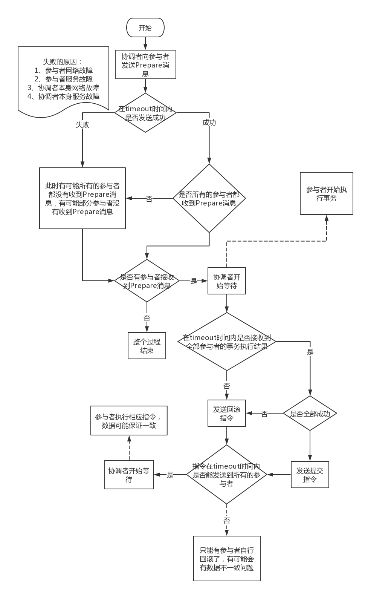
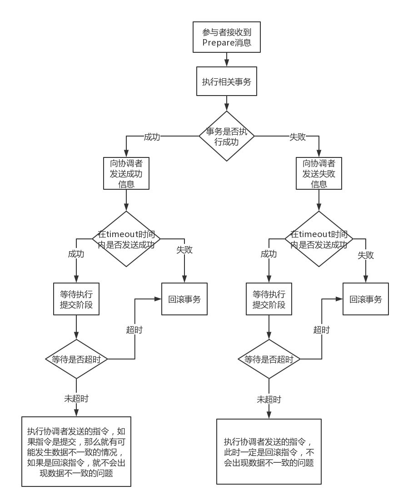

## 二阶提交协议(Two Phase Commitment Protocol)

所谓的两个阶段是指：

* 第一阶段：准备阶段(投票阶段)

* 第二阶段：提交阶段(执行阶段)

节点分类：

 * 事务协调者(事务管理器)

 * 事务参与者(资源管理器)

note：如何选举事务协调者？

### 准备阶段

准备阶段分为以下三个步骤：
>
1) 协调者节点向所有参与者节点询问是否可以执行提交操作(vote)，并开始等待各参与者节点的响应
>
2) 参与者节点执行询问发起为止的所有事务操作，并将Undo信息和Redo信息写入日志。(注意：若成功这里其实每个参与者已经执行了事务操作)
>
3)  各参与者节点响应协调者节点发起的询问。如果参与者节点的事务操作实际执行成功，则它返回一个”同意”消息；如果参与者节点的事务操作实际执行失败，则它返回一个”中止”消息。

### 提交阶段

如果协调者收到了参与者的失败消息或者超时，直接给每个参与者发送回滚(Rollback)消息；否则，发送提交(Commit)消息；参与者根据协调者的指令执行提交或者回滚操作，释放所有事务处理过程中使用的锁资源。(注意:必须在最后阶段释放锁资源)

##### 当协调者节点从**所有**参与者节点获得的响应消息都为”同意”时:
> 
1) 协调者节点向所有参与者节点发出”正式提交(commit)”的请求
> 
2) 参与者节点正式完成操作，并释放在整个事务期间内占用的资源
> 
3) 参与者节点向协调者节点发送”提交完成”消息
> 
4) 协调者节点受到所有参与者节点反馈的”完成”消息后，完成事务

##### 如果**任一**参与者节点在第一阶段返回的响应消息为”中止”，或者协调者节点在第一阶段的询问超时之前无法获取所有参与者节点的响应消息时：
> 
1) 协调者节点向所有参与者节点发出”回滚操作(rollback)”的请求
> 
2) 参与者节点利用之前写入的Undo信息执行回滚，并释放在整个事务期间内占用的资源
> 
3) 参与者节点向协调者节点发送”回滚完成”消息
> 
4) 协调者节点受到所有参与者节点反馈的”回滚完成”消息后，取消事务

不管最后结果如何，第二阶段都会结束当前事务。

### 二阶提交协议过程的一些思考

Q1：在准备阶段步骤一中，协调者要向参与者发送Prepare消息，那么协调者如何知道有哪些参与者？

协调者是选举出来的，需要使用外部手段持久化协调者和参与者的身份信息，要看具体的实现，与协议本身关系不大，纯粹是实现的问题

Q2：在准备阶段步骤一中，协调者要向参与者发送Prepare消息，Prepare消息的具体内容是什么？

Prepare消息的具体内容可能包括具体要执行的事务信息，还可能有其他的，要看具体的实现，与协议本身关系不大，纯粹是实现的问题

Q3：在准备阶段步骤一中，协调者向参与者发送Prepare消息，协调者何如保证**所有的**参与者都成功的接收到了信息？

在具体的实现中，参与者在接收到信息后直接返回接收成功的信息，或者协调者在timeout时间内没有将信息发生成功，也就是在timeout时间内参与者没有返回接收成功的信息，协调者直接认为信息发生失败，此时要向所有的参与者发送提交阶段的回滚操作

Q4：在准备阶段步骤一中，协调者向参与者发送Prepare消息，协调者向**部分**参与者发送信息后，协调者本身出现宕机或者网络问题，此时接收到信息的参与者应该如何操作？

这是二阶提交协议的一个缺点，协调者存在**单点故障**问题。针对只有部分参与者接收到了Prepare消息，此时整个过程如下图所示，此时使用 timeout 时间确定协调者是否恢复

协调者的行为：

参与者的行为：

### 二阶段提交协议的几个缺点
1) 同步阻塞问题。执行过程中，所有参与节点都是事务阻塞型的。当参与者占有公共资源时，其他第三方节点访问公共资源不得不处于阻塞状态

2) 单点故障。由于协调者的重要性，一旦协调者发生故障。参与者会一直阻塞下去。尤其在第二阶段，协调者发生故障，那么所有的参与者还都处于锁定事务资源的状态中，而无法继续完成事务操作。(如果是协调者挂掉，可以重新选举一个协调者，但是无法解决因为协调者宕机导致的参与者处于阻塞状态的问题)

3) 数据不一致。在二阶段提交的阶段二中，当协调者向参与者发送commit请求之后，发生了局部网络异常或者在发送commit请求过程中协调者发生了故障，这回导致只有一部分参与者接受到了commit请求。而在这部分参与者接到commit请求之后就会执行commit操作。但是其他部分未接到commit请求的机器则无法执行事务提交。于是整个分布式系统便出现了数据部一致性的现象

4) 二阶段无法解决的问题：协调者再发出commit消息之后宕机，而唯一接收到这条消息的参与者同时也宕机了。那么即使协调者通过选举协议产生了新的协调者，这条事务的状态也是不确定的，没人知道事务是否被已经提交

### 参考

* https://www.hollischuang.com/archives/681
* https://coolshell.cn/articles/10910.html

