## Docker 数据管理

### 概述

从数据的角度看，容器可以分为两类：`无状态(stateless)容器`和`有状态(stateful)容器`。

`无状态容器`是指容器在运行过程中不需要保存数据，每次访问的结果不依赖上次的访问。典型的应用是提供静态页面的web服务器。

`有状态容器`是指容器运行过程中需要保存数据，而且数据会发生变化，访问的结果依赖之前请求处理的结果。典型的应用是数据库。

对于有状态的容器，如何保存数据？

* data volume(Docker主机本地目录)

* 使用专门的 Storage Provider，也就是跨主机管理 data volume

不论是使用Docker主机本地的 data volume，还是使用跨主机的 data volume，都需要 `volume driver`。每一个 data volume 都是由 volume driver 管理的。

创建 volume 时如果不特别指定，将使用 local 类型的 driver，既从 Docker Host的本地目录中分配存储空间。如果要支持跨主机的 volume，则需要使用第三方的 driver。

```bash
[root@hz18 bin]# docker info | grep Volume
 Volume: local
[root@hz18 bin]#
```




### data volume(Docker主机本地目录)

Data Volume 本质上是 Docker Host 文件系统中的目录或者文件。能够直接被 mount 到容器的文件系统中。

Data Volume 的特点：

1. Data Volume 是目录或者文件，而非没有格式化的磁盘（块设备）
2. 容器可以读写 Volume 中的数据
3. Volume 可以永久的保存，即使使用它的容器已经被销毁

notes:

1. 因为 Volume 实际上是 Docker Host 文件系统的一部分，所以 Volume 的容量取决于文件系统当前未使用的空间。目前还没有方法设置 Volume 的容量。

Docker 提供了两种类型的 Volume：

1. bind mount
2. docker managed volume 


#### bind mount

```bash
-v <host path>:<container path>:rw (默认)
-v <host path>:<container path>:ro
```

notes：

1. 若绑定的是目录，容器中如果没有该目录则会新建该目录，如果有该目录则目录中的数据会被覆盖，和 linux mount 的行为一样。
2. 绑定单独一个文件时，Host 中的源文件必须存在，不然会当作绑定目录。


#### docker managed volume (数据容器)

```bash
-v <container path>  # 省略 Docker Host 目录
$ docker run -ti -v /cookbook --name data ubuntu /bin/bash
$ docker inspect -f {{.Mounts}} data
"Mounts": [
            {
                "Type": "volume",
                "Name": "b478d0e88e47f5ceda12b6fdab9b7f41b9819ea29afd5429c7635a09d872237f",
                "Source": "/var/lib/docker/volumes/b478d0e88e47f5ceda12b6fdab9b7f41b9819ea29afd5429c7635a09d872237f/_data",
                "Destination": "/cookbook",
                "Driver": "local",
                "Mode": "",
                "RW": true,
                "Propagation": ""
            }
        ],
   
--volumes-from data  # 使用数据容器
$ docker run -ti --volumes-from data ubuntu /bin/bash
root@4e80b4175702:/# ll /cookbook/
total 0
drwxr-xr-x 2 root root  6 Oct 29 13:00 ./
drwxr-xr-x 1 root root 22 Oct 29 13:09 ../
root@4e80b4175702:/# 

```


#### docker volume

```bash
$ docker volume --help

Usage:	docker volume COMMAND

Manage volumes

Commands:
  create      Create a volume
  inspect     Display detailed information on one or more volumes
  ls          List volumes
  prune       Remove all unused local volumes
  rm          Remove one or more volumes

Run 'docker volume COMMAND --help' for more information on a command.

```


### 跨主机管理 data volume

以 `Rex-Ray` 作为driver，以 `Virtual Media` 作为数据存储系统为例

```
Step 1: Download REX-Ray
$ curl -sSL https://rexray.io/install | sh

Step 2: Create the configuration
libstorage:
  service: virtualbox  # 使用 Virtual Media 作为存储系统
virtualbox:
  endpoint: http://192.168.99.1:18083  # Virtual Media 的访问地址
  volumePath: /Users/<your-name>/VirtualBox/Volumes
  controllerName: SATA

Step 3: Place the file at
/etc/rexray/config.yml

Step 4: Run as a service
$ rexray start

Step 5: 配置 VirtualBoBox 使 Virtual Media 可用

Step 6: 重启 rexray 服务

Step 7: rexray volume ls

Step 8: 创建 volume
docker volume create --driver rexray --name=mysqldata --opt=size=2

Step 9: 启动容器
docker run -v mysqldata:/var/lib/mysql

```

