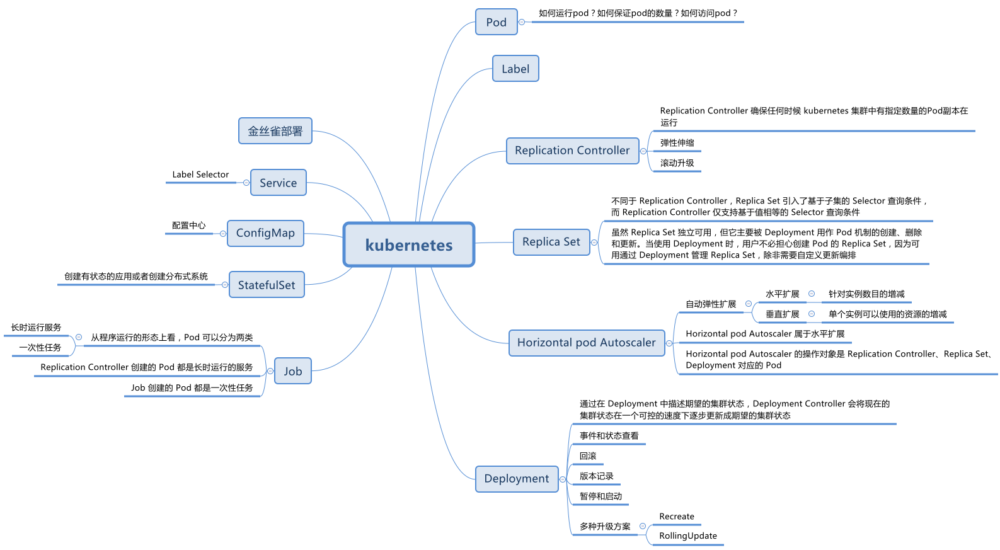

* 检查机器相关配置
* 在所有节点安装 docker 
* 在所有节点安装 kubeadm, kubelet 和 kubectl
  * 确保 kubelet 服务启动成功
* 用 kubeadm 初始化 Cluster
* 配置 kubectl 
  * 启用 kubectl 命令补全功能
* 安装 Pod 网络
* 添加 node 节点
* kubernetes dashboard
  * 安装
  * 修改 dashboard service 的 type 为 NodePort 以便通过浏览器访问
  * 配置 dashboard 登陆权限
* 安装[日志插件](https://github.com/kubernetes/kubernetes/tree/master/cluster/addons/fluentd-elasticsearch)
* 安装监控工具 Weave Scope


检查机器相关配置

在所有节点安装 docker 

在所有节点安装 kubeadm, kubelet 和 kubectl

用kubeadm创建 Cluster

```bash
[centos@kubernetes-master ~]$ kubeadm init --help
Run this in order to set up the Kubernetes master
Usage:
  kubeadm init [flags]
Flags:
      --apiserver-advertise-address string      The IP address the API Server will advertise it's listening on. 0.0.0.0 means the default network interface's address.
      --apiserver-bind-port int32               Port for the API Server to bind to (default 6443)
      --apiserver-cert-extra-sans stringSlice   Optional extra altnames to use for the API Server serving cert. Can be both IP addresses and dns names.
      --cert-dir string                         The path where to save and store the certificates (default "/etc/kubernetes/pki")
      --config string                           Path to kubeadm config file (WARNING: Usage of a configuration file is experimental)
      --dry-run                                 Don't apply any changes; just output what would be done
      --feature-gates string                    A set of key=value pairs that describe feature gates for various features. Options are:
SelfHosting=true|false (ALPHA - default=false)
StoreCertsInSecrets=true|false (ALPHA - default=false)
      --kubernetes-version string               Choose a specific Kubernetes version for the control plane (default "stable-1.8")
      --node-name string                        Specify the node name
      --pod-network-cidr string                 Specify range of IP addresses for the pod network; if set, the control plane will automatically allocate CIDRs for every node
      --service-cidr string                     Use alternative range of IP address for service VIPs (default "10.96.0.0/12")
      --service-dns-domain string               Use alternative domain for services, e.g. "myorg.internal" (default "cluster.local")
      --skip-preflight-checks                   Skip preflight checks normally run before modifying the system
      --skip-token-print                        Skip printing of the default bootstrap token generated by 'kubeadm init'
      --token string                            The token to use for establishing bidirectional trust between nodes and masters.
      --token-ttl duration                      The duration before the bootstrap token is automatically deleted. 0 means 'never expires'. (default 24h0m0s)
[centos@kubernetes-master ~]$
```


```
--apiserver-advertise-address 指定用 master 节点的哪个 interface 与 Cluster 的其他节点通信
--pod-network-cidr 指定 Pod 的网络范围。Kubernetes 支持多种网络方案，并且不同的网络方案对 --pod-network-cidr 的要求不同
--token-ttl token 的过期时间，0 代表永不过期
```


```bash
[centos@kubernetes-master ~]$ sudo kubeadm init --pod-network-cidr=10.244.0.0/16 --token-ttl 0
[kubeadm] WARNING: kubeadm is in beta, please do not use it for production clusters.
[init] Using Kubernetes version: v1.8.2
[init] Using Authorization modes: [Node RBAC]
[preflight] Running pre-flight checks
[preflight] Starting the kubelet service
[certificates] Generated ca certificate and key.
[certificates] Generated apiserver certificate and key.
[certificates] apiserver serving cert is signed for DNS names [kubernetes-master kubernetes kubernetes.default kubernetes.default.svc kubernetes.default.svc.cluster.local] and IPs [10.96.0.1 10.128.128.120]
[certificates] Generated apiserver-kubelet-client certificate and key.
[certificates] Generated sa key and public key.
[certificates] Generated front-proxy-ca certificate and key.
[certificates] Generated front-proxy-client certificate and key.
[certificates] Valid certificates and keys now exist in "/etc/kubernetes/pki"
[kubeconfig] Wrote KubeConfig file to disk: "admin.conf"
[kubeconfig] Wrote KubeConfig file to disk: "kubelet.conf"
[kubeconfig] Wrote KubeConfig file to disk: "controller-manager.conf"
[kubeconfig] Wrote KubeConfig file to disk: "scheduler.conf"
[controlplane] Wrote Static Pod manifest for component kube-apiserver to "/etc/kubernetes/manifests/kube-apiserver.yaml"
[controlplane] Wrote Static Pod manifest for component kube-controller-manager to "/etc/kubernetes/manifests/kube-controller-manager.yaml"
[controlplane] Wrote Static Pod manifest for component kube-scheduler to "/etc/kubernetes/manifests/kube-scheduler.yaml"
[etcd] Wrote Static Pod manifest for a local etcd instance to "/etc/kubernetes/manifests/etcd.yaml"
[init] Waiting for the kubelet to boot up the control plane as Static Pods from directory "/etc/kubernetes/manifests"
[init] This often takes around a minute; or longer if the control plane images have to be pulled.
[apiclient] All control plane components are healthy after 1739.503372 seconds
[uploadconfig] Storing the configuration used in ConfigMap "kubeadm-config" in the "kube-system" Namespace
[markmaster] Will mark node kubernetes-master as master by adding a label and a taint
[markmaster] Master kubernetes-master tainted and labelled with key/value: node-role.kubernetes.io/master=""
[bootstraptoken] Using token: a4d564.311847aa8f119aed
[bootstraptoken] Configured RBAC rules to allow Node Bootstrap tokens to post CSRs in order for nodes to get long term certificate credentials
[bootstraptoken] Configured RBAC rules to allow the csrapprover controller automatically approve CSRs from a Node Bootstrap Token
[bootstraptoken] Configured RBAC rules to allow certificate rotation for all node client certificates in the cluster
[bootstraptoken] Creating the "cluster-info" ConfigMap in the "kube-public" namespace
[addons] Applied essential addon: kube-dns
[addons] Applied essential addon: kube-proxy
Your Kubernetes master has initialized successfully!
To start using your cluster, you need to run (as a regular user):
  mkdir -p $HOME/.kube
  sudo cp -i /etc/kubernetes/admin.conf $HOME/.kube/config
  sudo chown $(id -u):$(id -g) $HOME/.kube/config
You should now deploy a pod network to the cluster.
Run "kubectl apply -f [podnetwork].yaml" with one of the options listed at:
http://kubernetes.io/docs/admin/addons/
You can now join any number of machines by running the following on each node
as root:
  kubeadm join --token a4d564.311847aa8f119aed 10.128.128.120:6443 --discovery-token-ca-cert-hash sha256:a6e6315941daf289457c4027183e48be2bc67ca59ad1826e19eae4c746b01a69
[centos@kubernetes-master ~]$
```


配置 kubectl 

note：推荐使用普通用户执行 kubectl，例如 ubuntu 用户

```bash
mkdir -p $HOME/.kube
sudo cp -i /etc/kubernetes/admin.conf $HOME/.kube/config
sudo chown $(id -u):$(id -g) $HOME/.kube/config
```


启用 kubectl 命令补全功能

```bash
echo "source < (kubectl completion bash)" >> ~/.bashrc
```


安装 Pod 网络

```bash
[centos@kubernetes-master ~]$ kubectl apply -f https://raw.githubusercontent.com/coreos/flannel/v0.9.0/Documentation/kube-flannel.yml
clusterrole "flannel" created
clusterrolebinding "flannel" created
serviceaccount "flannel" created
configmap "kube-flannel-cfg" created
daemonset "kube-flannel-ds" created
[centos@kubernetes-master ~]$
```


添加 node 节点

```bash
kubeadm join --token a4d564.311847aa8f119aed 10.128.128.120:6443 --discovery-token-ca-cert-hash sha256:a6e6315941daf289457c4027183e48be2bc67ca59ad1826e19eae4c746b01a69
```


kubernetes dashboard

```bash
kubectl create -f https://raw.githubusercontent.com/kubernetes/dashboard/master/src/deploy/recommended/kubernetes-dashboard.yaml
```


修改 dashboard service 的 type 为 NodePort 以便通过浏览器访问


配置 dashboard 登陆权限

dashboard 支持 Kubeconfig 和 Token 两种认证方式，为简化配置，为 dashboard 默认用户配置 admin 权限

```
kind: ClusterRoleBinding
```


