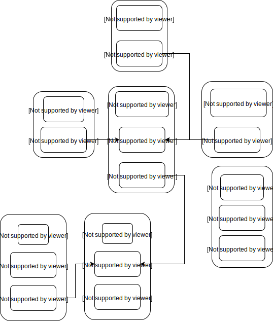

## kubernetes ssl

kubernetes 系统各组件需要使用 TLS 证书对通信进行加密。

根据认证对象可以将证书分成三类：服务器证书 server cert，客户端证书 client cert，对等证书peer cert (表示既是 server cert 又是 client cert )，在 kubernetes 集群中需要的证书种类如下：

* etcd 节点需要标识自己服务的 server cert，也需要 client cert 与 etcd 集群其他节点交互，当然可以分别指定2个证书，也可以使用一个对等证书

* master 节点需要标识 apiserver 服务的 server cert，也需要 client cert 连接 etcd 集群，这里也使用一个对等证书

* kubectl、calico、kube-proxy 只需要 client cert，因此证书请求中 hosts 字段可以为空

* kubelet 证书比较特殊，不是手动生成，它由 node 节点 TLS BootStrap 向 apiserver 请求，由master 节点的 controller-manager 自动签发，包含一个 client cert 和一个 server cert

