## Docker 跨主机通信

- [Docker 跨主机通信方案](#docker-跨主机通信方案)

- [Docker 跨主机通信方案与Docker集成的原理](#docker-跨主机通信方案与docker集成的原理)

- [Docker 跨主机通信模型](#docker-跨主机通信模型)

- [Docker overlay](#docker-overlay)

- [Docker Macvlan](#docker-macvlan)

- [Flannel](#flannel)

- [Weave](#weave)

- [Calico](#calico)

- [Docker 跨主机通信方案比较](#docker-跨主机通信方案比较)

### Docker 跨主机通信方案

* Docker overlay

* Docker Macvlan

* Flannel

* Weave

* Calico

### Docker 跨主机通信方案与Docker集成的原理

* libnetwork

* CNM(Container Network Model)

### Docker 跨主机通信模型

##### Docker overlay

##### Docker Macvlan

##### Flannel

##### Weave

##### Calico

### Docker 跨主机通信方案比较

| 实现方式 | 网络模型 | 分布式键值对存储 | IPAM(IP管理) | 连通与隔离 | 性能 |
|---------|--------|--------|--------|--------|--------|
| Docker overlay | VxLAN网络，需要封装成VxLAN数据包 | 需要 | 单一subnet | 同一ovwrlay网络可以直接访问。不同的overlay网络不能互相访问。可以直接和外网连通||
| Docker Macvlan | VLAN网络，数据直接发送，不需要封装 |不需要 | 自定义 | Macvlan网络的连通性和隔离性完全取决于路由配置 ||
| Flannel | `vxlan模式`需要封装数据，`host-gw模式`依赖IP转发，不需要数据封装 | 需要 | 每个host 一个subnet| 无论是同一Flannel网络还是不同的Flannel网络都可以互相访问，没有提供隔离性。也可以直接访问外网||
| Weave | VxLAN网络，需要封装成VxLAN数据包 | 不需要 | 单一subnet | Weave网络默认配置所有容器都在一个subnet中，可以直接互相访问，没有提供隔离性。若要加入隔离性，可以加入参数使容器处于不同网络。默认不能访问外网，可以把主机网卡加入weare网络以便访问外网 ||
| Calico | 完全三层网络，不需要数据封装 | 需要 | 每个host 一个subnet | Calico网络默认只允许处于同一subnet中的容器互相访问，但可以通过配置`Policy`实现任何场景的网络控制。Calico网络默认也可以直接访问外网，同时也可以配置`Policy`使之不能访问外网||

对于性能：
* 需要数据封装的网络（overlay，Weave， Flannel（vxlan模式））比不需要数据封装的网络（Macvlan，Flannel（host-gw模式），Calico）性能差
* 三层网络转发（Macvlan，Flannel（host-gw模式））比二层网络转发（Calico）性能差
* 网络性能由高到低顺序
    1. Calico
    2. Macvlan，Flannel（host-gw模式）
    3. overlay，Weave， Flannel（vxlan模式）

