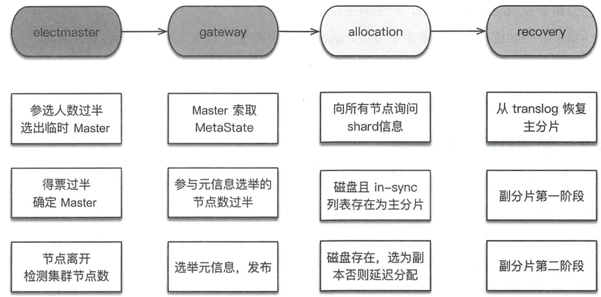

# ElasticSearch

### ES 索引，Lucene 索引，segment，filed 之间的关系？


《Elasticsearch源码解析与优化实战》p21

### refresh 操作和 flush 操作的作用？

客户端向集群中写入数据，集群接收数据后将数据缓存在内存中，待数据达到一定大小时，将数据组织成 segment 结构，然后写入文件系统。此时也没有实际写入磁盘，而是缓存在文件系统缓存中，也是内存中，操作系统会按照一定的频率将文件系统缓存的内容写入磁盘。

refresh 操作的作用是无论此时有多少数据都生成一个新的 segment，然后写入文件系统，缓存到文件系统缓存。

flush 操作将文件系统缓存中的数据写入磁盘

《Elasticsearch源码解析与优化实战》p21、p23、p133

### 为什么 segment 文件大小不能超过磁盘空间的一半？

将两个或者多个 segment 合并为一个 segment 的过程中需要额外的磁盘空间，segment1 和 segment2 大小都为 1G，那么合并 segment1 和 segment2 需要的额外空间是 2G

《Elasticsearch源码解析与优化实战》p23

### 节点角色

* 主节点( Master node )
* 数据节点( Data node)
* 预处理节点( Ingest node) 预处理器和管道
* 协调节点(Coordinating node)
* 部落节点 (Tribe node) 集群联邦
* 客户端节点

《Elasticsearch源码解析与优化实战》p24

### ES 主要模块和相关功能？

* Cluster
* Allocation 实现分片的相关功能
* Discovery 发现集群中的节点，选举主节点
* Gateway 负责集群元数据的存储和集群重启时元数据的恢复
* Indices
* HTTP
* Transport
* Engine 封装了 lucene 和 translog 相关接口
* Node 单个节点的启动和关闭 P48 

### **集群启动流程**



1. 选举主节点，bully 算法，Discovery 模块功能
2. 选举集群元数据，根据版本号，Gateway 模块功能
3. 选举主分片和副本分片，根据磁盘文件信息和集群元数据中的 in-sync 列表，Allocation 模块功能
5. 恢复主分片数据和副本分片数据，indices.recovery 模块功能

《Elasticsearch源码解析与优化实战》第三章


### 单个节点的启动和关闭过程

**单个节点的启动**

1. 解析配置，包括配置文件和命令行参数
2. 加载安全配置
3. 检查内部环境，包括 lucene 版本和 jar 包
4. 检查外部环境，包括操作系统配置和 JVM 配置 bootstrap check
5. 启动 keepalive 线程

**单个节点的关闭**

1. 关闭**主节点**导致选举产生新的主节点
2. 关闭**数据节点**时，最后的客户端的写操作可能成功，也可能失败；读操作会失败；分片的写入过程因为加锁操作还是会成功写入副本分片

节点启动流程做的就是初始化和检查工 作，各个子模块启动后异步地工作，加载本地数据，或者选主、加入集群等。节点在关闭时有机会处理未写完的数据，但是写完后可能来不及通知客户端。

### 选举主节点

Discovery 发现 ping 集群中的节点，选举主节点

**Bully 算法**

Leader 选举的基本算法之一。它假定所有的节点都有唯一的一个 ID，使用该 ID 对节点进行排序。任何时候的当前 Leader 都是参与集群的最大 ID 节点。该算法的优点是易于实现。但是，当拥有最大 ID 的节点处于不稳定状态时会有问题。例如，master 负载过重而假死，集群拥有第二大 ID 的节点呗选举为新主，这时原来的 master 恢复，再次被选为新主，然后又假死...

ES 通过推迟选举，直到当前的 master 失效来解决这个问题。只有当前主节点不挂掉，就不进行重新选举。但是容易产生脑裂(双主)问题，再通过“法定得票人数过半”解决脑裂问题。


### 主分片和副本分片，维护数据一致性

Allocation 模块实现分片相关的功能

和分片相关的问题：
1. 选举主分片
2. 分配分片到节点
3. 数据在分片中的读写，包括主分片向副本分片中写数据
4. 维护分片元数据信息，包括哪个分片在哪个节点，最新数据列表 in-sync
5. 重新选举主分片后如何维护数据一致性

ps：重新选举主分片后如何维护数据一致性，这个需要使用到数据恢复流程。但是这个数据恢复流程和集群启动时主副分片的数据恢复流程不一样，不是同一个流程。

#### 选举主分片

选举主分片的时机：
1. 集群启动时
2. 在集群运行过程中，主分片节点宕机或者出现网络分区，此时需要重新选举

选举主分片都需要使用最新数据列表  in-sync ，在该表中选择

#### 分配分片到节点

在创建索引和修改配置时主节点直接将分片分配到节点，并且将分配信息记录在集群元数据中。但是在集群启动过程中，不会将分片分配信息汇报给主节点。而是汇报存储在节点磁盘上的分片信息，根据磁盘上的信息重新确定哪个分片在哪个节点。并且根据集群元数据 in-sync 列表选举主分片。

#### 数据在分片中的读写

ES 采用类似 PacificA 算法

1. 向副本分片写入数据的过程（数据副本策略）
2. 添加和删除分片的过程（配置管理）
3. 旧主副本和新主副本同时存在如何处理（错误检测）

《Elasticsearch源码解析与优化实战》第六章
《Elasticsearch源码解析与优化实战》第三章

### 集群重启时主副分片数据恢复流程，维护数据完整性

Indices.recovery 模块的功能

**数据恢复的触发条件**

1. 从快照备份恢复
2. 节点的加入和离开
3. 索引的 _open 操作
4. shrink 操作

**为什么需要进行数据恢复操作？**

对于主分片来说，可能有一些数据没来得及刷盘；对于副本分片来说，一是没来得及刷盘，而是主分片写完了，副本分片还没来得及写，主副分片数据不一致。

**主分片数据恢复**

由于每次写操作都会记录事务日志（translog），事务日志中记录了进行了哪些操作以及这些操作的数据。因此将最后一次提交（Lucene 一次提交就是一次 fsync 刷盘过程）之后的 translog 重放，建立 lucene 索引，如此完成主分片数据恢。

**副本分片数据恢复**

副本分片需要恢复成和主分片数据一致，并且恢复期间允许向主分片写入新的数据。恢复过程分为两阶段：

1. phase1，在主节点获取 translog 锁，保持 translog 不受刷新磁盘的影响，刷新磁盘就清空 translog。然后调用 lucene 接口对主分片做快照。把这些快照数据复制传输到副本节点，副本分片使用快照恢复数据，并且开始接受读写请求，读请求来自客户端，写请求来自主分片。 
2. phase2，将 translog 复制传输到副本节点，重放 translog 恢复执行快照期间写入的数据

《Elasticsearch源码解析与优化实战》第十章

### 客户端写流程、GET 流程、Search 流程


### ElasticSearch 集群元数据 Gateway 模块

Gateway 负责集群元数据的存储和集群重启时元数据的恢复，只负责集群层面和索引层面的元数据恢复。分片层面的元数据恢复由 Allocation 模块完成

ES 中存储的数据：
1. state 元数据信息
2. index Lucene 生成的索引文件
3. translog 事务日志文件

元数据信息包括以下几种：
* nodes/0/state/*.st  集群层面元信息
* nodes/0/indices/{index_uuid}/state/*.st  索引层面元信息
* nodes/0/indices/{index_uuid}/0/state/*.st  分片层面元信息

分别对应的 ES 数据结构：
* MetaData 集群层面，主要是 clusterUUID、setting、templates 等
* IndexMetaData 索引层面，主要是 numberOfShared、mappings 等
* ShareStateMetaData 分片层面，主要是 version、indexUUID、primary、拥有最新数据的分片列表 in-sync等

ps: 持久化的元数据信息中不包括“哪个分片在哪个节点的路由信息”，路由信息是在集群重启时根据硬盘文件内容动态创建的，或者是在心跳检测时动态修改的。

《Elasticsearch源码解析与优化实战》p26

### Allocation 模块

分片分配操作的目的：
1. 确定哪些分片应该分配到哪个节点
2. 确定哪些分片作为主分片，哪些作为副本分片

对于新建索引和已有的索引，分片分配的过程也不一样。

触发分片分配的条件：
1. index 增删
2. node 增删
3. 手工 reroute
4. 副本数量改变
5. 集群重启

### Snapshot 模块

1. 快照的相关操作
2. Lucene 文件结构

### Cluster 模块

1. 集群状态
2. 集群任务

直接或者间接提交集群任务的时机：
1. 集群拓扑结构变化
2. 模板、索引 map、别名的变化
3. 索引相关操作，create、delete、open、close
4. pipeline 增删
5. 脚本增删
6. Gateway 发布选举出来的集群状态信息
7. 分片分配
8. 快照、reroute api 调用


### Transport 模块

### ThreadPool 模块

1. ES 中拥有的线程池
2. ES 线程池种类
3. 线程池相关操作

### shrink 原理

linux 硬链接和软连接的区别


### 写入速度的优化

1. 首次批量导入数据，可以将副本数设置为 0，导入完毕再将副本数调整回去，这样副本分片只需要复制，节省了构建索引的过程

2. translog flush 间隔调整，也就是事务日志 translog 写入磁盘的频率设置

	* index.translog.durability: async
	* index.translog.sync_interval: 120s
	* index.translog.flush_threshold_size: 1024mb

3. 调整索引刷新间隔 refresh_interval，也就是 lucene 写入磁盘的频率设置

	* index.refresh_interval: 120s

4. 段 segment 合并优化

	* index.merge.scheduler.max_thread_count
	* index.merge.policy.*
	
5. 增大 indexing buffer

	* indices.memory.index_buffer_size
	* indices.memory.max_index_buffer_size
	* indices.memory.min_index_buffer_size

6. 使用 bulk 请求

	* bulk 线程池和相关队列设置
	* 并发执行 bulk 请求

7. 磁盘间任务均衡

	* 为 path.data 配置多个路径来使用多块磁盘，并且使用不同的轮询策略

8. 节点间的写入任务均衡

	* 客户端轮询连接集群节点

9. 索引过程调整和优化

	* 自动生成 doc Id
	* 调整字段 mapping
		* 减少字段数量
		* 对于不需要分词的字段，index 属性设置为 no_analyzed 或者 no
		* 减少字段内容长度
		* 使用不同的分词器，不同分词器运算的复杂度会不一样
	* 调整 _source 字段
	* 禁用 _all 字段
	* 对已 analyzed 的字段禁用 Norms 评分
	* 优化 index_options，index_options 用于控制在建立倒排索引过程中，哪些内容会被添加到倒排索引，例如， doc数量 、词频、 positions、 offsets 等，优化这些设置可以降低索引时的计算任务

### 搜索速度的优化

1. 为文件系统 cache 预留足够的内存，提高命中率
2. 使用更快的 CPU 和 SSD
3. 数据结构合理建模，尽量避免使用 join、nested、父子查询等
4. 对常见的聚合查询进行索引预热
5. 优化字段映射
6. 尽量避免使用脚本
7. 优化时间范围查询，使用较大的范围提高缓存命中率
8. 为只读索引执行 force-merge
9. 预热全局序号（global ordinals）优化 term 聚合
10. 预热文件系统 cache
11. 将 and、or、not 的查询转化为 bool 过滤
12. 提前在协调节点进行结果聚合
13. 聚合是选择深度优先还是广度优先
14. 限制搜索请求的分片数

### 磁盘使用量优化

1. 元数据字段
	* _source 存储原始 json 数据
	* _all  存储所有字段分词后的结果

2. 映射参数
	* index 是否索引 布尔值
	* doc_values 为了加快排序、聚合，在建立倒排索引的时候，额外增加的一个列式存储
	* fielddata doc_values 用于一般的字段类型，不包括 text 类型，fielddata 是 text 类型为了加快排序、聚合额外存储的数据结构，只用于 text 字段类型
	* store 相关字段是否需要独立存储 布尔值
	* norms
	* index_options


### ElasticSearch 映射

**常见映射参数**

1. analyzer

   用于指定文本字段的分词器，对索引和搜索都有效

2. search_analyzer

   用于指定搜索时的分词器 

3. normalizer

   用于分词前的标准化配置，比如把字符串全部变为小写

4. boost

   在索引或者搜索时设置字段的权重

5. coerce

   用于清除脏数据，确保索引的数据和指定的类型一致

6. ignore_malformed

   忽略不规则数据

7. copy_to

   将一个或者多个字段的值复制到另一个字段中

8. doc_values

   为了加快排序、聚合操作，在建立倒排索引的时候，额外增加的一个列式存储。

   text 类型不支持 doc_values 参数

9. fielddata

   doc_values 用于一般的字段类型，不包括 text 类型，fielddata 是 text 类型为了加快排序、聚合操作额外存储的数据结构，只用于 text 字段类型

10. dynamic

    用于检测新发现的字段，布尔值

11. enabled

    是否索引相关字段或者是否禁用映射

12. index

    指定字段是否可以被索引

13. format

    指定日期格式

14. ignore_above

    用于指定字段分词和索引时字符串的最大长度，超过的部分会被忽略，只用于 keyword 类型

15. include_in _all

    用于指定字段值是否包含在 _all 字段中

16. index_options

    控制索引时存储哪些信息到倒排索引中

17. term_vector

    控制词向量包含的信息

18. fields

    为同一个字段设置不同的类型和索引方式

19. norms

    标准化文档用于索引时对文档进行评分

20. null_value

    使值为 null 的字段可索引，可搜索

21. position_increment_gap

    指定词项直接的间距

22. properties

    指定字段类型等相关属性

23. similarity

    指定文档评分模型

24. store

    相关字段是否需要独立存储 布尔值

**常见元字段**

1. _index
2. _type
3. _id
4. _uid
5. _source
6. _size
7. _all
8. _field_name
9. _parent
10. _routing

### 自定义分词器

《从Lucene到Elasticsearch：全文检索实战》p173

### 自定义路由

自定义路由的本质就是在索引文档的时候指定 routing 参数，在搜索时指定相同的 routing 参数

```Shell
# 索引文档
curl -X PUT "localhost:9200/my_index/_doc/1?routing=user1&refresh=true&pretty" -H 'Content-Type: application/json' -d'
{
  "title": "This is a document"
}
'

# 搜索文档
curl -X GET "localhost:9200/my_index/_doc/1?routing=user1&pretty"

```

### ElasticSearch 版本控制机制

* version 设置文档版本号，主要用于乐观锁

* version_type 主要控制版本号的比较机制，用于对文档进行并发更新操作时同步数据
	* internal 默认值，请求参数指定的版本号**等于**存储的版本号则写入
	* external 请求参数指定的版本号**大于**存储的版本号则写入


### 配置参数说明

《Elasticsearch源码解析与优化实战》p24

节点角色相关

* node.master
* node.data
* node.ingest

《Elasticsearch源码解析与优化实战》p41

分片分配相关

* cluster.routing.allocation.enable
* index.unassigned.node_left.delayed_timeout

《Elasticsearch源码解析与优化实战》p51

单节点启动相关

* bootstrap.system_call_filter

《Elasticsearch源码解析与优化实战》p57、p230

集群节点发现和选举主节点相关

* discovery.zen.minimum_master_nodes
* discovery.zen.ping.unicast.hosts
* discovery.zen.ping.unicast.hosts.resolve_timeout
* discovery.zen.ping_timeout
* discovery.zen.join_timeout
* discovery.zen.master_election.ignore_non_master_pings
* discovery.zen.fd.ping_interval
* discovery.zen.fd.ping_timeout
* discovery.zen.fd.ping_retries
* discovery.zen.commit_timeout
* discovery.zen.publish_timeout
* discovery.zen.no_master_block

《Elasticsearch源码解析与优化实战》p72

写数据相关

* index.write.wait_for_active_shards

《Elasticsearch源码解析与优化实战》p129

主副分片数据恢复相关

* indices.recovery.max_bytes_per_sec
* index.shard.check_on_startup

《Elasticsearch源码解析与优化实战》p129

元数据相关

* gateway.*

《Elasticsearch源码解析与优化实战》p163

分片相关

* cluster.routing.allocation.*

《Elasticsearch源码解析与优化实战》p241

网络相关

* transport.*
* network.*
* http.*

《Elasticsearch源码解析与优化实战》p260

线程池相关

* threadpool.*

《Elasticsearch源码解析与优化实战》p278

写索引优化

* index.routing.allocation.require_name
* index.blocks.write

《Elasticsearch源码解析与优化实战》p298

读索引优化

* index.store.preload

* batched_reduce_size
* action.search.shard_count