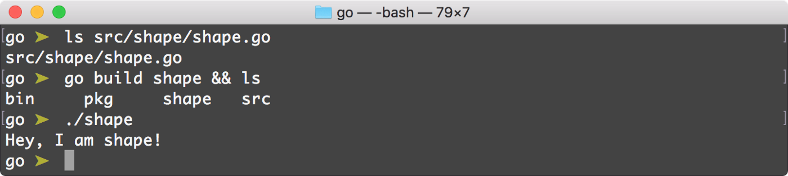

# Getting started with Go

## Installing Go on your system, setting up environment variables, understanding root / workspace directories.

# Installation

As we know, a programming language is nothing but a high-level view of the instructions that a CPU can understand and follow (*do computation / IO operations demanded in the program*).  众所周知，编程语言不过是CPU可以理解和遵循的指令的高级视图（执行程序中要求的计算/ IO操作）。

A language typically consists of the **language specifications** (*syntax*), **standard library**, a **runtime environment,** and a **compiler**. When you install Go, these are all the things you will get.  语言通常由语言规范（语法），标准库，运行时环境和编译器组成。 当您安装Go时，您将获得所有这些。

As Go is an open-source and free programming language, you can install it from the source. It also provides compiled binaries to install Go on your system with ease.  由于Go是一种开放源代码和免费的编程语言，因此您可以从源代码中安装它。 它还提供了编译后的二进制文件，可轻松在您的系统上安装Go。

It comes with Windows and macOS [**installer packages**](https://golang.org/dl/) which I would recommend if you are using Windows or macOS. All other download and installation related information are available at [**golang.org**](https://golang.org/doc/install).  它随附Windows和macOS安装程序包，如果您使用Windows或macOS，我会建议您使用。 所有其他与下载和安装相关的信息都可以在golang.org上找到。

------

# Go Installation Directory

When you install Go on your system, it creates a directory `/usr/local/go` in UNIX or `c:/go` in Windows. Then it copies all necessary code and binaries needed for Go to function in this directory.  在系统上安装Go时，它将在UNIX中创建目录 /usr/local/go 或在Windows中创建 c:/go 。 然后，它将在该目录中复制Go功能所需的所有必要代码和二进制文件。

This is where Go’s **command-line tools**, **standard library** and **compiler** lives. Whenever you import a package from Go’s standard library, Go looks for the package in this directory.  这是Go的命令行工具，标准库和编译器的所在地。 每当您从Go的标准库中导入软件包时，Go都会在此目录中查找该软件包。


## Custom Installation directory

If somehow, your Go installation directory is different than what Go assumes where it would be, you can use `GOROOT` environment variable. Edit your `~/.bash_profile` and add the below entry. For Windows, [***follow this answer\***](https://superuser.com/questions/949560/how-do-i-set-system-environment-variables-in-windows-10)*.*  如果您的Go安装目录与Go假定的目录不同，则可以使用GOROOT环境变量。 编辑您的 ~/.bash_profil 并添加以下条目。 对于Windows，请遵循以下答案。

```
export GOROOT=/usr/local/custom-go
```

> Generally, you don’t need to setup `*GOROOT*` environment variable. I recommend not to modify/use `*GOROOT*` variable anywhere unless it is absolutely necessary.  通常，您不需要设置GOROOT环境变量。 我建议不要在任何地方修改/使用GOROOT变量，除非绝对必要。

------

# Go Workspace

> *⚠️ …* If you are working on **Go v1.11+**, then you do not need to set up a workspace directory using `*GOPATH*` environment variable. You can check the Go version using `*go version*` command. Go supports a much better way to manage your project using **Go Modules**. Follow [**this article**](https://medium.com/rungo/anatomy-of-modules-in-go-c8274d215c16) to know more. Go workspaces (`*GOPATH*`) will be deprecated soon[⁰](https://blog.golang.org/modules2019).  如果您使用的是Go v1.11 +，则无需使用GOPATH环境变量来设置工作区目录。 您可以使用go version命令检查Go版本。 Go支持一种更好的使用Go Modules管理项目的方法。 请按照本文了解更多信息。 Go工作区（GOPATH）将很快被弃用。

You can create a Go program anywhere you want on your system. A typical Go program is a plain text file with `.go` file extension. You can run this program using `go run hello.go` command where `hello.go` is a Go program file in the current directory.  您可以在系统上的任何位置创建Go程序。 典型的Go程序是带有.go文件扩展名的纯文本文件。 您可以使用go run hello.go命令运行该程序，其中hello.go是当前目录中的Go程序文件。

A **workspace** is Go’s way to facilitate project management. A workspace, in a nutshell, is a directory on your system where Go **looks for source code** files, **manages dependency packages** and **build distribution binary files**.  Go是促进项目管理的一种方式。 简而言之，工作空间是系统上的目录，Go可以在其中查找源代码文件，管理依赖包并构建分发二进制文件。

Whenever a Go program encounters an `import` statement, it looks for the package in the Go’s **standard library** *(*`*$GOROOT/src*`*)*. If the package is not available there, then Go refers to the system's environment variable `**GOPATH**` which is the path to Go workspace directory and looks for packages in `$GOPATH/src` directory.  每当Go程序遇到import语句时，它都会在Go的标准库（$GOROOT/src）中查找包。 如果那里没有可用的软件包，则Go引用系统的环境变量GOPATH（它是Go工作空间目录的路径），并在 $GOPATH/src 目录中查找软件包。

**You can have as many workspaces as you want, as long as you keep** `**GOPATH**` **environment variable pointed to the current working workspace directory whenever you are working on the given project.**  只要在给定项目上进行操作时，只要保持GOPATH环境变量指向当前工作空间目录，就可以拥有任意数量的工作空间。

> Similar to `*$GOROOT*`, `*$GOPATH*` by default points to `*$HOME/go*` directory in UNIX and `*%USERPROFILE%\go*` on windows. Hence, it is not absolutely necessary to setup `*GOPATH*` environment variable.  与 $GOROOT 类似，$GOROOT 默认指向UNIX中的 $HOME/go 目录和Windows上的 %USERPROFILE%\go。 因此，并非绝对必要设置GOPATH环境变量。

## Workspace directory structure

A Go workspace directory must have three sub-directories viz. `src`, `pkg` and `bin`. If you want to set up Go workspace, follow [***this\***](https://golang.org/doc/code.html#Workspaces) documentation. If you are using macOS, then you can follow [***this\***](https://medium.com/@himanshuagarwal1395/setting-up-environment-variables-in-macos-sierra-f5978369b255) Medium article to setup environment variables both temporarily or permanently.  Go工作空间目录必须具有三个子目录。 src，pkg和bin。 如果要设置Go工作区，请遵循此文档。 如果您使用的是macOS，则可以按照此中级文章临时或永久设置环境变量。


## ↪ src

The **src** directory contains Go packages. A package in nutshell is a project directory containing Go source code *(*`*.go*` *files)*. Any packages installed using `go get` command will reside here as well (*and its dependency packages*).  src目录包含Go软件包。 简而言之，一个软件包是一个包含Go源代码（.go文件）的项目目录。 使用go get命令安装的所有软件包（及其依赖软件包）也将驻留在此处。

In Go, every program is contained in a package. Hence, whenever you will be working with a new Go project, you need to create a new directory inside `$GOPATH/src` and work your way up from there.  在Go中，每个程序都包含在一个包中。 因此，每当要使用新的Go项目时，都需要在 $GOPATH/src 中创建一个新目录，然后从那里继续。

## ↪ pkg

The **pkg** directory contains Go package objects. They are the compiled versions of the original package source code and they have `.a` file extension *(* a\* *stands for* *archived\*)*.  pkg目录包含Go软件包对象。 它们是原始程序包源代码的编译版本，并且具有.a文件扩展名（a代表已归档）。

These files contain the compiled package binary code, along with debugging symbols and source information. A package object is **customized for machine architecture and the Go version**. These files are created by the Go [**pack**](https://golang.org/cmd/pack/) tool while building/installing a package.  这些文件包含已编译的程序包二进制代码以及调试符号和源信息。 包对象是针对机器体系结构和Go版本定制的。 这些文件是在构建/安装软件包时由Go pack工具创建的。

Whenever you install a 3rd party package, a package object `package-name.a` is created for that package in this directory.  每当您安装第三方软件包时，都会在此目录中为该软件包创建一个软件包对象package-name.a。

In Go, you typically use `import "<package-name>"` or `import "<main/child-package>"` syntax to import a package (like ES6 syntax). Normally, Go looks for these packages in $GOROOT/src or $GOPATH/src directories. But if it finds a precompiled package object associated with an imported package, then Go uses that instead.  在Go中，通常使用import“ <程序包名称>”或import“ <main / child-package>”语法来导入程序包（例如ES6语法）。 通常，Go在$ GOROOT / src或$ GOPATH / src目录中查找这些软件包。 但是，如果找到与导入包相关联的预编译包对象，则Go会使用该对象。

Package objects are compiled and archived files for specific platforms. Hence you will see the **platform architecture** directory inside the **pkg** directory.  包对象是针对特定平台的编译和归档文件。 因此，您将在pkg目录中看到平台架构目录。


The advantage of having a package object is to save compilation time. As a package is nothing but a collection of Go programs, it has to go through Go compiler every single time the **main** program *(a program who imports it)* compiles. If a package has a compiled object file in the **pkg** directory for current system architecture, then it doesn’t get compiled again.  具有包对象的优点是节省编译时间。 由于一个包不过是Go程序的集合，因此每次主程序（导入该程序的程序）都必须经过Go编译器。 如果软件包在当前系统体系结构的pkg目录中具有已编译的目标文件，则不会再次对其进行编译。

Therefore when you are referencing `foo/bar` package. It refers to `$GOPATH/pkg/{arch}/foo/bar.a` and not `$GOPATH/src/foo/bar/*.go` *(for Go’s standard library package, it will be* `*$GOROOT*` *instead of* `*$GOPATH*`*)*.  因此，当您引用 foo/bar 包时。 它是指 $GOPATH/pkg/{arch}/foo/bar.a，而不是 $GOPATH/src/foo/bar/*.go（对于Go的标准库包，它将是 $GOROOT 而不是 $GOPATH）。

> A package object is created when you use `*go install*` command on **non-main** packages. You will learn about **main** and **non-main** packages in packages lesson. Package object are also called as **cached objects** or **cached packages**.  在非主软件包上使用go install命令时，将创建一个软件包对象。 您将在软件包课程中了解主软件包和非主软件包。 包对象也称为缓存对象或缓存包。

## ↪ bin

A Go program can either meant to be used as **utility inside a package** or to **perform some operation**. We have seen packages and where they reside.  Go程序既可以用作包内的实用程序，也可以执行某些操作。 我们已经看到了软件包及其驻留位置。

A Go program that is meant to perform some operation like **make a network request** or **write something to a file** needs to be compiled first so that your machine can understand the instructions. When you run `go run hello.go` command, Go compiler first compiles the `hello.go` file and then executes the resultant binary code.  必须先编译旨在执行某些操作（例如发出网络请求或向文件中写入内容）的Go程序，以便您的计算机可以理解指令。 当您运行go run hello.go命令时，Go编译器将首先编译hello.go文件，然后执行生成的二进制代码。

You can output a binary file from a Go program or package using `go build ` *(main package)* or `go build program/path.go` command. This will create a binary file in the current directory.



The **bin** directory contains the same binary executable files. These files are created by `go install` commands. `go install` command runs `go build` command internally and then outputs these files to the **bin** directory.

Generally, this directory is in the executable path of the system. Hence all the programs inside this directory are executable from the terminal.

> `*go install*` command also creates **package objects** of any imported packages inside currently compiling Go program. Learn more about `*go build*` vs `*go install*` commands from [**here**](https://pocketgophers.com/go-install-vs-go-build/).


> `***GOBIN\***` is another environment variable that Go uses to put binary files created using `*go install*` command. By default, `*GOBIN*` is `*$GOPATH/bin*` but you can change it to whatever directory you like.

------

# Summing Up

The motivation behind having a Go workspace is to easily manage your projects, dependencies, and distributions. Switching Go workspaces should be easy, hence I generally create one Go workspace per project and temporarily set `$GOPATH` environment variable to quickly change workspaces.

## 1. Set up environment variables

```
export GOPATH=/Users/Uday.Hiwarale/uday-gh/go_workspaces/main
export GOBIN=$GOPATH/binPATH=$PATH:$GOPATH:$GOBIN
export PATH
```

Setting `GOBIN` environment variable is not necessary, but since `bin` directory of a workspace will be in our `PATH`, it’s a good idea to set it for simplicity.

## 2. Make sure, `$GOPATH` and `$GOBIN` is set


As discussed, there is no need to set `GOROOT` environment variables as we are using the default installation directory *(on macOS =* `*/usr/local/go*`*)*.

> You can also use `go env GOROOT` or `go env GOPATH` command to check currently interprated Go environment variable.

## 3. Installing 3rd party package


This command will pull source code from the **GitHub** repository and clone it inside `$GOPATH/src`. This will also download other dependency packages of the `gorm` and install them under `src` directory.


After package and dependencies are downloaded, Go will compile the package and create a single package object file in `$GOPATH/pkg` directory under the same directory structure of the package.

## 4. Create binaries


It doesn’t matter, from where you execute `go install shape` command, Go knows where `shape` package is *(from* `*GOPATH*` *environment variable)*.

Using this command, a binary file is generated inside `bin` directory with the name of the package. Since this `bin` directory is in our `PATH`, we can execute this binary file just by its **filename as the command**.

[原文链接](https://medium.com/rungo/working-in-go-workspace-3b0576e0534a)
