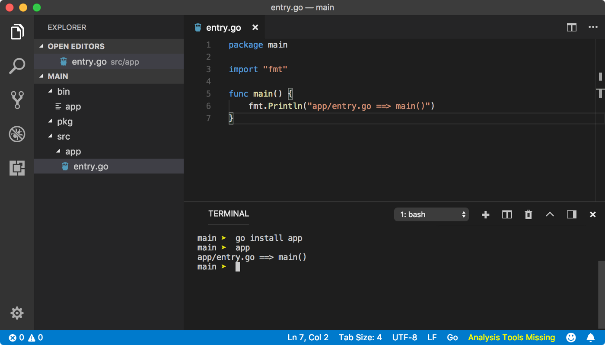
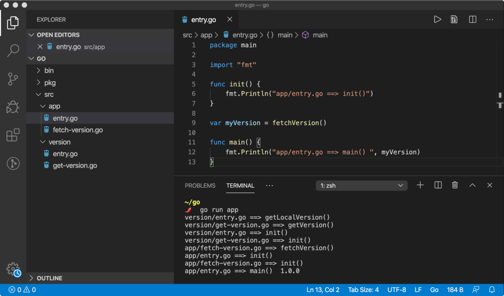

# Everything you need to know about Packages in Go

## A complete overview of package management and deployment in Go programming language  Go编程语言的软件包管理和部署的完整概述

## Migrate to Go Modules

Go provides a new feature called **Modules** which provides flexibility to manage your project and dependencies with ease. If you are working on Go packages, then you should consider **relocating** your project to Go Modules.  Go提供了一个称为 Modules 的新功能，该功能提供了轻松管理项目和依赖项的灵活性。 如果您正在使用Go软件包，则应考虑将项目重新定位到Go Modules。

If you are familiar to languages like **Java** or **JavaScript** on **Node**, then you might be quite familiar with **packages**. A package is nothing but a directory with some code files, which exposes different variables (*features*) from a single point of reference. Let me explain, what that means.  如果您熟悉Node上的Java或JavaScript之类的语言，那么您可能对软件包非常熟悉。 包不过是带有一些代码文件的目录，该目录从单个引用点公开不同的变量（功能）。 让我解释一下，这意味着什么。

Imagine you have more than a thousand functions that you need constantly while working on any project. Some of these functions have common behavior. For example, `toUpperCase` and `toLowerCase` function transforms **case** of a `string`, so you write them in a single file (*probably* ***case.go\***). There are other functions which do some other operations on `string` data type, so you write them in a separate file.  想象一下，在处理任何项目时，您需要不断地拥有上千种功能。 其中一些功能具有共同的行为。 例如，toUpperCase和toLowerCase函数转换字符串的大小写，因此您将它们写入单个文件（可能为case.go）。 还有其他函数可以对字符串数据类型执行其他一些操作，因此您可以将它们写入单独的文件中。

Since you have many files which do something with `string` data type, so you created a directory named `string` and put all `string` related files into it. Finally, you put all of these directories in one parent directory which will be your package. The whole package structure looks like below.  由于您有许多文件可以处理字符串数据类型，因此您创建了一个名为string的目录，并将所有与字符串相关的文件放入其中。 最后，将所有这些目录放在一个父目录中，该目录将成为您的程序包。 整个程序包结构如下所示。

```
package-name
├── string
|  ├── case.go
|  ├── trim.go
|  └── misc.go
└── number
   ├── arithmetics.go
   └── primes.go
```

I will explain thoroughly, how we can import functions and variables from a package and how everything blends together to form a package, but for now, imagine your package as a directory containing `.go` files.  我将详细解释如何从包中导入函数和变量，以及如何将所有内容融合在一起形成一个包，但是现在，将您的包想象成一个包含.go文件的目录。

Every Go program **must be** a part of some package. As discussed in [**Getting started with Go**](https://medium.com/rungo/working-in-go-workspace-3b0576e0534a) lesson, a standalone executable Go program must have `package main` declaration. If a program is part of the main package, then `go install` will create a binary file; which upon execution calls `main` function of the program. If a program is part of a package other than `main`, then a **package archive** file is created with `go install` command. **Don’t worry, I will explain all this in upcoming topics.**  每个Go程序都必须是某些程序包的一部分。 如Go入门课程中所述，独立的可执行Go程序必须具有包main声明。 如果程序是主软件包的一部分，那么go install将创建一个二进制文件； 在执行时调用程序的主要功能。 如果程序不是main包的一部分，则使用go install命令创建一个包归档文件。 不用担心，我将在接下来的主题中解释所有这些。

Let’s create an executable package. As we know, to create a binary executable file, we need our program to be a part of `main` package and it must have `main` function which is the entry point of execution.



A package name is the name of the directory contained in `src` directory. In the above case, `app` is the package since `app` is the child directory of `src` directory. Hence, `go install app` command looked for `app` sub-directory inside `src` directory of `GOPATH` (*since* `*GOROOT*` *doesn’t have it*).  软件包名称是src目录中包含的目录的名称。 在上述情况下，因为app是src目录的子目录，所以app是软件包。 因此，执行go install app命令会在GOPATH的src目录中查找app子目录（因为GOROOT没有）。

Then it compiled the package and created `app` binary executable file (*same as the package name*) inside `bin` directory (*set by* `*GOBIN*`) which should be executable from the terminal since `bin` directory in the `PATH`.

> *💡* **Package declaration** which should be first line of code like `*package main*` in above example, can be different than package name. Hence, you might find some packages where package name (**name of the directory**) is different than package declaration. When you import a package, package declaration is used to create **package reference variable**, explained later in the article.

`go install ` command looks for any file with `**main**` **package declaration** inside given `package` directory. If it finds a file, then Go knows this is an executable program and it needs to create a binary file. A package can have many files but only one file with `**main**` function, since that file will be the entry point of the execution.  go install <package>命令在给定的软件包目录中查找具有主软件包声明的任何文件。 如果找到文件，则Go知道这是一个可执行程序，因此需要创建一个二进制文件。 一个包可以有许多文件，但只有一个具有主要功能的文件，因为该文件将成为执行的入口。

If a package does not contain a file with `main` package declaration, then Go creates a **package archive** (`.a`) file inside `pkg` directory.


Since, `app` is not an executable package, it created `app.a` file inside `pkg` directory. We can not execute this file as it’s not a binary executable file.

## Package naming convention

Go community recommends to use plain and simple names for packages. For example, `strutils` for **string utility** functions or `http` for HTTP requests related functions. A package names with `under_scores`, `hy-phens` or `mixedCaps` should be avoided.  Go社区建议对软件包使用简单的名称。 例如，用于字符串实用程序功能的strutils或用于HTTP请求相关功能的http。 应该避免使用under_scores，连字符或mixedCaps的软件包名称。

------

# Creating a package

As we discussed, there are two types of packages. An **executable package** and a **utility package**. An executable package is your main application since you will be running it. A utility package is not self-executable, instead, it enhances the functionality of an executable package by providing utility functions and other important assets.  正如我们所讨论的，有两种类型的软件包。 可执行程序包和实用程序包。 可执行软件包是您的主要应用程序，因为您将在运行它。 实用程序包不是自可执行的，相反，它通过提供实用程序功能和其他重要资产来增强可执行程序包的功能。

As we know, a package is nothing but a directory. Let’s create `greet` directory inside `src` and put some files in it. This time, we will write `package greet` a declaration on the top of each file to state that this is a utility package.  众所周知，包只不过是目录。 让我们在src中创建greet目录，并将一些文件放入其中。 这次，我们将在每个文件的顶部写一个“ greeting”包，以声明这是一个实用程序包。


## Export members

A utility package is supposed to provide some **variables** to a package who imports it. Like `export` syntax in `JavaScript`, Go exports a variable if a variable name starts with **Uppercase**. All other variables not starting with an uppercase letter is private to the package.  实用程序包应该为导入它的包提供一些变量。 与JavaScript中的导出语法一样，如果变量名称以大写字母开头，则Go会导出变量。 所有其他不以大写字母开头的变量对程序包都是私有的。

> *⚠️* I am going to use **variable** word from now on in this article, to describe an export member but export members can be of any type like `*constant*`, `*map*`, `*function*`, `*struct*`, `*array*`, `*slice*` etc.

Let’s export a greeting variable from `day.go` file.


In the above program, `Morning` variable will be exported from the package but not the `morning` variable since it starts with a lowercase letter.

## Importing a package

Now, we need an **executable package** which will consume our `greet` package. Let’s create an `app` directory inside `src` and create `entry.go` file with `main` package declaration and `main` function. Note here, Go packages do not have an **entry file naming system** like `index.js` in Node. For an executable package, a file with `main` function is the entry file for execution.

To import a package, we use `import` syntax followed by the **package name**.

> *💡* Unlike other programming languages, a package name can also be a subpath like `*some-dir/****greet\***` and Go will automatically resolve the path to the `***greet\***` package for us as you will see in the **nested package** topic ahead.

Go first searches for package directory inside `**GOROOT**/src` directory and if it doesn’t find the package, then it looks for `**GOPATH**/src`. Since, `fmt` package is part of Go’s standard library which is located in `GOROOT/src`, it is imported from there. But since Go cannot find `greet` package inside `GOROOT`, it will lookup inside `GOPATH/src` and we have it there.


Above program throws compilation error, as `morning` variable is not visible from the package `greet`. As you can see, we use `.` (*dot*) notation to access exported members from a package. When you import a package, Go creates a global variable using the **package declaration** of the package. In the above case, `greet` is the global variable created by Go because we used `package greet` declaration in programs contained in `greet` package.


We can group `fmt` and `greet` package imports together using grouping syntax (*parentheses*). This time, our program will compile just fine, because `Morning` variable is exported from the `greet` package.

> *💡* BTW, you can run an executable Go package from anywhere using `go run ` command. Go will try to resolve the package from `GOROOT` or `GOPATH` directories and execute the `main` function. Hence, in the above example, you could have just executed the `go run app` command.  顺便说一句，您可以使用go run <package-name>命令从任何地方运行可执行的Go软件包。 Go将尝试从GOROOT或GOPATH目录解析该程序包并执行main函数。 因此，在上面的示例中，您可能刚刚执行了go run app命令。

## Nested package

We can nest a package inside a package. Since for Go, a package is just a directory, it’s like creating a subdirectory inside an already existing package. All we have to do is write an appropriate package declaration and provide a relative path of the nested package when we import it.  我们可以将包嵌套在包中。 由于对于Go，包只是目录，就像在现有包中创建子目录一样。 我们要做的就是编写一个适当的程序包声明，并在导入时提供嵌套程序包的相对路径。


As you can see from the above example, Go has created the `de` variable from the `greet/de` package import which contains all the exports from the `de` sub-package. The `de` variable name comes from the `package de` declaration.

## Package compilation

As discussed in the previous lesson, `go run` command compiles and executes a program. We know, `go install` command compiles a package and creates a binary executable file or package archive file.

The package archive file is created to avoid compilation of the package every single time it is imported in a program. The `go install` command pre-compiles a package and Go refers to `.a` files.

> *💡* Generally, when you install a 3rd party package, Go compiles the package and create package archive file. If you have created a package locally, then your **IDE** might create package archive as soon as you save the file in the package or when package gets modified. **VSCode compiles the package when you save it if you have** [**Go**](https://marketplace.visualstudio.com/items?itemName=ms-vscode.Go) **plugin installed.**  通常，当您安装第三方软件包时，Go会编译该软件包并创建软件包存档文件。 如果您是在本地创建的，则IDE可能会在将文件保存到包中或修改包后立即创建包归档文件。 如果已安装Go插件，则VSCode在保存时会编译该软件包。


However, the nested packages won’t be compiled into archive files when you use `go install ` command. To create an archive file for the nested package, you need to use the same command but will the nested package path like `go install greet/de` in the previous example.


------

# Package initialization

When we run a Go program, the Go compiler follows a certain execution order for packages, files in a package and variable declaration in those files.  当我们运行Go程序时，Go编译器会按照一定的执行顺序执行程序包，程序包中的文件以及这些文件中的变量声明。

## Package scope

**A scope is a region in a code block where a defined variable is accessible**. A package scope is a region within a package where a declared variable is accessible from within a package (*across all the files in the package*). This region is the top-most block of any file in the package.  范围是代码块中可访问定义变量的区域。 包作用域是包中的一个区域，在该区域中，可以从包内（跨包中的所有文件）访问已声明的变量。 此区域是软件包中任何文件的最上面的块。


Take a look at `go run` command. This time, instead of executing one file, we have a glob pattern to include all the files inside `app` package for execution.

Go is smart enough to figure out an entry point of the application which is `entry.go` because it has `main` function. We can also use a command like below (*the filename order doesn’t matter*).

```
go run src/app/version.go src/app/entry.go
```

> *💡* You can also use `*go run app*` command which does the same thing and this is a **better approach** to execute a package. `*go install*` or `*go build*` command requires a package name, which includes all the files inside a package, so we don’t have to specify them like above.

Coming back to our main issue, we can use variable `version` declared in `version.go` file from anywhere in the package even though it is **not exported** (*like* `*Version*`), because it is declared in package scope.

If the `version` variable would have been declared inside a function, it wouldn’t have been in the package scope and the above program would have failed to compile.

**You are not allowed to redeclare a global variable with the same name in the same package**. Hence, once `version` variable is declared, it can not be redeclared in the package scope. But you are free to re-declare elsewhere.


## Variable initialization

When a variable `a` depends on another variable `b`, `b` should be defined beforehand, else program won’t compile. Go follows this rule inside functions.


But when these variables are defined in package scope, they are declared in initialization cycles. Let’s have a look at the simple example below.


In the above example, first `c` is declared because its value is already declared. In later initialization cycle, `b` is declared, because it depends on `c` and value of `c` is already declared. In the final initialization cycle, `a` is declared and assigned to the value of `b`. Go can handle complex initialization cycles like below.


In the above example, first `c` will be declared and then `b` as its value depends on `c` and finally `a` as its value depends on `b`. You should avoid any initialization loop like below where initialization gets into a recursive **loop**.


Another example of package scope would be, having a function `f` in a separate file which references variable `c` from the main file.


## Init function

Like `main` function, `**init**` function is called by Go when a package is initialized. It does not take any arguments and doesn’t return any value.

The `init` function is **implicitly** declared by Go, hence you can not reference it from anywhere (*or call it like* `*init()*`). You can have multiple `init` functions in a file or a package. Order of the execution of `init` function in a file will be according to the order of their appearances.


You can have `init` function anywhere in the package. These `init` functions are called in lexical file name order (***alphabetical order\***).


After all the`init` functions are executed, `main` function is called. Hence, the **main job of** `**init**` **function is to initialize global variables** that cannot be initialized in the global context. For example, initialization of an array.


Since, `for` syntax is not valid in package scope, we can initialize the array `integers` of size `10` using `for` loop inside `init` function.

## Package alias

When you import a package, Go create a variable using the package declaration of the package. If you are importing multiple packages with the same name, this will lead to a conflict.

```
// greet/parent.go
package greetvar Message = "Hey there. I am parent."// greet/greet/child.go
package greetvar Message = "Hey there. I am child."
```


Hence, we use **package alias**. We state a variable name in between `import` keyword and package name which becomes the new variable to reference the package.


In the above example, `greet/greet` package now is referenced by `child` variable. If you notice, we aliased `greet` package with an underscore.

Underscore is a special character in Go which acts as `null` **container**. Since we are importing `greet` package but not using it, Go compiler will complain about it. To avoid that, we are storing reference of that package into `_` and Go compiler will simply ignore it.

Aliasing a package with an **underscore** which seems to do nothing is quite useful sometimes when you want to **initialize** a package but not use it.

```
// greet/parent.go
package greetimport "fmt"var Message = "Hey there. I am parent."func init() {
  fmt.Println("greet/parent.go ==> init()")
}// greet/greet/child.go
package greetimport "fmt"var Message = "Hey there. I am child."func init() {
  fmt.Println("greet/greet/child.go ==> init()")
}
```


The main thing to remember is, **an imported package is initialized only once per package**. Hence if you have multiple import statements in a package, an imported package is going to be initialized only once in the lifetime of main package execution.

> *💡* If we use `*.*` (dot) as an alias like `*import . "greet/greet"*` then all the export members of `*greet*` package will be available in the local file block scope and we can reference `*Message*` without using qualifier `*child*`. Hence, `*fmt.Println(Message)*` would work just fine. This type of import is called as **Dot Import** and Go community is [**not very fond of it**](https://github.com/golang/go/issues/29326) as it can cause some issues.

------

# Program execution order

So far, we understood everything there is about packages. Now, let’s combine our understanding of how a program initializes in Go.

```
go run *.go
├── Main package is executed
├── All imported packages are initialized
|  ├── All imported packages are initialized (recursive definition)
|  ├── All global variables are initialized 
|  └── init functions are called in lexical file name order
└── Main package is initialized
   ├── All global variables are initialized
   └── init functions are called in lexical file name order
   
```

Here is a small example to prove it.

```
// version/get-version.go
package versionimport "fmt"func init() {
 fmt.Println("version/get-version.go ==> init()")
}func getVersion() string {
 fmt.Println("version/get-version.go ==> getVersion()")
 return "1.0.0"
}/***************************/// version/entry.go
package versionimport "fmt"func init() {
 fmt.Println("version/entry.go ==> init()")
}var Version = getLocalVersion()func getLocalVersion() string {
 fmt.Println("version/entry.go ==> getLocalVersion()")
 return getVersion()
}/***************************/// app/fetch-version.go
package mainimport (
 "fmt"
 "version"
)func init() {
 fmt.Println("app/fetch-version.go ==> init()")
}func fetchVersion() string {
 fmt.Println("app/fetch-version.go ==> fetchVersion()")
 return version.Version
}/***************************/// app/entry.go
package mainimport "fmt"func init() {
 fmt.Println("app/entry.go ==> init()")
}var myVersion = fetchVersion()func main() {
 fmt.Println("app/fetch-version.go ==> fetchVersion()")
 fmt.Println("version ===> ", myVersion)
}
```



------

# Installing 3rd party package

Installing a 3rd party package is nothing but cloning the remote code into a local `src/` directory. Unfortunately, Go does not support package version or provide package manager but a proposal is waiting [***here\***](https://github.com/golang/proposal/blob/master/design/24301-versioned-go.md).

Go does not have a centralize official package registry, it asks you to provide hostname and path to the package.

```
$ go get -u github.com/jinzhu/gorm
```

Above command imports files from `http://github.com/jinzhu/gorm` URL and saves it inside `src/github.com/jinzhu/gorm` directory. As discussed in nested packages, you can import `gorm` package like below.

```
package mainimport "github.com/jinzhu/gorm"// use ==> gorm.SomeExportedMember
```

So, if you made a package and want people to use it, just publish it on GitHub and you are good to go. If your package is executable, people can use it as a command-line tool else they can import it in a program and use it as a utility module. The only thing they need to do is use the below command.

```
$ go get github.com/your-username/repo-name
```

------

# Migrate to Go Modules

Go provides a new feature called **Modules** which provides flexibility to manage your project and dependencies with ease. If you are working on Go packages, then you should consider **relocating** your project to Go Modules.


[原文链接](https://medium.com/rungo/everything-you-need-to-know-about-packages-in-go-b8bac62b74cc)