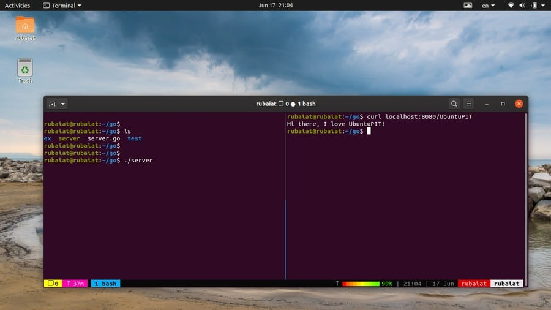
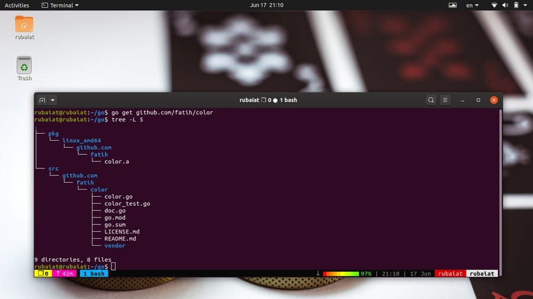
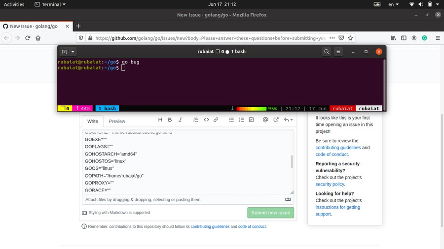
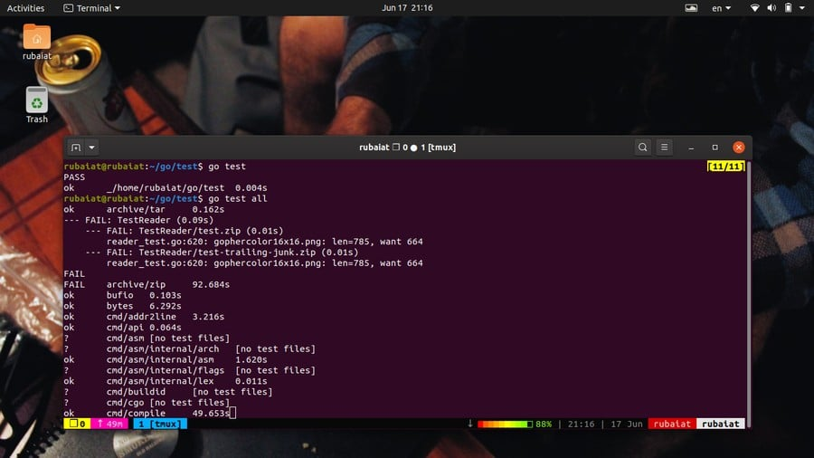
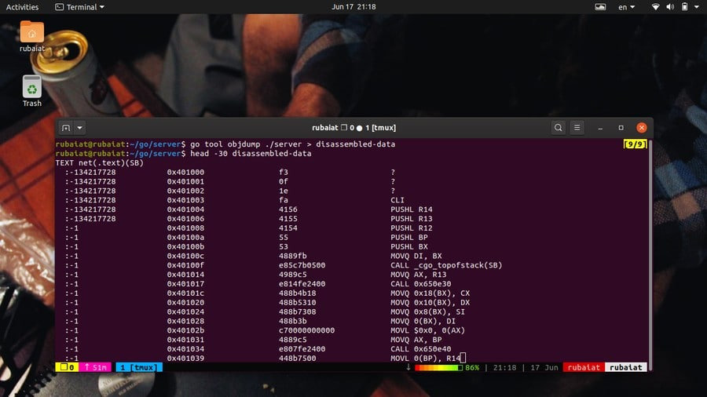
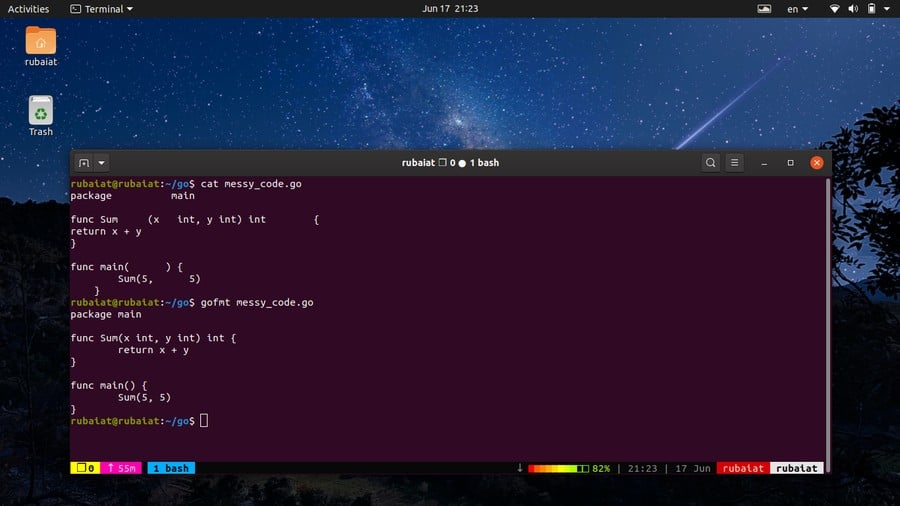

# The 40 Go Command Examples for Aspiring Golang Developers  有抱负的Golang开发人员的40个Go命令示例

Go is a statically-typed programming language with strong support for concurrency. It is backed by Google and is meant for general-purpose projects like systems application development or web apps. Golang is becoming more and more popular due to its robust feature set and support for the latest programming practices. A large number of companies are looking for active Go developers due to its growing usage in modern applications. Developers can use a number of go commands to increase their programming productivity or workflow management. In this guide, we will discuss some of these commands for aspiring Go devs.  Go是一种静态类型的编程语言，具有对并发的强大支持。 它得到了Google的支持，适用于诸如系统应用程序开发或Web应用程序之类的通用项目。 Golang由于其强大的功能集和对最新编程实践的支持而变得越来越受欢迎。 由于Go语言在现代应用程序中的使用日益广泛，因此许多公司正在寻找积极的Go开发人员。 开发人员可以使用许多go命令来提高编程效率或工作流程管理。 在本指南中，我们将为有抱负的Go开发人员讨论其中一些命令。

## Useful Go Command Examples in Linux

Go provides a suite of useful tools for managing the build process and workflow for programmers. They are invoked by means of a set of simple commands built right into go. We are outlining 40 such useful commands in the following section.  Go提供了一套有用的工具来为程序员管理构建过程和工作流。 它们是通过内置在go中的一组简单命令来调用的。 在以下部分中，我们概述了40个此类有用的命令。

### 1. Build a Program

The go build command allows developers to build the binary executable for a given program. We have created a simple server program called server.go for demonstrating this. Now, we will build this program using go build.  go build命令允许开发人员为给定程序构建二进制可执行文件。 我们已经创建了一个简单的服务器程序server.go进行演示。 现在，我们将使用go build来构建该程序。

```
$ go build server.go
```

This command will create a binary executable file named server in our go working directory. You can find out the code for the server program from [this section of the Golang website](https://golang.org/doc/articles/wiki/). Now, we can run the program like any other Linux command-line tools.  此命令将在我们的工作目录中创建一个名为server的二进制可执行文件。 您可以从Golang网站的此部分中找到服务器程序的代码。 现在，我们可以像运行其他任何Linux命令行工具一样运行该程序。

```
$ ./server
```



### 2. Run a Program Without Building It

Developers usually make gradual changes to their programs based on testing. It is inconvenient to build the program each time you make a slight modification. Luckily, go allows us to run a program even without building it in the first place.  开发人员通常会根据测试对其程序进行逐步更改。 每次稍加修改就构建程序是很不方便的。 幸运的是，go允许我们即使不首先构建程序也可以运行程序。

```
$ go run server.go
```

This command will run the program directly without requiring you to build the source code. It is extremely useful when you are playing around with smaller sub-programs.  该命令将直接运行程序，而无需您构建源代码。 当您使用较小的子程序时，它非常有用。

### 3. Display Current GOPATH

Go manages the source codes, objects, and binaries of a program by using the Go Workspace. The root of this workspace is specified by using the **GOPATH** variable. You can find the current path to your Go Workspace by using the following command.  Go使用Go Workspace管理程序的源代码，对象和二进制文件。 使用GOPATH变量指定此工作空间的根。 您可以使用以下命令找到Go Workspace的当前路径。

```
$ go env GOPATH
```

This is where you need to put your source files and compiler them. Although you can set up multiple Go Workspaces, it is advised to use one distinct workspace. The sub-command **env** also provides a lot of other information, as we’ll see later.  这是您需要放置源文件并对其进行编译的地方。 尽管可以设置多个Go工作区，但建议使用一个不同的工作区。 子命令env还提供了许多其他信息，我们将在后面看到。

### 4. Set New GOPATH

From Go version 1.8, Unix systems specify the **$HOME/go** directory as the default GOPATH. However, you can easily change this to a different location using the following simple command.  从Go版本1.8开始，Unix系统将 $HOME/go 目录指定为默认的GOPATH。 但是，您可以使用以下简单命令将其轻松更改为其他位置。

```
$ go env -w GOPATH=$HOME/projects/go
```

This will change your GOPATH to **$HOME/projects/go**. You can also set the GOPATH by adding the following line to your **~/.bash_profile**. Simply open the file using your favorite Linux text editor and append the next line at the end.

```
export GOPATH=$HOME/projects/go
```

After saving the file, exit, and run the following command to reflect the changes.

```
$ source ~/.bash_profile
```

### 5. Install Go Packages

Every go program you write or use is part of a go package. Go packages are nothing but a directory that contains some go files inside the **/src** directory. We can install go packages very easily by using the go install command.

```
$ go install test-app
```

When you run this command, go will look for the directory test-app first in **$GOROOT/src** and then in **$GOPATH/src**. Once it is found, go will determine the entry point of the package by looking for the package main in the source files. Go will then proceed to install this package and place the test-app binary in the **/bin** directory of your workspace.  运行此命令时，go会先在 $GOROOT/src 中查找目录test-app，然后在 $GOPATH/src 中查找目录。 找到它后，go将通过在源文件中查找包主文件来确定包的入口点。 然后，Go将继续安装此软件包，并将test-app二进制文件放入工作区的 /bin 目录中。

### 6. Download and Install Packages

Golang has been enjoying growing popularity among a large number of FOSS developers. As a result, a lot of useful programs are being written using go. You can easily download a third-party go package and install it using the following simple command.  Golang在众多FOSS开发人员中越来越受欢迎。 结果，使用go编写了许多有用的程序。 您可以使用以下简单命令轻松下载第三方go软件包并进行安装。

```
$ go get host/example-project
$ go get github.com/fatih/color
```

This command will download and install the popular color package alongside all its dependencies. You can also update the package in the future by using the **-u** flag, as shown below.

```
$ go get -u github.com/fatih/color
```



### 7. List Packages Alongside Dependencies

Your Go workspace will grow over time and may house packages that are no longer needed. You can list all installed go packages as well as their dependencies. This will help you determine which packages to remove from your workspace.  您的Go工作空间会随着时间的推移而增长，并且可能会容纳不再需要的软件包。 您可以列出所有已安装的go软件包及其依赖项。 这将帮助您确定要从工作空间中删除哪些软件包。

```
$ go list
```

This go command requires an import path and will provide information on a specific package. To get information on all installed packages, you need to use a special wildcard.  此go命令需要导入路径，并将提供有关特定软件包的信息。 要获取有关所有已安装软件包的信息，您需要使用特殊的通配符。

```
$ go list ./...
```

Run this command from your GOPATH and go will display all the packages that are installed in your workspace.

### 8. Fix Go Packages

When you update your go version, programs that use older features may get broken. Go provides a handy tool to fix these programs and rewrite them to use newer features of the language. You will need to use the go fix command to do this.

```
$ go fix app/app.go
```

This command will rewrite the app.go file to accommodate newer Go APIs and features. Use the following command to fix entire applications.

```
$ go tool fix app/
```

### 9. Remove Go Objects

Go creates objects files during program builds and stores them in a temporary directory. Plus, many go tools also create various objects that takes storage space. You will want to get rid of the unused objects over time.

```
$ go clean
```

It will remove all go objects that are created before running this command. Use the below command to remove all objects for a specific package.

```
$ go clean -i app/
```

The **-i** option of clean will delete all corresponding binaries or archives as well.

### 10. Display Environment Information

Programmers can easily find information on various go environment variables. The go env command can be used to display all go environment variable in your Linux terminal emulator.

```
$ go env
```

It will print out all go variables no matter whether their values are set or not. To print the value of a specific go variable, use the following format.

```
$ go env VARIABLE
$ go env GOCACHE
```

We have printed the GOPATH earlier using the above syntax. It is useful for retrieving particular environment variables.

### 11. Create Bug Reports

Go is a relatively new language and rolls out new features quite often. Although it is designed very carefully, you may sometime face unwanted bugs or problems. Thankfully, it is very convenient to generate bug reports for the go runtime.  Go是一种相对较新的语言，并且经常推出新功能。 尽管它的设计非常谨慎，但有时您可能会遇到不想要的错误或问题。 幸运的是，为go运行时生成错误报告非常方便。

```
$ go bug
```

When you run the above command, it will open your default browser and create a bug report in Go’s official GitHub repository. It will add all essential information such as system information as well as go configurations.



### 12. Reformat Package Sources

The Go runtime makes formatting extremely convenient for developers. You can simply fire up your Linux code editor and start writing code without thinking about indentations or alignments. Once done, use the below go command to format your code according to Go’s recommendation.  Go运行时使格式化对于开发人员极为方便。 您可以简单地启动Linux代码编辑器并开始编写代码，而无需考虑缩进或对齐方式。 完成后，请使用以下go命令根据Go的建议设置代码格式。

```
$ go fmt [packages]
$ go fmt server.go
```

The second command formats the server.go file. You can also pass in a directory containing a bunch of go files to format them all. Go will use tabs for indentations and spaces for code alignments.

### 13. Manage Modules

All Go commands have pre-built support for modules. Modules in Go are nothing but a collection of multiple go packages. The *go.mod* file contains all third-party packages for a Go application. You can easily create this file by using the following command.  所有Go命令都具有对模块的预先构建的支持。 Go中的模块不过是多个go软件包的集合。 go.mod文件包含Go应用程序的所有第三方程序包。 您可以使用以下命令轻松创建此文件。

```
$ go mod <command> [arguments]
$ go mod init app
```

This command will create a *go.mod* file for our custom app package. It will contain the module name as well as the go version information. The mod utility takes various other commands apart from **init**. Type the following to view the available options.

```
$ go help mod
```

### 14. Generate Go Files

Golang allows developers to create or update Go source files by using directives within existing sources. The generate command is used for doing this. Although generate is meant for creating or updating Go files, it can be used to perform other tasks as well.  Golang允许开发人员通过使用现有源代码中的指令来创建或更新Go源文件。 generate命令用于执行此操作。 尽管generate是用于创建或更新Go文件的，但它也可以用于执行其他任务。

```
$ go generate [-run regexp] [-n] [-v] [-x] [build flags] [file.go... | packages]
```

When you run go generate, it will look for directives of the following format in your go source files.

```
//go:generate command argument...
```

Generate will run the command once it finds the directive inside your go source. Note that there can be no spaces before or within “**//go**“.

### 15. Upgrade Package Dependencies

Earlier, we showed how to install or update packages using the go get utility. However, when working on larger projects, you will often need to update your package dependencies. The following command updates all Go packages that are in your GOPATH.

```
$ go get -u all
```

However, you should use different GOPATH for different projects. It will make sure that updating packages in project A wouldn’t break project B. You can also upgrade a package to a specific version by using the suffix ‘**@**‘.

```
$ go get foo@v1.6
```

### 16. Test Package Upgrades

Once you have completed upgrading, make sure that all of your old projects are working flawlessly. You can use the following simple command to do this from your terminal.

```
$ go test all
```

This command will check whether the applications are working as expected after the package upgrades. You can also test a single project by specifying the import path of the project.

```
$ go test app/
```

This will display summarized information on the test results.



### 17. Find Mistakes in Packages

Go provides a flexible tool for catching unsuspected errors or mistakes in your source file. The go vet command uses heuristics to find suspicious use of constructs, which often lead to actual errors. The below command vets the package that is in the current directory for such errors.  Go提供了一个灵活的工具来捕获源文件中的意外错误或错误。 go vet命令使用试探法来查找可疑的构造用法，这通常会导致实际错误。 以下命令将检查当前目录中的软件包是否存在此类错误。

```
$ go vet
```

You can also specify the packages using the import path, as shown in the below example.

```
$ go vet app/
```

Use the below command to find more information on vet and its available options.

```
$ go doc cmd/vet
```

### 18. Download Modules to Cache

You can download Go Modules to your local cache. This is very useful when working on larger projects and will make app updates easier over time. The command for this looks like below.

```
$ go mod download [-x] [-json] [modules]
```

Simply pass the module name, as shown below.

```
$ go mod download example-project/app
```

Since Go version 1.11, the downloaded modules are stored in **$GOPATH/pkg/mod**. The **-x** options display which commands will be executed by mod download. The **-json** flag prints a set of JSON objects describing the downloaded module to the terminal output.

### 19. Maintain Module Dependencies

The go mod tidy command allows us to add missing dependencies or delete unused modules. This go command helps in maintaining module dependencies and keep your applications as lean as possible. Simply run the following simple command to do this.  go mod tidy命令使我们可以添加缺少的依赖项或删除未使用的模块。 此go命令有助于维护模块依赖性，并使您的应用程序尽可能精简。 只需运行以下简单命令即可。

```
$ go mod tidy [-v]
```

Make sure to run this from your project’s root directory. You can check the go.mod file to see which dependencies were added or deleted. The **-v** flag, if used, causes tidy to display which modules were removed to the standard error.

### 20. Create Vendored Copy of Dependencies

Go allows developers to create a vendored copy of the module dependencies. This simply resets the main module’s vendor directory and include all the packages that are required to build or test packages that are in the main module.

```
$ go mod vendor [-v]
```

The above command makes a vendored copy of the main module’s dependencies. If you use the -v option, it will display the names of the vendored modules and packages to the system’s standard error.

### 21. Verify Module Dependencies

Programmers can easily verify whether all the dependencies of the current modules have the expected content or not. The “go mod” verify command checks that if any dependencies in the local cache have been modified since download. The command takes the below format.

```
$ go mod verify
```

The above command will print ‘*all modules verified*‘ if the module dependencies are unmodified. Else, it will report which modules have been changed and cause a non-zero exit. This simple tool can help developers determine the integrity of their dependencies.

### 22. Display Why Packages/Modules are Needed

You can see why certain modules or packages are required in your application. This is useful if you are working with someone else’s code or are trying to figure out what certain things do in a specific project. The “why” command of the mod tool allows us to do this.

```
$ go mod why [-m] [-vendor] packages...
$ go mod why golang.org/x/text/language golang.org/x/text/encoding
```

The first one is the general syntax, and the second one is an example. It prints out why the *language* and *encoding* packages are required in your application.

### 23. Disassemble Go Binaries

If you are using Go for systems programming or intensive applications like games, you will need to analyze your executables from time to time. Go provides a set of tools for analyzing binaries. In this example, we will look at the objdump command. It disassembles go executables and works like the Linux objdump command.

```
$ go tool objdump [-s symregexp] binary
```

This is supported syntax for objdump. You need to use the go tool utility to use objdump. The below command disassembles a go binary named server.go.

```
$ go tool objdump ./server
```

You can limit the disassembly to specific symbols by using the -s option. It will only disassemble the symbols whose name matches **symregexp**. You will usually want to save the output for detailed inspection.

```
$ go tool objdump ./server > disassembled-data
```



### 24. Display Exported API for Packages

You can easily display the APIs exported by a set of Go packages. You will need to use the api tool of the go command to do this. Take a close look at the below command to see how this works.

```
$ go tool api
```

This will print out the APIs for your go packages in the standard output. Redirect the output to a file if you want to save the output of this command.

### 25. Use Go Assembler

Go comes with an in-built assembler that lets developers create object files from assembler source code. Although you will rarely use assembly with go, having the ability to do so doesn’t hurt. Simply write the assembly code inside your go package. You can then invoke the go assembler, as demonstrated below.  Go带有一个内置的汇编程序，开发人员可以使用该程序从汇编程序源代码创建目标文件。 尽管您很少会随行使用汇编语言，但是有能力这样做不会有任何伤害。 只需在您的go包中编写汇编代码即可。 然后，您可以调用go汇编器，如下所示。

```
$ go tool asm test.s
$ go tool asm new-test.asm
```

Usually, systems programmers use assembly to increase the performance of a critical section of code. Even go implements some portion of the math package using assembly, such as the pi computation.

### 26. Print Build ID of Binaries

The build id of an ELF binary is a unique representation of the build information. Go provides a simple utility for displaying this information directly from your terminal. See the below example to see how this works.

```
$ go tool buildid server
```

This will print out the build-id of the binary executable named server. This is created when you generate the binary via go build or other build tools. You can match it with the output of the file command. Run the below command and look for the Go BuildID section.

```
$ file server
```

### 27. Use the CGO Tool

One major feature of Go is its interoperability with C codebases. You can use C codes inside Go sources and vice versa. You can then generate the binary by using the usual go build or install from the root of your package. Alternatively, you can use the **cgo** tool of the go runtime.  Go的主要功能之一是与C代码库的互操作性。 您可以在Go源代码中使用C代码，反之亦然。 然后，您可以使用通常的go构建或从软件包根目录安装来生成二进制文件。 另外，您可以使用go运行时的cgo工具。

```
$ go tool cgo [cgo options] [-- compiler options] gofiles...
$ go tool cgo app/ccode.go
```

Consult the below documentation to see which options are available to cgo.

```
$ go doc cmd/cgo
```

### 28. Use Go Compile

By default, the go build or run command does not create object files. You can use the compile utility of the go command to generate an object file. It will only work when you use go tool, as illustrated in the below example.

```
$ go tool compile server.go
```

This command create a binary executable called server as well as an object file named server.o. The compile utility also offers a plethora of useful functionalities. You can check a detailed overview of compile by running the following command.

```
$ go doc cmd/compile
```

### 29. Use Go Dist

The dist utility allows developers to bootstrap, build, and test the go runtime from their terminal. It has the following syntax.

```
$ go tool dist [command]
```

Some of the available commands are banner, bootstrap, clean, list, env, and version. You can find a list of all supported commands by running the following.

```
$ go doc cmd/dist
```

For example, the following snippet prints the Go installation banner using the dist tool.

```
$ go tool dist banner
```

Use the below command to list all supported platforms for Go. It will display a JSON output indicating the OS, Architecture, and CGO support.

```
$ go tool dist list -json
```

### 30. Use the Gofmt Tool

Gofmt is another one of Go’s source formatting utility. It works quite similar to **fmt**. In fact, when you use go fmt, it calls this under the hood. Gofmt has the following syntax.

```
$ gofmt [flags] [path ...]
```

For example, the below command will reformat the source file test.go and print it to the standard output. If you give a pathname instead of a filename, gofmt will try to reformat all .go files inside that directory.

```
$ gofmt test.go
```

Contrary to fmt, gofmt does not write back the changes to the original file. You will need to use the **-w** flag for doing so. Use the following command to get a list of all available flags.  与fmt相反，gofmt不会将更改写回到原始文件。 您将需要使用-w标志。 使用以下命令获取所有可用标志的列表。

```
$ go doc cmd/gofmt
```

### 

### 31. Use the Link Tool

The Link utility reads the go archive or object for a package main and creates a binary executable containing all of its dependencies. It is invoked using go tool and has the below syntax.

```
$ go tool link [flags] main.a
```

For example, the below command will combine the server.o file with its dependencies and spit out a binary.

```
$ go tool link server.o
```

Link supports a large number of flags that allow developers to manage or control the build process. You can find a detailed list of them by running the following command.

```
$ go doc cmd/link
```

### 32. Print Symbol List

You can print the list of symbols contained in an object file, archive, or executable by using the go nm tool. Symbols are simply names of global objects such as methods used by an object file. The syntax of this command is shown below.

```
$ go tool nm [options] file...
$ go tool nm server.o
```

The output prints each symbol in a new line. They are separated by three space-separated fields, representing the address, type, and symbol name. You can view the list of symbol types from [this page of the Go documentation](https://golang.org/cmd/nm/). The options include size, type, sort, and n.

### 33. Manage Go Archives

Go allows developers to create, modify, or extract archives. The go tool nm allows us to do such binary operations. It is a basic simulation of the traditional ar tool in Unix. The syntax for this command is shown below.

```
$ go tool pack op file.a [name...]
```

The op stands for operations. Pack permits several operations, including creating an archive, adding to the archive, and extracting.

```
$ go tool pack r server.a server.o
```

This command appends the file server.o to the archive server.a. You can see the list of all available OP codes by running the following command.

```
$ go doc cmd/pack
```

### 34. Display Profiling data

Go comes with excellent profiling support. If you are developing resource-intensive applications or programming for low-spec machines, profiling will help you increase performance significantly. The pprof utility of the go command allows us to display and interpret profiling data.

```
$ go tool pprof binary profile
$ go tool pprof ./app cpu.prof
```

You can work with both CPU and Memory profiles. Moreover, pprof also allows developers to analyze profiling data remotely over the web. Although starting Go programmers may find the API a little bit complicated, we found the performance gain to be worth the learning curve.

### 35. Display Trace Files

Go provides excellent concurrency support via goroutines. However, we often see developers writing concurrent code that hardly benefits their programs. This happens due to ineffective parallelization, which causes latency, contention, and other performance issues. Thankfully, you can use the go trace utility for visualizing how your goroutines are working.

```
$ go tool trace trace.out
```

This command will display the trace file trace.out for a given program, which can be generated in multiple ways. You can use the **go test** command, **runtime/trace.Start**, or the **net/http/pprof** package for creating a trace file for your application. [Check out this link to learn more](https://golang.org/cmd/trace/) about this.

### 36. Convert Test Output to JSON

The go command-line utility provides an effective way to convert test output to JSON. You can save this JSON output for later inspection or may use it for further processing. The below command shows us how to do this by using the test2json utility of Golang.

```
$ go tool test2json [-p pkg] [-t] [./pkg.test -test.v]
$ go tool test2json -p example.go -t example_test.go
```

The first line contains the syntax for the **test2json** command, while the second one is a working example. It will display the JSON output directly to the console. You can save this data easily by using a simple redirection.


### 37. Use the Addr2line Tool

Go provides a minimal simulation of the GNU addr2line tool by means of the go command addr2line. It translates addresses to line numbers in your program. It can be really beneficial to systems programmers and debuggers.

```
$ go tool addr2line binary
```

When invoked this way, this command will read hex addresses. For each address, it displays the function name and line number corresponding to that address. You can find more information on this tool by using the following command.

```
$ go doc cmd/addr2line
```

### 38. Display Help Page

The help page of go contains summarized information of standard go commands. It is useful for quickly looking up the usage and syntax of everyday commands. You can invoke the help page by running one of the following simple commands.

```
$ go help
$ go --help
```

Moreover, you can also print information for a specific command by using the below syntax.

```
$ go help <topic>
$ go help install
```

### 39. Display Go Documentation

Go provides in-depth documentation for the runtime utilities as well as standard commands. These are extremely useful if you want to master the fundamentals of Golang and learn the best practices. You can invoke the documentation in one of the following ways.

```
$ man go
```

This will print out a basic manual for Go. However, go provides individual manuals for each command. You can find out detailed information for a specific command by running the following.

```
$ man go-<topic>
$ man go-install
```

To access documentation for various go tools, use the go doc command. The below command displays the documentation for the go link utility.

```
$ go doc cmd/link
```

### 40. Display Version Information

Golang is a relatively new language, and thus it is very common to have differences across various releases. Many features are not available to older go versions at all. So, you need to make sure that your go installation meets the requirements for certain features.

```
$ go version
```

The above command will show you which version of the go runtime is installed in your machine. You can use this to make sure your code works the same on the production environment as it does on your development machine.

## Ending Thoughts

Golang is enjoying massive popularity due to its robust feature set and performance. Tech giants like Google and Netflix are using Go to build their flagship applications. One of the primary reasons behind Go’s continuing popularity is its standard toolchain. The standard utilities are often more than enough for even the largest of projects. And they are easily accessible by means of simple go commands. In this guide, we have outlined all the major commands needed to increase your go expertise as well as workflow. Hopefully, they will help you become a go master in no time.

[原文链接](https://www.ubuntupit.com/go-command-examples-for-aspiring-golang-developers/)
