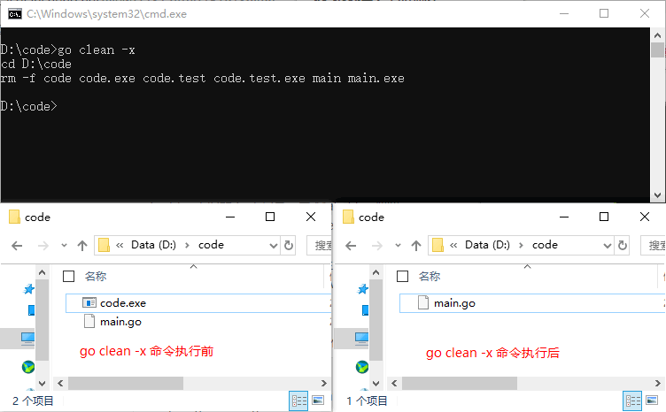

# Go Command

## go build 命令

Go 语言的编译速度非常快。Go 1.9 版本后默认利用 Go 语言的并发特性进行函数粒度的并发编译。

Go 语言的程序编写基本以源码方式，无论是自己的代码还是第三方代码，并且以 GOPATH 作为工作目录和一套完整的工程目录规则。因此 Go 语言中日常编译时无须像 C++ 一样配置各种包含路径、链接库地址等。

Go语言中使用 go build 命令主要用于编译代码。在包的编译过程中，若有必要，会同时编译与之相关联的包。

go build 有很多种编译方法，如无参数编译、文件列表编译、指定包编译等，使用这些方法都可以输出可执行文件。

### go build 无参数编译

本小节需要用到的代码具体位置是 `./src/chapter11/gobuild`。

代码相对于 GOPATH 的目录关系如下：

```
.
└── src
  └── chapter11
    └── gobuild
      ├── lib.go
      └── main.go
```

main.go 代码如下：

```go
package main

import (
	"fmt"
)

func main() {
	pkgFunc() // 同包的函数
	fmt.Println("hello world")
}

```

lib.go 代码如下：

```go
package main

import "fmt"

func pkgFunc() {
	fmt.Println("call pkgFunc")
}

```

如果源码中没有依赖 GOPATH 的包引用，那么这些源码可以使用无参数 go build。如下所示：
```bash
$ cd src/chapter11/gobuild/
$ go build
$ ls  # 编译这两个文件后，生成当前目录名的可执行文件并放置于当前目录下
gobuild lib.go main.go
$ ./gobuild
call pkgFunc
hello world
```

### go build 文件列表

编译同目录的多个源码文件时，可以在 go build 的后面提供多个文件名，go build 会编译这些源码，输出可执行文件。

在代码代码所在目录（./src/chapter11/gobuild）中使用 go build，在 go build 后添加要编译的源码文件名，代码如下：

```bash
$ go build main.go lib.go
$ ls
lib.go main main.go
$ ./main
call pkgFunc
hello world
$ go build lib.go main.go
$ ls
lib lib.go main main.go
```

1. 使用 go build 文件列表 方式编译时，可执行文件默认选择文件列表中第一个源码文件作为可执行文件名输出。

2. 如果需要指定输出可执行文件名，可以使用 `-o` 参数，参见下面的例子：

```bash
$ go build -o myexec main.go lib.go
$ ls
lib.go main.go myexec
$ ./myexec
call pkgFunc
hello world
```

3. 使用 go build 文件列表 编译方式编译时，文件列表中的每个文件必须是同一个包的 Go 源码。也就是说，不能像 C++ 一样将所有工程的 Go 源码使用文件列表方式进行编译。编译复杂工程时需要用“指定包编译”的方式。

4. go build 文件列表 方式更适合使用 Go 语言编写的只有少量文件的工具。

### go build package

go build package 在设置 GOPATH 后，可以直接根据包名进行编译，即便包内文件被增删也不影响编译指令。

本小节需要用到的代码具体位置是 `./src/chapter11/goinstall`。

相对于GOPATH的目录关系如下：

```bash
.
└── src
  └── chapter11
    └──goinstall
      ├── main.go
      └── mypkg
        └── mypkg.go
```

main.go 代码如下：

```go
package main

import (
	"chapter11/goinstall/mypkg"
	"fmt"
)

func main() {
	mypkg.CustomPkgFunc()
	fmt.Println("hello world")
}

```

mypkg.go 代码如下：

```go
package mypkg

import "fmt"

func CustomPkgFunc() {
	fmt.Println("call CustomPkgFunc")
}

```

执行以下命令将按包方式编译 goinstall 代码：

```bash
# 设置环境变量 GOPATH
$ export GOPATH=/home/davy/golangbook/code
$ go build -o main chapter11/goinstall
$ ./goinstall
call CustomPkgFunc
hello world
```

### go build 编译时的附加参数

go build 还有一些附加参数，可以显示更多的编译信息和更多的操作，详见下表所示。

| 附加参数 | 备  注                                      |
| -------- | ------------------------------------------- |
| -v       | 编译时显示包名                              |
| -p n     | 开启并发编译，默认情况下该值为 CPU 逻辑核数 |
| -a       | 强制重新构建                                |
| -n       | 打印编译时会用到的所有命令，但不真正执行    |
| -x       | 打印编译时会用到的所有命令                  |
| -race    | 开启竞态检测                                |


## go clean 命令

Go 语言中的 `go clean` 命令可以移除当前源码包和关联源码包里面编译生成的文件，这些文件包括以下几种：

- 执行 `go build` 命令时在当前目录下生成的与包名或者 Go 源码文件同名的可执行文件。在 Windows 下，则是与包名或者 Go 源码文件同名且带有 “.exe” 后缀的文件。
- 执行 `go test` 命令并加入 `-c` 标记时在当前目录下生成的以包名加 “.test” 后缀为名的文件。在 Windows 下，则是以包名加 “.test.exe” 后缀的文件。
- 执行 `go install` 命令安装当前代码包时产生的结果文件。如果当前代码包中只包含库源码文件，则结果文件指的就是在工作区 pkg 目录下相应的归档文件。如果当前代码包中只包含一个命令源码文件，则结果文件指的就是在工作区 bin 目录下的可执行文件。
- 在编译 Go 或 C 源码文件时遗留在相应目录中的文件或目录 。包括：“_obj” 和 “_test” 目录，名称为 “_testmain.go”、“test.out”、“build.out” 或 “a.out” 的文件，名称以 “.5”、“.6”、“.8”、“.a”、“.o” 或 “.so” 为后缀的文件。这些目录和文件是在执行 `go build` 命令时生成在临时目录中的。

`go clean` 命令就像 Java 中的 `maven clean` 命令一样，会清除掉编译过程中产生的一些文件。在 Java 中通常是 .class 文件，而在 Go 语言中通常是上面我们所列举的那些文件。

```bash
go clean -i -n
```

通过上面的示例可以看出，`go clean` 命令还可以指定一些参数。对应的参数的含义如下所示：

- -i 清除关联的安装的包和可运行文件，也就是通过 `go install` 安装的文件；
- -n 把需要执行的清除命令打印出来，但是不执行，这样就可以很容易的知道底层是如何运行的；
- -r 循环的清除在 import 中引入的包；
- -x 打印出来执行的详细命令，其实就是 -n 打印的执行版本；
- -cache 删除所有`go build`命令的缓存
- -testcache 删除当前包所有的测试结果

实际开发中 `go clean` 命令使用的可能不是很多，一般都是利用 `go clean` 命令清除编译文件，然后再将源码递交到 github 上，方便对于源码的管理。

下面我们以本地的一个项目为例，演示一下 `go clean` 命令：

```bash
go clean -n
cd D:\code
rm -f code code.exe code.test code.test.exe main main.exe
```

在命令中使用 `-n` 标记可以将命令的执行过程打印出来，但不会正真执行。如果既要打印命令的执行过程同时又执行命令的话可以使用 `-x` 标记，如下所示：

```bash
go clean -x
cd D:\code
rm -f code code.exe code.test code.test.exe main main.exe
```




## go run 命令

Python 或者 Lua 语言可以在不输出二进制的情况下，将代码使用虚拟机直接执行。Go 语言虽然不使用虚拟机，但可使用 `go run` 指令达到同样的效果。

`go run` 命令会编译源码，并且直接执行源码的 main() 函数，不会在当前目录留下可执行文件。

下面我们准备一个 main.go 的文件来观察 `go run` 的运行结果，源码如下：

```go
package main

import (
	"fmt"
	"os"
)

func main() {
	fmt.Println("args:", os.Args)
}

```

这段代码的功能是将输入的参数打印出来。使用 `go run` 运行这个源码文件，命令如下：

```bash
huzhi@huzhideMacBook-Pro test % go run test.go
args: [/var/folders/4f/gy92m6hd2xj3c6_yz0dht6880000gn/T/go-build400660524/b001/exe/test]
huzhi@huzhideMacBook-Pro test % go run test.go --filename xxx.go
args: [/var/folders/4f/gy92m6hd2xj3c6_yz0dht6880000gn/T/go-build167469940/b001/exe/test --filename xxx.go]
huzhi@huzhideMacBook-Pro test %

```

`go run` 不会在运行目录下生成任何文件，可执行文件被放在临时文件中被执行，工作目录被设置为当前目录。在 `go run` 的后部可以添加参数，这部分参数会作为代码可以接受的命令行输入提供给程序。

`go run` 不能使用 go run package 的方式进行编译，如需快速编译运行包，需要使用如下步骤来代替：

1. 使用 `go build` 生成可执行文件。
2. 运行可执行文件。


## go fmt 命令

对于一门编程语言来说，代码格式化是最容易引起争议的一个问题，不同的开发者可能会有不同的编码风格和习惯，但是如果所有开发者都能使用同一种格式来编写代码，那么开发者就可以将主要精力放在语言要解决的问题上，从而节省开发时间。

### gofmt 介绍

Go 语言的开发团队制定了统一的官方代码风格，并且推出了 gofmt 工具（gofmt 或 go fmt）来帮助开发者格式化他们的代码到统一的风格。

gofmt 是一个 cli 程序，会优先读取标准输入，如果传入了文件路径的话，会格式化这个文件，如果传入一个目录，会格式化目录中所有 .go 文件，如果不传参数，会格式化当前目录下的所有 .go 文件。

gofmt 默认不对代码进行简化，使用 `-s` 参数可以开启简化代码功能，具体来说会进行如下的转换：

#### 去除数组、切片、Map 初始化时不必要的类型声明

如下形式的切片表达式：

```go
[]T{T{}, T{}}
```

简化后的代码为：

```go
[]T{{}, {}}
```

#### 去除数组切片操作时不必要的索引指定

如下形式的切片表达式：

```go
s[a:len(s)]
```

简化后的代码为：

```go
s[a:]
```

#### 去除循环时非必要的变量赋值

如下形式的循环：

```go
for x, _ = range v {...}
```

简化后的代码为：

```go
for x = range v {...}
```

如下形式的循环：

```go
for _ = range v {...}
```

简化后的代码为：

```go
for range v {...}
```

gofmt 命令参数如下表所示：

| 标记名称 | 标记描述 |
| ------- | ------- |
| -l          | 仅把那些不符合格式化规范的、需要被命令程序改写的源码文件的绝对路径打印到标准输出。而不是把改写后的全部内容都打印到标准输出。 |
| -w          | 把改写后的内容直接写入到文件中，而不是作为结果打印到标准输出。 |
| -r          | 添加形如 “a[b:len(a)] -> a[b:]” 的重写规则。如果我们需要自定义某些额外的格式化规则，就需要用到它。 |
| -s          | 简化文件中的代码。                                           |
| -d          | 只把改写前后内容的对比信息作为结果打印到标准输出。而不是把改写后的全部内容都打印到标准输出。 命令程序将使用 diff 命令对内容进行比对。在 Windows 操作系统下可能没有 diff 命令，需要另行安装。 |
| -e          | 打印所有的语法错误到标准输出。如果不使用此标记，则只会打印每行的第 1 个错误且只打印前 10 个错误。 |
| -comments | 是否保留源码文件中的注释。在默认情况下，此标记会被隐式的使用，并且值为 true。 |
| -tabwidth   | 此标记用于设置代码中缩进所使用的空格数量，默认值为 8。要使此标记生效，需要使用“-tabs”标记并把值设置为 false。 |
| -tabs       | 是否使用 tab（'\t'）来代替空格表示缩进。在默认情况下，此标记会被隐式的使用，并且值为 true。 |
| -cpuprofile | 是否开启 CPU 使用情况记录，并将记录内容保存在此标记值所指的文件中。 |

可以看到 gofmt 命令还支持自定义的重写规则，使用 `-r` 参数，按照 pattern -> replacement 的格式传入规则。

【示例】有如下内容的 Golang 程序，存储在 main.go 文件中。

```go
package main

import "fmt"

func main() {
	a := 1
	b := 2
	c := a + b
	fmt.Println(c)
}

```

用以下规则来格式化上面的代码：

```bash
gofmt -w -r "a + b -> b + a" main.go
```

格式化的结果如下。

```go
package main

import "fmt"

func main() {
	a := 1
	b := 2
	c := b + a
	fmt.Println(c)
}

```

注意：gofmt 使用 tab 来表示缩进，并且对行宽度无限制，如果手动对代码进行了换行，gofmt 不会强制把代码格式化回一行。

### go fmt 和 gofmt

gofmt 是一个独立的 cli 程序，而 Go 语言中还有一个 `go fmt` 命令，`go fmt` 命令是 gofmt 的简单封装。

```bash
go help fmt
usage: go fmt [-n] [-x] [packages]

Fmt runs the command 'gofmt -l -w' on the packages named
by the import paths. It prints the names of the files that are modified.

For more about gofmt, see 'go doc cmd/gofmt'.
For more about specifying packages, see 'go help packages'.

The -n flag prints commands that would be executed.
The -x flag prints commands as they are executed.

To run gofmt with specific options, run gofmt itself.

See also: go fix, go vet.
```

`go fmt` 命令本身只有两个可选参数 `-n` 和 `-x`：

- `-n` 仅打印出内部要执行的 `go fmt` 的命令；
- `-x` 命令既打印出 `go fmt` 命令又执行它，如果需要更细化的配置，需要直接执行 gofmt 命令。

`go fmt` 在调用 gofmt 时添加了 `-l -w` 参数，相当于执行了 `gofmt -l -w`。


## go install 命令

go install 命令的功能和前面一节 go build 中介绍的 go build 命令类似，附加参数绝大多数都可以与 go build 通用。go install 只是将编译的中间文件放在 GOPATH 的 pkg 目录下，以及固定地将编译结果放在 GOPATH 的 bin 目录下。

这个命令在内部实际上分成了两步操作：第一步是生成结果文件（可执行文件或者 .a 包），第二步会把编译好的结果移到 $GOPATH/pkg 或者 $GOPATH/bin。

本小节需要用到的代码位置是 `./src/chapter11/goinstall`。

使用 go install 来执行代码，参考下面的 shell：

```bash
$ export GOPATH=/home/davy/golangbook/code
$ go install chapter11/goinstall
```

编译完成后的目录结构如下：

```bash
.
├── bin
│   └── goinstall
├── pkg
│   └── linux_amd64
│       └── chapter11
│           └── goinstall
│               └── mypkg.a
└── src
    └── chapter11
        ├── gobuild
        │   ├── lib.go
        │   └── main.go
        └── goinstall
            ├── main.go
            └── mypkg
                └── mypkg.go

```

go install 的编译过程有如下规律：

- go install 是建立在 GOPATH 上的，无法在独立的目录里使用 go install。
- GOPATH 下的 bin 目录放置的是使用 go install 生成的可执行文件，可执行文件的名称来自于编译时的包名。
- go install 输出目录始终为 GOPATH 下的 bin 目录，无法使用`-o`附加参数进行自定义。
- GOPATH 下的 pkg 目录放置的是编译期间的中间文件。


## go get 命令

go get 命令可以借助代码管理工具通过远程拉取或更新代码包及其依赖包，并自动完成编译和安装。整个过程就像安装一个 App 一样简单。

这个命令可以动态获取远程代码包，目前支持的有 BitBucket、GitHub、Google Code 和 Launchpad。在使用 go get 命令前，需要安装与远程包匹配的代码管理工具，如 Git、SVN、HG 等，参数中需要提供一个包名。

这个命令在内部实际上分成了两步操作：第一步是下载源码包，第二步是执行 go install。下载源码包的 go 工具会自动根据不同的域名调用不同的源码工具，所以为了 go get 命令能正常工作，你必须确保安装了合适的源码管理工具，并同时把这些命令加入你的 PATH 中。

参数介绍：

- -d 只下载不安装
- -f 只有在你包含了 -u 参数的时候才有效，不让 -u 去验证 import 中的每一个都已经获取了，这对于本地 fork 的包特别有用
- -fix 在获取源码之后先运行 fix，然后再去做其他的事情
- -t 同时也下载需要为运行测试所需要的包
- -u 强制使用网络去更新包和它的依赖包
- -v 显示执行的命令

### 远程包的路径格式

Go 语言的代码被托管于 Github.com 网站，该网站是基于 Git 代码管理工具的，很多有名的项目都在该网站托管代码。其他类似的托管网站还有 code.google.com、bitbucket.org 等。

这些网站的项目包路径都有一个共同的标准，参见下图所示。


图中的远程包路径是 Go语言的源码，这个路径共由 3 个部分组成：

- 网站域名：表示代码托管的网站，类似于电子邮件 @ 后面的服务器地址。
- 作者或机构：表明这个项目的归属，一般为网站的用户名，如果需要找到这个作者下的所有项目，可以直接在网站上通过搜索“域名/作者”进行查看。这部分类似于电子邮件 @ 前面的部分。
- 项目名：每个网站下的作者或机构可能会同时拥有很多的项目，图中标示的部分表示项目名称。

### go get package

默认情况下，go get 可以直接使用。例如，想获取 go 的源码并编译，使用下面的命令行即可：

```bash
$ go get github.com/davyxu/cellnet
```

获取前，请确保 GOPATH 已经设置。Go 1.8 版本之后，GOPATH 默认在用户目录的 go 文件夹下。

cellnet 只是一个网络库，并没有可执行文件，因此在 go get 操作成功后 GOPATH 下的 bin 目录下不会有任何编译好的二进制文件。

需要测试获取并编译二进制的，可以尝试下面的这个命令。当获取完成后，就会自动在 GOPATH 的 bin 目录下生成编译好的二进制文件。

```bash
$ go get github.com/davyxu/tabtoy
```

### go get 使用时的附加参数

使用 go get 时可以配合附加参数显示更多的信息及实现特殊的下载和安装操作，详见下表所示。

| 附加参数  | 备  注                                 |
| --------- | -------------------------------------- |
| -v        | 显示操作流程的日志及信息，方便检查错误 |
| -u        | 下载丢失的包，但不会更新已经存在的包   |
| -d        | 只下载，不安装                         |
| -insecure | 允许使用不安全的 HTTP 方式进行下载操作 |


## go generate 命令

`go generate` 命令是在 Go 语言 1.4 版本里面新添加的一个命令，当运行该命令时，它将扫描与当前包相关的源代码文件，找出所有包含 `//go:generate` 的特殊注释，提取并执行该特殊注释后面的命令。

使用 `go generate` 命令时有以下几点需要注意：

- 该特殊注释必须在 .go 源码文件中；
- 每个源码文件可以包含多个 generate 特殊注释；
- 运行 `go generate` 命令时，才会执行特殊注释后面的命令；
- 当 `go generate` 命令执行出错时，将终止程序的运行；
- 特殊注释必须以 `//go:generate` 开头，双斜线后面没有空格。

在下面这些场景下，我们会使用 `go generate` 命令：

- yacc：从 .y 文件生成 .go 文件；
- protobufs：从 protocol buffer 定义文件（.proto）生成 .pb.go 文件；
- Unicode：从 UnicodeData.txt 生成 Unicode 表；
- HTML：将 HTML 文件嵌入到 go 源码；
- bindata：将形如 JPEG 这样的文件转成 go 代码中的字节数组。

再比如：

- string 方法：为类似枚举常量这样的类型生成 String() 方法；
- 宏：为既定的泛型包生成特定的实现，比如用于 ints 的 sort.Ints。

`go generate` 命令格式如下所示：

```bash
go generate [-run regexp] [-n] [-v] [-x] [command] [build flags] [file.go... | packages]
```

参数说明如下：

- -run 正则表达式匹配命令行，仅执行匹配的命令；
- -v 输出被处理的包名和源文件名；
- -n 显示不执行命令；
- -x 显示并执行命令；
- command 可以是在环境变量 PATH 中的任何命令。

执行 `go generate` 命令时，也可以使用一些环境变量，如下所示:

- $GOARCH 体系架构（arm、amd64 等）；
- $GOOS 当前的 OS 环境（linux、windows 等）；
- $GOFILE 当前处理中的文件名；
- $GOLINE 当前命令在文件中的行号；
- $GOPACKAGE 当前处理文件的包名；
- $DOLLAR 固定的`$`

【示例 1】假设我们有一个 main.go 文件，内容如下：

```go
package main

import "fmt"

//go:generate go run main.go
//go:generate go version
func main() {
	fmt.Println("http://c.biancheng.net/golang/")
}

```

执行 `go generate -x` 命令，输出结果如下：

```bash
go generate -x
go run main.go
http://c.biancheng.net/golang/
go version
go version go1.13.6 windows/amd64
```

通过运行结果可以看出 `//go:generate` 之后的命令成功运行了，命令中使用的 `-x` 参数是为了将执行的具体命令同时打印出来。

下面通过 stringer 工具来演示一下 `go generate` 命令的使用。

stringer 并不是Go语言自带的工具，需要手动安装。我们可以通过下面的命令来安装 stringer 工具。

```bash
go get golang.org/x/tools/cmd/stringer
```

上面的命令需要翻墙。条件不允许的话也可以通过 Github 上的镜像来安装，安装方法如下：

```bash
git clone https://github.com/golang/tools/ $GOPATH/src/golang.org/x/tools
go install golang.org/x/tools/cmd/stringer
```

安装好的 stringer 工具位于 GOPATH/bin 目录下，想要正常使用它，需要先将 GOPATH/bin 目录添加到系统的环境变量 PATH 中。

【示例 2】使用 stringer 工具实现 String() 方法：

首先，在项目目录下新建一个 painkiller 文件夹，并在该文件夹中创建 painkiller.go 文件，文件内容如下：

```go
//go:generate stringer -type=Pill
package painkiller

type Pill int

const (
	Placebo Pill = iota
	Aspirin
	Ibuprofen
	Paracetamol
	Acetaminophen = Paracetamol
)

```

然后，在 painkiller.go 文件所在的目录下运行 `go generate` 命令。

执行成功后没有任何提示信息，但会在当前目录下面生成一个 pill_string.go 文件，文件中实现了我们需要的 String() 方法，文件内容如下：

```go

```


## go test 命令

Go 语言拥有一套单元测试和性能测试系统，仅需要添加很少的代码就可以快速测试一段需求代码。

go test 命令，会自动读取源码目录下面名为 `*_test.go` 的文件，生成并运行测试用的可执行文件。输出的信息类似下面所示的样子：

```bash
ok archive/tar 0.011s
FAIL archive/zip 0.022s
ok compress/gzip 0.033s
...
```

性能测试系统可以给出代码的性能数据，帮助测试者分析性能问题。

### 提示

单元测试（unit testing），是指对软件中的最小可测试单元进行检查和验证。对于单元测试中单元的含义，一般要根据实际情况去判定其具体含义，如 C 语言中单元指一个函数，Java 里单元指一个类，图形化的软件中可以指一个窗口或一个菜单等。总的来说，单元就是人为规定的最小的被测功能模块。

单元测试是在软件开发过程中要进行的最低级别的测试活动，软件的独立单元将在与程序的其他部分相隔离的情况下进行测试。

### 单元测试——测试和验证代码的框架

要开始一个单元测试，需要准备一个 go 源码文件，在命名文件时需要让文件必须以 `_test` 结尾。默认的情况下，`go test` 命令不需要任何的参数，它会自动把你源码包下面所有 test 文件测试完毕，当然你也可以带上参数。

这里介绍几个常用的参数：

- -bench regexp 执行相应的 benchmarks，例如 -bench=.；
- -cover 开启测试覆盖率；
- -run regexp 只运行 regexp 匹配的函数，例如 -run=Array 那么就执行包含有 Array 开头的函数；
- -v 显示测试的详细命令。

单元测试源码文件可以由多个测试用例组成，每个测试用例函数需要以 `Test` 为前缀，例如：

```go
func TestXXX( t *testing.T )
```

- 测试用例文件不会参与正常源码编译，不会被包含到可执行文件中。
- 测试用例文件使用 `go test` 指令来执行，没有也不需要 main() 作为函数入口。所有在以`_test` 结尾的源码内以 `Test` 开头的函数会自动被执行。
- 测试用例可以不传入 *testing.T 参数。


helloworld 的测试代码（具体位置是 `./src/chapter11/gotest/helloworld_test.go`）：

```go
package code11_3

import "testing"

func TestHelloWorld(t *testing.T) {
	t.Log("hello world")
}

```

代码说明如下：

- 单元测试文件 (*_test.go) 里的测试入口必须以 Test 开始，参数为 *testing.T 的函数。一个单元测试文件可以有多个测试入口。
- 使用 testing 包的 T 结构提供的 Log() 方法打印字符串。

#### 单元测试命令行

单元测试使用 go test 命令启动，例如：

```bash
$ go test helloworld_test.go
ok          command-line-arguments        0.003s
$ go test -v helloworld_test.go
=== RUN   TestHelloWorld
--- PASS: TestHelloWorld (0.00s)
        helloworld_test.go:8: hello world
PASS
ok          command-line-arguments        0.004s
```

#### 运行指定单元测试用例

`go test` 指定文件时默认执行文件内的所有测试用例。可以使用 `-run` 参数选择需要的测试用例单独执行，参考下面的代码。

一个文件包含多个测试用例（具体位置是 `./src/chapter11/gotest/select_test.go`）

```go
package code11_3

import "testing"

func TestA(t *testing.T) {
	t.Log("A")
}

func TestAK(t *testing.T) {
	t.Log("AK")
}

func TestB(t *testing.T) {
	t.Log("B")
}

func TestC(t *testing.T) {
	t.Log("C")
}

```

这里指定 TestA 进行测试：

```bash
$ go test -v -run TestA select_test.go
=== RUN   TestA
--- PASS: TestA (0.00s)
        select_test.go:6: A
=== RUN   TestAK
--- PASS: TestAK (0.00s)
        select_test.go:10: AK
PASS
ok          command-line-arguments        0.003s
```

TestA 和 TestAK 的测试用例都被执行，原因是 `-run` 跟随的测试用例的名称支持正则表达式，使用 `-run TestA$` 即可只执行 TestA 测试用例。

#### 标记单元测试结果

当需要终止当前测试用例时，可以使用 FailNow，参考下面的代码。

测试结果标记（具体位置是 `./src/chapter11/gotest/fail_test.go`）

```go
func TestFailNow(t *testing.T) {
	t.FailNow()
}
```

还有一种只标记错误不终止测试的方法，代码如下：

```go
func TestFail(t *testing.T) {

	fmt.Println("before fail")

	t.Fail()

	fmt.Println("after fail")
}
```

测试结果如下：

```bash
=== RUN   TestFail
before fail
after fail
--- FAIL: TestFail (0.00s)
FAIL
exit status 1
FAIL        command-line-arguments        0.002s
```

从日志中看出，第 5 行调用 Fail() 后测试结果标记为失败，但是第 7 行依然被程序执行了。

#### 单元测试日志

每个测试用例可能并发执行，使用 testing.T 提供的日志输出可以保证日志跟随这个测试上下文一起打印输出。testing.T 提供了几种日志输出方法，详见下表所示。

| 方  法 | 备  注                           |
| ------ | -------------------------------- |
| Log    | 打印日志，同时结束测试           |
| Logf   | 格式化打印日志，同时结束测试     |
| Error  | 打印错误日志，同时结束测试       |
| Errorf | 格式化打印错误日志，同时结束测试 |
| Fatal  | 打印致命日志，同时结束测试       |
| Fatalf | 格式化打印致命日志，同时结束测试 |

开发者可以根据实际需要选择合适的日志。

### 基准测试——获得代码内存占用和运行效率的性能数据

基准测试可以测试一段程序的运行性能及耗费 CPU 的程度。Go 语言中提供了基准测试框架，使用方法类似于单元测试，使用者无须准备高精度的计时器和各种分析工具，基准测试本身即可以打印出非常标准的测试报告。

#### 基础测试基本使用

下面通过一个例子来了解基准测试的基本使用方法。

基准测试（具体位置是 `./src/chapter11/gotest/benchmark_test.go`）

```go
package code11_3

import "testing"

func Benchmark_Add(b *testing.B) {
	var n int
	for i := 0; i < b.N; i++ {
		n++
	}
}

```

这段代码使用基准测试框架测试加法性能。`b.N` 由基准测试框架提供。测试代码需要保证函数可重入性及无状态，也就是说，测试代码不使用全局变量等带有记忆性质的数据结构。避免多次运行同一段代码时的环境不一致，不能假设 N 值范围。

使用如下命令行开启基准测试：

```bash
$ go test -v -bench=. benchmark_test.go
goos: linux
goarch: amd64
Benchmark_Add-4           20000000         0.33 ns/op
PASS
ok          command-line-arguments        0.700s
```

代码说明如下：

- `-bench=.` 表示运行 benchmark_test.go 文件里的所有基准测试，和单元测试中的 `-run` 类似。
- Benchmark_Add-4 是基准测试名称，2000000000 表示测试的次数，也就是 testing.B 结构中提供给程序使用的 N。“0.33 ns/op” 表示每一个操作耗费多少时间（纳秒）。

注意：Windows 下使用 go test 命令行时，`-bench=.` 应写为 `-bench="."`。

#### 基准测试原理

基准测试框架对一个测试用例的默认测试时间是 1 秒。开始测试时，当以 Benchmark 开头的基准测试用例函数返回时还不到 1 秒，那么 testing.B 中的 N 值将按 1、2、5、10、20、50……递增，同时以递增后的值重新调用基准测试用例函数。

#### 自定义测试时间

通过 `-benchtime` 参数可以自定义测试时间，例如：

```bash
$ go test -v -bench=. -benchtime=5s benchmark_test.go
goos: linux
goarch: amd64
Benchmark_Add-4           10000000000                 0.33 ns/op
PASS
ok          command-line-arguments        3.380s
```

#### 测试内存

基准测试可以对一段代码可能存在的内存分配进行统计，下面是一段使用字符串格式化的函数，内部会进行一些分配操作。

```go
func Benchmark_Alloc(b *testing.B) {

	for i := 0; i < b.N; i++ {
		fmt.Sprintf("%d", i)
	}
}
```

在命令行中添加 `-benchmem` 参数以显示内存分配情况，参见下面的指令：

```bash
$ go test -v -bench=Alloc -benchmem benchmark_test.go
goos: linux
goarch: amd64
Benchmark_Alloc-4 20000000 109 ns/op 16 B/op 2 allocs/op
PASS
ok          command-line-arguments        2.311s
```

代码说明如下：

- `-bench` 后添加了  Alloc，指定只测试 Benchmark_Alloc() 函数。
- “16 B/op” 表示每一次调用需要分配 16 个字节，“2 allocs/op” 表示每一次调用有两次分配。

开发者根据这些信息可以迅速找到可能的分配点，进行优化和调整。

#### 控制计时器

有些测试需要一定的启动和初始化时间，如果从 Benchmark() 函数开始计时会很大程度上影响测试结果的精准性。testing.B 提供了一系列的方法可以方便地控制计时器，从而让计时器只在需要的区间进行测试。我们通过下面的代码来了解计时器的控制。

基准测试中的计时器控制（具体位置是 `./src/chapter11/gotest/benchmark_test.go`）：

```go
import "testing"

func Benchmark_Add_TimerControl(b *testing.B) {

	// 重置计时器
	b.ResetTimer()

	// 停止计时器
	b.StopTimer()

	// 开始计时器
	b.StartTimer()

	var n int
	for i := 0; i < b.N; i++ {
		n++
	}
}

```

从 Benchmark() 函数开始，Timer 就开始计数。StopTimer() 可以停止这个计数过程，做一些耗时的操作，通过 StartTimer() 重新开始计时。ResetTimer() 可以重置计数器的数据。

计数器内部不仅包含耗时数据，还包括内存分配的数据。


## go pprof 命令

Go 语言工具链中的 go pprof 可以帮助开发者快速分析及定位各种性能问题，如 CPU 消耗、内存分配及阻塞分析。

性能分析首先需要使用 runtime.pprof 包嵌入到待分析程序的入口和结束处。runtime.pprof 包在运行时对程序进行每秒 100 次的采样，最少采样 1 秒。然后将生成的数据输出，让开发者写入文件或者其他媒介上进行分析。

go pprof 工具链配合 Graphviz 图形化工具可以将 runtime.pprof 包生成的数据转换为 PDF 格式，以图片的方式展示程序的性能分析结果。

### 安装第三方图形化显式分析数据工具（Graphviz）

Graphviz 是一套通过文本描述的方法生成图形的工具包。描述文本的语言叫做 DOT。

在 [www.graphviz.org](http://www.graphviz.org/) 网站可以获取到最新的 Graphviz 各平台的安装包。

CentOS 下，可以使用 yum 指令直接安装：

```bash
$ yum install graphiviz
```

## 安装第三方性能分析来分析代码包

runtime.pprof 提供基础的运行时分析的驱动，但是这套接口使用起来还不是太方便，例如：

- 输出数据使用 io.Writer 接口，虽然扩展性很强，但是对于实际使用不够方便，不支持写入文件。
- 默认配置项较为复杂。

很多第三方的包在系统包 runtime.pprof 的技术上进行便利性封装，让整个测试过程更为方便。这里使用 github.com/pkg/profile 包进行例子展示，使用下面代码安装这个包：

```bash
$ go get github.com/pkg/profile
```

### 性能分析代码

下面代码故意制造了一个性能问题，同时使用 github.com/pkg/profile 包进行性能分析。

基准测试代码如下（具体文件：`./src/chapter11/profile/cpu.go`）：

```go
package main

import (
	"time"

	"github.com/pkg/profile"
)

func joinSlice() []string {

	var arr []string

	for i := 0; i < 100000; i++ {
		// 故意造成多次的切片添加(append)操作, 由于每次操作可能会有内存重新分配和移动, 性能较低
		arr = append(arr, "arr")
	}

	return arr
}

func main() {
	// 开始性能分析, 返回一个停止接口
	stopper := profile.Start(profile.CPUProfile, profile.ProfilePath("."))

	// 在main()结束时停止性能分析
	defer stopper.Stop()

	// 分析的核心逻辑
	joinSlice()

	// 让程序至少运行1秒
	time.Sleep(time.Second)
}

```

代码说明如下：

- 为了进行性能分析，这里在已知元素大小的情况下，还是使用 append() 函数不断地添加切片。性能较低，在实际中应该避免，这里为了性能分析，故意这样写。
- 使用 profile.Start 调用 github.com/pkg/profile 包的开启性能分析接口。这个 Start 函数的参数都是可选项，这里需要指定的分析项目是 profile.CPUProfile，也就是 CPU 耗用。profile.ProfilePath(".") 指定输出的分析文件路径，这里指定为当前文件夹。profile.Start() 函数会返回一个 Stop 接口，方便在程序结束时结束性能分析。
- 使用 defer，将性能分析在 main() 函数结束时停止。
- 为了保证性能分析数据的合理性，分析的最短时间是 1 秒，使用 time.Sleep() 在程序结束前等待 1 秒。如果你的程序默认可以运行 1 秒以上，这个等待可以去掉。

性能分析需要可执行文件配合才能生成分析结果，因此使用命令行对程序进行编译，代码如下：

```bash
$ go build -o cpu cpu.go
$ ./cpu
$ go tool pprof --pdf cpu cpu.pprof > cpu.pdf
```

代码说明如下：


- 使用 go tool 工具链输入 cpu.pprof 和 cpu 可执行文件，生成 PDF 格式的输出文件，将输出文件重定向为 cpu.pdf 文件。这个过程中会调用 Graphviz 工具，Windows 下需将 Graphviz 的可执行目录添加到环境变量 PATH 中。

最终生成 cpu.pdf 文件，使用 PDF 查看器打开文件，观察后发现下图所示的某个地方可能存在瓶颈。


图中的每一个框为一个函数调用的路径，第 3 个方框中 joinSlice 函数耗费了 50% 的 CPU 时间，存在性能瓶颈。重新优化代码，在已知切片元素数量的情况下直接分配内存，代码如下：

```go
func joinSlice() []string {

	const count = 100000

	var arr []string = make([]string, count)

	for i := 0; i < count; i++ {
		arr[i] = "arr"
	}

	return arr
}

```

代码说明如下：

- 将切片预分配 count 个数量，避免之前使用 append() 函数的多次分配。
- 预分配后，直接对每个元素进行直接赋值。

重新运行上面的代码进行性能分析，最终得到的 cpu.pdf 中将不会再有耗时部分。


