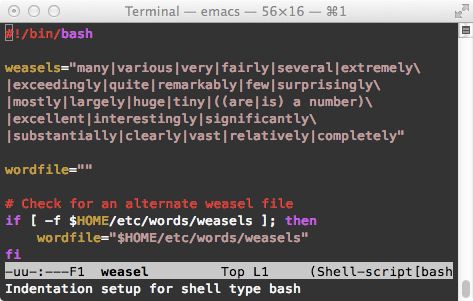
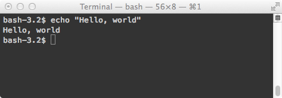

# Shell programming with bash: by example, by counter-example

* https://matt.might.net/articles/bash-by-example/

As an interactive shell, bash is a terse language for initiating and directing computations.  作为交互式 shell，bash 是一种用于启动和指导计算的简洁语言。

As a scripting language, bash is a domain-specific language for manipulating and composing processes and files.  作为一种脚本语言，bash 是一种特定于域的语言，用于操作和组合进程和文件。



Bash is baroque. Bash is brittle. Bash is indispensable.  Bash 是巴洛克风格。 巴什很脆弱。 Bash 是必不可少的。

Bash was not designed.  Bash 不是设计的。

It's not fair to say that bash has evolved either: it retains and utilizes all of its vestigial appendages.  说 bash 也进化了也不公平：它保留并利用了所有残留的附属物。

Read on for my brief example-driven guide to bash, including coverage of:  请继续阅读我的简短示例驱动的 bash 指南，包括：

- variables and arrays;  变量和数组；
- operations on variables;  变量操作；
- subtle quirks like `*` versus `@`;  微妙的怪癖，例如 `*` 与 `@`；
- arithmetic;  算术;
- strings;  字符串；
- scope;  范围;
- files and redirection;  文件和重定向；
- pipes;  管道；
- processes;  流程；
- patterns;  模式；
- control structures;  控制结构；
- pitfalls.  陷阱。

I've tried to make this a one-shot introduction, covering all of the common, and a good fragment of the advanced.  我试图把它作为一个一次性的介绍，涵盖所有常见的，以及高级的一个很好的片段。

If you're new to Unix and/or shell programming, I advise starting with:  如果您不熟悉 Unix 和/或 shell 编程，我建议您从以下内容开始：

- [A survival guide for Unix](http://matt.might.net/articles/basic-unix/); and/or
- [Settling into Unix](http://matt.might.net/articles/settling-into-unix/).

------

## What is bash?

Bash is an interactive shell:



You type in commands.  你输入命令。

Bash executes them.  Bash 执行它们。

Unix users spend a lot of time manipulating files at the shell.  Unix 用户花费大量时间在 shell 上操作文件。

As a shell, it is directly available via the terminal in both Mac OS X (Applications > Utilities) and Linux/Unix.  作为 shell，它可以通过 Mac OS X（应用程序 > 实用程序）和 Linux/Unix 中的终端直接使用。

At the same time, bash is also a scripting language:  同时，bash 也是一种脚本语言：


Bash scripts can automate routine or otherwise arduous tasks involved in systems administration.  Bash 脚本可以自动化系统管理中涉及的日常或其他艰巨任务。

## Why use bash?

Here are example tasks for which you might use bash:  以下是您可能会使用 bash 的示例任务：

- Orchestrating system start-up/shutdown tasks.  编排系统启动/关闭任务。
- Automatically renaming a collection of files.  自动重命名文件集合。
- Finding all duplicate mp3s on a hard drive.  查找硬盘上所有重复的 mp3。
- Orchestrating a suite of tools for cracking a password database.  编排一套破解密码数据库的工具。
- [Finding weasel words](http://matt.might.net/articles/shell-scripts-for-passive-voice-weasel-words-duplicates/) in your writing.  在你的写作中寻找狡猾的词。
- [Implementing a relational database](http://matt.might.net/articles/sql-in-the-shell/) out of text files.  从文本文件中实现关系数据库。
- Simplifying configuration and reconfiguration of software.  简化软件的配置和重新配置。

## Bash as a scripting language

To create a bash script, you place `#!/bin/bash` at the top of the file.

Then, change the permissions on the file to make it executable:

```bash
$ chmod u+x scriptname
```

To execute the script from the current directory, you can run `./scriptname` and pass any parameters you wish.

When the shell executes a script, it finds the `#!/path/to/interpreter`.

It then runs the interpreter (in this case, `/bin/bash`) on the file itself.

The `#!` convention is why so many scripting languages use `#` for comments.

Here's an example bash script that prints out the first argument:

```bash
#!/bin/bash

# Use $1 to get the first argument:

echo $0
echo $1
echo $2
echo $3

# $ ./first.sh a b c d e
# ./first.sh
# a
# b
# c
```

### Comments

Comments in bash begin with `#` and run to the end of the line:

```
echo Hello, World. # prints out "Hello, World."
```

### Variables/Arrays

Variables in bash have a dual nature as both arrays and variables.  bash 中的变量具有数组和变量的双重性质。

To set a variable, use `=`:

```
foo=3  # sets foo to 3
```

But, be sure to avoid using spaces:

```
foo = 3 # error: invokes command `foo' with arguments `=' and `3'
```

If you want to use a space, you can dip into the expression sub-language that exists inside `((` and `))`:

```
(( foo = 3 )) # Sets foo to 3.
```

To reference the value of a variable, use a dollar sign, `$`:

```
echo $foo ; # prints the value of foo to stdout
```

You can delete a variable with `unset`:

```
foo=42
echo $foo    # prints 42
unset foo
echo $foo    # prints nothing
```

Of course, you can assign one variable to another:

```
foo=$bar # assigns the value of $bar to foo.
```

If you want to assign a value which contains spaces, be sure to quote it:

```
# wrong:
foo=x y z # sets foo to x; will try to execute y on z

# right:
foo="x y z" # sets foo to "x y z"
```

It is sometimes necessary to wrap a reference to a variable is braces:

```
echo ${foo} # prints "x y z"
```
This notation is necessary for variable operations and arrays.

There is no need to declare a variable as an array: every variable is an array.

You can start using any variable as an array:

```
foo[0]="first"  # sets the first element to "first"
foo[1]="second" # sets the second element to "second"
```

To reference an index, use the braces notation:

```
foo[0]="one"
foo[1]="two"
echo ${foo[1]}  # prints "two"
```

When you reference a variable, it is an implicit reference to the first index:

```
foo[0]="one"
foo[1]="two"
echo $foo       # prints "one"
```

You can also use parentheses to create an array:

```
foo=("a a a" "b b b" "c c c")
echo ${foo[2]}  # prints "c c c"
echo $foo       # prints "a a a"
```

To access all of the values in an array, use the special subscript `@` or `*`:

```
array=(a b c)
echo $array       # prints a
echo ${array[@]}  # prints a b c
echo ${array[*]}  # prints a b c
```

To copy an array, use subscript `@`, surround it with quotes, and surround that with parentheses:

```
foo=(a b c)
bar=("${foo[@]}")
echo ${bar[@]}    # prints a b c
echo ${bar[1]}    # prints b
```

Do not try to copy with just the variable:

```
foo=(a b c)
bar=$foo
echo ${bar[1]}    # prints nothing
```

And, do not forget the quotes, or else arrays with space-containing elements will be screwed up:

```
foo=("a 1" "b 2" "c 3")
bar=(${foo[@]})
baz=("${foo[@]}")
echo ${bar[1]}            # oops, print "1"
echo ${baz[1]}            # prints "b 2"
```

#### Special variables

There are special bash variables for grabbing arguments to scripts and functions:

```
echo $0      # prints the script name
echo $1      # prints the first argument
echo $2      # prints the second argument
echo $9      # prints the ninth argument
echo $10     # prints the first argument, followed by 0
echo ${10}   # prints the tenth argument
echo $#      # prints the number of arguments
```

The variable `$?` holds the "exit status" of the previously executed process.

An exit status of 0 indicates the process "succeeded" without error.

An exit status other than 0 indicates an error.

In shell programming, `true` is a program that always "succeeds," and `false` is a program that always "fails":

```
true
echo $?   # prints 0
false
echo $?   # will never print 0; usually prints 1
```

The process id of the current shell is available as `$$`

The process id of the most recently backgrounded process is available as `$!`:

```
# sort two files in parallel:

sort words > sorted-words &        # launch background process
p1=$!
sort -n numbers > sorted-numbers & # launch background process
p2=$!
wait $p1
wait $p2
echo Both files have been sorted.
```

#### Operations on variables

In a feature unique among many languages, bash can operate on the value of a variable *while* dereferencing that variable.  在许多语言中独一无二的功能中，bash 可以在取消引用该变量的同时对变量的值进行操作。

##### String replacement

Bash can replace a string with another string:

```
foo="I'm a cat."
echo ${foo/cat/dog}  # prints "I'm a dog."
```

To replace *all* instances of a string, use double slashes:

```
foo="I'm a cat, and she's cat."
echo ${foo/cat/dog}   # prints "I'm a dog, and she's a cat."
echo ${foo//cat/dog}  # prints "I'm a dog, and she's a dog."
```

These operations generally do not modify the variable:

```
foo="hello"
echo ${foo/hello/goodbye}  # prints "goodbye"
echo $foo                  # still prints "hello"
```

Without a replacement, it deletes:

```
foo="I like meatballs."
echo ${foo/balls}       # prints I like meat.
```

The `${name#pattern}` operation removes the shortest prefix of `${name}` matching pattern, while `##` removes the longest:

```
minipath="/usr/bin:/bin:/sbin"
echo ${minipath#/usr}           # prints /bin:/bin:/sbin
echo ${minipath#*/bin}          # prints :/bin:/sbin
echo ${minipath##*/bin}         # prints :/sbin
```

The operator `%` is the same, except for suffixes instead of prefixes:

```
minipath="/usr/bin:/bin:/sbin"
echo ${minipath%/usr*}           # prints nothing
echo ${minipath%/bin*}           # prints /usr/bin:
echo ${minipath%%/bin*}          # prints /usr
```

##### String/array manipulation  字符串/数组操作

Bash has operators that operate on both arrays and strings.  Bash 具有对数组和字符串都进行操作的运算符。

For instance, the prefix operator `#` counts the number of characters in a string or the number of elements in an array.  例如，前缀运算符 # 计算字符串中的字符数或数组中的元素数。

> It is a common mistake to accidentally operate on the first element of an array as a string, when the intent was to operate on the array.  当意图对数组进行操作时，意外地将数组的第一个元素作为字符串操作是一个常见的错误。

Even the [Bash Guide for Beginners](http://www.tldp.org/LDP/Bash-Beginners-Guide/html/sect_10_03.html) contains a misleading example:  甚至 Bash 初学者指南也包含一个误导性示例：

```
ARRAY=(one two three)
echo ${#ARRAY}          # prints 3 -- the length of the array?
```

However, if we modify the example slightly, it seems to break:

```
ARRAY=(a b c)
echo ${#ARRAY}          # prints 1
```

This is because `${#ARRAY}` is the same as `${#ARRAY[0]}`, which counts the number of characters in the first element, `a`.

It is possible to count the number of elements in the array, but the array must be specified explicitly with `@`:

```
ARRAY=(a b c)
echo ${#ARRAY[@]}      # prints 3
```

It is also possible to slice strings and arrays:

```
string="I'm a fan of dogs."
echo ${string:6:3}           # prints fan
array=(a b c d e f g h i j)
echo ${array[@]:3:2}         # prints d e
```

##### Existence testing

Some operations test whether the variable is set:

```
unset username
echo ${username-default}        # prints default
username=admin
echo ${username-default}        # prints admin
```

For operations that test whether a variable is set, they can be forced to check whether the variable is set **and** not empty by adding a colon ("`:`"):

```
unset foo
unset bar
echo ${foo-abc}   # prints abc
echo ${bar:-xyz}  # prints xyz
foo=""
bar=""
echo ${foo-123}   # prints nothing
echo ${bar:-456}  # prints 456
```

The operator `=` (or `:=`) is like the operator `-`, except that it also sets the variable if it had no value:

```
unset cache
echo ${cache:=1024}   # prints 1024
echo $cache           # prints 1024
echo ${cache:=2048}   # prints 1024
echo $cache           # prints 1024
```

The `+` operator yields its value if the variable is set, and nothing otherwise:  如果设置了变量，`+` 运算符会产生它的值，否则不会：

```
unset foo
unset bar
foo=30
echo ${foo+42}    # prints 42
echo ${bar+1701}  # prints nothing
```

The operator `?` crashes the program with the specified message if the variable is not set:  如果未设置变量，`?` 使用指定的消息使程序崩溃：

```
: ${1?failure: no arguments} # crashes the program if no first argument
```

(The `:` command ignores all of its arguments, and is equivalent to `true`. [参考](https://www.cyberciti.biz/tips/howto-setting-default-values-for-shell-variables.html))

##### Indirect look-up

Bash allows indirect variable/array look-up with the `!` prefix operator.

That is, `${!expr}` behaves like `${${expr}}`, if only that worked:

```
foo=bar
bar=42

echo ${foo}   # prints "bar"
echo ${!foo}  # prints $bar, which is 42
alpha=(a b c d e f g h i j k l m n o p q r s t u v w x y z)
char=alpha[12]
echo ${char}  # prints "alpha[12]"
echo ${!char} # prints ${alpha[12]}, which is m
```

#### Array quirks: * versus @

There are two additional special variables: `$*` and `$@`.  还有两个额外的特殊变量：`$*` 和 `$@`。

[All of the behaviors described in this section apply to arrays when accesed via `${array[*]}` or `${array[@]}` as well.]  [当通过 `${array[*]}` 或 `${array[@]}` 访问时，本节中描述的所有行为也适用于数组。]

The both seem to contain the arguments passed to the current script/procedure, but they have subtly different behavior when quoted:  两者似乎都包含传递给当前脚本/过程的参数，但引用时它们的行为略有不同：

To illustrate the difference, we need to create a couple helper scripts.  为了说明差异，我们需要创建几个帮助脚本。

First, create `print12`:

```
#!/bin/bash
# prints the first parameter, then the second:
echo "first:  $1"
echo "second: $2"
```

Then, create `showargs`:

```
#!/bin/bash
echo $0
echo \$\1: ===========$1===========
echo \$\2: ===========$2===========
echo \$\3: ===========$3===========
echo \"\$\1\": ==========="$1"===========
echo \"\$\2\": ==========="$2"===========
echo \"\$\3\": ==========="$3"===========

# "参数1 参数2 参数3 ..."
echo \$\*: ===========$*===========
# "参数1" "参数2" "参数3" ...
echo \$\@: ===========$@===========

echo "$*"
echo \"\$\*\": ==========="$*"===========
echo "$@"
echo \"\$\@\": ==========="$@"===========

bash print12.sh "$*"
bash print12.sh "$@"

# $ bash showargs.sh 0 "  1    2  3  "
# showargs.sh
# $1: ===========0===========
# $2: =========== 1 2 3 ===========
# $3: ======================
# "$1": ===========0===========
# "$2": ===========  1    2  3  ===========
# "$3": ======================
# $*: ===========0 1 2 3 ===========
# $@: ===========0 1 2 3 ===========
# 0   1    2  3
# "$*": ===========0   1    2  3  ===========
# 0   1    2  3
# "$@": ===========0   1    2  3  ===========
# first: ===========0   1    2  3  ===========
# second: ======================
# first: ===========0===========
# second: ===========  1    2  3  ===========

```

This happens because `"$*"` combines all arguments into a single string, while `"$@"` requotes the individual arguments.  发生这种情况是因为 `"$*"` 将所有参数组合成一个字符串，而 `"$@"` 重新引用了各个参数。

There is another subtle difference between the two: if the variable `IFS` (internal field separator) is set, then the contents of this variable are spliced between elements in `"$*"`.  两者还有一个细微的区别：如果设置了变量IFS（内部字段分隔符），那么这个变量的内容会在 `"$*"` 中的元素之间拼接。

Create a script called `atvstar`:

```

#!/bin/bash
IFS=","
echo $0
echo \$\1: ===========$1===========
echo \$\2: ===========$2===========
echo \$\3: ===========$3===========
echo \"\$\1\": ==========="$1"===========
echo \"\$\2\": ==========="$2"===========
echo \"\$\3\": ==========="$3"===========

# "参数1 参数2 参数3 ..."
echo \$\*: ===========$*===========
# "参数1" "参数2" "参数3" ...
echo \$\@: ===========$@===========

echo "$*"
echo \"\$\*\": ==========="$*"===========
echo "$@"
echo \"\$\@\": ==========="$@"===========

bash print12.sh "$*"
bash print12.sh "$@"

# $ bash atvstar.sh 0 "  1    2  3  "
# atvstar.sh
# $1: ===========0===========
# $2: ===========  1    2  3  ===========
# $3: ======================
# "$1": ===========0===========
# "$2": ===========  1    2  3  ===========
# "$3": ======================
# $*: ===========0   1    2  3  ===========
# $@: ===========0   1    2  3  ===========
# 0,  1    2  3
# "$*": ===========0,  1    2  3  ===========
# 0   1    2  3
# "$@": ===========0   1    2  3  ===========
# first: ===========0,  1    2  3  ===========
# second: ======================
# first: ===========0===========
# second: ===========  1    2  3  ===========

# $ bash atvstar.sh 0 ",,1,,,,2,,3,,"
# atvstar.sh
# $1: ===========0===========
# $2: ===========  1    2  3  ===========
# $3: ======================
# "$1": ===========0===========
# "$2": ===========,,1,,,,2,,3,,===========
# "$3": ======================
# $*: ===========0   1    2  3  ===========
# $@: ===========0   1    2  3  ===========
# 0,,,1,,,,2,,3,,
# "$*": ===========0,,,1,,,,2,,3,,===========
# 0 ,,1,,,,2,,3,,
# "$@": ===========0 ,,1,,,,2,,3,,===========
# first: ===========0,,,1,,,,2,,3,,===========
# second: ======================
# first: ===========0===========
# second: ===========,,1,,,,2,,3,,===========

```

`IFS` must contain a single character.

Again, these same quoting behaviors transfer to arrays when subscripted with `*` or `@`:

```bash
#!/bin/bash

arr=("a b"  "   c   d    e     ")
echo \$\{\a\r\r\[\0\]\}: ===========${arr[0]}===========
echo \$\{\a\r\r\[\1\]\}: ===========${arr[1]}===========
echo \"\$\{\a\r\r\[\0\]\}\": ==========="${arr[0]}"===========
echo \"\$\{\a\r\r\[\1\]\}\": ==========="${arr[1]}"===========
echo \$\{\a\r\r\[\*\]\}: ===========${arr[*]}===========
echo \$\{\a\r\r\[\@\]\}: ===========${arr[@]}===========
echo \"\$\{\a\r\r\[\*\]\}\": ==========="${arr[*]}"===========
echo \"\$\{\a\r\r\[\@\]\}\": ==========="${arr[@]}"===========

bash print12.sh "${arr[*]}"
bash print12.sh "${arr[@]}"

# $ bash showargs.sh
# ${arr[0]}: ===========a b===========
# ${arr[1]}: =========== c d e ===========
# "${arr[0]}": ===========a b===========
# "${arr[1]}": ===========   c   d    e     ===========
# ${arr[*]}: ===========a b c d e ===========
# ${arr[@]}: ===========a b c d e ===========
# "${arr[*]}": ===========a b    c   d    e     ===========
# "${arr[@]}": ===========a b    c   d    e     ===========
# first: ===========a b    c   d    e     ===========
# second: ======================
# first: ===========a b===========
# second: ===========   c   d    e     ===========

```

### Strings and quoting  字符串和引用

Strings in bash are sequences of characters.

To create a literal string, use single quotes; to create an interpolated string, use double quotes:  要创建文字字符串，请使用单引号； 要创建内插字符串，请使用双引号：

```bash
world=Earth
foo='Hello, $world!'
bar="Hello, $world!"
echo $foo            # prints Hello, $world!
echo $bar            # prints Hello, Earth!
```

In intepolated strings, variables are converted to their values.  在插值字符串中，变量被转换为它们的值。

### Scope

In bash, variable scope is at the level of processes: each process has its own copy of all variables.

In addition, variables must be marked for export to child processes:

```bash
foo=42
bash somescript          # somescript cannot see foo
export foo
bash somescript          # somescript can see foo
echo "foo = " $foo       # always prints foo = 42
```

Let's suppose that this is `somescript`:

```bash
#!/bin/bash
echo "old foo = $foo"
foo=300
echo "new foo = $foo"
```

The output from the code would be:

```
old foo = 
new foo = 300
old foo = 42
new foo = 300
foo = 42
```

### Expressions and arithmetic  表达式和算术

It is possible to write arithmetic expressions in bash, but with some caution.  可以在 bash 中编写算术表达式，但要小心。

The command `expr` prints the result of arithmetic expressions, but one must take caution:  命令 `expr` 打印算术表达式的结果，但必须小心：

```bash
expr 3 + 12      # prints 15
expr 3 * 12      # (probably) crashes: * expands to all files 
expr 3 \* 12     # prints 36
```

The `(( *assignable* = *expression* ))` assignment notation is more forgiving:  `(( assignable = expression ))` 赋值符号更宽容：

```bash
(( x = 3 + 12 )); echo $x    # prints 15
(( x = 3 * 12 )); echo $x    # prints 36
```

If you want the result of an arithmetic expression without assigning it, you can use `$((expression))`:

```bash
echo $(( 3 + 12 ))   # prints 15
echo $(( 3 * 12 ))   # prints 36
```

While declaring variables implicitly is the norm in bash, it is possible to declare variables explicitly and attach a type to them.  虽然隐式声明变量是 bash 中的规范，但可以显式声明变量并将类型附加到它们。

The form `declare -i variable` creates an explicit integer variable:  形式 `declare -i` 变量创建一个显式整数变量：

```bash
declare -i number
number=2+4*10
echo $number        # prints 42
another=2+4*10
echo $another       # prints 2+4*10
number="foobar"
echo $number        # prints 0
```

Assignments to integer variables will force evaluation of expressions.

### Files and redirection

Every process in Unix has access to three input/output channels by default: STDIN (standard input), STDOUT (standard output) and STDERR (standard error).  默认情况下，Unix 中的每个进程都可以访问三个输入/输出通道：STDIN（标准输入）、STDOUT（标准输出）和 STDERR（标准错误）。

When writing to STDOUT, the output appears (by default) at the console.  写入 STDOUT 时，输出（默认情况下）出现在控制台上。

When reading from STDIN, it reads (by default) directly from what the user types into the console.  从 STDIN 读取时，它（默认情况下）直接从用户在控制台中键入的内容读取。

When writing to STDERR, the output appears (by default) at the console.  写入 STDERR 时，输出（默认情况下）出现在控制台上。

All of these channels can be redirected.  所有这些渠道都可以重定向。

For instance, to dump the contents of a file into STDIN (instead of accepting user input), use the `<` operator:  例如，要将文件的内容转储到 STDIN（而不是接受用户输入），请使用 < 运算符：

```bash
# prints out lines in myfile containing the word foo:
grep foo < myfile
```

To dump the output of a command into a file, use the `>` operator:

```bash
# concatenates file1 with file2 in new file combined:
cat file1 file2 > combined
```

To append to the end of a file, use the `>>` operator:

```bash
# writes the current date and time to the end of a file named log:
date >> log
```

To specify the contents of STDIN literally, in a script, use the `<<endmarker` notation:

```bash
cat <<UNTILHERE
All of this will be printed out.
Since all of this is going into cat on STDIN.
UNTILHERE

$ cat << EOF > client.properties
sasl.jaas.config=org.apache.kafka.common.security.scram.ScramLoginModule required \
    username="my-user" \
    password="DnZbkwsrzU6V";

security.protocol=SASL_PLAINTEXT
sasl.mechanism=SCRAM-SHA-512
EOF
```

Everything until the next instance of `endmarker` by itself on a line is redirected to STDIN.

To redirect error output (STDERR), use the operator `2>`:

```bash
# writes errors from web daemon start-up to an error log:
httpd 2> error.log
```

In fact, all I/O channels are numbered, and `>` is the same as `1>`.

STDIN is channel 0, STDOUT is channel 1, while STDERR is channel 2.

The notation `M>&N` redirects the output of channel M to channel N.

So, it's straightforward to have errors display on STDOUT:

```bash
grep foo nofile 2>&1 # errors will appear on STDOUT
```

#### Capturing STDOUT with backquotes  使用反引号捕获 STDOUT

There is another quoting form in bash that looks like a string--backtick: ` `` `.  bash 中还有另一种引用形式，看起来像一个字符串——反引号：` `` `。

These quotes execute the commands inside of them and drop the output of the process in place:  这些引号执行其中的命令并将进程的输出放在适当的位置：

```bash
# writes the date and the user to the log:
echo `date` `whoami` >> log
```

Given that is sometimes useful to nest these expansions, newer shells have added a nestable notation: `$(command)`:  鉴于嵌套这些扩展有时很有用，较新的 shell 添加了一个可嵌套的符号：`$(command)`：

```bash
# writes the date and the user to the log:
echo $(date) $(whoami) >> log
```

It is tempting to import the contents of a file with `cat path-to-file`, but there is a simpler built-in shorthand: `<path-to-file`:

```bash
echo user: `< config/USER` # prints the contents of config/USER
```

#### Redirecting with exec

The special bash command `exec` can manipulate channels over ranges of commands:

```bash
exec < file # STDIN has become file
exec > file # STDOUT has become file
```

You may wish to save STDIN and STDOUT to restore them later:

```bash
exec 7<&0 # saved STDIN as channel 7
exec 6>&1 # saved STDOUT as channel 6
```

If you want to log all output from a segment of a script, you can combine these together:

```bash
exec 6>&1       # saved STDOUT as channel 6
exec > LOGFILE  # all further output goes to LOGFILE

# put commands here
exec 1>&6       # restores STDOUT; output to console again
```

### Pipes

It is also possible to route the STDOUT of one process into the STDIN of another using the `|` (pipe) operator:

```bash
# prints out root's entry in the user password database:
cat /etc/passwd | grep root
```

The general form of the pipe operator is:

```bash
outputing-command | inputing-command
```

And, it is possible to chain together commands in "pipelines":

```bash
# A one-liner to find space hogs in the current directory:

# du -cks *  # prints out the space usage of files in the current directory

# sort -rn   # sorts STDIN, numerically, by the first column in reverse order

# head       # prints the first 10 entries from STDIN

du -cks * | sort -rn | head
```

Some program accept a filename from which to read instead of reading from STDIN.

For these programs, or programs which accept multiple filenames, there is a way to create a temporary file that contains the output of a command, the `<(command)` form.

The expression `<(command)` expands into the name of a temporary file that contains the output of running `command`.

This is called process substitution.

```bash
# appends uptime, date and last line of event.log onto main.log:
cat <(uptime) <(date) <(tail -1 event.log) >> main.log
```

### Processes

Bash excels at coordinating processes.  Bash 擅长协调流程。

Pipelines act to coordinate several processes together.  管道用于协调多个流程。

It is also possible to run processes in parallel.  也可以并行运行进程。

To execute a command in the background, use the `&` postfix operator:  要在后台执行命令，请使用 `&` 后缀运算符：

```bash
time-consuming-command &
```

And, to fetch the process id, use the `$!` special variable directly after spawning the process:

```bash
time-consuming-command &
pid=$!
```

The `wait` command waits for a process id's associated process to finish:

```bash
time-consuming-command &
pid=$!
wait $pid
echo Process $pid finished.
```

Without a process id, `wait` waits for all child processes to finish.

To convert a folder of images from JPG to PNG in parallel:

```bash
for f in *.jpg
do
  convert $f ${f%.jpg}.png &
done
wait
echo All images have been converted.
```

### Globs and patterns

Bash provides uses the glob notation to match on strings and filenames.

In most contexts in bash, a glob pattern automatically expands to an array of all matching filenames:

```
echo *.txt        # prints names of all text files
echo *.{jpg,jpeg} # prints names of all JPEG files
```

Glob patterns have several special forms:

- `*` matches any string.
- `?` matches a single character.
- `[chars]` matches any character in `chars`.
- `[a-b]` matches any character between `a` and `b`.

Using these patterns, it's easy to remove all files of the form `fileNNN`, where `NNN` is some 3-digit number:

```bash
rm file[0-9][0-9][0-9]
```

The curly brace "set" form seems to act like a pattern, but it will expand even if the files do not exist: `{string1,string2,...,stringN}` expands to `string1` or `string2` or ...  花括号 "set" 形式看起来像一个模式，但即使文件不存在它也会扩展：`{string1,string2,...,stringN}` 扩展为 `string1` 或 `string2` 或 ...

It is possible to create a "bash bomb": a pattern that grows exponentially in size under expansion:  可以创建一个 "bash 炸弹" ：一种在扩展下呈指数增长的模式：

```bash
echo {0,1}              # prints 0 1
echo {0,1}{0,1}         # prints 00 01 10 11
echo {0,1}{0,1}{0,1}    # prints 000 001 010 011 100 101 110 111
```

### Control structures

Like most languages, bash supports control structures for conditionals, iteration and subroutines.  与大多数语言一样，bash 支持条件、迭代和子例程的控制结构。

#### Conditionals

If-then-else-style conditionals exist in bash, as in other languages.  与其他语言一样，bash 中存在 if-then-else 样式的条件。

However, in bash the condition is a command, and an exit status of success (0) is "true," while an exit status of fail (non-zero) is "false.":  但是，在 bash 中，条件是命令，成功 (0) 的退出状态为"真"，而失败（非零）的退出状态为"假"。

```bash
# this will print:
if true
then
  echo printed
fi

# this will not print:
if false
then
  echo not printed
fi
```

Bash can take different actions on whether a program succeeded or failed:

```
if httpd -k start
then
  echo "httpd started OK"
else
  echo "httpd failed to start"
fi
```

In bash, many conditions are built from the special command `test`.  在 bash 中，许多条件都是通过特殊命令 test 构建的。

The command test takes many flags to perform conditional tests.  命令 test 需要许多标志来执行条件测试。

Run `help test` to list them all.

Some popular flags include:

- `-e file` is true iff a specific file/directory exists.
- `-z string` is true iff the given string is empty.
- `string1 = string2` is true iff the two strings are equal.

There is an alternate notation for `test args` using square brackets: `[ args ]`.

Conditionals can check if arguments are meaningful:

```bash
if [ "$1" = "-v" ]
then
  echo "switching to verbose output"
  VERBOSE=1
fi
```

#### Iteration

The `while command; do commands; done` form executes `commands` until the test command completes with non-zero exit status:

```bash
# automatically restart the httpd in case it crashes:
while true
do
  httpd
done
```

It's possible to iterate over the elements in an array with a `for var in array; do commands; done` loop:

```bash
# compile all the c files in a directory into binaries:
for f in *.c
do
  gcc -o ${f%.c} $f
done
```

#### Subroutines

Bash subroutines are somewhat like separate scripts.

There are two syntaxes for defining a subroutine:

```bash
function name {
  commands
}
```

and:

```bash
name () {
  commands
}
```

Once declared, a function acts almost like a separate script: arguments to the function come as `$n` for the nth argument.

One major different is that functions can see and modify variables defined in the outer script:

```bash
count=20
function showcount {
  echo $count
  count=30
}
showcount    # prints 20
echo $count  # prints 30
```

## Examples

Putting this all together allows us to write programs in bash.

Here is a subroutine for computing factorial:

```bash
function fact {
  result=1
  n=$1
  while [ "$n" -ge 1 ]
  do
    result=$(expr $n \* $result)
    n=$(expr $n - 1)
  done
  echo $result
}
```

Or, with the expression notation:

```bash
function facter {
  result=1
  n=$1
  while (( n >= 1 ))
  do
    (( result = n * result ))
    (( n = n - 1 ))
  done
  echo $result
}
```

Or, with declared integer variables:

```bash
factered () {
  declare -i result
  declare -i n
  n=$1
  result=1
  while (( n >= 1 ))
  do
    result=n*result
    n=n-1
  done
  echo $result
}
```
