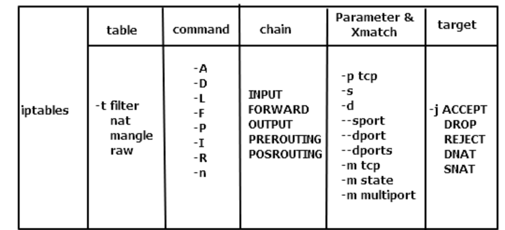

## iptables

#### iptables 中的表

iptables 包含 5 张表（tables）:

* `filter` 用于存放所有与防火墙相关操作的默认表。

* `nat` 用于 网络地址转换（例如：端口转发）。

* `mangle` 用于对特定数据包的修改（参考 损坏数据包）。

* `raw` 用于配置数据包，raw 中的数据包不会被系统跟踪。

* `security` 用于强制访问控制网络规则（例如： SELinux）。

notes:

大部分情况仅需要使用 filter 和 nat。其他表用于更复杂的情况——包括多路由和路由判

#### iptables 命令说明( 重点参考 man iptables )



```
iptables [-t 表] 大写子命令 [规则号] 链名 匹配标准 -j 目标规则

其中:
表: filter(默认表)/nat/mangle/raw/security

子命令: D(delete)/R(replace)/I(insert)/L(list)/F(flush)/Z(zero)/N(new-chain)/X(delete-chain)/P(policy)

规则号

链名: INPUT/PREROUTING/FORWARD/POSTROUTING/OUTPUT

匹配标准: 
-p protocol，例如 -p tcp
-s source-ip
-d destination-ip
-sport source-port
-dport destination-port
-dports
-m [tcp/state/multiport]

目标规则: 
ACCEPT : 接受
DROP : 丢弃
REJECT : 拒绝
DNAT : 目标地址转换
SNAT : 源地址转换
RETURN : 返回主链继续匹配
REDIRECT : 端口重定向
MASQUERADE : 地址伪装
MARK : 打标签
LOG : 记录到日志

```

#### iptables 常见用法

##### 查看规则

```bash
# 通过 -t 指定要查看的表
$ iptables-save -t filter
$ iptables-save -t nat
$ iptables-save

$ iptables -t filter -nvL --line-number
$ iptables -t nat -nvL --line-number

```

##### 添加规则

```bash
# 在位置 7 添加一条规则
$ iptables -t filter -I INPUT 7 -i eth0 -p tcp -m tcp --dport 80 -j ACCEPT
-t 指定要添加表
-I 添加操作
INPUT 指定要添加的链
7 添加的规则在链中的位置
-i eth0 -p tcp -m tcp --dport 80 -j ACCEPT 添加的规则

```

##### 删除规则

```bash
# 删除第一条规则
$ iptables -t filter -D INPUT 1
```

##### 修改规则（修改规则的最佳做法是先删除该条规则，在重新添加）

```bash
# 将第七条规则修改为 drop
$ iptables -t filter -R INPUT 7 -j DROP

# 将第七条规则修改为 accept
$ iptables -t filter -R INPUT 7 -j ACCEPT

```


##### 创建和使用自定义链

```bash
### 创建自定义链 ###

# 在 filter 表中创建一个管理 ssh 黑名单的链
iptables -t filter -N ssh-deny-chain
iptables -t filter --line -nvL ssh-deny-chain

# 为 ssh-deny-chain 链添加规则，禁止 192.168.101.6 访问
iptables -t filter -I ssh-deny-chain -s 192.168.101.6 -j REJECT

### 使用自定义链 ###
# 把 ssh-deny-chain 加入 INPUT 链，规则：如果访问目标端口是 22
iptables -t filter -I INPUT -p tcp --dport 22 -j ssh-deny-chain
iptables --line -nvL INPUT | grep ssh-deny-chain

# 测试：测试在192.168.101.6 执行登录会提示失败

### 结论 ###
1. 为自定义链添加规则
2. 在默认链中通过 `-j` 参数引用自定义链
3. 引用后会按照自定义链中的规则处理数据包

```


#### 故障排查

方法一：添加日志规则，目标使用`-j LOG`

方法二：raw table, with the TRACE target

方法三：使用  `ulogd` 日志

方法四：[调试工具(重点)](https://github.com/lanzhiwang/iptables-trace)

#### 故障排查具体操作方法

方法一：添加日志规则，目标使用 `-j LOG`  具体操作方法

1. 在需要写入日志的位置添加规则
2. 开启系统日志或者开启iptables的独立日志

```bash
# 第一步添加日志规则，和添加普通规则的方法一样，只是-j参数不同
$ iptables -I INPUT 1 -j LOG --log-prefix "iptables"
$ iptables -I FORWARD 1 -j LOG --log-prefix "iptables"

# 开启系统日志或者开启iptables的独立日志
不同的Linux发行版操作方法不同

```

##### 

方法二：raw table, with the TRACE target 

iptables 可以 trace 执行路径，TRACE target 只能在 iptables 的 raw 表中添加，raw 表中有两条iptables built-in chain: **PREROUTING** 和 **OUTPUT** ，分别代表网卡数据入口和本地进程下推数据的出口。TRACE target 就添加在这两条 chain 上，如下是 centos 7 操作方步

```
# 启用日志
modprobe nf_log_ipv4
sysctl net.netfilter.nf_log.2=nf_log_ipv4
  
# 添加追踪，下面是追踪 http的访问，
iptables -t raw -I PREROUTING 1 -j TRACE -p tcp --dport 80
iptables -t raw -I OUTPUT 1 -j TRACE -p tcp --dport 80
  
# 查看记录
journalctl -k -f|grep "TRACE"
  
# 关闭追踪
iptables -t raw -D PREROUTING -j TRACE -p tcp --dport 80
iptables -t raw -D OUTPUT -j TRACE -p tcp --dport 80

```

参考

* https://backreference.org/2010/06/11/iptables-debugging/
* http://www.opensourcerers.org/how-to-trace-iptables-in-rhel7-centos7/
* https://serverfault.com/questions/385937/how-to-enable-iptables-trace-target-on-debian-squeeze-6
* https://www.opsist.com/blog/2015/08/11/how-do-i-see-what-iptables-is-doing.html

docker 网络追踪

* https://tonybai.com/2017/11/06/explain-docker-single-host-network-using-iptables-trace-and-ebtables-log/


方法三：使用  `ulogd` 日志

[参考1](./ulogd.md)


