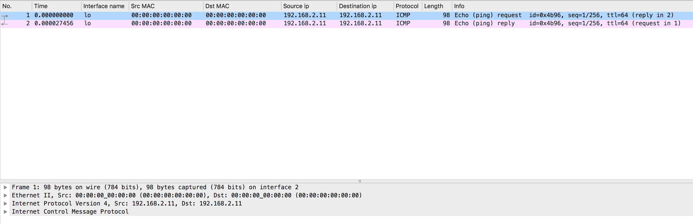
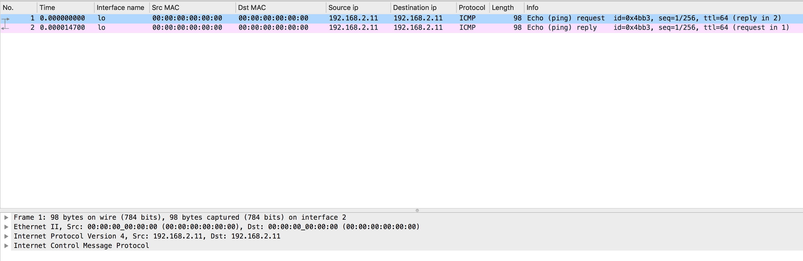
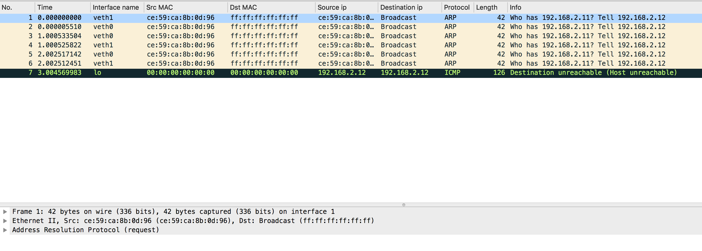
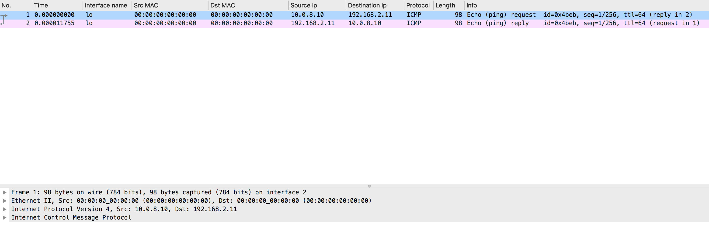
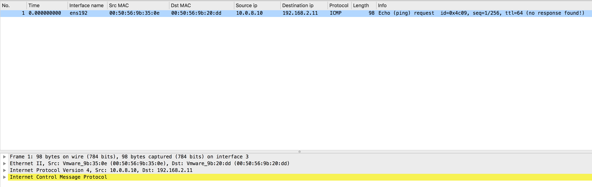
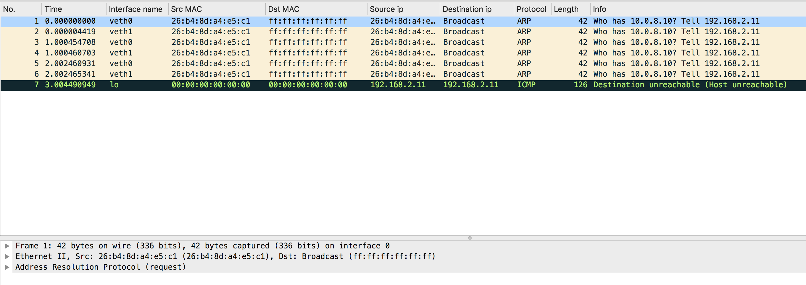
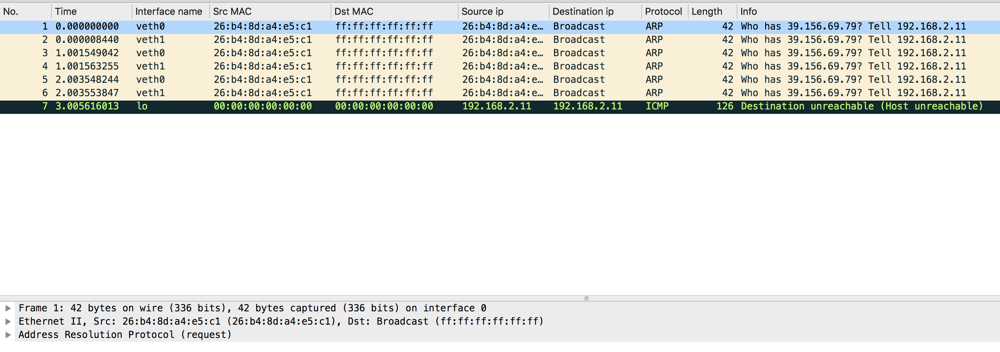

## 网络拓扑1

```
+----------------------------------------------------------------+
|                                                                |
|       +------------------------------------------------+       |
|       |             Newwork Protocol Stack             |       |
|       +------------------------------------------------+       |
|              ↑               ↑               ↑                 |
|..............|...............|...............|.................|
|              ↓               ↓               ↓                 |
|        +----------+    +-----------+   +-----------+           |
|        |  ens192  |    |   veth0   |   |   veth1   |           |
|        +----------+    +-----------+   +-----------+           |
|   10.0.8.10  ↑               ↑               ↑                 |
|              |               +---------------+                 |
|              |         192.168.2.11     192.168.2.12           |
+--------------|-------------------------------------------------+
               ↓
         Physical Network


ip link add veth0 type veth peer name veth1
ip addr add 192.168.2.11/24 dev veth0
ip addr add 192.168.2.12/24 dev veth1
ip link set veth0 up
ip link set veth1 up

tshark -i veth0 -i veth1 -i lo -i ens192 -n -f 'dst net 192.168.2.0/24 or src net 192.168.2.0/24 or icmp' -w example.pcap
tshark -i veth0 -i veth1 -i lo -i ens192 -n -f 'dst net 192.168.2.0/24 or src net 192.168.2.0/24' -w example.pcap

ping -c 1 192.168.2.11
ping -c 1 -I veth0 192.168.2.11
ping -c 1 -I veth1 192.168.2.11
ping -c 1 -I lo 192.168.2.11
ping -c 1 -I ens192 192.168.2.11

ping -c 1 -I veth0 192.168.2.11
ping -c 1 -I veth0 192.168.2.12
ping -c 1 -I veth0 10.0.8.10
ping -c 1 -I veth0 baidu.com
```
测试：
```bash
[root@huzhi-code ~]# ping -c 1 192.168.2.11
PING 192.168.2.11 (192.168.2.11) 56(84) bytes of data.
64 bytes from 192.168.2.11: icmp_seq=1 ttl=64 time=0.069 ms

--- 192.168.2.11 ping statistics ---
1 packets transmitted, 1 received, 0% packet loss, time 0ms
rtt min/avg/max/mdev = 0.069/0.069/0.069/0.000 ms
[root@huzhi-code ~]#
```

结论：
1. 因为 veth0 接口的 ip 就是 192.168.2.11，所以默认 ICMP 请求包和响应包都走 lo 接口

```bash
[root@huzhi-code ~]# ping -c 1 -I veth0 192.168.2.11
PING 192.168.2.11 (192.168.2.11) from 192.168.2.11 veth0: 56(84) bytes of data.

--- 192.168.2.11 ping statistics ---
1 packets transmitted, 0 received, 100% packet loss, time 0ms

[root@huzhi-code ~]#
```

结论：
1. 因为 veth0 接口的 ip 就是 192.168.2.11，所以默认 ICMP 请求包和响应包都走 lo 接口
2. 此时指定 veth0 接口处理 ICMP 请求包和响应包不会有作用，还是使用 lo 接口处理 ICMP 请求包和响应包

```bash
[root@huzhi-code ~]# ping -c 1 -I veth1 192.168.2.11
PING 192.168.2.11 (192.168.2.11) from 192.168.2.12 veth1: 56(84) bytes of data.

--- 192.168.2.11 ping statistics ---
1 packets transmitted, 0 received, 100% packet loss, time 0ms

[root@huzhi-code ~]#
```

结论：
1. 因为指定 veth1 接口处理 ICMP 请求包和响应包，所以网络内核栈使用 veth1 先发送 ARP 请求，但此时 veth1 没有相应的网络内核栈处理 ARP 包，所以只有 ARP 请求包，没有响应包

```bash
[root@huzhi-code ~]# ping -c 1 -I lo 192.168.2.11
ping: Warning: source address might be selected on device other than lo.
PING 192.168.2.11 (192.168.2.11) from 10.0.8.10 lo: 56(84) bytes of data.
64 bytes from 192.168.2.11: icmp_seq=1 ttl=64 time=0.050 ms

--- 192.168.2.11 ping statistics ---
1 packets transmitted, 1 received, 0% packet loss, time 0ms
rtt min/avg/max/mdev = 0.050/0.050/0.050/0.000 ms
[root@huzhi-code ~]#
```

结论：
1. 因为 veth0 接口的 ip 就是 192.168.2.11，所以默认 ICMP 请求包和响应包都走 lo 接口

```bash
[root@huzhi-code ~]# ping -c 1 -I ens192 192.168.2.11
PING 192.168.2.11 (192.168.2.11) from 10.0.8.10 ens192: 56(84) bytes of data.

--- 192.168.2.11 ping statistics ---
1 packets transmitted, 0 received, 100% packet loss, time 0ms

[root@huzhi-code ~]#
```

结论：
1. 

```bash
[root@huzhi-code ~]# ping -c 1 -I veth0 10.0.8.10
PING 10.0.8.10 (10.0.8.10) from 192.168.2.11 veth0: 56(84) bytes of data.

--- 10.0.8.10 ping statistics ---
1 packets transmitted, 0 received, 100% packet loss, time 0ms

[root@huzhi-code ~]#
```

结论：
1. 

```bash
[root@huzhi-code ~]# ping -c 1 -I veth0 baidu.com
PING baidu.com (39.156.69.79) from 192.168.2.11 veth0: 56(84) bytes of data.

--- baidu.com ping statistics ---
1 packets transmitted, 0 received, 100% packet loss, time 0ms

[root@huzhi-code ~]#
```

结论：
1. 

## 网络拓扑2

```
+----------------------------------------------------------------+
|                                                                |
|       +------------------------------------------------+       |
|       |             Newwork Protocol Stack             |       |
|       +------------------------------------------------+       |
|              ↑               ↑               ↑                 |
|..............|...............|...............|.................|
|              ↓               ↓               ↓                 |
|        +----------+    +-----------+   +-----------+           |
|        |  ens192  |    |   veth0   |   |   veth1   |           |
|        +----------+    +-----------+   +-----------+           |
|   10.0.8.10  ↑               ↑               ↑                 |
|              |               +---------------+                 |
|              |         10.0.8.12     10.0.8.13                 |
+--------------|-------------------------------------------------+
               ↓
         Physical Network

```

