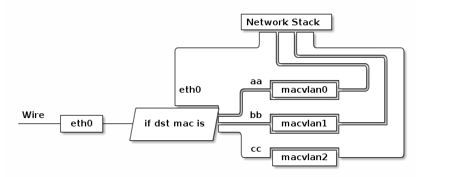
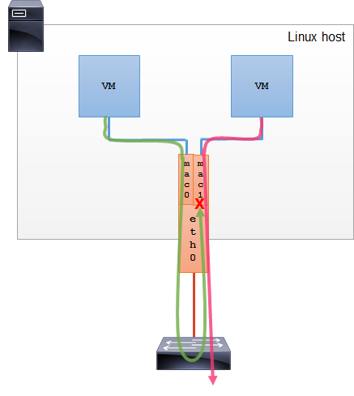
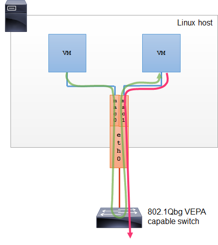
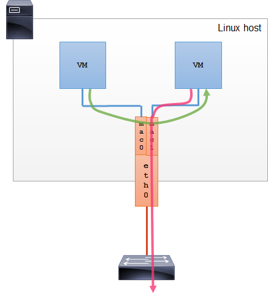
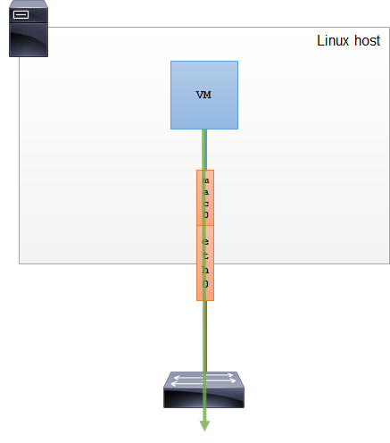
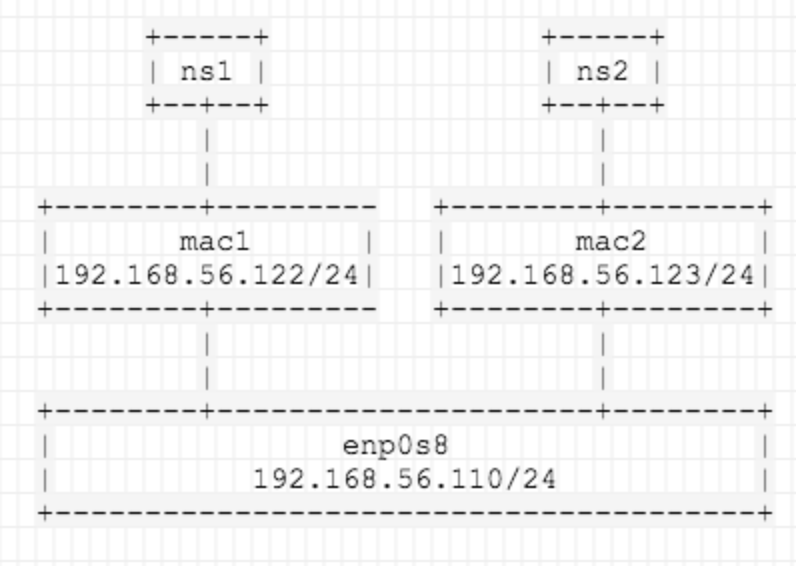
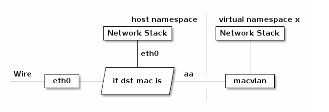

# macvlan and mactap

## macvlan 介绍

macvlan 是 Linux 操作系统内核提供的网络虚拟化方案之一，更准确的说法是网卡虚拟化方案。它可以为一张物理网卡设置多个 mac 地址，相当于物理网卡施展了影分身之术，由一个变多个，同时要求物理网卡打开**混杂模式**。针对每个 mac 地址，都可以设置 IP 地址，本来是一块物理网卡连接到交换机，现在是多块虚拟网卡连接到交换机。

macvlan 这种技术听起来有点像 VLAN，但它们的实现机制是完全不一样的：

* macvlan 子接口和原来的主接口是完全独立的，可以单独配置 MAC 地址和 IP 地址，而 VLAN 子接口和主接口共用相同的 MAC 地址。
* VLAN 用来划分广播域，而 macvlan 共享同一个广播域。

通过不同的子接口，macvlan 也能做到流量的隔离。macvlan 会根据收到包的目的 MAC 地址判断这个包需要交给哪个虚拟网卡，虚拟网卡再把包交给上层的协议栈处理。如下图所示：



## macvlan 四种模式

* private
* vepa（默认）
* bridge
* passthru [ nopromisc ]


### private

这种模式下，同一主接口下的子接口之间彼此隔离，不能通信。即使从外部的物理交换机导流，也会被无情地丢掉。



### vepa(默认)

这种模式下，子接口之间的通信流量需要导到外部支持 802.1Qbg/VPEA 功能的交换机上（可以是物理的或者虚拟的），经由外部交换机转发，再绕回来。

注：802.1Qbg/VPEA 功能简单说就是交换机要支持发夹（hairpin）功能，也就是数据包从一个接口上收上来之后还能再扔回去。



### bridge

这种模式下，模拟的是 Linux bridge 的功能，但比 bridge 要好的一点是每个接口的 MAC 地址是已知的，不用学习。所以，这种模式下，子接口之间就是直接可以通信的。



### passthru [ nopromisc ]

这种模式，只允许单个子接口连接主接口，且必须设置成混杂模式，一般用于子接口桥接和创建 VLAN 子接口的场景。



## macvlan 实践

通常，单独使用 macvlan 毫无意义，一般都是结合 VM 和容器来构建网络。下面我们就简单使用 namespace 来看看 Linux 是怎么使用 macvlan 的。

实验拓扑如下：


以接口 enp0s8 为例创建两个 macvlan 子接口（使用 bridge 模式），配置 IP 并将其挂到两个 namespace 中，测试连通性。

```bash
# help
ip link add link DEVICE name NAME type { macvlan | macvtap } mode { private | vepa | bridge | passthru [ nopromisc ] | source }

# 创建两个 macvlan 子接口
$ ip link add link enp0s8 dev mac1 type macvlan mode bridge
$ ip link add link enp0s8 dev mac2 type macvlan mode bridge

# 创建两个 namespace
$ ip netns add ns1
$ ip netns add ns2

# 将两个子接口分别挂到两个 namespace 中
$ ip link set mac1 netns ns1
$ ip link set mac2 netns ns2

# 配置 IP 并启用
# enp0s8 的 IP 是 192.168.56.110/24，配置的子接口 IP 也必须是同一网段的
$ ip netns exec ns1 ip address add 192.168.56.122/24 dev mac1
$ ip netns exec ns1 ip link set mac1 up

$ ip netns exec ns2 ip address add 192.168.56.123/24 dev mac2
$ ip netns exec ns2 ip link set mac2 up

# 测试连通性
$ ip netns exec ns1 ip address show mac1
$ ip netns exec ns1 ping 192.168.56.123

```

## mactap 介绍

和 macvlan 相似的技术还有一种是 mactap。和 macvlan 不同的是，mactap 收到包之后不是交给协议栈，而是交给一个 tapX 文件，然后通过这个文件，完成和用户态的直接通信。




## 在 docker 中使用 macvlan 

```bash
# node1
$ docker network create -d macvlan --subnet 192.168.2.0/24 --gateway 192.168.2.1 -o parent=enp0s5 -o macvlan_mode=bridge macnet
$ docker run -id --net macnet --ip 192.168.2.220 --name c1 busybox sh
$ docker run -id --net macnet --ip 192.168.2.221 --name c2 busybox sh

# node2
$ docker network create -d macvlan --subnet 192.168.2.0/24 --gateway 192.168.2.1 -o parent=enp0s5 -o macvlan_mode=bridge macnet
$ docker run -id --net macnet --ip 192.168.2.222 --name c3 busybox sh
$ docker run -id --net macnet --ip 192.168.2.223 --name c4 busybox sh

# 在 node1 上测试网络连通情况
# ping 网关(通)
$ docker exec c1 ping -c 3 192.168.2.1

$ docker exec c1 ping -c 3 c1
$ docker exec c1 ping -c 3 192.168.2.220

```

## docker vlan macvlan 

```bash
# node1

# 为物理网卡 enp0s5 创建 vlan 子接口
$ ip link add link enp0s5 name enp0s5.200 type vlan id 200
# 启用 enp0s5.200
$ ip link set enp0s5.200 up
# 设置 enp0s5.200 为混杂模式
$ ip link set enp0s5.200 promisc on
# 设置 enp0s5.200 ip 地址
$ ip addr add 192.168.200.10/24 dev enp0s5.200
# 删除原默认路由，否则下面加默认路由时会报错。
$ ip route del default
$ ip route add default via 192.168.200.1 dev enp0s5.200

$ docker network create -d macvlan --subnet=192.168.200.0/24 --gateway=192.168.200.1 -o parent=enp0s5.200 -o macvlan_mode=bridge macvlan200
$ docker run --net=macvlan200 --ip=192.168.200.100 -id --name c5 busybox sh
$ docker run --net=macvlan200 --ip=192.168.200.101 -id --name c6 busybox sh


# node2
# 为物理网卡 enp0s5 创建 vlan 子接口
$ ip link add link enp0s5 name enp0s5.200 type vlan id 200
# 启用 enp0s5.200
$ ip link set enp0s5.200 up
# 设置 enp0s5.200 为混杂模式
$ ip link set enp0s5.200  promisc on
# 设置 enp0s5.200 ip 地址
$ ip addr add 192.168.200.11/24 dev enp0s5.200
# 删除原默认路由，否则下面加默认路由时会报错。
$ ip route del default
$ ip route add default via 192.168.200.1 dev enp0s5.200

$ docker network create -d macvlan --subnet=192.168.200.0/24 --gateway=192.168.200.1 -o parent=enp0s5.200 -o macvlan_mode=bridge macvlan200
$ docker run --net=macvlan200 --ip=192.168.200.102 -id --name c7 busybox sh
$ docker run --net=macvlan200 --ip=192.168.200.103 -id --name c8 busybox sh

```

## 参考

* https://ctimbai.github.io/2019/04/01/tech/linux-macvlan/
* https://www.hi-linux.com/posts/40904.html
