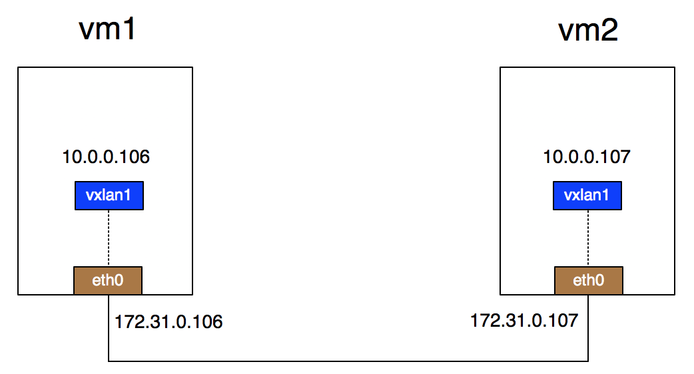
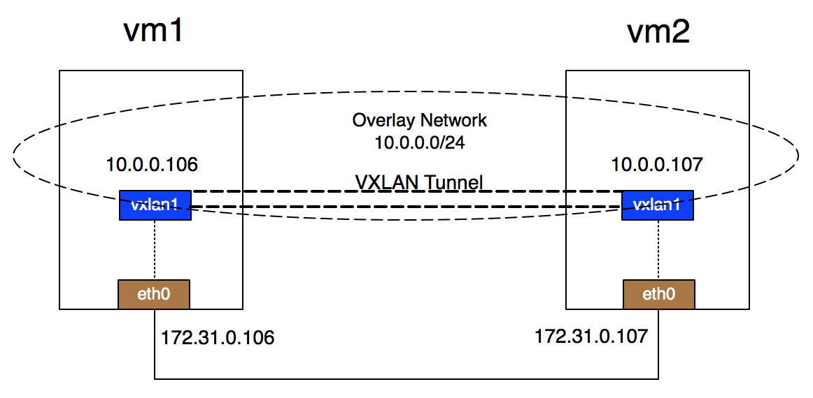
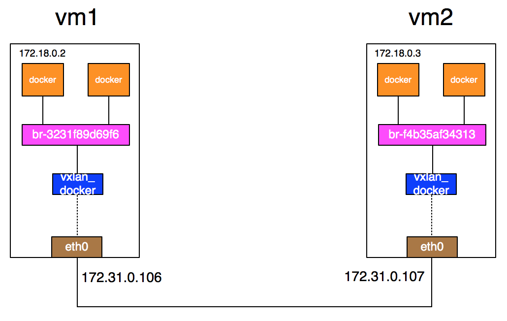

# vxlan

## 基本原理

简单的点对点VXLAN环境：



上图是一个物理上的示意图，在逻辑上形成的VXLAN overlay网络环境如下图：



实现步骤：

```bash
# vm1
$ ip link add vxlan1 type vxlan id 1 remote 172.31.0.107 dstport 4789 dev eth0
$ ip link set vxlan1 up
$ ip addr add 10.0.0.106/24 dev vxlan1
$ ifconfig vxlan1
$ route -n

# vm2
$ ip link add vxlan1 type vxlan id 1 remote 172.31.0.106 dstport 4789 dev eth0
$ ip link set vxlan1 up
$ ip addr add 10.0.0.107/24 dev vxlan1
$ ifconfig vxlan1
$ route -n

# 在 vm1 上验证
$ ping 10.0.0.107 -c 3
$ tcpdump -i eth0 host 172.31.0.107 -s0 -v -w vxlan_vni_1.pcap

```

## 利用 VxLAN 实现容器跨主机通信



```bash
# vm1
$ docker network create --subnet 172.18.0.0/16 mynetwork
$ docker run -itd --net mynetwork --ip 172.18.0.2 centos

$ ip link add vxlan_docker type vxlan id 200 remote 172.31.0.107 dstport 4789 dev eth0
$ ip link set vxlan_docker up
$ brctl addif br-3231f89d69f6 vxlan_docker

# vm2
$ docker network create --subnet 172.18.0.0/16 mynetwork
$ docker run -itd --net mynetwork --ip 172.18.0.3 centos

$ ip link add vxlan_docker type vxlan id 200 remote 172.31.0.106 dstport 4789 dev eth0
$ ip link set vxlan_docker up
$ brctl addif br-f4b35af34313 vxlan_docker

```

## 点对点的 vxlan 网络详细说明

```bash
# help
ip link add DEVICE type vxlan id VNI 
[ dev PHYS_DEV ] 
[ { group | remote } IPADDR ] 
[ local { IPADDR | any } ] 
[ ttl TTL ] 
[ tos TOS ] 
[ flowlabel FLOWLABEL ] 
[ dstport PORT ] 
[ srcport MIN MAX ] 
[ [no]learning ] 
[ [no]proxy ] 
[ [no]rsc ] 
[ [no]l2miss ] 
[ [no]l3miss ] 
[ [no]udpcsum ] 
[ [no]udp6zerocsumtx ] 
[ [no]udp6zerocsumrx ] 
[ ageing SECONDS ] 
[ maxaddress NUMBER ] 
[ [no]external ] 
[ gbp ] 
[ gpe ]

虚拟机：
node1: 192.168.8.100
node2: 192.168.8.101

overlay
10.20.1.0/24

############# node1 192.168.8.100 #############
[node1]$ ip link add vxlan0 type vxlan id 42 \
dstport 4789 \
remote 192.168.8.101 \
local 192.168.8.100 \
dev enp0s8

[node1]$ ip -d link show dev vxlan0
[node1]$ ip addr add 10.20.1.2/24 dev vxlan0
[node1]$ ip link set vxlan0 up
[node1]$ ip route
[node1]$ bridge fdb

############# node2 192.168.8.101 #############
[node2]$ ip link add vxlan0 type vxlan id 42 \
dstport 4789 \
remote 192.168.8.100 \
local 192.168.8.101 \
dev enp0s8

[node2]$ ip -d link show dev vxlan0
[node2]$ ip addr add 10.20.1.3/24 dev vxlan0
[node2]$ ip link set vxlan0 up
[node2]$ ip route
[node2]$ bridge fdb

############# 验证 #############
[node1]$ ping -c 3 10.20.1.3

[node2]$ ping -c 3 10.20.1.2

```

## 多播模式的 vxlan

```bash
ip link add DEVICE type vxlan id VNI 
[ dev PHYS_DEV ] 
[ { group | remote } IPADDR ] 
[ local { IPADDR | any } ] 
[ ttl TTL ] 
[ tos TOS ] 
[ flowlabel FLOWLABEL ] 
[ dstport PORT ] 
[ srcport MIN MAX ] 
[ [no]learning ] 
[ [no]proxy ] 
[ [no]rsc ] 
[ [no]l2miss ] 
[ [no]l3miss ] 
[ [no]udpcsum ] 
[ [no]udp6zerocsumtx ] 
[ [no]udp6zerocsumrx ] 
[ ageing SECONDS ] 
[ maxaddress NUMBER ] 
[ [no]external ] 
[ gbp ] 
[ gpe ]

虚拟机：
node1: 192.168.8.100
node2: 192.168.8.101
node3: 192.168.8.102

overlay
10.20.1.0/24

############# node1 192.168.8.100 #############
[node1]$ ip link add vxlan0 type vxlan \
id 42 \
dstport 4789 \
group 239.1.1.1 \
dev enp0s8
# 参数 group 239.1.1.1 表示把 vtep 加入到这个多播组

[node1]$ ip addr add 10.20.1.2/24 dev vxlan0
[node1]$ ip link set vxlan0 up
[node1]$ ip route
[node1]$ bridge fdb


############# node2 192.168.8.101 #############
[node2]$ ip link add vxlan0 type vxlan \
id 42 \
dstport 4789 \
group 239.1.1.1 \
dev enp0s8
# 参数 group 239.1.1.1 表示把 vtep 加入到这个多播组

[node2]$ ip addr add 10.20.1.3/24 dev vxlan0
[node2]$ ip link set vxlan0 up
[node2]$ ip route
[node2]$ bridge fdb

```

## 利用 bridge 来接入容器

```bash
# 在 node1 上构建 VxLAN 网络设备 vxlan0
[node1]$ ip link add vxlan0 type vxlan \
id 42 \
dstport 4789 \
group 239.1.1.1 \
local 192.168.8.100 \
dev enp0s8

# [node1]$ ip addr add 10.20.1.2/24 dev vxlan0
[node1]$ ip link set vxlan0 up
[node1]$ ip route
[node1]$ bridge fdb

# 在 node1 上构建 bridge 网络设备 vxlan0
[node1]$ ip link add br0 type bridge

# 将 VxLAN 网络设备 vxlan0 接入 br0
[node1]$ ip link set vxlan0 master bridge
[node1]$ ip link set vxlan0 up
[node1]$ ip link set br0 up

[node1]$ ip link add foo type veth peer name bar
[node1]$ ip link set dev foo master br0
[node1]$ ip link set dev foo up

[node1]$ ip netns add container
[node1]$ ip link set dev bar netns container
[node1]$ ip netns exec container ip link set bar name eth0
[node1]$ ip netns exec container ip addr add 10.20.1.2/24 dev eth0
[node1]$ ip netns exec container ip link set eth0 up
[node1]$ ip netns exec container ip link set lo up
[node1]$

```

参考
* https://www.cnblogs.com/wipan/p/9220615.html
* https://cizixs.com/2017/09/28/linux-vxlan/