# Syslog : The Complete System Administrator Guide  完整系统管理员指南

If you are a system administrator, or just a regular Linux user, there is a very high chance that you worked with Syslog, at least one time.

On your Linux system, pretty much everything related to system logging is linked to the Syslog protocol.  在Linux系统上，几乎所有与系统日志记录相关的内容都链接到Syslog协议。

Designed in the early 80’s by Eric Allman (from Berkeley University), the syslog protocol is a specification that defines a standard for message logging on any system.  由Eric Allman（来自伯克利大学）在80年代早期设计的系统日志协议是一种规范，它定义了任何系统上的消息记录标准。

Yes.. any system.

Syslog is not tied to Linux operating systems, it can also be used on Windows instances, or ony operating system that implements the syslog protocol.

If you want to know more about syslog and about Linux logging in general, this is probably the tutorial that you should read.  如果您想了解有关syslog和Linux日志的更多信息，这可能是您应该阅读的教程。

Here is everything that you need to know about Syslog.

Table of Contents	
1. I – What is the purpose of Syslog?
2. II – What is Syslog architecture?
3. III – What is Syslog message format?
	* a – What are Syslog facility levels?
	* b – What are Syslog severity levels?
	* c – What is the PRI part?
	* d – What is the HEADER part?
4. IV – How does Syslog message delivery work?
	* a – What is syslog forwarding?
	* b – Is Syslog using TCP or UDP?
5. V – What are current Syslog implementations?
6. VI – What are the log best practices?
7. VII – Conclusion

## I – What is the purpose of Syslog?

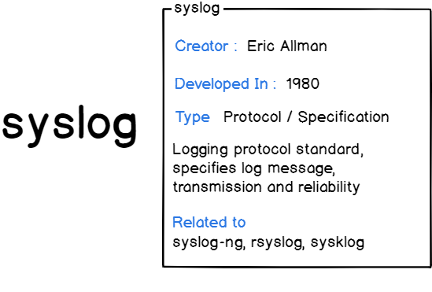

Syslog is used as a standard to produce, forward and collect logs produced on a Linux instance. Syslog defines severity levels as well as facility levels helping users having a greater understanding of logs produced on their computers. Logs can later on be analyzed and visualized on servers referred as Syslog servers.  Syslog用作生成，转发和收集Linux实例上生成的日志的标准。 Syslog定义严重性级别以及设施级别，帮助用户更好地了解其计算机上生成的日志。 稍后可以在称为Syslog服务器的服务器上分析和显示日志。

Here are a few more reasons why the syslog protocol was designed in the first place:  以下是为什么首先设计syslog协议的几个原因：

* Defining an architecture: this will be explained in details later on, but if syslog is a protocol, it will probably be part of a complete network architecture, with multiple clients and servers. As a consequence, we need to define roles, in short : are you going to receive, produce or relay data?  定义体系结构：稍后将对此进行详细说明，但如果syslog是协议，则它可能是具有多个客户端和服务器的完整网络体系结构的一部分。 因此，我们需要定义角色，简而言之：您是要接收，生成还是转发数据？

* Message format: syslog defines the way messages are formatted. This obviously needs to be standardized as logs are often parsed and stored into different storage engines. As a consequence, we need to define what a syslog client would be able to produce, and what a syslog server would be able to receive;  消息格式：syslog定义消息的格式化方式。 这显然需要标准化，因为日志经常被解析并存储到不同的存储引擎中。 因此，我们需要定义syslog客户端能够生成什么，以及syslog服务器能够接收的内容;

* Specifying reliability: syslog needs to define how it handles messages that can not be delivered. As part of the TCP/IP stack, syslog will obviously be opiniated on the underlying network protocol (TCP or UDP) to choose from;  指定可靠性：syslog需要定义它如何处理无法传递的消息。 作为TCP / IP堆栈的一部分，syslog显然会在底层网络协议（TCP或UDP）上被选择以供选择;

* Dealing with authentication or message authenticity: syslog needs a reliable way to ensure that clients and servers are talking in a secure way and that messages received are not altered.  处理身份验证或消息真实性：syslog需要一种可靠的方法来确保客户端和服务器以安全的方式进行通信，并且不会更改收到的消息。

## II – What is Syslog architecture?

When designing a logging architecture, like a centralized logging server, it is very likely that multiple instances will work together.  在设计日志记录体系结构（如集中式日志记录服务器）时，很可能多个实例一起工作。

Some will generate log messages, and they will be called **“devices”** or **“syslog clients“**.

Some will simply forward the messages received, they will be called **“relays“**.

Finally, there is some instances where you are going to receive and store log data, those are called **“collectors”** or **“syslog servers”**.

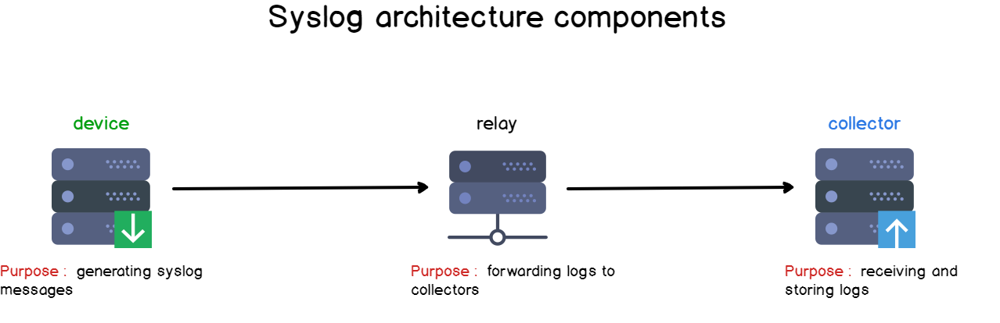

Knowing those concepts, we can already state that a standalone Linux machine acts as a “syslog client-server” on its own : it produces log data, it is collected by rsyslog and stored right into the filesystem.  了解这些概念后，我们已经可以说独立的Linux机器本身就是一个“syslog客户端 - 服务器”：它生成日志数据，由rsyslog收集并存储到文件系统中。

Here’s a set of architecture examples around this principle.  这是围绕这个原则的一组架构示例。

In the first design, you have one device and one collector. This is the most simple form of logging architecture out there.  在第一个设计中，您有一个设备和一个收集器。 这是最简单的日志记录架构形式。

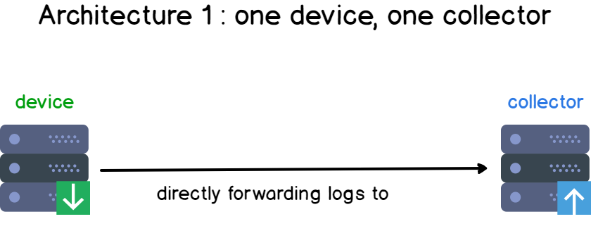

Add a few more clients in your infrastructure, and you have the basis of a centralized logging architecture.  

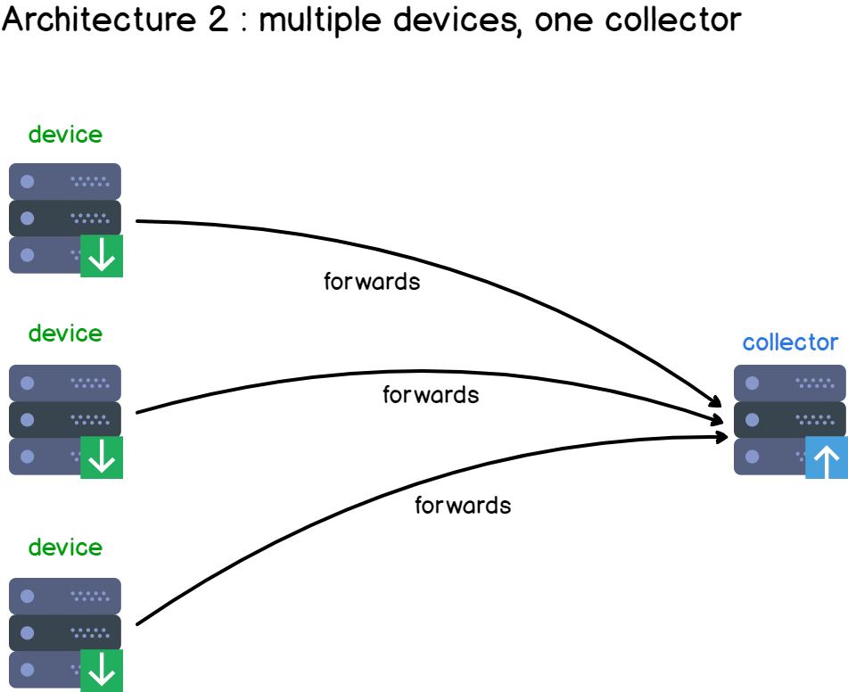

Multiple clients are producing data and are sending it to a centralized syslog server, responsible for aggregating and storing client data.

If we were to complexify our architecture, we can add a “relay“.

Examples of relays could be Logstash instances for example, but they also could be rsyslog rules on the client side.

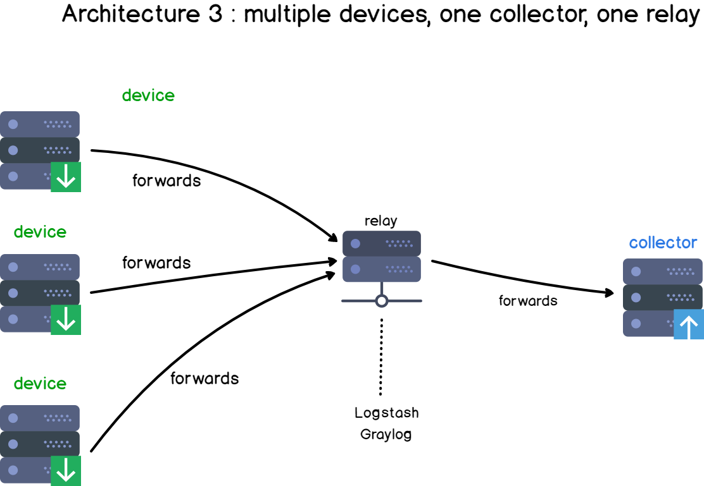

Those relays act most of the time as “content-based routers” ([if you are not familiar with content-based routers, here is a link to understand it](https://www.enterpriseintegrationpatterns.com/patterns/messaging/ContentBasedRouter.html)).  这些中继大部分时间都是“基于内容的路由器”（如果您不熟悉基于内容的路由器，这里有一个了解它的链接）。

It means that based on the log content, data will be redirected to different places. Data can also be completely discarded if you are not interested in it.

Now that we have detailed Syslog components, let’s see what a Syslog message looks like.

## III – What is Syslog message format?

The syslog format is divided into three parts:

* PRI part: that details the message priority levels (from a debug message to an emergency) as well as the facility levels (mail, auth, kernel);  PRI部分：详细说明消息优先级（从调试消息到紧急情况）以及设施级别（邮件，身份验证，内核）;

* HEADER part: composed of two fields which are the TIMESTAMP and the HOSTNAME, the hostname being the machine name that sends the log;

* MSG part: this part contains the actual information about the event that happened. It is also divided into a TAG and a CONTENT field.

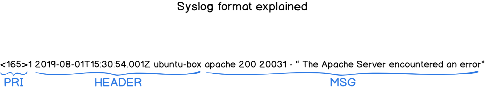

Before detailing the different parts of the syslog format, let’s have a quick look at syslog severity levels as well as syslog facility levels.  在详细说明syslog格式的不同部分之前，让我们快速查看syslog严重性级别以及syslog工具级别。

### a – What are Syslog facility levels?

In short, a facility level is used to determine the program or part of the system that produced the logs.  简而言之，设施级别用于确定生成日志的程序或系统的一部分。

By default, some parts of your system are given facility levels such as the kernel using the kern facility, or your mailing system using the mail facility.

If a third-party wants to issue a log, it would probably a reserved set of facility levels from 16 to 23 called “local use” facility levels.

Alternatively, they can use the “user-level” facility, meaning that they would issue logs related to the user that issued the commands.

In short, if my Apache server is run by the “apache” user, then the logs would be stored under a file called “apache.log” (<user>.log)

Here are the Syslog facility levels described in a table:

| Numerical Code | Keyword | Facility name|
| ---- | ---- | ---- |
|0 | kern | Kernel messages|
|1 | user | User-level messages|
|2 | mail | Mail system|
|3 | daemon | System Daemons|
|4 | auth | Security messages|
|5 | syslog | Syslogd messages|
|6 | lpr | Line printer subsystem|
|7 | news | Network news subsystem|
|8 | uucp | UUCP subsystem|
|9 | cron | Clock daemon|
|10 | authpriv | Security messages|
|11 | ftp | FTP daemon|
|12 | ntp | NTP subsystem|
|13 | security | Security log audit|
|14 | console | Console log alerts|
|15 | solaris-cron | Scheduling logs|
|16-23 | local0 to local7 | Locally used facilities|

Do those levels sound familiar to you?

Yes! On a Linux system, by default, files are separated by facility name, meaning that you would have a file for auth (auth.log), a file for the kernel (kern.log) and so on.

Here’s a screenshot example of my Debian 10 instance.

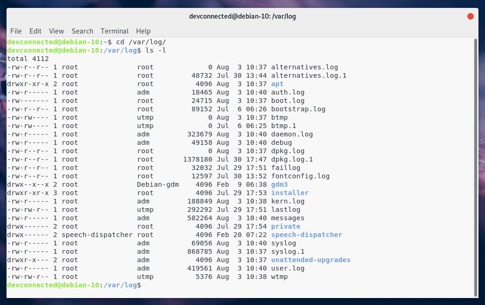

Now that we have seen syslog facility levels, let’s describe what syslog severity levels are.

### b – What are Syslog severity levels?

Syslog severity levels are used to how severe a log event is and they range from debug, informational messages to emergency levels.

Similarly to Syslog facility levels, severity levels are divided into numerical categories ranging from 0 to 7, 0 being the most critical emergency level.

Here are the syslog severity levels described in a table:

|Value | Severity | Keyword|
| ---- | ---- | ---- |
| 0 | Emergency | emerg |
| 1 | Alert | alert |
| 2 | Critical | crit |
| 3 | Error | err |
| 4 | Warning | warning |
| 5 | Notice | notice |
| 6 | Informational | info |
| 7 | Debug | debug |

Even if logs are stored by facility name by default, you could totally decide to have them stored by severity levels instead.

If you are using rsyslog as a default syslog server, you can check rsyslog properties to configure how logs are separated.

Now that you know a bit more about facilities and severities, let’s go back to our syslog message format.

### c – What is the PRI part?

The PRI chunk is the first part that you will get to read on a syslog formatted message.

The PRI stores the “**Priority Value**” between angle brackets.

> Remember the facilities and severities you just learned?

If you take the message facility number, multiply it by eight, and add the severity level, you get the “Priority Value” of your syslog message.

Remember this if you want to **decode** your syslog message in the future.

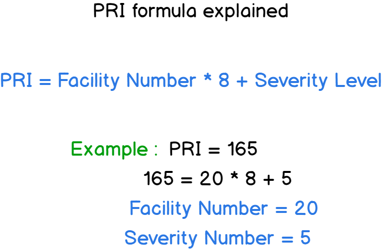

### d – What is the HEADER part?

As stated before, the HEADER part is made of two crucial information : the TIMESTAMP part and the HOSTNAME part (that can sometimes be resolved to an IP address)

This HEADER part directly follows the PRI part, right after the right angle bracket.

It is noteworthy to say that the TIMESTAMP part is formatted on the “Mmm dd hh:mm:ss” format, “Mmm” being the first three letters of a month of the year.

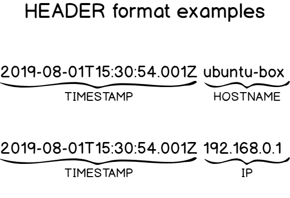

When it comes to the HOSTNAME, it is often the one given when you type the hostname command. If not found, it will be assigned either the IPv4 or the IPv6 of the host.

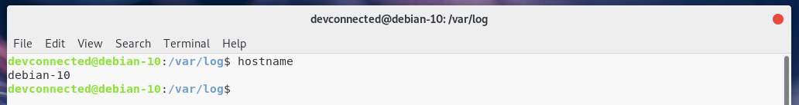

## IV – How does Syslog message delivery work?

When issuing a syslog message, you want to make sure that you use reliable and secure ways to deliver log data.  发出系统日志消息时，您需要确保使用可靠且安全的方式来提供日志数据。

Syslog is of course opiniated on the subject, and here are a few answers to those questions.  Syslog当然是关于这个主题的意见，这里有几个问题的答案。

### a – What is syslog forwarding?

Syslog forwarding consists in sending clients logs to a remote server in order for them to be centralized, making log analysis and visualization easier.  Syslog转发包括将客户端日志发送到远程服务器以使其集中化，从而使日志分析和可视化更容易。

Most of the time, system administrators are not monitoring one single machine, but they have to monitor dozens of machine, on-site and off-site.  大多数情况下，系统管理员不监控一台机器，但他们必须监控数十台机器，现场和非现场。

As a consequence, it is a very common practice to send logs to a distant machine, called a centralized logging server, using different communication protocols such as UDP or TCP.  因此，使用不同的通信协议（如UDP或TCP）将日志发送到远程计算机（称为集中式日志记录服务器）是一种非常常见的做法。

### b – Is Syslog using TCP or UDP?

As specified on the RFC 3164 specification, syslog clients use UDP to deliver messages to syslog servers.  根据RFC 3164规范的规定，syslog客户端使用UDP将消息传递到syslog服务器。

Moreover, Syslog uses the port 514 for UDP communication.  此外，Syslog使用端口514进行UDP通信。

However, on recent syslog implementations such as rsyslog or syslog-ng, you have the possibility to use TCP (Transmission Control Protocol) as a secure communication channel.  但是，在最近的syslog实现（如rsyslog或syslog-ng）上，您可以使用TCP（传输控制协议）作为安全通信通道。

For example, rsyslog uses the port 10514 for TCP communication, ensuring that no packets are lost along the way.  例如，rsyslog使用端口10514进行TCP通信，确保在此过程中不丢失任何数据包。

Furthermore, you can use the TLS/SSL protocol on top of TCP to encrypt your Syslog packets, making sure that no man-in-the-middle attacks can be performed to spy on your logs.  此外，您可以在TCP之上使用TLS / SSL协议来加密您的Syslog数据包，确保不会执行任何中间人攻击来监视您的日志。

If you are curious about rsyslog, here’s a tutorial on how to setup a complete centralized logging server in a secure and reliable way.  如果您对rsyslog感到好奇，这里有一个关于如何以安全可靠的方式设置完整的集中式日志记录服务器的教程。

## V – What are current Syslog implementations?

Syslog is a specification, but not the actual implementation in Linux systems.

Here is a list of current Syslog implementations on Linux:

* Syslog daemon: published in 1980, the syslog daemon is probably the first implementation ever done and only supports a limited set of features (such as UDP transmission). It is most commonly known as the sysklogd daemon on Linux;

* Syslog-ng: published in 1998, syslog-ng extends the set of capabilities of the original syslog daemon including TCP forwarding (thus enhancing reliability), TLS encryption and content-based filters. You can also store logs to local databases for further analysis.

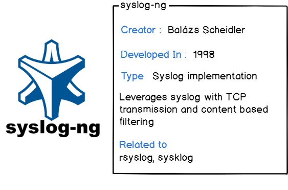

* Rsyslog: released in 2004 by Rainer Gerhards, rsyslog comes as a default syslog implementation on most of the actual Linux distributions (Ubuntu, RHEL, Debian etc..). It provides the same set of features as syslog-ng for forwarding but it allows developers to pick data from more sources (Kafka, a file, or Docker for example)

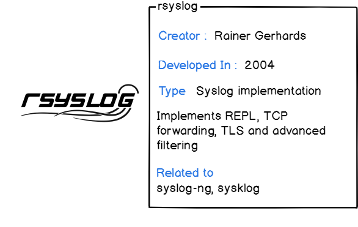

## VI – What are the log best practices?

When manipulating Syslog or when building a complete logging architecture, there are a few best practices that you need to know:  在操作Syslog或构建完整的日志记录体系结构时，您需要了解一些最佳实践：

* Use reliable communication protocols unless you are willing to lose data. Choosing between UDP (a non-reliable protocol) and TCP (a reliable protocol) really matters. Make this choice ahead of time;  除非您愿意丢失数据，否则请使用可靠的通信协议。在UDP（不可靠的协议）和TCP（可靠的协议）之间进行选择非常重要。提前做出这个选择;

* Configure your hosts using the NTP protocol: when you want to work with real time log debugging, it is best for you to have hosts that are synchronized, otherwise you would have a hard time debugging events with a good precision;  使用NTP协议配置主机：当您想要使用实时日志调试时，最好让您拥有同步的主机，否则您将很难以高精度调试事件;

* Secure your logs: using the TLS/SSL protocol surely has some performance impacts on your instance, but if you are to forward authentication or kernel logs, it is best to encrypt them to make sure that no one is having access to critical information;  保护您的日志：使用TLS / SSL协议肯定会对您的实例产生一些性能影响，但如果您要转发身份验证或内核日志，最好加密它们以确保没有人可以访问关键信息;

* You should avoid over-logging: defining a good log policy is crucial for your company. You have to decide if you are interested in storing (and essentially consuming bandwidth) for informational or debug logs for example. You may be interested in having only error logs for example;  您应该避免过度记录：定义良好的日志策略对您的公司至关重要。例如，您必须决定是否对存储信息或调试日志（以及基本上消耗带宽）感兴趣。例如，您可能只对错误日志感兴趣;

* Backup log data regularly: if you are interested in keeping sensitive logs, or if you are audited on a regular basis, you may be interested in backing up your log on an external drive or on a properly configured database;  定期备份日志数据：如果您对保留敏感日志感兴趣，或者您经常接受审计，则可能有兴趣备份外部驱动器或正确配置的数据库上的日志;

* Set up log retention policies: if logs are too old, you may be interested in dropping them, also known as “rotating” them. This operation is done via the logrotate utility on Linux systems.  设置日志保留策略：如果日志太旧，您可能有兴趣删除它们，也称为“旋转”它们。此操作通过Linux系统上的logrotate实用程序完成。

## VII – Conclusion

The Syslog protocol is definitely a classic for **system administrators** or **Linux engineers** willing to have a deeper understanding on how logging works on a server.

However, there is a time for theory, and there is a time for practice.

> So where should you go from there? You have multiple options.

You can start by setting up a **syslog server** on your instance, like a Kiwi Syslog server for example, and starting gathering data from it.

Or, if you have a bigger infrastructure, you should probably start by setting up a **centralized logging architecture**, and later on [monitor it using very modern tools such as Kibana for visualization](https://devconnected.com/monitoring-linux-logs-with-kibana-and-rsyslog/).

I hope that you learned something today.

Until then, have fun, as always.

参考：

* [Syslog 日志指南](https://devconnected.com/syslog-the-complete-system-administrator-guide/)