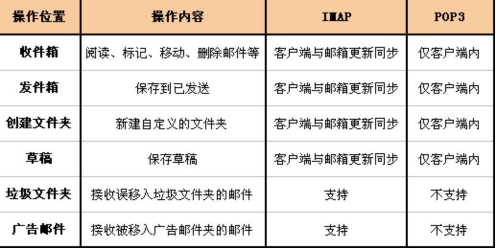

# IMAP 和 POP3 的区别

**POP3**协议允许电子邮件客户端下载服务器上的邮件，但是在客户端的操作（如移动邮件、标记已读等），不会反馈到服务器上，比如通过客户端收取了邮箱中的3封邮件并移动到其他文件夹，邮箱服务器上的这些邮件是没有同时被移动的 。

**IMAP**提供 webmail 与电子邮件客户端之间的双向通信，客户端的操作都会反馈到服务器上，对邮件进行的操作，服务器上的邮件也会做相应的动作。

同时，**IMAP**像**POP3**那样提供了方便的邮件下载服务，让用户能进行离线阅读。**IMAP**提供的摘要浏览功能可以让你在阅读完所有的邮件到达时间、主题、发件人、大小等信息后才作出是否下载的决定。此外，**IMAP** 更好地支持了从多个不同设备中随时访问新邮件。

总之，**IMAP** 整体上为用户带来更为便捷和可靠的体验。**POP3** 更易丢失邮件或多次下载相同的邮件，但 **IMAP** 通过邮件客户端与webmail 之间的双向同步功能很好地避免了这些问题。

