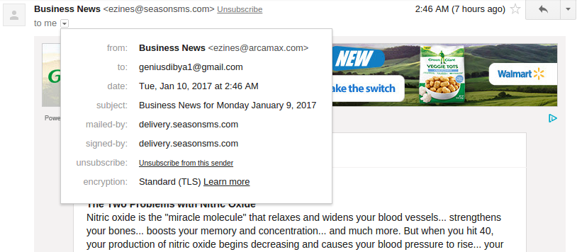
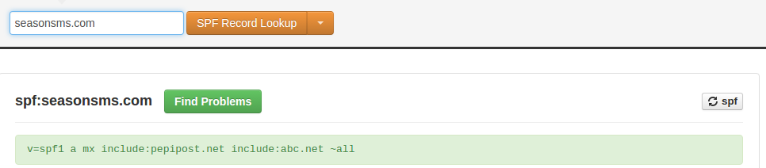
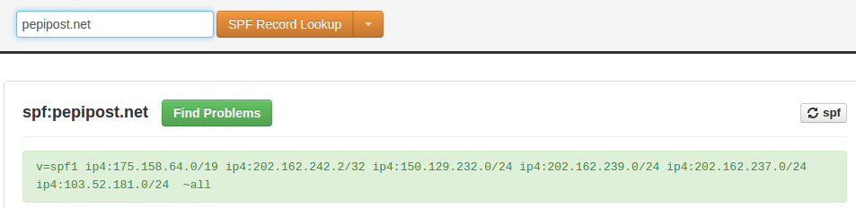
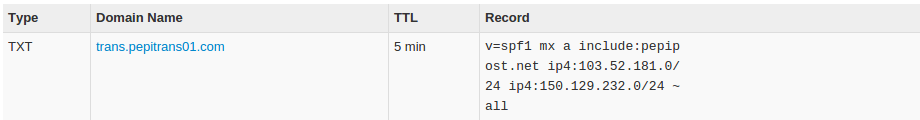

## How to read email headers and identify Spam

Nobody likes or wants SPAM. And yet our inboxes are full of it.  没有人喜欢或想要垃圾邮件。 然而我们的收件箱却充满了它。

It is not only plain intrusive, it also puts our online identity at risk. Phishing attacks have only been on the rise ever since they came into existence.  它不仅是简单的侵入性，它还使我们的在线身份处于危险之中。 网络钓鱼攻击自成立以来一直呈上升趋势。

### It’s not easy to detect phishing emails

To defend customers inboxes from SPAM emails, companies spend time and money to block malicious emails before they even reach the customers with the DMARC (Domain-based Message Authentication Reporting and Conformance) standard.  为了保护垃圾邮件中的客户收件箱，公司在使用DMARC（基于域的邮件身份验证报告和一致性）标准访问客户之前，花费时间和金钱来阻止恶意电子邮件。

Unfortunately, no matter what one does, some unsolicited emails will always make it to the inbox. While some of the emails we receive are obvious spam, most of them are not very easy to recognise just by seeing the content or the sender. And these are extremely effective—97% of people around the globe cannot identify a sophisticated phishing email.  不幸的是，无论做什么，一些不请自来的电子邮件总会进入收件箱。 虽然我们收到的一些电子邮件是明显的垃圾邮件，但通过查看内容或发件人，大多数电子邮件都不容易识别。 这些非常有效 - 全球97％的人无法识别复杂的网络钓鱼电子邮件。

### But there’s a way..

Here comes the advance debugging of email which is commonly known as analysing the email headers. Let’s understand what email headers are and how they can help in detecting fraudulent emails.  以下是电子邮件的高级调试，通常称为分析电子邮件标题。 让我们了解一下哪些电子邮件标题以及它们如何帮助检测欺诈性电子邮件。

Generally only the basic information is displayed on the normal email header. Some examples of normal email header in different mail clients:  通常，只有基本信息显示在普通电子邮件标题上。 不同邮件客户端中普通电子邮件标题的一些示例：

#### Gmail



#### Thunderbird

As you notice, most email readers only show the From: and To: headers, which can be easily forged. The complete message headers will look something like this:  正如您所注意到的，大多数电子邮件阅读器仅显示From：和To：标题，这些标题可以轻松伪造。 完整的邮件标题将如下所示：

```
Delivered-To: someguy@gmail.com
Received: by 10.200.41.121 with SMTP id z54csp461727qtz;
       Sun, 8 Jan 2017 04:33:03 -0800 (PST)
X-Received: by 10.55.157.17 with SMTP id g17mr82034336qke.122.1483878783846;
       Sun, 08 Jan 2017 04:33:03 -0800 (PST)
Return-Path: <0-1111323-gmail.com@delivery.seasonsms.com>
Received: from trans.pepitrans01.com (trans.pepitrans01.com. [103.52.181.228])
       by mx.google.com with ESMTPS id 94si44473076qtb.140.2017.01.08.04.33.03
       for <someguy@gmail.com>
       (version=TLS1_2 cipher=ECDHE-RSA-AES128-GCM-SHA256 bits=128/128);
       Sun, 08 Jan 2017 04:33:03 -0800 (PST)
Received-SPF: pass (google.com: domain of 0-22228-gmail.com@delivery.seasonsms.com designates 103.52.181.228 as permitted sender) client-ip=103.52.181.228;
Authentication-Results: mx.google.com;
      dkim=pass header.i=@delivery.seasonsms.com;
      header.i=@delivery.seasonsms.com;
      spf=pass (google.com: domain of 0-22228-gmail.com@delivery.seasonsms.com designates 103.52.181.228 as permitted sender) smtp.mailfrom=0-22228-gmail.com@delivery.seasonsms.com
DKIM-Signature: v=1; a=rsa-sha1; c=relaxed/relaxed; s=pepipost; d=delivery.seasonsms.com;h=Message-ID:To:From:Subject:Content-Type:List-Unsubscribe:Date;
bh=IReTMq2p4Y99Y1lFEln+pSvcofA=;b=dEWvsIdSK0j5Gmp9ATUlhfDRHQqUR7BolSaqyBh+CzC5WU4iGnn6aBZFtLSi0b4ze+V5nwG3fCAyn4mkAGhdgA7DvJTikspVnn+Jqpu68ru6UnH10WVD8oCJ6aa4Pa6A/sA4Zm52K9h2R7cGQjMOcEZ+N5NNQ6BG9Dtvi+ezKgk=
Received: by trans226.mailxy.com id he8oo0229vgh; Sun, 8 Jan 2017 18:03:04 +0530 (envelope-from <0-22228-gmail.com@delivery.seasonsms.com>)
Delivered-To: someguy@gmail.com
DKIM-Signature: v=1; a=rsa-sha1; c=relaxed/relaxed; s=pepipost; d=delivery.seasonsms.com;h=Message-ID:To:From:Subject:Content-Type:List-Unsubscribe:Date;bh=ChnX1bsU13QtrayAVkclQsY4c0s=;b=Ziuit9vOzeeAanLi0/
idQ3hTE/Jb3cWs2pMLW71gzQ1/AHgpWYBhXDZoxU8wAmluG/8q2BmnQNKYr9W+ZU1DD4aZHUS1ViqMWYcAdudle3pBb40kLPyk6uCuixu3hXcV/J2d13xEOJ5QkVyiYWYYL1WLxRSOypYBU/7eHWxntiE=
Message-ID: <bmi1.t100.c284046070.1483878782@delivery.seasonsms.com>
To: someguy@gmail.com
From: "Confirmation - Thrifty-Deals" <ezines@delivery.seasonsms.com>
Subject: Confirm your newsletter subscription
Content-Type: text/plain
List-Unsubscribe: <mailto:unsub-aeaaaaaacdxdf5qykzk2kqaivun2lcnkeegsmkob35aq@delivery.seasonsms.com>
X-InjTime: 1483878784
X-Abuse-Reports-To: abuse@pepipost.com
X-FNCID: 22228-14838138016706353-0
X-TransMail: 1
Date: Sun, 8 Jan 2017 18:03:04 +0530
We have received your request to receive the Thrifty-Deals newsletter. Please click below now to complete the process:
http://seasonsms.com/lt.pl?jfklowerwksdfha
Thank you!
Publisher:
Season Publishing House
Newport News, VA 23606
```

The complete email header would provide much more information on the origin of a message and is a useful tool for tracking and stopping SPAM and virus-laden email.  完整的电子邮件标题将提供有关邮件来源的更多信息，是跟踪和停止垃圾邮件和病毒邮件的有用工具。

Whenever you open an email to read, you’ll also find options like View Source, View Message Header or Show Original. Here is the guide for you to view the complete email headers on different email clients or webmail provider.  每当您打开要阅读的电子邮件时，您还会找到“查看源”，“查看邮件标题”或“显示原始文件”等选项。 以下是您在不同电子邮件客户端或Webmail提供商上查看完整电子邮件标头的指南。

### Understanding the different elements of email headers

#### Received

The header lines begin with Received: and provides a trace of the email from its origin to your mail server. It will show the origin along with the list of servers which processed this email before reaching your mailbox. The ‘Received:’ parameter of your email gives you many valuable clues to identify the legitimacy of the source.  标题行以Received：开头，并提供从其来源到邮件服务器的电子邮件的跟踪。 它将显示原点以及在到达您的邮箱之前处理此电子邮件的服务器列表。 电子邮件中的“已收到：”参数为您提供了许多有价值的线索，可以确定来源的合法性。

#### How To Analyse The Received Parameter In The Mail Headers

Each mail server which handles an email message adds a Received: header set to the front of the message; the first set is therefore added by your mail server.  每个处理电子邮件消息的邮件服务器都会在消息的前面添加一个Received：标头集; 因此，第一个集合由您的邮件服务器添加。

The first Received header shows that the email was actually originated from a server with IP address 10.200.41.121

```
Received: by 10.200.41.121 with SMTP id z54csp461727qtz;
       Sun, 8 Jan 2017 04:33:03 -0800 (PST)
```

In the above example, the header shows the email is actually received From: **“Confirmation – Thrifty-Deals” <ezines@seasonsms.com>** but the Received: parameter is showing from **trans.pepitrans01.com. [103.52.181.228]**.

```
Received: from trans.pepitrans01.com (trans.pepitrans01.com. [103.52.181.228])
       by mx.google.com with ESMTPS id 94si44473076qtb.140.2017.01.08.04.33.03
       for <someguy@gmail.com>
       (version=TLS1_2 cipher=ECDHE-RSA-AES128-GCM-SHA256 bits=128/128);
       Sun, 08 Jan 2017 04:33:03 -0800 (PST)
```

Now, this seems suspicious. Unless trans.pepitrans01.com belongs to the same owner who owns seasonsms.com or the owner of seasonsms.com has given rights to trans.pepitrans01.com to send emails on their behalf.  现在，这看起来很可疑。 除非trans.pepitrans01.com属于拥有seasonsms.com的同一所有者，否则seasonsms.com的所有者已授权trans.pepitrans01.com代表他们发送电子邮件。

Let’s check the SPF record of seasonsms.com. This you can easily do on mxtoolbox.com or simply type ~ **dig TXT seasonsms.com** on your terminal.



As per the SPF record, seasonsms.com has granted rights to pepipost.net for sending emails on their behalf.  根据SPF记录，seasonsms.com已授予pepipost.net代表他们发送电子邮件的权利。

So, now let’s try to valid the actual sending IP address **trans.pepitrans01.com. [103.52.181.228]** belongs to pepipost.net or not. If that validates, then we are safe to say that email is not spam.

So, let’s check the SPF record of pepipost.net



Also, the SPF of trans.pepitrans01.com



Cool, in both of the above we got same reference of IP address, which is 103.52.181.x here. So, this shows that pepipost.net has allowed 102.52.181.x to send emails on their behalf.  很酷，在上面我们都得到了相同的IP地址参考，这里是103.52.181.x. 因此，这表明pepipost.net允许102.52.181.x代表他们发送电子邮件。

#### So, the conclusion of this analysis is that

* the user someguy@gmail.com has received an email from ezines@delivery.seasonsms.com via 103.52.181.x IP address which is owned by pepipost.net

* seasonsms’s SPF shows that they have allowed pepipost.net to send emails on their behalf.

Hence, this is a legitimate email and not a forged one.  因此，这是一个合法的电子邮件，而不是伪造的电子邮件。

### Received-SPF And DKIM-Signature

In the above example there are two more important parameters, Received-SPF and DKIM-Signature. Not every sender adds these, but most of the good/ big senders have now made it a practice to add SPF and DKIM. These parameters help in identifying the authenticity of the email.  在上面的示例中，有两个更重要的参数，Received-SPF和DKIM-Signature。 不是每个发件人都添加这些，但大多数好/大发件人现在已经成为添加SPF和DKIM的做法。 这些参数有助于识别电子邮件的真实性。

The header parameter in Received-SPF is showing as pass. This means the domain seasonsms.com has allowed the IP address 103.52.181.228 to send emails on their behalf.  Received-SPF中的header参数显示为pass。 这意味着域seasonsms.com允许IP地址103.52.181.228代表他们发送电子邮件。

This conforms to the analysis which we did earlier.  这符合我们之前做过的分析。

```
Received-SPF: pass (google.com: domain of 0-22228-gmail.com@delivery.seasonsms.com designates 103.52.181.228 as permitted sender) client-ip=103.52.181.228;
```

The next header parameter Authentication-Results: is showing dkim=pass. This means the long public key mentioned in the parameter DKIM-Signature: matches with its associated private key stored on the actual sending server 103.52.181.228/pepipost.net server.  下一个标题参数Authentication-Results：显示dkim = pass。 这意味着参数DKIM-Signature中提到的长公钥与存储在实际发送服务器103.52.181.228/pepipost.net服务器上的相关私钥匹配。

```
Authentication-Results: mx.google.com;
      dkim=pass header.i=@delivery.seasonsms.com;
      spf=pass (google.com: domain of 0-22228-gmail.com@delivery.seasonsms.com designates 103.52.181.228 as permitted sender) smtp.mailfrom=0-22228-gmail.com@delivery.seasonsms.com
      
DKIM-Signature: v=1; a=rsa-sha1; c=relaxed/relaxed; s=pepipost; d=delivery.seasonsms.com;
h=Message-ID:To:From:Subject:Content-Type:List-Unsubscribe:Date;
bh=IReTMq2p4Y99Y1lFEln+pSvcofA=;b=dEWvsIdSK0j5Gmp9ATUlhfDRHQqUR7BolSaqyBh+CzC5WU4iGnn6aBZFtLSi0b4ze+V5nwG3fCAyn4mkAGhdgA7DvJTikspVnn+Jqpu68ru6UnH10WVD8oCJ6aa4Pa6A/sA4Zm52K9h2R7cGQjMOcEZ+N5NNQ6BG9Dtvi+ezKgk=

Received-SPF: pass (google.com: domain of 0-22228-gmail.com@delivery.seasonsms.com designates 103.52.181.228 as permitted sender) client-ip=103.52.181.228;
```

In the above case the email was sent using a third party SMTP service Pepipost. But, in case the email was sent using their own in-house infrastructure, then the owner of the sender domain and sending IP address should be ideally same (unless on a shared infrastructure).  在上述情况下，电子邮件是使用第三方SMTP服务Pepipost发送的。 但是，如果电子邮件是使用自己的内部基础结构发送的，那么发件人域的所有者和发送IP地址应该完全相同（除非在共享基础结构上）。

A number of tools are available for verifying the ownership of a domain/IP address. The authoritative reference for IP addresses is the American Registry of Internet Numbers. Using ARIN’s “Search WHOIS” tool, you can find the identification of the IP address owner.  有许多工具可用于验证域/ IP地址的所有权。 IP地址的权威参考是美国互联网号码注册。 使用ARIN的“搜索WHOIS”工具，您可以找到IP地址所有者的标识。

If nothing works out and you still doubt on the legitimacy of an email then simply send a message to “abuse@organization” with a copy of complete email header (Here is the above example: it will be abuse@seasonsms.com). Most of the webmasters validate and reply to queries received on abuse.  如果没有任何结果，您仍然怀疑电子邮件的合法性，那么只需向“abuse @ organization”发送一条消息，其中包含完整电子邮件标题的副本（以下是上面的示例：它将是abuse@seasonsms.com）。 大多数网站管理员验证并回复有关滥用的查询。

#### List-Unsubscribe

This is another important parameters parameter in the email header.

```
List-Unsubscribe:<mailto:unsub-aeaaaaaacdxdf5qykzk2kqaivun2lcnkeegsmkob35aq@delivery.seasonsms.com>
```

In case the user wants to unsubscribe from an email then simply send an email to this long email address, and user will get unsubscribed.  如果用户想要取消订阅电子邮件，则只需向此长电子邮件地址发送电子邮件，用户即可取消订阅。

The List-Unsubscribe header is an optional piece of text. It works in conjunction with options that the email client provides for unsubscribing and spam complaints.  List-Unsubscribe标头是一段可选文本。 它与电子邮件客户端提供的用于取消订阅和垃圾邮件投诉的选项一起使用。


Example: In case of Gmail you will see an option to unsubscribe from this sender. When a user clicks on this link, the email client sends an email to the email address defined in the List-Unsubscribe header parameter.  示例：如果是Gmail，您会看到取消订阅此发件人的选项。 当用户单击此链接时，电子邮件客户端会向List-Unsubscribe标头参数中定义的电子邮件地址发送电子邮件。

All email headers prefixed with “X-” are actually not the standard headers. It is added by the sending server for some of their internal tracking and reporting purpose. Hence, these can be simply ignored for any analysis. Example of these headers in the above example are: X-Abuse-Reports-To, X-InjTime, X-FNCID, X-TransMail, X-SG-EID.  所有前缀为“X-”的电子邮件标头实际上都不是标准标头。 它由发送服务器添加，用于其内部跟踪和报告目的。 因此，任何分析都可以忽略这些。 上例中的这些标题的示例是：X-Abuse-Reports-To，X-InjTime，X-FNCID，X-TransMail，X-SG-EID。

Historically, designers and implementers of application protocols have often distinguished between standardized and unstandardized parameters by prefixing the names of unstandardized parameters with the string “X-” or similar constructs. In practice, that convention causes more problems than it solves. Hence it is later depreciated by the IETF community.  历史上，应用协议的设计者和实现者通常通过在非标准化参数的名称前加上字符串“X-”或类似结构来区分标准化参数和非标准化参数。 在实践中，该惯例导致的问题多于解决的问题。 因此，它稍后会被IETF社区折旧。

### Some handy tips for identifying and avoiding Spam emails:  一些识别和避免垃圾邮件的方便提示：

Tip 1: Test It Before You Check It  在检查之前进行测试

If you are unsure of any embedded text in the email, hover your mouse over the link to review the full email address. If it looks fishy, don’t click it. Test the link by opening the link in a different window.  如果您不确定电子邮件中是否包含任何嵌入文本，请将鼠标悬停在链接上以查看完整的电子邮件地址。 如果它看起来很腥，请不要点击它。 通过在其他窗口中打开链接来测试链接。

Tip 2: Check For Spelling Mistakes

Brands are pretty serious about the emails they send out. Legitimate messages usually do not have major spelling mistakes or poor grammar. Email addresses of Spam or phishing emails have random spellings which can be easily noticed.  品牌对他们发出的电子邮件非常认真。 合法的消息通常没有重大的拼写错误或语法不佳。 垃圾邮件或网络钓鱼电子邮件的电子邮件地址具有随机拼写，可以很容易地被注意到。

Tip 3: Don’t Share Your Personal Information

Legitimate banks and most other companies will never ask for personal credentials via email so don’t share it.

Tip 4: Invoking A Sense Of Urgency Or Fear Is A Common Phishing Tactic.  调用紧迫感或恐惧是一种常见的网络钓鱼策略。

Beware of subject lines that claim your “account has been suspended” or your account had an “unauthorized login attempt” such emails are most probably SPAM.  请注意声称您的“帐户已被暂停”或您的帐户有“未经授权的登录尝试”的主题行，此类电子邮件很可能是垃圾邮件。

Tip 5: Don’t Click On Attachments

Including viruses and malware as an attachment is a common phishing tactic. Malware can damage files on your computer, steal your passwords or spy on you without your knowledge. Don’t open any email attachments you weren’t expecting.

### Conclusion

We at Pepipost take spam seriously. We are working hard to rebuild and reconstruct the email ecosystem. Let’s together make it spam free. Start analyzing your emails and mark unwanted suspicious emails as Spam and stay safe from Phishing.


