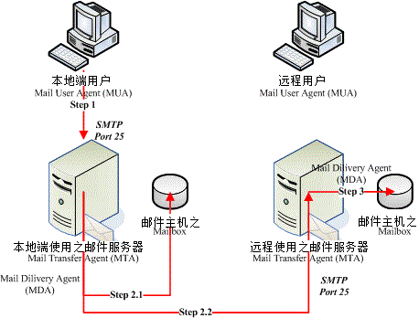
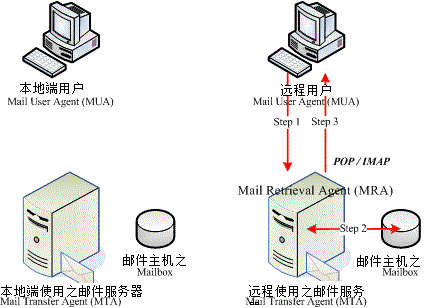

## mail protocol

- [IMAP](#imap)
- [POP3](#pop3)
- [STMP](#stmp)

### 电子邮件传送过程示意图



### 客户端收回信件的流程示意图



### IMAP

INTERNET MESSAGE ACCESS PROTOCOL - VERSION 4rev1

https://tools.ietf.org/html/rfc3501

```bash

## IMAP命令示例

# 连接服务器
$ telnet imap.163.com 143
Trying 123.125.50.47...
Connected to imap.163.com.
Escape character is '^]'.
* OK Coremail System IMap Server Ready(163com[726cd87d72d896a1ac393507346040fa])

HZ1 CAPABILITY
* CAPABILITY IMAP4rev1 XLIST SPECIAL-USE ID LITERAL+ STARTTLS XAPPLEPUSHSERVICE UIDPLUS X-CM-EXT-1
HZ1 OK CAPABILITY completed

HZ2 ID ("name" "com.tencent.foxmail" "version" "1.2" "vendor" "Tencent Limited" "contact" "foxmailapp@qq.com")
* ID ("name" "Coremail Imap" "vendor" "Mailtech" "TransID" "3PmVJQB3bjS5RERX")
HZ2 OK ID completed

HZ3 LOGIN "hzhilamp@163.com" "password"  # 此处的密码是设置 imap 时的密码，有可能和普通登录密码不同
HZ3 OK LOGIN completed

HZ4 LIST "" *
* LIST () "/" "INBOX"
* LIST (\Drafts) "/" "&g0l6P3ux-"
* LIST (\Sent) "/" "&XfJT0ZAB-"
* LIST (\Trash) "/" "&XfJSIJZk-"
* LIST (\Junk) "/" "&V4NXPpCuTvY-"
* LIST () "/" "&dcVr0mWHTvZZOQ-"
* LIST () "/" "&Xn9USpCuTvY-"
* LIST () "/" "&i6KWBZCuTvY-"
HZ4 OK LIST Completed

HZ5 SELECT "INBOX"  # HZ5 SELECT "&g0l6P3ux-"  # HZ5 SELECT "&XfJT0ZAB-"
* 31 EXISTS
* 23 RECENT
* OK [UIDVALIDITY 1] UIDs valid
* FLAGS (\Answered \Seen \Deleted \Draft \Flagged)
* OK [PERMANENTFLAGS (\Answered \Seen \Deleted \Draft \Flagged)] Limited
HZ5 OK [READ-WRITE] SELECT completed

# UID 越小，说明邮件越早收到
HZ6 FETCH 1:* (UID)  # HZ6 FETCH 3:* (UID)  # HZ6 FETCH 31:* (UID)
* 1 FETCH (UID 1392611444)
* 2 FETCH (UID 1392611445)
* 3 FETCH (UID 1392611459)
* 4 FETCH (UID 1392611486)
* 5 FETCH (UID 1392611488)
* 6 FETCH (UID 1392611489)
* 7 FETCH (UID 1392611490)
* 8 FETCH (UID 1392611503)
* 9 FETCH (UID 1392611504)
* 10 FETCH (UID 1392611505)
* 11 FETCH (UID 1392611506)
* 12 FETCH (UID 1392611507)
* 13 FETCH (UID 1392611508)
* 14 FETCH (UID 1392611509)
* 15 FETCH (UID 1392611510)
* 16 FETCH (UID 1392611511)
* 17 FETCH (UID 1392611513)
* 18 FETCH (UID 1392611515)
* 19 FETCH (UID 1392611516)
* 20 FETCH (UID 1392611517)
* 21 FETCH (UID 1392611518)
* 22 FETCH (UID 1392611521)
* 23 FETCH (UID 1392611522)
* 24 FETCH (UID 1392611523)
* 25 FETCH (UID 1392611525)
* 26 FETCH (UID 1392611526)
* 27 FETCH (UID 1392611527)
* 28 FETCH (UID 1392611528)
* 29 FETCH (UID 1392611529)
* 30 FETCH (UID 1392611530)
* 31 FETCH (UID 1392611535)
HZ6 OK Fetch completed

# 在这里获取邮件内容不会到导致邮件客户端显示邮件已读
HZ7 UID FETCH 1392611807 (UID BODY.PEEK[])
* 1 FETCH (UID 1392611444 BODY[] {7269}
Received: from so254-47.mailgun.net (unknown [198.61.254.47])
by mx27 (Coremail) with SMTP id TcCowEC5OUZyBBxXiR2hBw--.56047S2;
Sun, 24 Apr 2016 07:25:44 +0800 (CST)
DKIM-Signature: a=rsa-sha256; v=1; c=relaxed/relaxed; d=email.bagevent.com; q=dns/txt;
 s=mailo; t=1461453931; h=Content-Transfer-Encoding: Mime-Version:
 Content-Type: Subject: From: To: Message-Id: Date: Sender;
 bh=b0ROfHrkI9jVWBHEtN+tOgQyrPpwGtIH61oyeAf3lqA=; b=SOYxyctZIVPi7WezEYngiIIx/GokoU6GWnH+h/ktCi0nMjOhywtEUuHAQStgERS2QPSXnZPI
 Dr7yEXZSJrigkTnKpOJrIWdR8ScnjWFAiPpyH02j4QCZNsjtPG8PHeuuV8Qo9Wxu4m4LAFrb
 IVKXtvtMu3gDDz4XQ7nLytgI/bM=
DomainKey-Signature: a=rsa-sha1; c=nofws; d=email.bagevent.com;
 s=mailo; q=dns; h=Sender: Date: Message-Id: To: From: Subject:
 Content-Type: Mime-Version: Content-Transfer-Encoding;
 b=T/tYQUsVcJeXHR53ETDg1AI/qv8mrdGL+V5eNu4UtqHP5wtICRqk6PQo0z3CE+vqFsMmK4
 pQv8anfNn4h9mV1f4XX1dCrWTU5UTH5U2JAIT2DQcoRjgLCeyz4KLaV+eHJr1IpVvcNDMyMM
 3juIeVrlw6ik59eaqlLhzLTS8NxHI=
Sender: bounce+f3bc88.bc03de-hzhilamp=163.com@email.bagevent.com
Date: Sat, 23 Apr 2016 23:25:31 +0000
X-Mailgun-Sid: WyJhNTk2YyIsICJoemhpbGFtcEAxNjMuY29tIiwgImJjMDNkZSJd
Received: by luna.mailgun.net with HTTP; Sat, 23 Apr 2016 23:25:25 +0000
Message-Id: <20160423232525.119498.56674.F5A739B3@email.bagevent.com>
X-Mailgun-Campaign-Id: 21390
To: hzhilamp@163.com
From: support@bagevent.com
Subject: =?utf-8?b?44CQNeaciDfml6XvvIzlnZDmoIfvvJrmrabmsYnlhYnosLfliJs=?=
 =?utf-8?b?5Lia5ZKW5ZWh77yM5LiN6KeB5LiN5pWj44CR5Zyo57q/5pSv5LuY6K6i5Y2V?=
 =?utf-8?b?5bey5Yib5bu677yM6K+35bC95b+r5a6M5oiQ5pSv5LuY44CC?=
Content-Type: text/html; charset="utf-8"
Mime-Version: 1.0
Content-Transfer-Encoding: base64
X-CM-TRANSID:TcCowEC5OUZyBBxXiR2hBw--.56047S2
Authentication-Results: mx27; spf=neutral smtp.mail=bounce+f3bc88.bc03
de-hzhilamp=163.com@email.bagevent.com; dkim=pass header.i=@email.bage
vent.com
X-Coremail-Antispam: 1Uf129KBjDUn29KB7ZKAUJUUUUU529EdanIXcx71UUUUU7v73
VFW2AGmfu7bjvjm3AaLaJ3UbIYCTnIWIevJa73UjIFyTuYvjxU3xR6UUUUU

PCFET0NUWVBFIGh0bWwgUFVCTElDICItLy9XM0MvL0RURCBYSFRNTCAxLjAgVHJhbnNpdGlvbmFs
TkFoYUZSRUxMVmViMnpSak1hX1V2MzBjZVQ3WHdnbjl1eDhOQmlMdSI+PC9ib2R5Pg0KPC9odG1s
Pg==
)
HZ7 OK Fetch completed

HZ8 LOGOUT
* BYE IMAP4rev1 Server logging out
HZ8 OK LOGOUT completed
Connection closed by foreign host.
$ 


# 列出所有的邮箱文件夹
HZ4 LIST "" *
* LIST () "/" "INBOX"
* LIST (\Drafts) "/" "&g0l6P3ux-"
* LIST (\Sent) "/" "&XfJT0ZAB-"
* LIST (\Trash) "/" "&XfJSIJZk-"
* LIST (\Junk) "/" "&V4NXPpCuTvY-"
* LIST () "/" "&dcVr0mWHTvZZOQ-"
* LIST () "/" "&Xn9USpCuTvY-"
* LIST () "/" "&i6KWBZCuTvY-"
* LIST () "/" "Dan at Real Python"
HZ4 OK LIST Completed

# 选择一个自定义的文件夹
HZ5 SELECT "Dan at Real Python"
* 17 EXISTS
* 17 RECENT
* OK [UIDVALIDITY 3060268] UIDs valid
* FLAGS (\Answered \Seen \Deleted \Draft \Flagged)
* OK [PERMANENTFLAGS (\Answered \Seen \Deleted \Draft \Flagged)] Limited
HZ5 OK [READ-WRITE] SELECT completed

# 获取所有的邮件
HZ6 SEARCH ALL
* SEARCH 1 2 3 4 5 6 7 8 9 10 11 12 13 14 15 16 17
HZ6 OK SEARCH completed

# 获取最新的邮件，数字越小，邮件越早收到
HZ6 SEARCH NEW
* SEARCH 1 2 3 4 5 6 7 8 9 10 11 12 13 14 15 16 17
HZ6 OK SEARCH completed

# 获取第二封邮件的邮件头
HZ7 FETCH 2 FULL
* 2 FETCH (INTERNALDATE "30-Nov-2018 13:30:12 +0800" FLAGS () ENVELOPE ("Fri, 30 Nov 2018 05:30:08 +0000 (UTC)" "=?UTF-8?B?aSBhbSBleHBsb2l0aW5nIHlvdQ==?=" (("=?UTF-8?B?IkRhbiBhdCBSZWFsIFB5dGhvbiI=?=" NIL "info" "realpython.com")) ((NIL NIL "bounces+6633630-54f4-hzhilamp=163.com" "drip.realpython.com")) (("=?UTF-8?B?IkRhbiBhdCBSZWFsIFB5dGhvbiI=?=" NIL "info" "realpython.com")) ((NIL NIL "hzhilamp" "163.com")) NIL NIL NIL "<dPeHNeDDQduveMRHA-W9Nw@ismtpd0037p1iad2.sendgrid.net>") BODY (("text" "plain" ("charset" "UTF-8") NIL NIL "quoted-printable" 2848 82)("text" "html" ("charset" "UTF-8") NIL NIL "quoted-printable" 10484 230) "alternative") RFC822.SIZE 16100)
HZ7 OK Fetch completed

# 获取第17封邮件的所有内容
HZ7 FETCH 17 RFC822
* 17 FETCH (RFC822 {23503}
Received: from o4.m.dripemail2.com (unknown [167.89.79.110])
	by mx29 (Coremail) with SMTP id T8CowABHAxQVgSFcN9pnHQ--.36922S3;
	Tue, 25 Dec 2018 09:00:17 +0800 (CST)
</body>
</html>


--dfc6e410aa49b96ad57760d8f4790fe1adbb28312c1047413ead02503631--
)
HZ7 OK Fetch completed

# 获取第17封邮件后该邮件被标识为已读
HZ7 FETCH 17 FLAGS
* 17 FETCH (FLAGS (\Seen))
HZ7 OK Fetch completed

# 在图形界面客户端读取邮件，邮件也被标识为可读
HZ7 FETCH 16 FLAGS
* 16 FETCH (FLAGS (\Seen))
HZ7 OK Fetch completed

# 第15封邮件未读
HZ7 FETCH 15 FLAGS
* 15 FETCH (FLAGS ())
HZ7 OK Fetch completed

HZ7 FETCH 15 RFC822

# 第15封邮件已读
HZ7 FETCH 15 FLAGS
* 15 FETCH (FLAGS (\Seen))
HZ7 OK Fetch completed

HZ5 SELECT "Dan at Real Python"
* 17 EXISTS
* 14 RECENT
* OK [UIDVALIDITY 3060268] UIDs valid
* FLAGS (\Answered \Seen \Deleted \Draft \Flagged)
* OK [PERMANENTFLAGS (\Answered \Seen \Deleted \Draft \Flagged)] Limited
HZ5 OK [READ-WRITE] SELECT completed

# 使用 UID FETCH 方式可以确保获取邮件后邮件不会被标识为已读
HZ6 FETCH 1:* (UID)
* 1 FETCH (UID 1396969765)
* 2 FETCH (UID 1396969767)
* 3 FETCH (UID 1396969771)
* 4 FETCH (UID 1396969772)
* 5 FETCH (UID 1396969774)
* 6 FETCH (UID 1396969775)
* 7 FETCH (UID 1396969778)
* 8 FETCH (UID 1396969779)
* 9 FETCH (UID 1396969783)
* 10 FETCH (UID 1396969784)
* 11 FETCH (UID 1396969785)
* 12 FETCH (UID 1396969794)
* 13 FETCH (UID 1396969795)
* 14 FETCH (UID 1396969804)
* 15 FETCH (UID 1396969808)
* 16 FETCH (UID 1396969809)
* 17 FETCH (UID 1396969811)
HZ6 OK Fetch completed

HZ7 FETCH 10 FLAGS
* 10 FETCH (FLAGS ())
HZ7 OK Fetch completed

HZ7 UID FETCH 1396969784 (UID BODY.PEEK[])

HZ7 FETCH 10 FLAGS
* 10 FETCH (FLAGS ())
HZ7 OK Fetch completed

```

### POP3
Post Office Protocol - Version 3

https://www.ietf.org/rfc/rfc1939.txt

```bash
## POP3命令示例
$ telnet pop.163.com 110
Trying 123.125.50.29...
Connected to pop3.163.idns.yeah.net.
Escape character is '^]'.
+OK Welcome to coremail Mail Pop3 Server (163coms[726cd87d72d896a1ac393507346040fas])

USER hzhilamp@163.com
+OK core mail

PASS password
+OK 67 message(s) [3603306 byte(s)]

STAT
+OK 67 3603306

LIST
+OK 67 3603306
1 10281
2 28620
3 54262
4 29577
5 29459
6 29233
7 29576
8 120489
9 30096
10 105114
11 30625
12 61327
13 387795
14 29997
15 30358
16 47087
17 30459
18 7269
19 532675
20 104197
21 23761
22 30400
23 60360
24 109145
25 276636
26 30716
27 1353
28 7116
29 8771
30 46596
31 30708
32 30857
33 23190
34 108278
35 17719
36 26096
37 30677
38 12317
39 60311
40 30785
41 2120
42 30448
43 108401
44 8748
45 69726
46 30407
47 61619
48 22417
49 20470
50 30222
51 30603
52 30676
53 61115
54 53244
55 30596
56 14926
57 3254
58 30594
59 14860
60 3159
61 30688
62 30684
63 75088
64 62168
65 19878
66 2340
67 30567
.

RETR 1
+OK 10281 octets
Received: from unique26.sendcloud.org (unknown [101.227.180.20])
        by mx38 (Coremail) with SMTP id WMCowEDJp0UqiARXDryODw--.5144S14;
        Wed, 06 Apr 2016 11:54:10 +0800 (CST)
DKIM-Signature: v=1; a=rsa-sha256; c=relaxed/simple; d=coding-newsletter.com;
 i=@coding-newsletter.com; q=dns/txt; s=mail; t=1459914767; h=Date :
 From : To : Message-ID : Subject : MIME-Version : Content-Type :
 REPLY-TO : Date : From : Subject;
 bh=3X85IL5REk2U9ZJ5INjOcJq5Do40Zca6/zfXP94LYQE=;
 b=WtKbLTHaP2TNuN5dhkVeC786xFl9q91MhFK4abNBBdTftCRPpSXcVSd8G4jHE+eGmy+oTO
 ha82JevGhXXbIhxzygp8UYD7Ncdp0+z4ym5o6R2CHExBvMMnMgchh8JGyNibWFOqzksKfbcS
 Mlcdt0zkfxATFB5uDhy04EUaU1KUc=
Received:from 10.10.125.163 ([10.10.127.107]) by SendCloud Inbound Server (Haraka/2.2.4) with ESMTPA id E6943CED-5522-4785-91DD-AFB8AEB8F62F.1 envelope-from <no-reply@mail.coding.net> (authenticated bits=0); Wed, 06 Apr 2016 11:03:04 +0800
Date:Wed, 6 Apr 2016 11:03:04 +0800 (CST)
From:"Coding.NET" <no-reply@mail.coding.net>
To:hzhilamp@163.com
Message-ID:<173007129.413000.1459911784526.JavaMail.javamailuser@localhost>
Subject:=?utf-8?b?44CQ6YKA6K+35Ye944CRQ09ESU5HIOaKgOacr+Wwj+mmhiA6IOWJjeerrw==?=
 =?utf-8?b?5paw5oqA5pyv5a6e6Le1?=
MIME-Version:1.0
Content-Type:multipart/mixed; boundary="----=_Part_412998_927205460.1459911784496"
X-SMTPAPI:
REPLY-TO:"Coding.NET" <no-reply@mail.coding.net>
X-SENDCLOUD-UUID:1459911784789_44802_23691_6327.sc-10_10_127_51-inbound85$hzhilamp@163.com
X-SENDCLOUD-LOG:1459911784789_44802_23691_6327.sc-10_10_127_51-inbound85$hzhilamp@163.com#hzhilamp@163.com#91177#44802#0
X-CM-TRANSID:WMCowEDJp0UqiARXDryODw--.5144S14
Authentication-Results: mx38; spf=pass smtp.mail=06707e54-fbab-11e5-bd
        62-00163e15002f@coding-newsletter.com; dkim=pass header.i=@coding-news

.

DELE 1
+OK core mail

STAT
+OK 66 3593025

LIST
+OK 66 3593025
2 28620
3 54262
4 29577
5 29459
6 29233
7 29576
8 120489
9 30096
10 105114
11 30625
12 61327
13 387795
14 29997
15 30358
16 47087
17 30459
18 7269
19 532675
20 104197
21 23761
22 30400
23 60360
24 109145
25 276636
26 30716
27 1353
28 7116
29 8771
30 46596
31 30708
32 30857
33 23190
34 108278
35 17719
36 26096
37 30677
38 12317
39 60311
40 30785
41 2120
42 30448
43 108401
44 8748
45 69726
46 30407
47 61619
48 22417
49 20470
50 30222
51 30603
52 30676
53 61115
54 53244
55 30596
56 14926
57 3254
58 30594
59 14860
60 3159
61 30688
62 30684
63 75088
64 62168
65 19878
66 2340
67 30567
.

QUIT
+OK core mail
Connection closed by foreign host.
$


POP3 Command Summary

      Minimal最小 POP3 Commands:

         USER name               valid有效 in the AUTHORIZATION授权 state
         PASS string
         QUIT

         STAT                    valid in the TRANSACTION交易 state
         LIST [msg]
         RETR msg
         DELE msg
         NOOP
         RSET
         QUIT

      Optional POP3 Commands:

         APOP name digest        valid in the AUTHORIZATION state

         TOP msg n               valid in the TRANSACTION state
         UIDL [msg]

      POP3 Replies:

         +OK
         -ERR

      Note that with the exception of the STAT, LIST, and UIDL commands,
      the reply given by the POP3 server to any command is significant
      only to "+OK" and "-ERR".  Any text occurring after this reply
      may be ignored by the client.

```


### STMP
Simple Mail Transfer Protocol

https://www.ietf.org/rfc/rfc2821.txt


SMTP协议分为标准SMTP协议和扩展SMTP协议，标准SMTP协议是1982年在RFC821 文档中定义的，而扩展SMTP协议是1995年在RFC1869 文档中定义的。扩展SMTP协议在标准 SMTP协议基础上的改动非常小，主要增加了邮件安全方面的认证功能，现在我们说的SMTP协议基本上都是扩展SMTP协议。


```bash
$ telnet smtp.163.com 25
Trying 220.181.12.16...
Connected to smtp.163.com.
Escape character is '^]'.
220 163.com Anti-spam GT for Coremail System (163com[20141201])
## 
ehlo huzhi
250-mail
250-PIPELINING
250-AUTH LOGIN PLAIN
250-AUTH=LOGIN PLAIN
250-coremail 1Uxr2xKj7kG0xkI17xGrU7I0s8FY2U3Uj8Cz28x1UUUUU7Ic2I0Y2Ur1VxEZUCa0xDrUUUUj
250-STARTTLS
250 8BITMIME
##
auth login
334 dXNlcm5hbWU6
## hzhilamp@163.com base64编码
aHpoaWxhbXBAMTYzLmNvbQ==
334 UGFzc3dvcmQ6
## password
aHV6aGk1NjcyMzM=
235 Authentication successful
##
mail from:<hzhilamp@163.com>
250 Mail OK
##
rcpt to:<774126846@qq.com>  # 可以配置多个
250 Mail OK
##
data
354 End data with <CR><LF>.<CR><LF>
subject:Hello smtp
from:hzhilamp@163.com
to:774126846@qq.com
qwe:asd  # 自定义头信息
# header 和 body 之间必须有空行
         
first smtp

.
250 Mail OK queued as smtp11,D8CowABXRAHFeUpcvx3dAg--.43886S2 1548385572

# D8CowABXRAHFeUpcvx3dAg--.43886S2  SMTP id
# 1548385572  时间戳 2019-01-25 11:06:12

quit
221 Bye
Connection closed by foreign host.
$ 

# HELO and EHLO: Commands that initiate a new protocol session between client and server. The EHLO command requests them to respond with any optional SMTP extensions it supports

# RSET: While in the process of sending an email (after issuing the MAIL command), either end of the SMTP connection can reset the connection if it encounters an error

# NOOP: An empty ("no operation") message designed as a kind of ping to check for responsiveness of the other end of the session

https://www.ionos.com/digitalguide/e-mail/technical-matters/smtp/

```


参考：

* https://blog.csdn.net/pathfinder163/article/details/6397199
* https://www.cnblogs.com/ysocean/p/7652934.html


