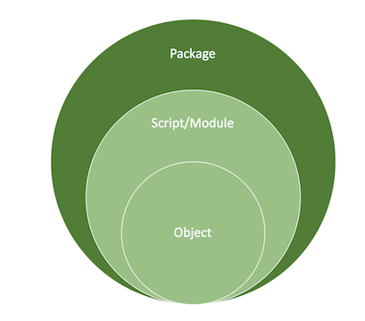
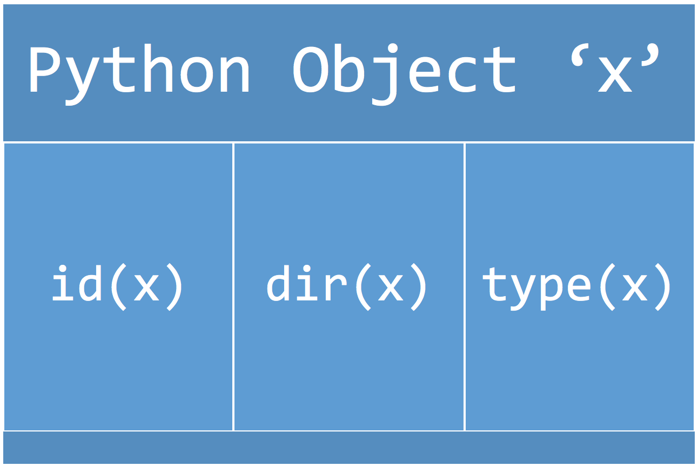

## Alice in Python projectland

Intro
Python hides the hurt
Building a simple word processor
Creating a single object
Combining objects into a program
Refactoring a single program
Combining programs into scripts
Combining scripts into a module
Project structure
Modular Code
Unit Tests
Requirements.txt and package dependencies
Documentation
Scripts
__init__.py
__main__.py driver
setup.py
Sharing and using our package
Next steps
Testing environments
More advanced testing
Continuous Integration
Git Hooks and Version Control
Setup.cfg
Sphinx/reST
Wheels
PyPi
Conclusion
Acknowledgements

### Intro
Python project structure and packaging standardization is still not a solved problem, something that became even more apparent to me when I recently worked on packaging a machine learning natural language app. -- Python项目结构和打包标准化仍然不是一个已经解决的问题，当我最近在打包机器学习自然语言应用程序时，这一点对我来说变得更加明显。

In the JVM, [as long as you have your path structured correctly](https://maven.apache.org/guides/introduction/introduction-to-the-standard-directory-layout.html), build tools will understand it and create a package for you into an executable JAR. -- 在JVM中，只要您的路径正确构建，构建工具就会理解它并为您创建一个包到可执行JAR中。

But, when I started looking for the same standardization in Python, it wasn’t as straightforward. Some questions I had as I worked: Should I be using virtualenvs? Pipenvs? `Setuptools`? Should I have a `setup.cfg`? What are wheels, or eggs, for that matter? Does each folder need an `__init__.py`? What does that file even do? How do I reference modules along the same `PYTHONPATH`? -- 但是，当我开始在Python中寻找相同的标准化时，它并不那么简单。 我工作时遇到的一些问题：我应该使用virtualenvs吗？Pipenvs？setuptools的？ 我应该有一个setup.cfg吗？ 什么是wheels, or eggs？ 每个文件夹都需要\_\_init\_\_.py吗？ 该文件甚至做了什么？ 如何在同一个PYTHONPATH中引用模块？

It became apparent that Python’s flexbility, which I really appreciate when I’m buckled down and writing code, makes it a huge pain to operationalize. -- 显而易见的是，Python的灵活性，当我被压缩并编写代码时，我真的很感激，这使得操作变得非常痛苦。

As I worked, I thought I’d write down everything I learned and built up to a complete Python project, from first principles, through a simple example, and thought it might help other people working through the same issues, as well. -- 在我工作的时候，我以为我会记下我学到的所有东西，并从一开始就通过一个简单的例子来构建一个完整的Python项目，并认为它可以帮助其他人解决同样的问题。

Come with me on a voyage of magic, adventure, and really annoying relative path references to find out how and why Python packaging works the way it does.  -- 跟我一起探索魔法，冒险和非常讨厌的相对路径参考，以了解Python包装的工作方式和原因。

This post goes through:


To comfortably go through the content, you should be reasonably comfortable with Python (aka if you know what a list comprehension is and how it works you should probably be good), and have some understanding of object-oriented programming basics. -- 为了舒适地浏览内容，你应该对Python感到相当舒服（如果你知道列表理解是什么以及它如何工作你可能应该是好的），并对面向对象的编程基础有一些了解。

All of the code is [here](https://github.com/veekaybee/textedit/tree/master/textedit).

My hope is that this post becomes a living document, so if you see something egregiously wrong, or something I missed, feel free to submit a pull request. -- 我希望这篇文章成为一个活文档，所以如果你看到一些非常错误的东西，或者我错过的东西，请随时提交拉取请求。

### Python hides the hurt
I’m going to start this Python post with a little Java. Sorry in advance. -- 我将用一点Java开始这篇Python文章。 提前抱歉。

The reasoning behind this is that having another language for comparison really helps sometimes. I’m currently working through a certificate in computer science, and most of my classes so far have been in Java. I’ve previously done mostly dynamically-typed Python, and R, which is way out there, and Scala, but for Spark, which is a separate beast altogether, so I was a little intimidated by the shackles of Java syntax. -- 这背后的原因是，使用另一种语言进行比较确实有时会有所帮助。 我目前正在修读计算机科学证书，到目前为止我的大部分课程都是用Java编写的。 我之前已经完成了大部分动态类型的Python和R，它就是那里的Scala，但对于Spark来说，它完全是一个独立的野兽，所以我对Java语法的束缚有点害怕

For instance, if I want to read a text file, change some text in it, and output to a new file, Java requires a lot of scaffolding: -- 例如，如果我想读取文本文件，更改其中的一些文本，并输出到新文件，Java需要大量的脚手架：

```java
import java.io.*;

public class Replace {

    public static void main(String[] args) throws IOException {
        File file = new File("alice.txt");

        try (FileReader freader = new FileReader(file);
             BufferedReader reader = new BufferedReader(freader);
             FileWriter writer = new FileWriter("new_alice.txt")) {
             String line;

            while ((line = reader.readLine()) != null) {
                String newLine = line.replaceAll("\\s+$", "").replaceAll("Alice", "Vicki");
                writer.write(newLine);
            }
        }
    }
}
```


But Python makes it relatively painless: -- 但Python使它相对无痛：

```python
# Replaces all instances in a file from "Alice" to "Dora the Explorer"

with open('alice.txt', 'r') as input:
	with open('new_alice.txt', 'w') as output:
		for line in input:
			line = line.rstrip()
			newline = line.replace("Alice", "Dora the Explorer")
			output.write(newline)
```

For a program of a couple lines, you might not want to use Java. But a benefit all of Java’s scaffolding and type safety, and, particularly its build tools, is that it makes large programs easier to package. -- 对于几行的程序，您可能不想使用Java。 但是Java的脚手架和类型安全性，特别是它的构建工具的好处在于它使大型程序更容易打包。

In Java, you could have three classes, put them in a project structure called `project/src/main/java/program` and call `package` on them, and they’ll automatically reference each other. Each program is automatically split logically into a single class. You can compile the separate programs in Maven. And you’re done. -- 在Java中，您可以有三个类，将它们放在名为`project/src/main/java/program`的项目结构中，并在它们上调用包，它们将自动相互引用。 每个程序自动按逻辑分成一个类。 您可以在Maven中编译单独的程序。 而且你已经完成了。

But, since Python abstracts types, objects, and paths away from the user, and there’s no centralized build system, it becomes a bit more complicated internally. -- 但是，由于Python抽象了远离用户的类型，对象和路径，并且没有集中式构建系统，因此内部变得有点复杂。

To understand what Python abstracts away and why this leads to different architecture choices, let’s start at The Beginning.

### Building a simple word processor

Let’s say I am Lewis Carroll, and I’m writing Alice in Wonderland. But instead of using ink and paper, I’d like to use some 21st century technology. -- 让我们说我是刘易斯卡罗尔，我正在写爱丽丝梦游仙境。 但我不想使用墨水和纸张，而是想使用21世纪的一些技术。

What kinds of stuff do authors usually like to do to books, that can be easily automated with a program? Fixing spacing after a period from single to double, spellcheck, replacing words in entire texts, and word count are some common text editing tasks. Authors like word editors. -- 作者通常喜欢对书籍做什么样的东西，可以通过程序轻松实现自动化？ 在从单一到双倍的句点之后修复间距，拼写检查，替换整个文本中的单词以及单词计数是一些常见的文本编辑任务。 作者喜欢文字编辑。

We’re going to create a [really, really (really) simple version of Word](https://github.com/veekaybee/textedit) to demonstrate how Python packaging works, drilling down through internals and hopefully having some fun along the way.

### Creating a single object

To start writing Python code, I’ll start in the Python REPL, the safe space for testing small pieces of code.

I might write something like,

`x = "Alice"`

This is a variable, and also, a complete piece of Python code. It looks deceptively simple - a string. But it’s really also an object, because everything, even primitive data types, is an object.

Objects are the building blocks of Python. You can create multiple objects that you bundle into a single executable file, known as a module. You can bundle several modules into a package. It gets a little more complicated when you also understand that packages and modules are also objects, but let’s keep it pretty simple here. -- 对象是Python的构建块。 您可以创建捆绑到单个可执行文件中的多个对象，称为模块。 您可以将多个模块捆绑到一个包中。 当你也明白包和模块也是对象时，它会变得有点复杂，但让我们在这里保持简单。



Once we have our object, `x`, we can find out what’s going on under the covers. -- 一旦我们得到了我们的对象x，我们就可以了解幕后发生了什么。

Each Python object has an identity - a pointer to a memory address where the object is stored, a type, and a value. All of this is metadata about the object and will help us investigate how various items in Python interact with each other. -- 每个Python对象都有一个标识 - 指向存储对象的内存地址的指针，类型和值。 所有这些都是关于对象的元数据，将帮助我们研究Python中的各个项目如何相互交互。



In Java, we can explicitly see as we build the code what the variable looks like - what type it is, what its class is, and where it fits into a program, because Java mandates that you write all of this out. -- 在Java中，我们可以明确地看到我们构建代码变量的样子 - 它是什么类型，它的类是什么，以及它适合程序的位置，因为Java强制要求你写出所有这些。

```java
public class Alice {

    public static void main(String[] args) {
        String x = "Alice";
    }

}
```

In Python, we have to dig a little to find that information. First, we can find out the memory address of the object: -- 在Python中，我们需要挖掘一点才能找到这些信息。 首先，我们可以找出对象的内存地址：

```python
>>> id(x)
4409066472
```

Then, we can look at the type of a single Python object by calling `type()` on it.

You can see that it’s an instance of class string. And, further, you can see that string is a class, too, type.

```python
>>> x = "Alice"
>>> type(x)
<class 'str'>
>>> type(str)
<class 'type'>
```

It’s classes and objects all the way down. We can also find out more about the `string` object with the `__doc__` method.

```python
>>> x.__doc__
"str(object='') -> str\nstr(bytes_or_buffer[, encoding[, errors]]) -> str\n\nCreate a new string object from the given object. If encoding or\nerrors is specified, then the object must expose a data buffer\nthat will be decoded using the given encoding and error handler.\nOtherwise, returns the result of object.__str__() (if defined)\nor repr(object).\nencoding defaults to sys.getdefaultencoding().\nerrors defaults to 'strict'."
```

(If you’re more curious about how strings specifically are created, digging into the Python source code is fun, which is where the `__doc__` string comes from.)

And if we call `dir()`, we can see all of the object attributes and methods that can act on that class. Attributes are variables and methods created specifically by higher-level Python classes. Methods are specific to that object. For example, most Python objects have the `__add__`,` __dir__`, and `__setattr__ `attributes. Only strings have `join`,`strip`, and `replace`

```python
>>> dir(x)
['__add__', '__class__', '__contains__', '__delattr__', '__dir__', '__doc__', '__eq__', '__format__', '__ge__', '__getattribute__', '__getitem__', '__getnewargs__', '__gt__', '__hash__', '', '__iter__', '__le__', '__len__', '__lt__', '__mod__', '__mul__', '__ne__', '__new__', '__reduce__', '__reduce_ex__', '__repr__', '__rmod__', '__rmul__', '__setattr__', '__sizeof__', '__str__', '__subclasshook__', 'capitalize', 'casefold', 'center', 'count', 'encode', 'endswith', 'expandtabs', 'find', 'format', 'format_map', 'index', 'isalnum', 'isalpha', 'isdecimal', 'isdigit', 'isidentifier', 'islower', 'isnumeric', 'isprintable', 'isspace', 'istitle', 'isupper', 'join', 'ljust', 'lower', 'lstrip', 'maketrans', 'partition', 'replace', 'rfind', 'rindex', 'rjust', 'rpartition', 'rsplit', 'rstrip', 'split', 'splitlines', 'startswith', 'strip', 'swapcase', 'title', 'translate', 'upper', 'zfill']
>>> x.__init__
<method-wrapper '__init__' of str object at 0x105ec4d88>
```

You can check this by creating an `int`:

```python
>>> y = 9
>>> dir(y)
['__abs__', '__add__', '__and__', '__bool__', '__ceil__', '__class__', '__delattr__', '__dir__', '__divmod__', '__doc__', '__eq__', '__float__', '__floor__', '__floordiv__', '__format__', '__ge__', '__getattribute__', '__getnewargs__', '__gt__', '__hash__', '__index__', '__init__', '__int__', '__invert__', '__le__', '__lshift__', '__lt__', '__mod__', '__mul__', '__ne__', '__neg__', '__new__', '__or__', '__pos__', '__pow__', '__radd__', '__rand__', '__rdivmod__', '__reduce__', '__reduce_ex__', '__repr__', '__rfloordiv__', '__rlshift__', '__rmod__', '__rmul__', '__ror__', '__round__', '__rpow__', '__rrshift__', '__rshift__', '__rsub__', '__rtruediv__', '__rxor__', '__setattr__', '__sizeof__', '__str__', '__sub__', '__subclasshook__', '__truediv__', '__trunc__', '__xor__', 'bit_length', 'conjugate', 'denominator', 'from_bytes', 'imag', 'numerator', 'real', 'to_bytes']
```

Finally, the object’s value. Since we’re working in the Python REPL, x is a global variable, i.e. available to the entire Python namespace. Therefore, we should be able to see it:

```python
>>> globals()
{'__loader__': <class '_frozen_importlib.BuiltinImporter'>, 'x': 'Alice', '__spec__': None, 'y': 9, '__name__': '__main__', '__doc__': None, '__builtins__': <module 'builtins' (built-in)>, '__package__': None}
```

We can run `globals` specifically on it to get its value:

```python
>>> globals()['x']
'Alice'
```

Now that we know what a single object can look like, let’s get out of the shallows of the REPL and create a bunch of them to interact with each other. -- 现在我们知道单个对象的样子了，让我们走出REPL的浅滩并创建一堆它们以相互交互。

### Combining objects into a program
Usually, after we write a couple one-liners, we want to write a complete snippet of code that does something. For example, let’s say Lewis Carroll has written a couple pages and wants to do a word count on the file he’s written (writers always want to compulsively do word counts). -- 通常，在我们编写几个单行代码之后，我们想要编写完整的代码片段来完成某些操作。 例如，让我们说刘易斯卡罗尔已经写了几页，并希望对他所写的文件进行字数统计（作者总是想要强制性地进行字数统计）。

We’ll work with `alice.txt` here:

```
Alice was beginning to get very tired of sitting by her sister on the bank, and of having nothing to do: once or twice she had peeped into the book her sister was reading, but it had no pictures or conversations in it, ‘and what is the use of a book,’ thought Alice ‘without pictures or conversations?’
So she was considering in her own mind (as well as she could, for the hot day made her feel very sleepy and stupid), whether the pleasure of making a daisy-chain would be worth the trouble of getting up and picking the daisies, when suddenly a White Rabbit with pink eyes ran close by her.
There was nothing so very remarkable in that; nor did Alice think it so very much out of the way to hear the Rabbit say to itself, ‘Oh dear! Oh dear! I shall be late!’ (when she thought it over afterwards, it occurred to her that she ought to have wondered at this, but at the time it all seemed quite natural); but when the Rabbit actually took a watch out of its waistcoat-pocket, and looked at it, and then hurried on, Alice started to her feet, for it flashed across her mind that she had never before seen a rabbit with either a waistcoat-pocket, or a watch to take out of it, and burning with curiosity, she ran across the field after it, and fortunately was just in time to see it pop down a large rabbit-hole under the hedge.
In another moment down went Alice after it, never once considering how in the world she was to get out again.
```

We are now working with a file, `wordcount.py`, and a text file, in the same directory.

```bash
mbp-vboykis:python_packaging vboykis$ tree
├── alice.txt
└── wordcount.py
```


The loop is still a single logical piece of code. Let’s save this as a file and execute it on the command line:

`vboykis$ python wordcount.py`
`Word Count: 274`

Let’s take a look inside:

```python
with open('alice.txt', 'r') as file:
	file_contents = file.read()
	print('Word count:', len(file_contents.split()))
		
    ---
    Word count: 274
```

We still have objects that we are performing operations on. `file` is an object, as is `file_contents` and `len(file_contents.split())`, but now we’re getting more interesting types:

```
type(file_contents)
str

type(file)
_io.TextIOWrapper

type(len(file_contents.split()))
int
```


When we run `python wordcount.py`, a [couple things happen](https://tech.blog.aknin.name/2010/04/02/pythons-innards-introduction/):

1) Python parses command line arguments (everything after `python` on the CLI)

2) Python checks for any dependencies (aka `import` statements) and pulls them in.

3) Python looks in our current working directory (`python_packaging`) for anything related to the file, and uses the path setup from when Python was installed on your system. -- Python在我们当前的工作目录（python_packaging）中查找与该文件相关的任何内容，并使用系统上安装Python时的路径设置。

Let’s check what our `PYTHONPATH` is:

```python
>>> import os
>>> import sys

>>> os.getcwd() #where we're currently running code
'/python_packaging'

>>> print('\n'.join(sys.path)) # all the paths Python checks for packages

python3/3.5.1/Frameworks/

Python.framework/Versions/3.5/lib/python35.zip
python3/3.5.1/Frameworks/

Python.framework/Versions/3.5/lib/python3.5
python3/3.5.1/Frameworks/

Python.framework/Versions/3.5/lib/python3.5/plat-darwin
python3/3.5.1/Frameworks/

Python.framework/Versions/3.5/lib/python3.5/lib-dynload
/usr/local/lib/python3.5/site-packages
```

4) Python assembles a Python virtual machine, `CPython`, to execute and interpret the code. -- Python组装了一个Python虚拟机CPython来执行和解释代码。

5) If there are no external dependencies (aka packages), as is the case in our word count program, a special attribute, `__name__ `is initialized to `"__main__"` in the **main** namespace. -- 如果没有外部依赖项（也就是包），就像我们的单词计数程序中的情况一样，一个特殊属性`__name__`在主命名空间中初始化为“`__main__`”。

Program:

```python
print("__name__:", __name__)

with open('texts/alice.txt', 'r') as file:
	file_contents = file.read()
	print('Word count:', len(file_contents.split()))
```

Output:

```bash
mbp-vboykis:python_packaging vboykis$ python wordcount.py 
__name__: __main__
Word count: 274
```

How do we get that file elsewhere? For example, how do we import functions from wordcount if we’re in the REPL? The REPL is, essentially, a special case of a file being executed directly in our current working directory. -- 我们如何在其他地方获得该文件？ 例如，如果我们在REPL中，我们如何从wordcount导入函数？ REPL本质上是一个直接在我们当前工作目录中执行的文件的特例。

However, if we run `wordcount.py` form the REPL, since we’re importing the `wordcount` module from elsewhere, the name immediately becomes that module.

```python
>>> import wordcount
>>> wordcount.__name__
'wordcount'
```

6) All of the code gets translated at run-time to byte code using the CPython interpreter. Python generates a copy of the file with the `.pyc` extension in a folder called `__pycache__`. -- 使用CPython解释器将所有代码在运行时转换为字节代码。 Python在名为`__pycache__`的文件夹中生成扩展名为`.pyc`的文件的副本。

If you want to see what the byte code of our program looks like, [digging into it](http://akaptur.com/blog/2013/08/14/python-bytecode-fun-with-dis/) can be fun. -- 如果你想看看我们程序的字节代码是什么样的，挖掘它可能很有趣。

7) As the code is executed, Python reads all of our objects and loops. The interpreter allocates memory to the code and the special Python structures for each object are created. This is where the `id` for each object is created, and why we can call these things after we run the code. -- 在执行代码时，Python会读取所有对象和循环。 解释器为代码分配内存，并创建每个对象的特殊Python结构。 这是创建每个对象的id的地方，以及我们在运行代码后调用这些东西的原因。

We’ve just created a Python runtime environment, told Python which directories it should be reading from, imported some stuff, allocated memory, and given some output. Basically all of the things we do to run a program. -- 我们刚刚创建了一个Python运行时环境，告诉Python它应该从哪个目录读取，导入一些东西，分配内存，并给出一些输出。 基本上我们为运行程序所做的所有事情。

### Refactoring a single program
Ok, so we’ve run our program. But, if we try to run it on any other file, not just `alice.txt`, we won’t be able to. Let’s make it a bit more robust. First, we’ll abstract out some of the hard coding referencing `alice.txt`. -- 好的，我们运行我们的程序。 但是，如果我们尝试在任何其他文件上运行它，而不仅仅是alice.txt，我们将无法执行。 让我们更健壮一点。 首先，我们将抽象出一些硬编码引用alice.txt。

Second, we’ll turn the code from a simple loop, into a function that acts like an API so that we can access a single pointer to our loop from other places in the file, and from other files. -- 其次，我们将代码从一个简单的循环转换为一个像API一样的函数，这样我们就可以从文件的其他位置和其他文件访问我们循环的单个指针。

Finally, we’ll add if `__name__ == '__main__' `to the program, put all the functions we want to execute under the if block, and run the file that way.

This is a really common pattern for running multiple functions and keeping track of them. As we noted in the last section, -- 这是运行多个函数并跟踪它们的一种非常常见的模式。 正如我们在上一节中提到的，

> If there are no external dependencies (aka packages), as is the case in our word count program, a special attribute, `__name__ `is initialized to "`__main__`" in the **main** namespace
>
> If the program is the main program you’re running, Python will run everything in order under that statement.

Note that if you don’t have `if __name__ == '__main__'`, the code won’t run anything since the function is initialized but not executed. -- 请注意，如果您没有`if __name__ =='__ main__'`，则代码将不会运行任何内容，因为函数已初始化但未执行。

This is a really important pattern to understand, because it looks into how Python references the current module you’re working with in relation to other modulers. -- 这是一个非常重要的理解模式，因为它会探讨Python如何引用您正在使用的当前模块与其他模块相关的模块。

Let’s also: adding a function that counts sentences, as well.

Program:

```python
def word_count(filename):
	with open(filename, 'r') as file:
		file_contents = file.read()
		print('Total words:   ', len(file_contents.split()))

def sentence_count(filename):
	with open(filename, 'r') as file:
		file_contents = file.read()
		print('total sentences:    ', file_contents.count('.')		+file_contents.count('!')+file_contents.count('?'))


if __name__ == '__main__':
	word_count('pool_of_tears.txt')
	sentence_count('pool_of_tears.txt')
```

Output:

```bash
vboykis$ python wordcount.py
Total words:    2098
total sentences:     117
```

These kinds of refactoring tasks will become important as we start to understand how many files, or modules, reference each other in a package. -- 当我们开始了解有多少文件或模块在包中相互引用时，这些重构任务将变得很重要。

We’re also going to slightly modify wordcount to return a value instead of print so we don’t double-print: -- 我们还将稍微修改wordcount以返回值而不是print，因此我们不会双重打印：

```python
def word_count(filename):
	with open(filename, 'r') as file:
		file_contents = file.read()
		return('Total words:   ', len(file_contents.split()))

def sentence_count(filename):
	with open(filename, 'r') as file:
		file_contents = file.read()
		return('total sentences:    ', file_contents.count('.')+file_contents.count('!')+file_contents.count('?'))


if __name__ == '__main__':
	print(word_count('pool_of_tears.txt'))
	print(sentence_count('pool_of_tears.txt'))
```


Let’s do one more thing, and now make this function a class so that it’s really, really easy to reference from other modules. -- 让我们再做一件事，现在让这个函数成为一个类，这样它真的很容易从其他模块中引用。

A class is part of object-oriented programming, and makes code more modular and easy to call. A class, in a way, is like an API.

And, let’s add a character count (we’ll need that for some later work we’re doing):

```python
## wordcount.py

#!/usr/bin/env python

"""Takes a file as sys.arg[1] as input and returns a wordcount, 
character count, and sentence count.

Sysargs:  filename
"""

import re
import sys


class WC:
	"""Conducts character, word, and letter count of object"""

	def __init__(self, filename):

		self.filename = filename


	def open_file(self,filename):
		"""Opens a file object to be used across the class"""
		with open(filename,'r') as f:
			file_contents = f.read()
			return file_contents


	def word_count(self):
		"""Returns a file's word count"""

		wc_file = self.open_file(self.filename)
		self = len(wc_file.split())
		return("Words:",len(wc_file.split()))


	def sentence_count(self):
		"""Returns a file's word sentence count"""

		sc_file = self.open_file(self.filename)
		
		return("Sentences:", sc_file.count('.') + sc_file.count('!') + sc_file.count('?'))

	def letter_count(self):

		"""Returns a file's character count, excluding punctuation"""
		letter_counter = 0

		pattern = r'[\W]' # excluding all punctuation

		cc_file = self.open_file(self.filename)

		total_words = cc_file.split()

		for word in total_words: 
			for letter in word:
				if not re.search(pattern, letter):
					letter_counter += 1
		
		return("Letters:", letter_counter)

	def counts(self):
		print(self.word_count(),'\n',self.sentence_count(),'\n',self.letter_count())

if __name__ == '__main__':
	alice = WC(sys.argv[1])
	WC.counts(alice)
```

Now we’re cooking. We’ve got a program that’s easy to read, abstractable, and applicable across multiple files. We have a complete Python module.

For bonus fun and to do some QA, you can paste the test into Word to do a sanity check. I got 274 words, which matches our program. -- 为了获得额外的乐趣并进行一些质量检查，您可以将测试粘贴到Word中以进行健全性检查。 我有274个单词，与我们的程序相符。

### Combining programs into scripts

Ok, we’ve cleaned up a single file. We have a pretty simple, clean module to do a word count, a sentence count, or character count on any file that’s input. But what if we want to count the words in a file, and then replace some text in that file, save as a new file, and do a word count again? -- 好的，我们已经清理了一个文件。 我们有一个非常简单，干净的模块，可以对输入的任何文件进行字数统计，句子计数或字符计数。 但是，如果我们想要计算文件中的单词，然后替换该文件中的某些文本，另存为新文件，并再次进行单词计数，该怎么办？

I could do this in the same `wordcount.py` script, but for the sake of the case study and modulatrity, let’s call these separate pieces of code, since they do separate things. The `wordcount` module is for analytics, the new module would actually change things in the program. -- 我可以在相同的wordcount.py脚本中执行此操作，但是为了案例研究和模块化，我们将这些单独的代码调用，因为它们分开了。 wordcount模块用于分析，新模块实际上会改变程序中的内容。

So now I want one piece of code to do a word count and another to replace words in a file. Here’s the word replacement. As always, we start with a single file and a single function. -- 所以现在我想要一个代码来进行单词计数而另一个代码来替换文件中的单词。 这是替换这个词。 与往常一样，我们从单个文件和单个函数开始。

```bash
mbp-vboykis:python_packaging vboykis$ tree
├── alice.txt
├── pool_of_tears.txt
└── replace.py
└── wordcount.py
```

Now we have a couple of text samples and a couple of modules in the same file folder. Starting to get a little complicated, but it’s not too bad, yet.

```python
## replace.py

def replace_words(words):
	with open(words, 'r') as input:
		with open('new_alice.txt', 'w')as output:
			for line in input:
				line = line.rstrip()
				newline = line.replace("Alice", "Dora the Explorer")
				print(newline)
				output.write(newline)

if __name__ == '__main__':
	replace_words('alice.txt')
```

Let’s say I want to call the wordcount on alice.txt, and then again on new_alice.txt, since I am adding more words. I could copy and paste the word_count method into the replace_words code. -- 假设我想在alice.txt上调用wordcount，然后再调用new_alice.txt，因为我要添加更多单词。 我可以将word_count方法复制并粘贴到replace_words代码中。

Or, I could just reference it from a different file in the same directory. Remember, Python always checks the directory you’re currently working in first for files, and the top-level file is the one that has the `__main__ `module. -- 或者，我可以从同一目录中的不同文件中引用它。 请记住，Python始终会检查您当前正在处理文件的目录，而顶级文件是具有`__main__`模块的文件。

Our directory currently looks like this:

```bash
mbp-vboykis:python_packaging vboykis$ tree
├── alice.txt
├── new_alice.txt
├── pool_of_tears.txt
├── replace.py
└── wordcount.py
```

Now, I’d like to call the  `wordcount` module from the `replace` module. Remember that all modules can be imported with their filename. So, if we are in the same directory, we should be able to do a simple `import wordcount`. Once we do that, we have access to all of wordcount’s classes and methods in the `replace` module.

We also want to see what the name of the module in relationship to the module calling it is. Notice that wordcount’s `__name __`is `wordcount`, while `replace's` is `main`, since that’s now the main module we’re referencing.

Program:

```python
## replace.py

from wordcount import WC

def replace_words(words):
	with open(words, 'r') as input:
		with open('new_alice.txt', 'w')as output:
			for line in input:
				line = line.rstrip()
				newline = line.replace("Alice", "Dora the Explorer")
				output.write(newline)

if __name__ == '__main__':
	replace_words('alice.txt')
	alice = WC('alice.txt')
	new_alice = WC('texts/new_alice.txt')
	print("Old Wordcount",alice.word_count())
	print("WC __name__:", WC.__name__)
	print("New Wordcount",new_alice.word_count())
	print("replace __name__:", __name__)
```

Output:

```bahs
Old Wordcount ('Words:', 274)
WC __name__: WC
New Wordcount ('Words:', 281)
replace __name__: __main__
```

Once again:

All of the functions from the wordcount module are imported into the replace module, to be used. That module is no longer the main module when you are running replace, but a helper module, because of the way `__name__` now points. These two modules also have to be in the same directory.

This distinction makes up the heart of the Python packaging system.

Let’s finish up by replace a callable object with an API, as well.

### Combining scripts into a module
Ok, now we have a word “editor”, a word counter, and we’re cranking away on Alice in Wonderland. What else might we want in a text editor? -- 好的，现在我们有一个单词“编辑器”，一个单词计数器，我们正在开启爱丽丝梦游仙境。 在文本编辑器中我们还想要什么？

Let’s brainstorm a couple modules of functionality: -- 让我们集体讨论几个功能模块：

* the ability to change from single to double space after a period? -- 一段时间后从单一空间变为双重空间的能力？
* And, the ability to determine how readable our document is based on the Colman-Liau index. There are lots of ways to gauge readability, but a lot of them involve counting word syllables, which is too complicated for what we’re trying to do here, which is focus on Python package structure. (If you are interested in wordcount, check out my other posts. ) -- 并且，能够确定我们的文档基于Colman-Liau索引的可读性。 有许多方法可以衡量可读性，但其中很多都涉及计算单词音节，这对于我们在这里尝试做的事情来说太复杂了，而这些重点是Python包结构。 （如果您对wordcount感兴趣，请查看我的其他帖子。）

So, in addition to our two modules:

* wordcount
* replace

We’ll be adding two more

* spacing
* readability

Based on PEP, the arbiter in Python style, the package name should be [short, lowercase, and meaningful..](https://www.python.org/dev/peps/pep-0008/#package-and-module-names)

Now that we have more than three modules, and also some text files, we’ll want to create a package. Let’s follow PEP again and call it something easy: textedit. If we were publishing this package to PyPI, the public repository of all available Python code and where we pull stuff from when we do pip package, we would want to make sure it doesn’t conflict with other names. Since we’re just sharing it with ourselves and maybe a couple of other people on our team, it’s fine for now. -- 既然我们有三个以上的模块，还有一些文本文件，我们就想创建一个包。 让我们再次关注PEP并称之为简单：textedit。 如果我们将这个包发布到PyPI，所有可用Python代码的公共存储库以及我们从pip包中提取内容的地方，我们希望确保它不与其他名称冲突。 由于我们只是与自己分享，也许我们团队中的其他人也分享，现在一切都很好。

Note: there are IDEs (PyCharm) and [programs](https://github.com/audreyr/cookiecutter-pypackage) that set up a cookiecutter Python application for you, but I’ve found these to be too complicated when you’re just starting out.

It’s important to understand what is actually being set up, and not to get too bogged down in the implementation/continuous integration details that you might not have to deal with at first. -- 了解实际设置的内容非常重要，而不是在实际/持续集成细节中陷入困境，这些细节最初可能不需要处理。

So we want something, at the very basic level, like this:

```bash
textedit
├── replace.py
├── wordcount.py
├── spacing.py
└── readability.py
```


Once we look at this, we might see that some modules belong together logically. For example, wordcount and spellcheck just take the text and analyze it. And, in fact, in the Word menu bar, they’re grouped together: -- 一旦我们看到这一点，我们可能会看到一些模块在逻辑上属于一起。 例如，wordcount和spellcheck只需获取文本并进行分析。 事实上，在Word菜单栏中，它们被组合在一起：


Which brings me to a (probably obvious) tip: Try to base your software on existing, successfully-tested patterns in the real world instead of trying to greenfield it. Chances are someone has already solved the exact problem you’re trying to solve. -- 这让我想到了一个（可能是显而易见的）提示：尝试将您的软件基于现实世界中现有的，经过成功测试的模式，而不是尝试对其进行绿化。 有可能有人已经解决了你想要解决的确切问题。

replace and spacing actually edit the document and create new copies of files. So you might want something like the way these functions are organized in the Word menu. And then you have your text documents that you’re actually testing the functionality on. Those should be separate from the code. -- 替换和间距实际上编辑文档并创建新的文件副本。 因此，您可能需要类似于在Word菜单中组织这些功能的方式。 然后你有你正在测试功能的文本文档。 那些应该与代码分开。

```bash
textedit
	├── edit
		├── replace.py
		├── spacing.py
	├── review
		├── wordcount.py
		└── readability.py
	├── texts
		├── alice.txt
		└── pool_of_tears.txt
```

At its very basic level, this is what our code structure looks like. -- 在最基本的层面上，这就是我们的代码结构。

### Project structure
But, there are signals we need to give to Python to read this correctly. CPython also needs to know how these things relate to each other in order to compile a package for us. And the code needs to be built in a way such that other people can seamlessly download it and use it without a lot of explanation from you. -- 但是，我们需要向Python提供正确读取此信息的信号。 CPython还需要知道这些事情如何相互关联才能为我们编译包。 并且代码需要以某种方式构建，以便其他人可以无缝地下载并使用它而无需您的大量解释。

Which is why, if you look at some popular Python project folder structures,like Pandas, Requests, or Flask, you’ll see they tend to be a bit more complicated. -- 这就是为什么，如果你看一些流行的Python项目文件夹结构，如Pandas，Requests或Flask，你会发现它们往往有点复杂。

Generally, it’s a good idea to look at other people’s work, so here are some [smaller Python packages to take a look at](https://news.ycombinator.com/item?id=9896369). -- 一般来说，查看其他人的工作是个好主意，所以这里有一些较小的Python包来看一看。

So how do you go from two scripts to a fully-functional package? -- 那么你如何从两个脚本转变为一个功能齐全的包呢？

### Modular Code
First, Python needs to have all of the files of the [project in its same directory and subdirectory:](https://the-hitchhikers-guide-to-packaging.readthedocs.io/en/latest/creation.html#directory-layout). The top-level textedit is the distribution or package, and the lower-level one is the actual module. -- 首先，Python需要将项目的所有文件放在同一目录和子目录中： 顶级textedit是分发或包，而低级textedit是实际模块。

```bash
textedit - package
 	textedit - module
		├── edit
			├── replace.py
			├── spacing.py
		├── review
			├── wordcount.py
			└── readability.py
		├── texts
			├── alice.txt
			└── pool_of_tears.txt
```

### Unit Tests
Then, you’ll want to add tests. Unit tests help you make sure that your code runs as expected, even as you change it. You usually want to write a test for each function or package.

There is a whole art/science to unit testing, but for the sake of this example, I’m going to skip it and just write an example test, called `test_wordcount.py`.

Program:

```python
import unittest
import sys
import os


sys.path.append(os.path.abspath("python_packaging/textedit/textedit/review"))
from wordcount import WC

WC_test = WC('../texts/alice.txt')

class Test(unittest.TestCase):

	wc = ('Words:', 274)
	sc = ('Sentences:', 7)
	cc = ('Letters:', 1120)


	def test_wc(self):
		self.assertCountEqual(WC_test.word_count(),self.wc)

	def test_sentences(self):
		self.assertEqual(WC_test.sentence_count(), self.sc)


	def test_characters(self):
		self.assertEqual(WC_test.character_count(), self.cc)

 
if __name__ == '__main__':
    unittest.main()
```

Output:

```bash
    mbp-vboykis:tests vboykis$ python test_wordcount.py 
...
----------------------------------------------------------------------
Ran 3 tests in 0.001s

OK
```

When you run this piece of code, it will check to make sure that wordcount is doing what you want it to do. Usually, we’ll want to have the units broken down and more well-defined, but remember, here, we’re focusing on building a package rather than the nuances of testing. -- 当您运行这段代码时，它将检查以确保wordcount正在执行您希望它执行的操作。 通常，我们希望拆分单元并更加明确，但请记住，在这里，我们专注于构建包而不是测试的细微差别。

But, whoa! What’s going on up top here? We have some important changes:

1. Lots of imports
2. `sys.path.append`
3. `../texts/alice.txt` as a relative file reference.

Here’s where the fun of packaging starts. Because we now have files in different directories, Python needs to understand how to link those directories together to execute the files. -- 这就是包装开始的乐趣所在。 因为我们现在在不同的目录中有文件，所以Python需要了解如何将这些目录链接在一起以执行文件。

Before, we were executing everything in the same folder. But now, Python needs to know what you’re talking about when you do `from wordcount import WC`, because that package is not in our current working directory, and it’s not in the package path that we have when we did this:

```python
>>> import os
>>> os.getcwd() #where wer're currently running code
'/python_packaging'

>>> print('\n'.join(sys.path)) # all the paths Python checks for packages
```

So we have to add this `sys.path.append(os.path.abspath("/python_packaging/textedit/textedit/review"))` to our sys path so Python knows where to refrence it from:

```python
>>>sys.path.append(os.path.abspath("/python_packaging/textedit/textedit/review"))
>>> print('\n'.join(sys.path))

python3/3.5.1/Frameworks/
Python.framework/Versions/3.5/lib/python35.zip
python3/3.5.1/Frameworks/Python.framework/Versions/3.5/lib/python3.5
python3/3.5.1/Frameworks/Python.framework/Versions/3.5/lib/python3.5/plat-darwin
python3/3.5.1/Frameworks/Python.framework/Versions/3.5/lib/python3.5/lib-dynload
/usr/local/lib/python3.5/site-packages
/python_packaging/textedit/textedit/review
```

And there it is, at the end. For now, we have to add `sys.path.append` to every file that we want to import. This is temporary, just to show how that works. We’ll fix this later. - 最后，它就在那里。 现在，我们必须将`sys.path.append`添加到我们要导入的每个文件中。 这是暂时的，只是为了说明它是如何工作的。 我们稍后会解决这个问题。

And, speaking of imports, we now have external packages that we’re calling: os, re, and sys, common modules. How does our package know how to call those? -- 而且，谈到导入，我们现在有外部包，我们正在调用：os，re和sys，通用模块。 我们的包裹如何知道如何调用它们？

### Requirements.txt and package dependencies
```bash
textedit - package
 	textedit - module
		├── edit
			├── replace.py
			├── spacing.py
		├── review
			├── wordcount.py
			└── readability.py
		├── tests
			└── test_wordcount.py
	requirements.txt
```

We put a requirements.txt module at the top level of our module. This file that will tell people who install the package which Python packages are used in our programs and automatically install them when you run `pip install .` on the package. (We may have to run `pip install -r requirements.txt` separately, but that’s usually an edge case.)

For example, we’ve used `os`, `sys`, and `re` in building this module so far. These are standard library modules, and come default with every Python install. It will also sync versions to make sure that they have the exact version you used to develop your code.

To create a requirements file, you would normally do a  `pip freeze > requirements.txt`. You’ll notice that this includes a lot of stuff, basically everything you have in your Python environment, since `pip freeze` doesn’t know which specific packages you’re using to build your package and there could be interactions.

There are several ways to build requirements on a per-project basis, but we’re not going to use them here because we want to focus, again, on packaging rather than Python environments. A simpler way to do this is to install [pipreqs and take it from there](https://github.com/bndr/pipreqs). -- 有几种方法可以在每个项目的基础上构建需求，但是我们不打算在这里使用它们，因为我们希望再次关注打包而不是Python环境。 一种更简单的方法是安装pipreqs并从那里获取它。

`pipreqs --force "/python_packaging/textedit/textedit"`

If you run that, you’ll see that the file generated is blank, because the three modules we’ve included, `os`, `re`, and `sys`, are part of the standard Python library. If we included something like NumPy, we’d get:

```bash
mbp-vboykis:textedit vboykis$ cat requirements.txt 
nltk==3.2
```


### Documentation
Let’s add some documentation, as well. Good documentation is really important, paricularly to someone just coming into your project. And, even more so, for yourself tomorrow morning. :) The easiest way to add documentation is to add a  README to the top level of your module, the same place as requirements.txt.

 textedit - package
 	textedit - module
​		├── edit
​			├── replace.py
​			├── spacing.py
​		├── review
​			├── wordcount.py
​			└── readability.py
​		├── tests
​			└── test_wordcount.py
​	README.MD
​	requirements.txt
​		
​		
Here are some aspirational examples of what good documentation should look like, but remember, these are really complicated examples. Here’s a good, simple one.

The advanced next level is to generate your documentation with Sphinx or reST. Don’t worry about that yet.

Documentation also includes your code. All of your code should have headers, and your classes should have docstrings, as well. Comments are good!

For headers, there are mixed opinions onto what one should contain, but I think headers help.

"""This module contains x, y
Author: Vicki Boykis
"""
For classes, check out Scikit-learn; it’s really good at documentation

Scripts
If you have any shell scripts or additional helper methods associated with your project, you can create a bin directory for them. We don’t, so that folder will be empty. But scripts are usually present anywhere you have to deploy stuff, add it to cron, or generally put it in production in any way.

This is also where continuous integration can come in.

 textedit - package
 	__init__.py
 	bin/ # scripts
 	textedit - module
 		__init__.py
​		├── edit
​			├── replace.py
​			├── spacing.py
​		├── review
​			__init__.py
​			├── wordcount.py
​			└── readability.py
​		├── tests
​		    __init__.py
​			└── test_wordcount.py
​	README.MD
​	requirements.txt
​			
__init__.py
And, finally and most importantly, the __init__.py, which we’ll want to add to every directory where you have runable Python modules.

If you remember from the Python innards overview __init__ is a special file that will make Python realize that you have a package working together instead of a single file.

We can leave it null. Or you can add things to it that will initialize when the module is run. Let’s leave it null for now.

When Python imports the module for the first time, it checks the module registry for a list of modules that it can use. Init allows your module to be put in that registry..

__main__.py driver
There is this concept in Java of a driver program that you can run and have it call all the other programs in the package.

In Python, we can also have a __main__.py file, which will execute everything in it first and pull in from other directories. This might be helpful if you’re pre-executing things, like for example a script has to kick off right away to load the word document, for example.

Here, since we’re just performing different things to a document in a single state, we don’t really need it.

Additionally, there are mixed thoughts about having a driver. Google’s Python code, for example, says that every file should have a name/main pattern.

 textedit - package
 	__init__.py
 	__main__.py
 	bin/
 	textedit - module
 		__init__.py
​		├── edit
​			├── replace.py
​			├── spacing.py
​		├── review
​			__init__.py
​			├── wordcount.py
​			└── readability.py
​		├── tests
​			└── test_wordcount.py
​	README.MD
​	requirements.txt
​			
setup.py
Now that we have the scaffolding in place, we can add things that will help us set up the module after we import it from pip or download it.

This is setup.py, the heart of a project.

It has metadata about the project, import distutils, which does the actual program setup whenever someone downloads it, as we specified in the README.md, and be at the top level of the package..

Here’s more really good background on what goes into the file.

Here’s what ours will look like. The most important part is setting the here variable to the current filepath.

Remember how we had to do crazy things to get our modules to reference each other in the context of the package? sys.path.append(os.path.abspath("python_packaging/textedit/textedit/review"))

This lets us avoid all of that and forces a root directory.

import io
import os
import sys
from shutil import rmtree

from setuptools import find_packages, setup, Command

# Package meta-data.
NAME = 'textedit'
DESCRIPTION = 'A simple Python text editor for Victorian authors who just want to write. '
URL = 'https://github.com/veekaybee/textedit'
EMAIL = 'vickiboykis@gmail.com'
AUTHOR = 'Vicki Boykis'

# What packages are required for this module to be executed?
REQUIRED = [
​    # 'requests', 'maya', 'records',
]

# The rest you shouldn't have to touch too much :)
# ------------------------------------------------
# Except, perhaps the License and Trove Classifiers!
# If you do change the License, remember to change the Trove Classifier for that!

here = os.path.abspath(os.path.dirname(__file__))


# Where the magic happens:
setup(
​    name=NAME,
​    #version=about['__version__'],
​    description=DESCRIPTION,
​    # long_description=long_description,
​    author=AUTHOR,
​    author_email=EMAIL,
​    url=URL,
​    packages=find_packages(exclude=('tests',)),
​    # If your package is a single module, use this instead of 'packages':
​    # py_modules=['mypackage'],

    # entry_points={
    #     'console_scripts': ['mycli=mymodule:cli'],
    # },
    install_requires=REQUIRED,
    include_package_data=True,
    license='MIT',
    classifiers=[
        # Trove classifiers
        # Full list: https://pypi.python.org/pypi?%3Aaction=list_classifiers
        'License :: OSI Approved :: MIT License',
        'Programming Language :: Python',
        'Programming Language :: Python :: 2.6',
        'Programming Language :: Python :: 2.7',
        'Programming Language :: Python :: 3',
        'Programming Language :: Python :: 3.3',
        'Programming Language :: Python :: 3.4',
        'Programming Language :: Python :: 3.5',
        'Programming Language :: Python :: 3.6',
        'Programming Language :: Python :: Implementation :: CPython',
        'Programming Language :: Python :: Implementation :: PyPy'
    ],

)

Now, once we run setup.py like the README specifices, we can follow the accepted module import naming structure, which is:

import module.submodule

For us, it would be:

import edit.replace

The rest is metadata about who you are and what the package looks like. It’s really top-loaded for use in PyPI, so I removed those components and kepts the ones necessary for use locally.

One of the things included in here is the install_requires which lists the requirements that will be installed for the file to continue. But wait, you say. Don’t we already have a requirements.txt file? Yes, we do. We’ll be using that one, instead.

The difference between the two is that install_requires is configured more if you’re packaging for production-ready systems and putting your package in PyPi, the Python package repository. If you are targeting specific packages in development or testing, use requirements.txt.

Since we’re not exactly focusing on targeting PyPi here to keep things simple, we’ll use requirements.

So now, finally we have:

 textedit - package
 	__init__.py
 	setup.py
 	textedit - module
 		__init__.py
 		├── texts
 			├── alice.txt
​			├── pool_of_tears.txt
​		├── edit
​			__init__.py
​			├── replace.py
​			├── spacing.py
​		├── review
​			__init__.py
​			├── wordcount.py
​			└── spellcheck.py 
​		├── tests
​	README.md
​	requirements.txt
​	
​			
Now that we have everything set up, let’s convert the rest of the code to more OOP-like practices, clean it up, and take a look.

An extra step we can take here is to make sure that none of the modules actually have an if __name__ == '__main__' piece of code so that they don’t run on their own, and create that driver module we were talking about so that there is only one entry point to the package.

You can see that in action here, for example. that’s a matter of style and might or might not make sense for your program.

Sharing and using our package
wordmenu

Ok, we’re done writing all of our code, our tests, making sure objects are accessible, and we have our structure all layed out. What do we do now? Let’s package it!

Let’s go to the module level of our package - where our setup.py file that will actually handle the install is located

mbp-vboykis:textedit vboykis$ cd /python_packaging/textedit/textedit

and run

pip install .

You should see something like this:

mbp-vboykis:textedit vboykis$ pip install .
Processing /python_packaging/textedit/textedit
Installing collected packages: textedit
  Running setup.py install for textedit ... done
Successfully installed textedit-0.0.0
✨ We’ve installed our package locally! ✨

Let’s see that it’s in our PYTHONPATH:

python3/3.5.1/Frameworks/Python.framework/Versions/3.5/lib/python35.zip
python3/3.5.1/Frameworks/Python.framework/Versions/3.5/lib/python3.5
python3/3.5.1/Frameworks/Python.framework/Versions/3.5/lib/python3.5/plat-darwin
python3/3.5.1/Frameworks/Python.framework/Versions/3.5/lib/python3.5/lib-dynload
/usr/local/lib/python3.5/site-packages
/usr/local/lib/python3.5/site-packages/textedit-0.0.0-py3.5.egg
And now, let’s write some code with it! We can either use the command line to run individual modules:

#Replace 

python replace.py ../texts/alice.txt "Alice" "Dora the Explorer"
Old Wordcount ('Words:', 274)
WC __name__: WC
New Wordcount ('Words:', 281)
replace __name__: __main__

#WordCount

mbp-vboykis:review vboykis$ python wordcount.py "../texts/alice.txt"
('Words:', 274)
('Sentences:', 7)
('Letters:', 1120)

# Readability

mbp-vboykis:review vboykis$ python readability.py "../texts/alice.txt"
('Reading Grade Level of Text:', 7)
Or we can now call the package from a completely new program, since we have it installed. Note the import structure. Each folder and subfolder is folder.subfolder, and each module name is after the import. Classes are referenced later down.

"""Tests textedit functionality on the pool_of_tears.txt file"""


from textedit.review import readability 
from textedit.review import wordcount 
from textedit.edit import spacing
from textedit.edit import replace


test_file = '/python_packaging/textedit/textedit/texts/pool_of_tears.txt'

# Count words
alice = wordcount.WC(test_file)

print(wordcount.WC.word_count(alice))
print(wordcount.WC.character_count(alice))
print(wordcount.WC.sentence_count(alice))

# Readability Index

print(readability.colman_liau(test_file))

# Change Spacing

sp = spacing.Spacing(test_file)
spacing.Spacing.spacing_check(sp)
print('Spaces replaced')

# Replace Words

replace.Replace(test_file, "Alice", "Dora the Explorer")
print('Words replaces')
The next step would be to use argparse to pass arguments a bit more cleanly.

And that’s it! We’ve imported a package that we can now use to write other software.

Next steps
wordmenu

🎉 Congratulations! We’ve built a Python package! 🎉

What’s next? A lot. But we’re not going to cover any of it in this post, because the goal, again, was to understand the basics of packaging.

But, now that we’ve taken our first step into a much larger and more insane world, there are a lot more next steps we can take to make sure our code is clean, secure, and easy to use.

Here are some great places to start exploring once you’ve gotten the hang of the above:

Testing environments
I mentioned before that there are several ways to create specific environments to build your applications so you’re isolated from whatever else is going on in your Python ecosystem.

1) Use virtualenv, which acts like a container and isolates the application you’re developing to a single environment that just has the packages you’re interested in for that specific application.

2) Use pipenv, in which you install packages through pipenv install requests instead of pip. It will create a Pipfile, which keeps track of all your libraries.

Both of these are involved in modifying the sys.path that we looked at earlier so that Python knows where to find other files.

Your next step would be to use either of these instead of your local Python environment.

More advanced testing
Unittest is a great starting point, but there’s also pytest, nose, mock testing (when you have complex object dependencies), and much, much more. All of these work slightly differently.

Continuous Integration
Once you build a package, you’ll probably want to make changes to it. And push those changes to some remote version-controlled repository so that others can use them. And you’ll want to automate this process so that you’re not manually doing pip install .. This process is known as continuous integration.

There’s a number of fantastic tools for Python CI. The most popular one these days is Travis, which involves adding a travis.yml file that will test your code against your tests and known Python versions.

Git Hooks and Version Control
We haven’t touched the subject of version control for your package, but you’ll want to add it to specific repositories. We can also add pre-commit and post-commit hooks to our code, which mean that the code gets checked, or some specific action is triggered, when you try to check in your code.

Setup.cfg
In our module, there are no passwords or usernames. But if you’re working with databases, webforms, or any number of software options that require you to log in, you’ll need a separate setup.cfg file that stores your passwords and keeps them safe on your local or testing machine while not sharing them with others.

Sphinx/reST
We’ve already written README.md. But what if you have multiple files that rely on each other? Or you want to use your docstrings to build documentation? Sphinx and reST are some ways popular Python packages are documented.

Wheels
Once you’re done refining all of that, and you’re ready to go to production, you should build a wheel. Python wheels are similar to JAR packages in Java, and are a much faster and lightweight process to use in production environments. You can use setup.py to build wheels (which is why it’s so important to get it right initially), python setup.py bdist_wheel --universal.

For much, much more info on wheels, see here

PyPi
This is the big one. If your module is stable enough, you can release it to PyPi, which means anyone in the world can download it through pip. There are some extra hoops you have to jump through here, namely in how you configure your setup.py file. For an easier way to do this, Flit is a potential option.

Once you’re ready, the whole world can see and use your text editor.

Conclusion
Python project structure and packaging can be intimidating, but, if you take it step by step, it doesn’t have to be.

Look at other people’s code, particularly smaller, modular projects, break the work up into pieces, and work through it piece by piece, until you’re all the way down the rabbit hole.

Good luck!

Acknowledgements
A huge thank you to Sam Zeitlin, Tom Ausperger, William Cox, and Mark Roddy for reading drafts of this post.

Any additional errors are wholly my own and the fault of too many late nights spent in the Tenniel Alice in Wonderland illustrations.

To fix a bug, feel free to submit a pull request.

© 2018. Vicki Boykis All rights reserved.


[参考1](https://veekaybee.github.io/2017/09/26/python-packaging/#python-hides-the-hurt)

[参考2](https://github.com/veekaybee/textedit)

