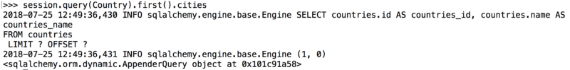

## SQLAlchemy’s “Lazy” Parameter

SQLAlchemy is one of the object-relational mapping softwares — it lets us map python classes to SQL databases and allows us to talk to the databases using python. You can imagine that each python class you’ve created acts like a table in the database and each instance of the class represents a row on the table.  SQLAlchemy是对象关系映射软件之一 - 它允许我们将python类映射到SQL数据库，并允许我们使用python与数据库进行通信。 您可以想象，您创建的每个python类都像数据库中的表，并且该类的每个实例都表示表中的一行。

### Relationship( )

Python class often has relationships with the other classes (ex. one-to-many, one-to-one, and many-to-many) and this makes the database richer. Below is an example of one-to-many relationship.

```
class Country(Base):
    __tablename__ = 'countries'
    id = Column(Integer, primary_key=True)
    name = Column(Text)
    cities = relationship('City', back_populates = 'country', lazy = True)
    
class City(Base):
    __tablename__ = 'cities'
    id = Column(Integer, primary_key=True)
    name = Column(Text)
    country_id = Column(Integer, ForeignKey('countries.id'))
    country = relationship('Country', back_populates = 'cities')
```

Here, country has many cities and cities belong to a country (One country To Many cities). Both classes have relationship function which shows their relationships, and the ‘child’ (= City class) has the foreign-key of its ‘parent’. There is a parameter in the relationship function, but what is it doing there?

### What is the ‘Lazy Parameter’?

Lazy parameter determines how the related objects get loaded when querying through relationships. Below listed are the four main lazy parameters. Typically when you query the database, the data get loaded at once; however, lazy parameter allows you to alternate the way they get loaded.  Lazy参数确定在查询关系时如何加载相关对象。 下面列出了四个主要的延迟参数。 通常，当您查询数据库时，数据会立即加载; 但是，lazy参数允许您交替加载它们的方式。

* lazy = ‘select’ (or True)
* lazy = ‘dynamic’
* lazy = ‘joined’ (or False)
* lazy = ‘subquery’

### lazy = ‘select’:

lazy = ‘select’ is the default setting. It emits a SELECT statement when loading. For instance, if you want to get all the city objects for the first country in the above example, you would query as:  lazy ='select'是默认设置。 它在加载时发出SELECT语句。 例如，如果要在上面的示例中获取第一个国家/地区的所有城市对象，则查询为：

```
session.query(Country).first().cities
```

**This would return a list of city objects**.

### lazy = ‘dynamic’:

When querying with lazy = ‘dynamic’, however, a separate query gets generated for the related object. If you use the same query as ‘select’, it will return: 但是，使用lazy ='dynamic'查询时，会为相关对象生成单独的查询。 如果您使用与“select”相同的查询，它将返回：



You can see that it returns **a sqlalchemy object instead of the city objects**. This is basically a SELECT statement for the city class, hence, it’s still waiting for us to call a method on it. In order to return the list of cities, therefore, you need to call .all( ) after cities:

```
session.query(Country).first().cities.all()
```

The benefit of this is that you can query further to return what you want by using methods like filter/filter_by, order_by, etc...  这样做的好处是你可以通过使用filter / filter_by，order_by等方法进一步查询返回你想要的东西......

### lazy = ‘joined’ (or ‘False’)

lazy = ‘joined’ literally **joins the two tables and returns the results**. By querying like below:  lazy ='joined'字面上连接两个表并返回结果。 通过查询如下：

```
session.query(Country).first().cities
```

### lazy = ‘subquery’

lazy = ‘subquery’ and lazy = ‘joined’ basically do the same thing, except that subquery uses subquery. The query and return would be the same for joined and subquery; however there could be **performance differences** between the two as they joins the tables differently.  lazy ='subquery'和lazy ='joined'基本上做同样的事情，除了子查询使用子查询。 对于连接和子查询，查询和返回将是相同的; 然而，两者之间可能存在性能差异，因为它们以不同方式加入表格。


