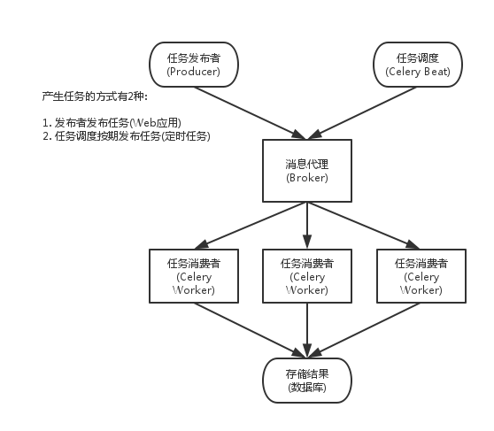
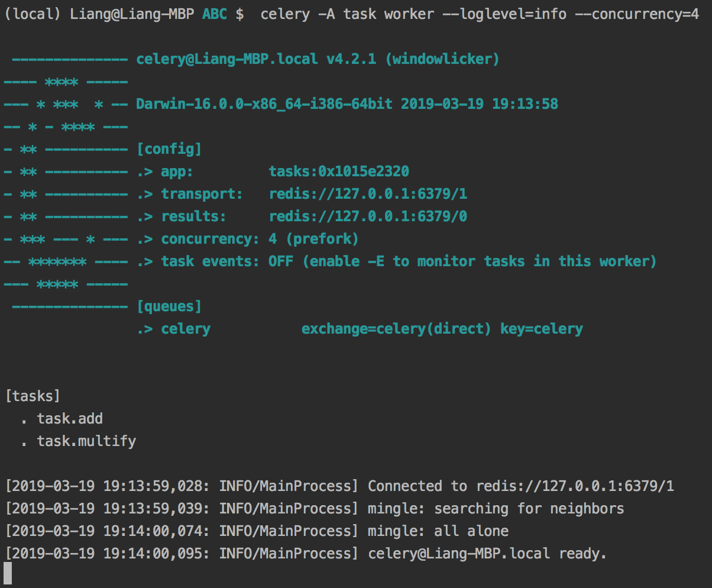
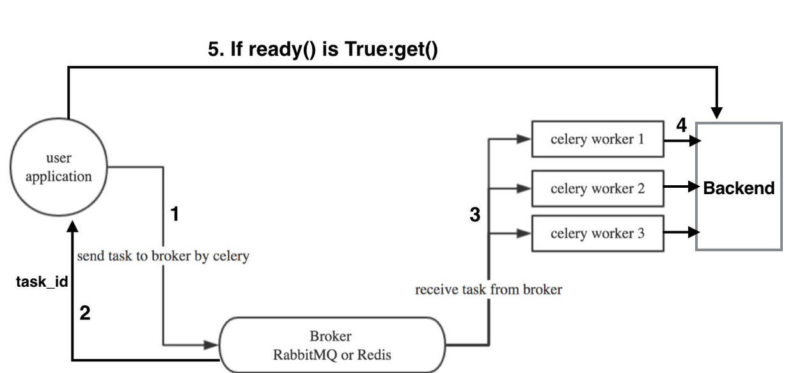
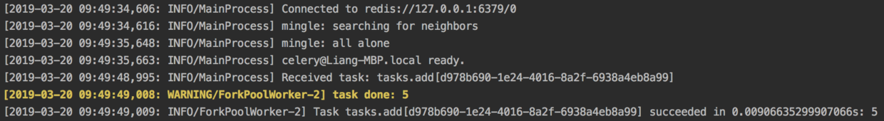
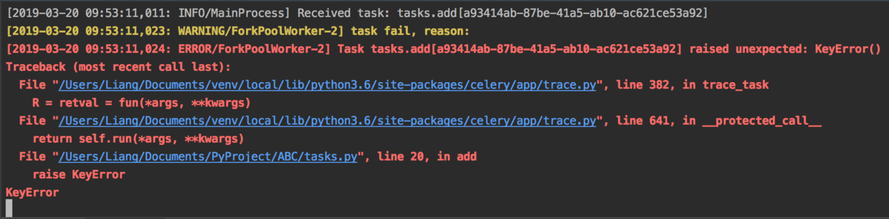
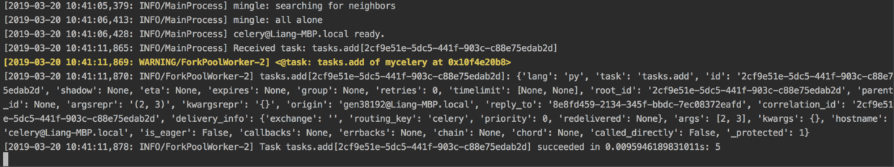
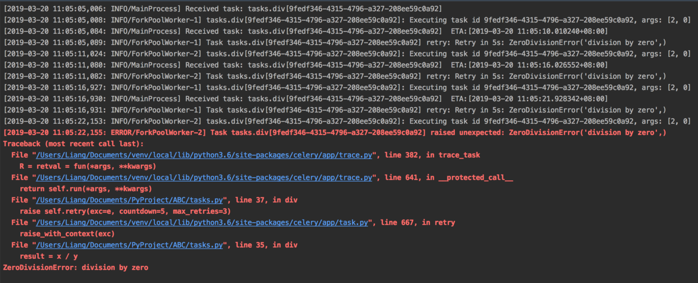
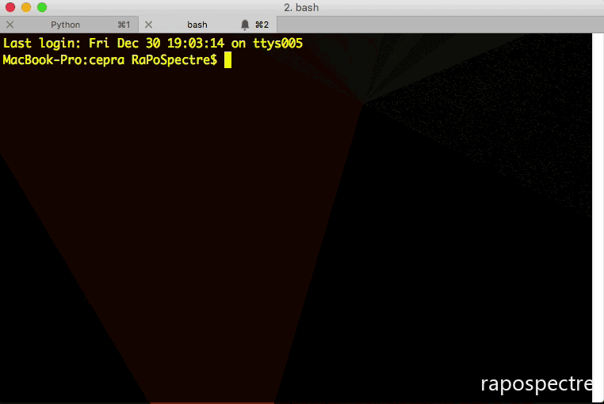

# Celery教程

## 基本概念



- **任务生产者 (task producer)**

任务生产者 (task producer) 负责产生计算任务，交给任务队列去处理。在 Celery 里，一段独立的 Python 代码、一段嵌入在 Django Web 服务里的一段请求处理逻辑，只要是调用了 Celery 提供的 API，产生任务并交给任务队列处理的，我们都可以称之为任务生产者。

- **任务调度器 (celery beat)**

Celery beat 是一个任务调度器，它以独立进程的形式存在。Celery beat 进程会读取配置文件的内容，周期性地将执行任务的请求发送给任务队列。Celery beat 是 Celery 系统自带的任务生产者。系统管理员可以选择关闭或者开启 Celery beat。同时在一个 Celery 系统中，只能存在一个 Celery beat 调度器。

- **Brokers**

brokers 中文意思为中间人，在这里就是指任务队列本身，Celery 扮演生产者和消费者的角色，brokers 就是生产者和消费者存放/拿取产品的地方(队列)。常见的 brokers 有 rabbitmq、redis、Zookeeper 等。

- **Result Stores / backend**

顾名思义就是结果储存的地方，队列中的任务运行完后的结果或者状态需要被任务发送者知道，那么就需要一个地方储存这些结果，就是 Result Stores 了

常见的 backend 有 redis、Memcached 甚至常用的数据库都可以。

- **Workers**

就是 Celery 中的工作者，类似与生产/消费模型中的消费者，其从队列中取出任务并执行。通常就是单独另开的进程

- **Tasks**

就是我们想在队列中进行的任务，一般由用户、触发器或其他操作将任务入队，然后交由 workers 进行处理。

**安装：**

```bash
pip install celery
pip install redis
```

## 基础用法

首先写一个 `task.py`

```python
from celery import Celery
# 配置 broker
broker = 'redis://localhost:6379/1'
# 配置backend，用来存储任务结果
backend = 'redis://localhost:6379/0'
app = Celery('tasks', broker=broker, backend=backend)

# 普通函数装饰为 celery task
@app.task
def add(x, y):
    return x + y

# 普通函数装饰为 celery task
@app.task
def multify(x, y):
    return x * y
```

触发任务 `main.py`

```python
from task import add

if __name__ == '__main__':
    print('starting')
    add.delay(2, 3)
    print('ending')
```

如果我们现在运行 `main.py`，程序会打印 starting 和 ending 并结束。同时，程序会将 add 这个任务发送到 redis 队列当中。我们可以查看 redis 的 1 号数据库：

```bash
127.0.0.1:6379[1]> keys *
1) "_kombu.binding.celery"
2) "celery" # 类型是list
127.0.0.1:6379[1]> lpop celery
"{\"body\": \"W1syLCAzXSwge30sIHsiY2FsbGJhY2tzIjogbnVsbCwgImVycmJhY2tzIjogbnVsbCwgImNoYWluIjogbnVsbCwgImNob3JkIjogbnVsbH1d\", \"content-encoding\": \"utf-8\", \"content-type\": \"application/json\", \"headers\": {\"lang\": \"py\", \"task\": \"task.add\", \"id\": \"0d89d2a6-82c1-40b4-972f-6e1f06019338\", \"shadow\": null, \"eta\": null, \"expires\": null, \"group\": null, \"retries\": 0, \"timelimit\": [null, null], \"root_id\": \"0d89d2a6-82c1-40b4-972f-6e1f06019338\", \"parent_id\": null, \"argsrepr\": \"(2, 3)\", \"kwargsrepr\": \"{}\", \"origin\": \"gen91344@Liang-MBP.local\"}, \"properties\": {\"correlation_id\": \"0d89d2a6-82c1-40b4-972f-6e1f06019338\", \"reply_to\": \"4bd32912-b8d0-3841-ac34-04a0123dc670\", \"delivery_mode\": 2, \"delivery_info\": {\"exchange\": \"\", \"routing_key\": \"celery\"}, \"priority\": 0, \"body_encoding\": \"base64\", \"delivery_tag\": \"e12f8252-0775-47e9-9390-255d6df3ceb1\"}}"

{
    "body": "W1syLCAzXSwge30sIHsiY2FsbGJhY2tzIjogbnVsbCwgImVycmJhY2tzIjogbnVsbCwgImNoYWluIjogbnVsbCwgImNob3JkIjogbnVsbH1d",
    "content-encoding": "utf-8",
    "content-type": "application/json",
    "headers": {
        "lang": "py",
        "task": "task.add",
        "id": "0d89d2a6-82c1-40b4-972f-6e1f06019338",
        "shadow": null,
        "eta": null,
        "expires": null,
        "group": null,
        "retries": 0,
        "timelimit": [null, null],
        "root_id": "0d89d2a6-82c1-40b4-972f-6e1f06019338",
        "parent_id": null,
        "argsrepr": "(2, 3)",
        "kwargsrepr": "{}",
        "origin": "gen91344@Liang-MBP.local"
    },
    "properties": {
        "correlation_id": "0d89d2a6-82c1-40b4-972f-6e1f06019338",
        "reply_to": "4bd32912-b8d0-3841-ac34-04a0123dc670",
        "delivery_mode": 2,
        "delivery_info": {
            "exchange": "",
            "routing_key": "celery"
        },
        "priority": 0,
        "body_encoding": "base64",
        "delivery_tag": "e12f8252-0775-47e9-9390-255d6df3ceb1"
    }
}
```

此时我们需要启动一个 worker 充当消费者，启动命令：

```bash
celery -A task worker --loglevel=info --concurrency=4
```

其中 A 指代着 app，task 为 `task.py`，它默认会寻找 `task.py` 下的 app 实例。concurrency 表示开启 4 个 worker（进程）。启动之后的显示：



如果异步任务返回结果，那么调用者如何接受这个结果呢？



```python
from task import add

if __name__ == '__main__':
    # delay 会把这个任务写到任务队列然后返回
    res = add.delay(2, 3)
    # task id 是 celery 返回的
    print(res)
    # 没有取到值会一直堵塞住
    print(res.get())
```

运行结果：

```python
56f4a31b-69c2-412a-93c6-930bc7c8bca0
5
```

事实上 res.get() 的原理就是 celery 会根据 task_id 去 redis 里查找对应任务的结果

`get` 函数是阻塞式的，也就是说等异步任务执行完成之后，有了结果才能返回，我们可以设置超时时间，就算没有结果也让它返回 `get(timeout=1)`。当然正确的做法是当结果返回了，我们再去取：

```python
if res.ready():
    data = res.get()
```

## 定时任务

如前面所说定时任务就是借助于**任务调度器 (celery beat)**，它以独立进程的形式存在。Celery beat 进程会读取配置文件的内容，**周期性**地将执行任务的请求发送给任务队列。

项目结构如下：

```bash
celery_demo
      |- __init__.py
      |- config.py
      |- app.py
      |- task1.py
      |- task2.py
```

1. `app.py` 的代码如下：

```python
from celery import Celery

app = Celery('mycelery')
app.config_from_object('config')
```

2. `config.py` 的代码如下：

```python
from datetime import timedelta
from celery.schedules import crontab

# Broker and Backend
BROKER_URL = 'redis://127.0.0.1:6379'
CELERY_RESULT_BACKEND = 'redis://127.0.0.1:6379/1'

# Timezone
# 指定时区，不指定默认为 'UTC'
CELERY_TIMEZONE='Asia/Shanghai'

# import
CELERY_IMPORTS = (
    'task1',
    'task2'
)

# schedules
CELERYBEAT_SCHEDULE = {
    'add-every-30-seconds': {
         'task': 'task1.add',
         'schedule': timedelta(seconds=30),  # 每 30 秒执行一次
         'args': (5, 8)  # 任务函数参数
    },
    'multiply-at-some-time': {
        'task': 'task2.multiply',
        'schedule': crontab(hour=9, minute=50),  # 每天早上 9 点 50 分执行一次
        'args': (3, 7)  # 任务函数参数
    }
}
```

3. `task1.py` 代码如下：

```python
import time
from app import app

@app.task
def add(x, y):
    time.sleep(2)
    return x + y
```

4. `task2.py` 代码如下

```python
import time
from app import app

@app.task
def multiply(x, y):
    time.sleep(2)
    return x * y
```

启动 Celery Beat 进程，定时将任务发送到 Broker

```bash
celery beat -A app
```

**此时任务调度器就会根据配置定时的将任务发送到队列当中（注意，如果 worker 没有启动的话，任务是不会消费执行的）**

```bash
LocalTime -> 2019-03-19 19:55:16
Configuration ->
    . broker -> redis://127.0.0.1:6379/0
    . loader -> celery.loaders.app.AppLoader
    . scheduler -> celery.beat.PersistentScheduler
    . db -> celerybeat-schedule
    . logfile -> [stderr]@%WARNING
    . maxinterval -> 5.00 minutes (300s)
```

我们可以使用同一个命令来启动 worker 进程和 Beat 进程

```bash
celery -B -A celery_app worker --loglevel=info
```

## 高级用法

经过快速入门的学习后，我们已经能够使用 Celery 管理普通任务，但对于实际使用场景来说这是远远不够的，所以我们需要更深入的去了解 Celery 更多的使用方式。

首先来看之前的 task：

```python
# 普通函数装饰为 celery task
@app.task
def add(x, y):
    return x + y
```

这里的装饰器 `app.task` 实际上是将一个正常的函数修饰成了一个 celery task 对象，所以这里我们可以给修饰器加上参数来决定修饰后的 task 对象的一些属性。

首先，我们可以让被修饰的函数成为 task 对象的绑定方法，这样就相当于被修饰的函数 add 成了 task 的实例方法，可以调用 self 获取当前 task 实例的很多状态及属性。

其次，我们也可以自己复写 task 类然后让这个自定义 task 修饰函数 add ，来做一些自定义操作。

### 2.1 根据任务状态执行不同操作

任务执行后，根据任务状态执行不同操作需要我们复写 task 的 `on_failure`、`on_success` 等方法：

```python
# tasks.py
class MyTask(Task):

    def on_success(self, retval, task_id, args, kwargs):
        print('task done: {0}'.format(retval))
        return super(MyTask, self).on_success(retval, task_id, args, kwargs)

    def on_failure(self, exc, task_id, args, kwargs, einfo):
        print('task fail, reason: {0}'.format(exc))
        return super(MyTask, self).on_failure(exc, task_id, args, kwargs, einfo)


@app.task(base=MyTask)
def add(x, y):
    return x + y
```

然后继续运行 worker：

```bash
celery -A tasks worker --loglevel=info
```

运行脚本，得到：



再修改下 tasks

```python
# 普通函数装饰为 celery task
@app.task
def add(x, y):
    raise KeyError
    return x + y
```

重新运行 worker，再运行 `main.py`：



可以看到，任务执行成功或失败后分别执行了我们自定义的 `on_failure`、`on_success`

### 2.2 任务绑定、记录日志和重试

任务绑定、记录日志和重试是 Celery 常用的 3 个高级属性。

当使用 `bind = True` 后，函数的参数发生变化，多出了参数 `self`（第一个参数），相当于把 add 变成了一个已绑定的方法，通过 `self` 可以获得任务的上下文。

```python
from celery.utils.log import get_task_logger
logger = get_task_logger(__name__)

# 如果不指定 bind 的话，调用 add.dealy 的时候会报参数数量不一致错误
@app.task(bind=True)
def add(self, x, y):
    print(self)
    logger.info(self.request.__dict__)
    return x + y
```



执行中的任务获取到了自己执行任务的各种信息，可以根据这些信息做很多其他操作，例如判断链式任务是否到结尾等等。关于 celery.task.request 对象的详细数据可以[看这里](http://docs.celeryproject.org/en/latest/userguide/tasks.html#task-request-info)

如果任务发生了异常，我们希望重试来再次执行任务。通常编写代码有两种方式，事实上本质都是一样的。

```python
@app.task(bind=True)
def div(self, x, y):
    req = self.request.__dict__
    logger.info(f"Executing task id {req['id']}, args: {req['args']}")
    try:
        result = x / y
    except ZeroDivisionError as e:
        raise self.retry(exc=e, countdown=5, max_retries=3)
    return result
```

`countdowm`：表示每隔多长时间执行一次

`max_retries`：表示最大重试次数

调用 `div.dealy(2, 0)` 的时候，任务执行如下：



另一种写法：

```python
@app.task(bind=True, autoretry_for=(Exception,), retry_kwargs={'countdown': 5, 'max_retries': 3})
def div(self, x, y):
    req = self.request.__dict__
    logger.info(f"Executing task id {req['id']}, args: {req['args']}")
    result = x / y
    return result
```

效果同上

### 2.3 指定队列

Celery 非常容易设置和运行，通常它会使用默认的名为 celery 的队列（可以通过  CELERY_DEFAULT_QUEUE 修改）用来存放任务。

```bash
127.0.0.1:6379> keys *
1) "_kombu.binding.celery"
2) "celery"  # 类型是list
```

我们可以设置这个队列的名称，如：

```python
@app.task(bind=True, queue="my_queue")
def add(self, x, y):
    return x + y
```

这样子，调用者调用 `add` 任务的时候，任务就发送到 `my_queue` 队列中去了

```bash
127.0.0.1:6379> keys *
1) "my_queue"  # 指定的queue
2) "_kombu.binding.my_queue"
3) "celery-task-meta-56f4a31b-69c2-412a-93c6-930bc7c8bca0"
4) "unacked_mutex"
5) "_kombu.binding.celery"
127.0.0.1:6379> llen my_queue
(integer) 1
```

如果此时开启 worker，worker 是无法消费到 `my_queue` 的消息的（因为默认是消费 `celery` 中的消息）。可以指定队列进行消费

```bash
celery  -A tasks worker --queue=my_queue --loglevel=info
```

### 2.4 任务状态回调

实际场景中得知任务状态是很常见的需求，对于 Celery 其内建任务状态有如下几种：

| 参数 | 说明 |
| ---| --- |
| PENDING | 任务等待中 |
| STARTED | 任务已开始 |
| SUCCESS | 任务执行成功 |
| FAILURE | 任务执行失败 |
| RETRY | 任务将被重试 |
| REVOKED | 任务取消 |

当我们有个耗时时间较长的任务进行时一般我们想得知它的实时进度，这里就需要我们自定义一个任务状态用来说明进度并手动更新状态，从而告诉回调当前任务的进度，具体实现：

```python
# tasks.py
from celery import Celery
import time

@app.task(bind=True)
def test_mes(self):
    for i in xrange(1, 11):
        time.sleep(0.1)
        self.update_state(state="PROGRESS", meta={'p': i * 10})
    return 'finish'
```

然后在 trigger.py 中增加：

```python
# trigger.py
from task import add, test_mes
import sys

def pm(body):
    res = body.get('result')
    if body.get('status') == 'PROGRESS':
        sys.stdout.write('\r任务进度: {0}%'.format(res.get('p')))
        sys.stdout.flush()
    else:
        print('\r')
        print(res)
r = test_mes.delay()
print(r.get(on_message=pm, propagate=False))
```



### 2.5 链式任务

有些任务可能需由几个子任务组成，此时调用各个子任务的方式就变的很重要，尽量不要以同步阻塞的方式调用子任务，而是用异步回调的方式进行链式任务的调用：

**错误示范**

```python
@app.task
def update_page_info(url):
    page = fetch_page.delay(url).get()
    info = parse_page.delay(url, page).get()
    store_page_info.delay(url, info)

@app.task
def fetch_page(url):
    return myhttplib.get(url)

@app.task
def parse_page(url, page):
    return myparser.parse_document(page)

@app.task
def store_page_info(url, info):
    return PageInfo.objects.create(url, info)
```

**正确示范1**

```python
def update_page_info(url):
    # fetch_page -> parse_page -> store_page
    chain = fetch_page.s(url) | parse_page.s() | store_page_info.s(url)
    chain()

@app.task()
def fetch_page(url):
    return myhttplib.get(url)

@app.task()
def parse_page(page):
    return myparser.parse_document(page)

@app.task(ignore_result=True)
def store_page_info(info, url):
    PageInfo.objects.create(url=url, info=info)
```

**正确示范2**

```python
fetch_page.apply_async((url), link=[parse_page.s(), store_page_info.s(url)])
```

链式任务中前一个任务的返回值默认是下一个任务的输入值之一 ( 不想让返回值做默认参数可以用 si() 或者 s(immutable=True) 的方式调用 )。

这里的 `s()` 是方法 `celery.signature()` 的快捷调用方式，signature 具体作用就是生成一个包含调用任务及其调用参数与其他信息的对象，个人感觉有点类似偏函数的概念：先不执行任务，而是把任务与任务参数存起来以供其他地方调用。

### 2.6 delay 和 apply_async

前面讲了调用任务不能直接使用普通的调用方式，而是要用类似 `add.delay(2, 2)` 的方式调用，而链式任务中又用到了 `apply_async` 方法进行调用，实际上 `delay` 只是 `apply_async` 的快捷方式，二者作用相同，只是 `apply_async` 可以进行更多的任务属性设置，比如 callbacks/errbacks 正常回调与错误回调、执行超时、重试、重试时间等等，具体参数可以[参考这里](http://docs.celeryproject.org/en/latest/reference/celery.app.task.html#celery.app.task.Task.apply_async)

```python
add.apply_async((2, 2), queue='lopri', countdown=10)
```

上述案例中，任务会被发送给一个名为 `lopri` 的队列，该任务会在信息发送后十秒执行。

直接应用 `add(3, 3)` 该任务会在当前进程中执行任务，不会发送消息。

- 每一个任务调用都有一个唯一的标识符（UUID），这个就是任务的 id
- `delay()` 和 `apply_async` 方法会返回一个 `AsyncResult` 实例，可以被用来跟踪任务执行状态，**但是需要开启result backend这样状态才能被存储在某处**
- `Results` 默认是禁用的，因为实际上没有一个 `result backend` 适用于每个应用程序，所以要考虑到每个独立 `backend` 的缺点来选择一个使用。对于许多保持返回值的任务来说都不是很有用，所以这个默认的禁用是很明智的。还需要注意的是，`result backend` 并不用来监控任务和 `worker`，对于 `Celery` 有专门的事件消息

### 2.7 关于 AsyncResult

AsyncResult 主要用来储存任务执行信息与执行结果，有点类似 tornado 中的 Future 对象，都有储存异步结果与任务执行状态的功能，对于写 js 的朋友，它有点类似 Promise 对象，当然在 Celery 4.0 中已经支持了 promise 协议，只需要配合 gevent 一起使用就可以像写 js promise 一样写回调：

```python
import gevent.monkey
monkey.patch_all()

import time
from celery import Celery

app = Celery(broker='amqp://', backend='rpc')

@app.task
def add(x, y):
    return x + y

def on_result_ready(result):
    print('Received result for id %r: %r' % (result.id, result.result))

add.delay(2, 2).then(on_result_ready)
```

要注意的是这种 promise 写法现在只能用在 backend 是 RPC (amqp) 或 Redis 时。 并且独立使用时需要引入 gevent 的猴子补丁，可能会影响其他代码。 官方文档给的建议是这个特性结合异步框架使用更合适，例如 tornado、 twisted 等。

> delay` 与 `apply_async` 生成的都是 AsyncResult 对象，此外我们还可以根据 task id 直接获取相关 task 的 AsyncResult: `AsyncResult(task_id=xxx)

关于 AsyncResult 更详细的内容，可以[参考这里](http://docs.celeryproject.org/en/latest/reference/celery.result.html?highlight=result#celery.result.AsyncResult)

利用 Celery 进行分布式队列管理、开发将会大幅提升开发效率，关于 Celery 更详细的使用大家可以去参考详细的[官方文档](http://docs.celeryproject.org/en/latest/index.html)

## 工作流

### Signature 对象

前面介绍了可以通过 delay 和 apply_async 来执行一个任务，多数情况下这已经足够使用，但是有时候你希望能够将任务及其参数传递给其它函数时，现有的方法就不够用了。

在 Celery 中，提供了 signature 方法将函数和参数打包起来成为一个 signature 对象（**类似于偏函数**），在这个对象中可以保存函数的参数以及任务执行的参数。

可以直接在 task 对象上调用 signature 方法，生成一个 signature 对象，或者直接调用 `s` 这个快捷方法。

```python
>>> add.signature((2, 2), countdown=10)
cele.add(2, 2)

>>> add.s(2, 2)
cele.add(2, 2)
```

和普通的 task 对象一样，你可以直接在 signarture 对象上调用 delay 或者 apply_async 方法，向 Celery 队列提交一个任务。

```python
>>> add.s(2, 2).delay()
<AsyncResult: fa8f326d-9e10-48f6-97c9-b33a33381231>
>>> add.s(2, 2).apply_async()
<AsyncResult: 6595e01e-ef73-4787-9f0e-5f2d5c35b103>
```

除了可以包含所有的参数之外，你也可以通过部分赋值的方式，产生一个偏函数对象，其效果就跟 partial 类似。当你调用时，只需要提供剩余参数就可以了。这样生成的偏函数和普通的 signature 对象功能上没有差别，只是相当于有了绑定的参数。

```python
>>> partial_s = add.s(1)
>>> partial_s(2)
3
```

### chain 任务的链式执行

chain 函数接受一个任务的列表，Celery 保证一个 chain 里的子任务会依次执行，在 AsynResult 上执行 get 会得到最后一个任务的返回值。和 link 功能类似，每一个任务执行结果会当作参数传入下一个任务，所以如果你不需要这种特性，采用 immutable signature 来取消。

```python
>>> from celery import chain
>>> result = chain(add.s(1, 2), add.s(3), add.s(4)) # 1+2+3+4
>>> result().get()
10
```

这还可以使用管道符写：

```python
>>> (add.s(1, 2) | add.s(3) | add.s(4))().get()
10
```

### group 任务的并发执行

group 函数也接受一个任务列表，这些任务会同时加入到任务队列中，且执行顺序没有任何保证。在 AsynResult 上执行 get 会得到一个包含了所有返回值的列表。

```
>>> from celery import group
>>> group(add.s(1, 2), add.s(3,4), add.s(5,6))().get()
[3, 7, 11]
```

### chord 带回调的 group

chord 基本功能和 group 类似，只是有一个额外的回调函数。回调函数会在前面的任务全部结束时执行，其参数是一个包含了所有任务返回值的列表。在 AsynResult 上执行 get 会得到回调函数的返回值。

```python
@app.task
def xsum(values):
    return sum(values)

>>> from celery import chord
>>> chord((add.s(i, i) for i in xrange(4)), xsum.s())().get()  # xsum 收到 [0, 2, 4, 6]
12
```

## 补充

### Celery Once

使用 Celery Once 来防止 Celery 重复执行同一个任务。

在[使用](https://blog.einverne.info/post/2017/04/celery-introduction.html) Celery 的时候发现有的时候 Celery 会将同一个任务执行两遍，我遇到的情况是相同的任务在不同的 worker 中被分别执行，并且时间只相差几毫秒。这问题我一直以为是自己哪里处理的逻辑有问题，后来发现[其他人](https://github.com/celery/celery/issues/4400) 也有类似的问题，然后基本上出问题的都是使用 Redis 作为 Broker 的，而我这边一方面不想将 Redis 替换掉，就只能在 task 执行的时候加分布式锁了。

不过在 Celery 的 issue 中搜索了一下，有人使用 Redis 实现了[分布式锁](https://github.com/celery/celery/issues/3270)，然后也有人使用了 [Celery Once](https://github.com/cameronmaske/celery-once)。 大致看了一下 Celery Once ，发现非常符合现在的情况，就用了下。

Celery Once 也是利用 Redis 加锁来实现，他的使用非常简单，参照 GitHub 的使用很快就能够用上。Celery Once 在 Task 类基础上实现了 QueueOnce 类，该类提供了任务去重的功能，所以在使用时，我们自己实现的方法需要将 QueueOnce 设置为 base

```python
@task(base=QueueOnce, once={'graceful': True})
```

后面的 once 参数表示，在遇到重复方法时的处理方式，默认 graceful 为 False，那样 Celery 会抛出 AlreadyQueued 异常，手动设置为 True，则静默处理。

另外如果要手动设置任务的 key，可以指定 keys 参数

```python
@celery.task(base=QueueOnce, once={'keys': ['a']})
def slow_add(a, b):
    sleep(30)
    return a + b
```

总得来说，分为几步

**第一步，安装**

```bash
pip install -U celery_once
```

**第二步，增加配置**

```python
from celery import Celery
from celery_once import QueueOnce
from time import sleep

celery = Celery('tasks', broker='amqp://guest@localhost//')
celery.conf.ONCE = {
    'backend': 'celery_once.backends.Redis',
    'settings': {
        'url': 'redis://localhost:6379/0',
        'default_timeout': 60 * 60
    }
}
```

**第三步，修改 delay 方法**

```python
example.delay(10)
#  修改为
result = example.apply_async(args=(10))
```

**第四步，修改 task 参数**

```python
@celery.task(base=QueueOnce, once={'graceful': True, 'keys': ['a']})
def slow_add(a, b):
    sleep(30)
    return a + b
```

[参考](https://liang.readthedocs.io/en/latest/chapter/Celery%E6%95%99%E7%A8%8B.html)
