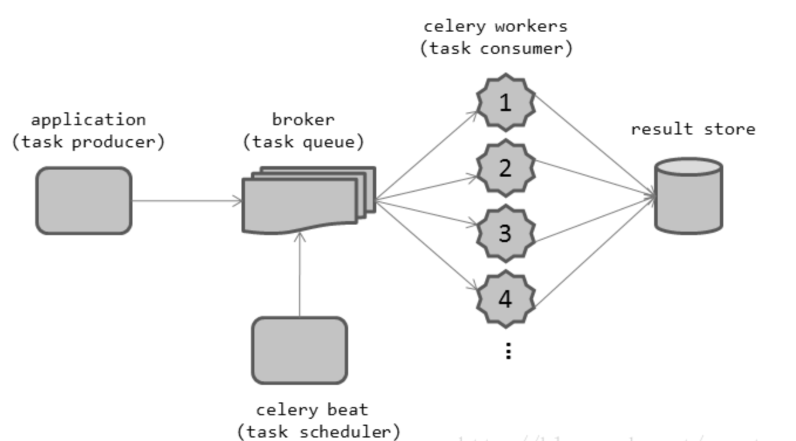
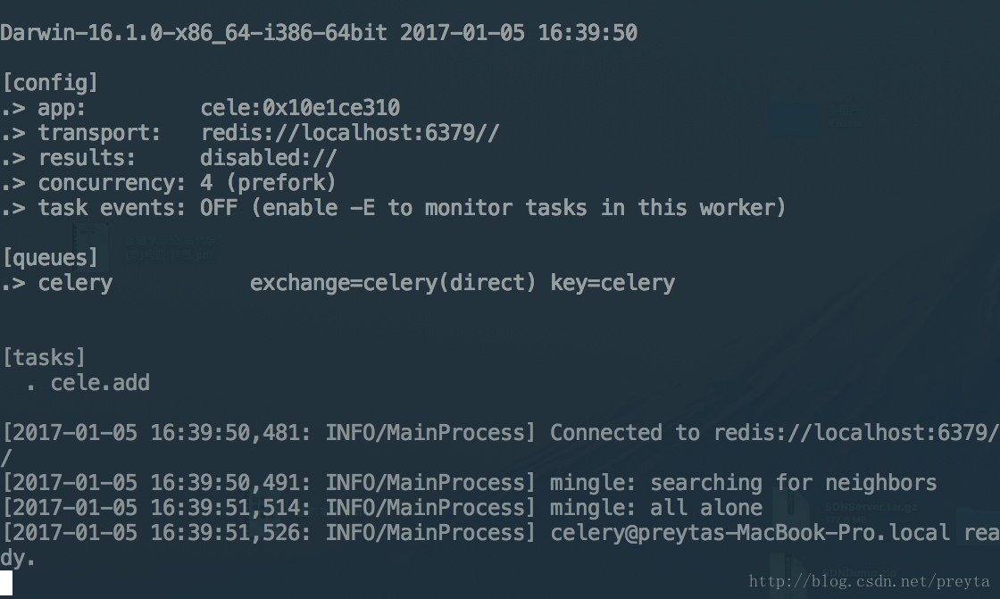
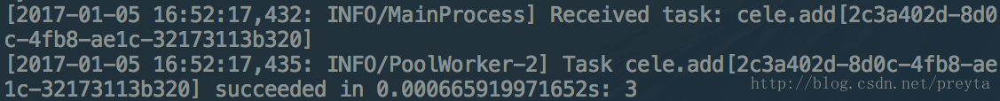

# Celery 学习笔记（1）简介

## 简介

Celery 是一个用 Python 编写的异步的任务调度模块，它有着简明的 API，并且有丰富的扩展性，适合用于构建分布式的 Web 服务。Celery 的工作流程很简单，你可以给 Celery 提交一个任务，然后 Celery 会将任务放入消息队列 broker 中，后台启动的多个 worker 并行的对任务进行执行，最后可以选择将执行结果写入 store 中。



## 一个简单的示例

Celery 支持多种中间人作为消息队列，包括 RabbitMQ，Redis，数据库，Amazon SQS 等等，但是官方推荐 RabbitMQ 和 Redis，这里我选择了 Redis 作为示例。所以需要提前安装 Celery 和 Redis，官方提供了一种简单的安装方法，可以同时安装 Celery 和 Redis 等相关的依赖。

```bash
sudo pip install -U "celery[redis]"
sudo apt-get install redis-server
sudo redis-server
```

使用 Celery 的过程中主要的步骤是：

1. 定义一个应用，并在应用上注册任务
2. 启动 worker，通过消息队列等待任务
3. 通过在程序里调用预先注册的任务给 Celery 提交一个任务

`cele.py` 包含了一个简单的示例，主要进行了任务的注册，首先创建了一个 Celery 实例 app，这是 Celery 里的一个应用(Application)，第一个参数是应用名，Celery 的 worker 通过这个名字寻找应用；第二个参数是 broker 这里设置为本机的 Redis Server。然后通过 app.task 装饰器为 app 这个应用注册一个任务。

```python
# cele.py
from celery import Celery

app = Celery('cele', broker='redis://localhost:6379')

@app.task
def add(x, y):
    return x + y
```

然后可以通过如下命令启动 worker， 其中 `-A` 参数用于指定在 `cele.py` 里定义的应用的名字，`--loglevel` 用于指定日志的记录等级

```bash
celery -A cele worker --loglevel=info
```

应该会看到一个大致如下的启动界面



其中 [config] 的大致含义是：

* app 是 worker 对应的应用名

* transport 是指在前面制定的消息队列地址

* results 是指 任务执行结果存储的地方，但是这里没有指定，所以默认就是关闭的

* concurrency 是 worker 的数量，默认和处理器的核心数相同

然后打开 python 解释器给 Celery 提交任务，可以看到注册之后的函数对象是 <@task: cele.add of cele:0x1094a9c10>，在 add 上执行 delay 并将函数参数传递给它就可以给提交一个任务，可以看到返回的是一个 AsynResult 对象，可以在这个对象上查询任务执行状态，等待任务完成等。

```python
>>> from cele import add
>>> add
>>> <@task: cele.add of cele:0x1094a9c10>
>>> add.delay(1, 2)
>>> <AsyncResult: 2c3a402d-8d0c-4fb8-ae1c-32173113b320>
```

同时在 Celery worker 那边可以看到任务执行情况，大致如下，worker-2 接收到一个任务，并执行得到结果 3



## 一个对执行结果进行存储的示例

如果你希望对任务执行的状态和结果进行监测，你需要为 Celery 配置一个后端，和中间人 Broker 一样，它可以是 RabbitMQ，Redis 等等，下面依然使用 Redis 作为示例。要为 Celery 配置一个后端，只需要在创建应用的时候进行指定就可以了，然后对程序进行一些修改，让它延迟 5 秒再执行。

```python
# cele.py
from celery import Celery
import time

app = Celery('cele', broker='redis://localhost:6379', backend='redis://localhost:6379')

@app.task
def add(x, y):
    time.sleep(5)
    return x + y
```

然后在命令行依次执行以下语句，可以得到类似的结果，所以现在就可以查询任务执行的状态以及结果

```python
>>> result = add.delay(1, 2)
>>> result.status
>>> u'PENDING'
>>> result.staus
>>> u'SUCCESS'
>>> result.result
>>> 3
```

## 对 Celery 进行配置

对 Celery 进行配置的方式有两种：

1. 在程序中，通过创建的应用对象添加配置

2. 对于大量的配置可以写在单独的文件中。

例如，可以直接在 app 的 conf 属性上进行修改，这个 conf 是一个 dict 对象。

```python
app.conf.task_serializer = 'json'
```

或者，对于多个配置可以使用字典更新的方式进行配置

```python
app.conf.update(
    task_serializer='json',
    accept_content=['json'],
    result_serializer='json',
    timezone='Europe/Oslo',
    enable_utc=True,
)
```

同时，也可以通过创建一个单独的文件，如下

```python
# config.py
task_serializer = 'json'
result_serializer = 'json'
accept_content = ['json']
timezone = 'Europe/Oslo'
enable_utc = True
```

从文件导入配置有几种可选的方式，你可以直接提供模块名进行索引，这里的名字应该是包含包名的字符串，类似于 'package.config' 之类的。总之需要解释器能够根据这个路径找到对应的模块。

```python
app.config_from_object('config')
```

或者直接从 python 模块中引用

```python
import config
app.config_from_object(config)
```

[参考](https://blog.csdn.net/preyta/article/details/54093388)
