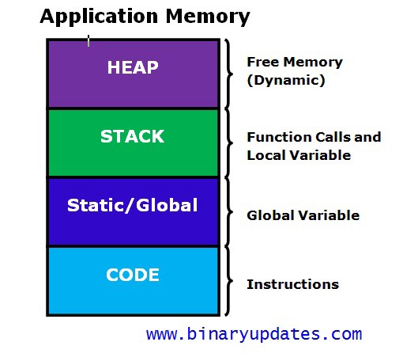
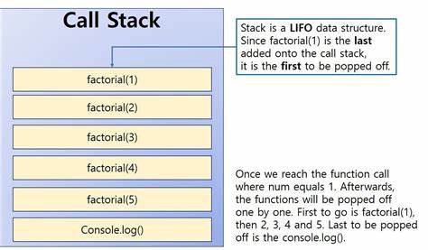
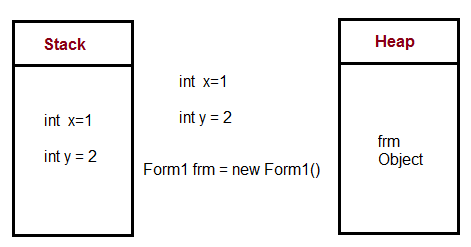
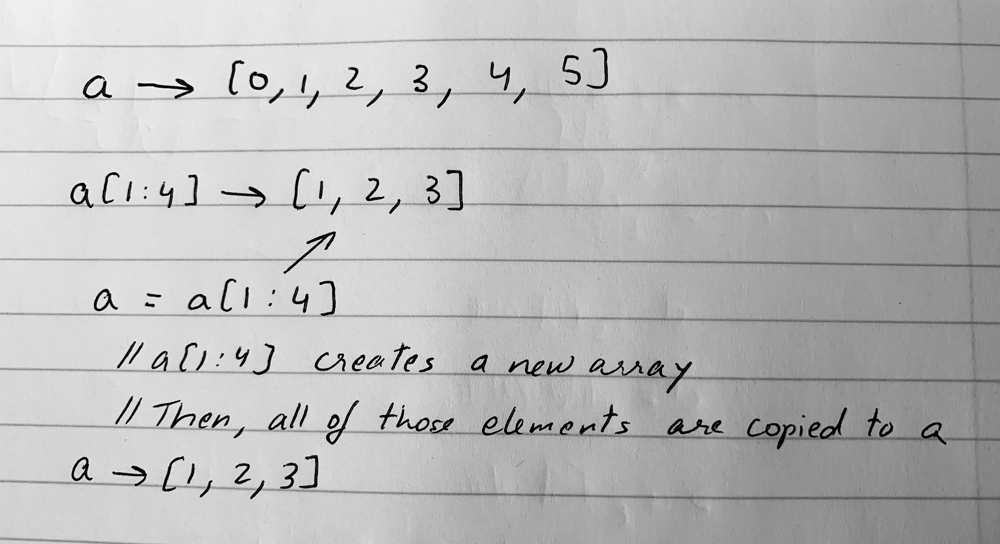
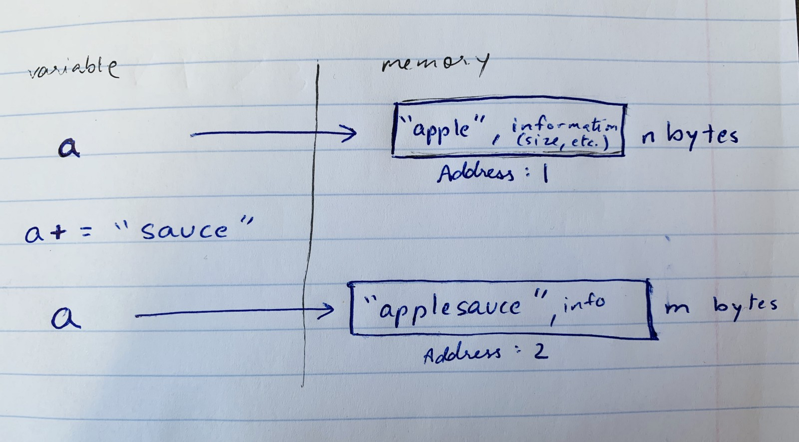
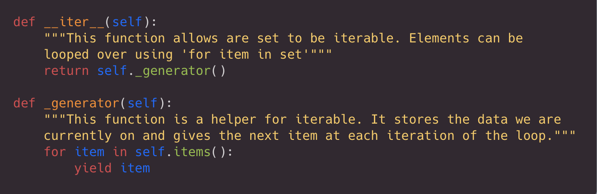

# How does Memory Allocation work in Python (and other languages)?

Are you a developer who hopes your app does not get deleted because it's too slow, even after writing efficient code? Every so often, we — and our users — delete a multitude of apps and files from their devices because it just cannot run with too many apps open on their device. I certainly hope my application is not removed. Thus, one of my prime concerns is to make my applications as memory-efficient as possible. If multiple apps are using memory as they run on the computer, our app cannot run alongside if it uses more memory than is available!  您是一名开发人员，希望您的应用程序不会被删除，因为它太慢了，即使在编写有效的代码之后？ 我们 - 以及我们的用户 - 经常会从他们的设备中删除大量应用和文件，因为它无法在设备上打开太多应用时运行。 我当然希望我的申请不会被删除。 因此，我最关心的一个问题是尽可能使我的应用程序具有内存效率。 如果多个应用程序在计算机上运行时使用内存，如果它使用的内存超出可用内存，我们的应用程序将无法同时运行！

In order to accomplish space-efficiency, it is essential to understand how memory allocation works for your programming language and its widely used in-built operations. This helps when implementing strategies and best practices for space optimizations.  为了实现空间效率，必须了解内存分配如何适用于您的编程语言及其广泛使用的内置操作。 这有助于实施空间优化的策略和最佳实践。

## So, how does Memory Allocation work?

Memory allocation is the process by which a program is assigned or allocated to a particular empty block of space in computer memory. In Python, all of this is done on the backend by the Python Memory Manager. Since Python is implemented using C programming language, this process is handled the C-way — where the developer allocates and frees memory (by creating a garbage collector for Python) so users do not have to do manual garbage collection. Since the C-backend handles this, Python users do not need to worry about it.  内存分配是将程序分配或分配给计算机内存中特定空白空间块的过程。 在Python中，所有这些都是由Python内存管理器在后端完成的。 由于Python是使用C编程语言实现的，因此这个过程是以C-way方式处理的 - 开发人员分配并释放内存（通过为Python创建垃圾收集器），因此用户不必进行手动垃圾收集。 由于C-backend处理这个问题，Python用户不必担心它。

Hold on, what is garbage collection? Garbage collection is when the interpreter frees memory for your programs for you when it is not being used. Python is able to do this because the developers of python implemented a garbage collector for us on the backend. This Python garbage collector uses a technique known as ‘reference counting’ in which objects are deallocated or “freed” when there is no longer a reference to it in the program.  坚持下去，什么是垃圾收集？ 垃圾收集是指解释器在没有使用时为您的程序释放内存。 Python能够做到这一点，因为python的开发人员在后端为我们实现了垃圾收集器。 这个Python垃圾收集器使用一种称为“引用计数”的技术，当程序中不再引用对象时，对象将被释放或“释放”。

C, however, does not have a garbage collector and so garbage collection must be handled by C developers themselves. Thus, if we use the C programming language and we assign a pointer to a space in memory, we need to make sure to free it before exiting our program, by deleting our data from that address in memory. When this is not taken care of, we end up with garbage collection.  但是，C没有垃圾收集器，因此垃圾收集必须由C开发人员自己处理。 因此，如果我们使用C编程语言并且我们为内存中的空间分配指针，我们需要确保在退出程序之前释放它，方法是从内存中的该地址删除我们的数据。 如果没有这个，我们最终会收集垃圾。

So…how is memory allocated? Memory can be stored on either a stack (for static memory allocation) or a heap (for dynamic memory allocation):



## Stack Allocation:

Stack allocation stores static memory, which is the memory that is only needed inside a particular function or method call. When a function is called, it is added onto the program’s call stack. Any local memory assignments — such as variable initializations — inside the particular functions are stored temporarily on the function call stack, where it is deleted once the function returns, and the call stack moves on to the next task. This allocation onto a contiguous block of memory is handled by the compiler using predefined routines, and developers do not need to worry about it.  堆栈分配存储静态内存，静态内存是在特定函数或方法调用中仅需要的内存。 调用函数时，它会被添加到程序的调用堆栈中。 特定函数内部的任何本地内存分配（例如变量初始化）都临时存储在函数调用堆栈中，一旦函数返回，它就会被删除，并且调用堆栈将继续执行下一个任务。 这种对连续内存块的分配由编译器使用预定义的例程来处理，开发人员不需要担心它。

### What is a call stack?



A computer program uses the stack data structure to store active subroutines — tasks or function calls — in the order they are to be called. This is known as the call stack. So, when we run a program, all of the function calls are first added to the call stack by the compiler. Then, these function calls are popped out of the stack and called.  计算机程序使用堆栈数据结构按照它们被调用的顺序存储活动子例程 - 任务或函数调用。 这称为调用堆栈。 因此，当我们运行程序时，编译器首先将所有函数调用添加到调用堆栈中。 然后，这些函数调用从堆栈弹出并被调用。

## Heap Allocation:

Heap allocation stores dynamic memory, which is the memory that is used in the program, at global scope. These variables are needed outside of specific method or function calls or are shared within multiple functions globally. Unlike stack allocation, **heap allocation is not related to its namely counterpart: the heap data structure. It is simply a large space of memory available for allocation and freeing at somewhat random addresses, found based on the space needed by the object being stored.**  堆分配在全局范围内存储动态内存，动态内存是程序中使用的内存。 这些变量在特定方法或函数调用之外是必需的，或者在全局的多个函数内共享。 与堆栈分配不同，堆分配与其对应关系：堆数据结构。 它只是一个大的内存空间，可用于分配和释放某些随机地址，这些地址基于所存储对象所需的空间。

This allocation is manually done by C developers and must be implemented carefully to prevent memory leaks. All memory allocated on the heap, such as pointers to nodes in a linked list or other objects, must be freed at the end of the program, or whenever it is no longer needed. For implementations such as linked lists and tree data structures, freeing memory must be handled with extra care when a node is deleted, and access to that address in memory — often with the use of pointers — is lost.  此分配由C开发人员手动完成，必须小心实施以防止内存泄漏。 堆上分配的所有内存（例如指向链接列表中的节点的指针或其他对象）必须在程序结束时或不再需要时释放。 对于链接列表和树数据结构等实现，删除节点时必须特别小心处理释放内存，并且在内存中访问该地址（通常使用指针）会丢失。

Below is an example of how a program’s function variables would be allocated onto a stack and a heap. Notice how local variables are stored on the stack, however, the form object is stored on a heap. This is because the inbuilt operation ‘new’ allocates dynamic memory on the heap.  下面是一个如何将程序的函数变量分配到堆栈和堆上的示例。 注意局部变量如何存储在堆栈中，但是，表单对象存储在堆上。 这是因为内置操作'new'在堆上分配动态内存。



## But, I use Python and I don’t do this…

If you use python, then this is already done for you by python’s memory manager, implemented using C. Since the backend for Python is in C, the developers of the Python programming language carefully implemented memory management for python such that we do not have to deal with it. Memory management in python, however, does involve a **private heap**, and thus it must be handled carefully.  如果您使用python，那么这已经由python的内存管理器为您完成，使用C实现。由于Python的后端在C中，Python编程语言的开发人员仔细地为python实现了内存管理，这样我们就不必 处理它。 但是，python中的内存管理确实涉及私有堆，因此必须小心处理。

## What are some best practices in Python for memory allocation or space complexity?

1. Avoid List Slicing

List indexing results in memory allocation for an entirely new array, separate from the original, where the elements needed are copied over.

> For example: for a = [0, 1, 2, 3, 4, 5], a[1:4] allocates a new array [1, 2, 3]



The above example displays how list slicing can be costly in terms of space and time, especially when handling large amounts of data! A new array must be allocated and copied over. Thus, it is best practice to **try to use function parameters or separate variables to track indices instead of slicing or altering a list**.  上面的示例显示了列表切片在空间和时间方面的成本，特别是在处理大量数据时！ 必须分配和复制新数组。 因此，最佳做法是尝试使用函数参数或单独的变量来跟踪索引，而不是切片或更改列表。

2. Use List Indexing Sparingly

If possible, **try to use “for item in array”** for loops over arrays, before using “for index in range(len(array))” to save space and time. If the index is not necessary, and your program will work without it, then don’t allocate it!

3. String Concatenation

When possible, avoid using ‘+’ for string concatenation because strings are immutable. Every time you add an element to the string, Python creates a new string and allocates it to a new address!

Each string in python needs a fixed amount of memory space based on the characters and length and is allocated to that much memory when initialized. Thus, when changes are made to the string, it needs a different amount of memory and needs to be reallocated.

Let's run through an example program and see it in memory:



```python
a = “apple”
a += “sauce”
print(a) // “applesauce”
```

Instead of “+” for string concatenation, USE ''.join(iterable_object) or .format or % ! 

This makes a huge impact when the program deals with more data and/or longer strings.  当程序处理更多数据和/或更长字符串时，这会产生巨大影响。

4. Use Iterators and Generators

Iterators give the value you need when you ask for it, but do not compute each value initially. This is efficient for both time and memory when working with large data sets because you can start using the data immediately and do not have to wait for your program to process the entire data set first. Generators are helper functions that allow us to create iterator functions.

[Read about how to implement iterators and generators and how they save memory space here](https://medium.freecodecamp.org/how-and-why-you-should-use-python-generators-f6fb56650888)

Below is an example implementation of an iterator for a set implementation. The iterator function calls the special generator function. The generator uses yield to save which element we are on, and give only that value, moving to the next value only on the next iteration of the loop.



5. Make use of libraries when possible

If you are implementing methods that have already been implemented and available as a python library, consider using the library if it is more space efficient and time efficient than your code! Also, do this to save time such that you can work on the meat of your program.

[Here’s an O’Reilly article on 20 useful python modules](https://www.oreilly.com/learning/20-python-libraries-you-arent-using-but-should)

Wow, you made it! A short recap: we learned that memory is managed using stacks and heaps in our programs — well, just a private heap for Python. We also learned tricks and tips to write memory efficient code!

参考：

* https://medium.com/datadriveninvestor/how-does-memory-allocation-work-in-python-and-other-languages-d2d8a9398543
* https://rushter.com/blog/python-memory-managment/
* https://realpython.com/python-memory-management/
