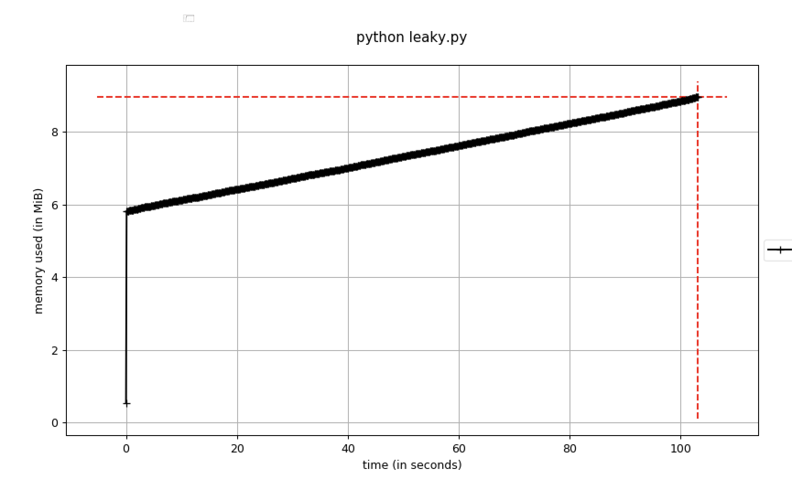
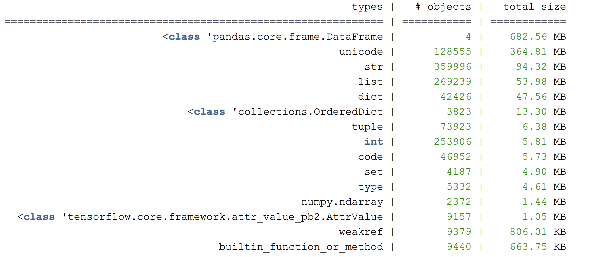

# Hunting for Memory Leaks in Python applications  寻找Python应用程序中的内存泄漏

We use Python a fair bit at Zendesk for building machine learning (ML) products. One of the common performance issues we encountered with machine learning applications is memory leaks and spikes. The Python code is usually executed within containers via distributed processing frameworks such as [Hadoop](https://hadoop.apache.org/), [Spark](https://spark.apache.org/) and [AWS Batch](https://medium.com/zendesk-engineering/how-we-use-aws-batch-at-zendesk-to-build-all-the-machine-learning-models-a41d93eabd45). Each container is allocated a fixed amount of memory. Once the code execution exceeds the specified memory limit, the container will terminate due to out of memory errors.  在Zendesk，我们相当多地使用Python来构建机器学习（ML）产品。 我们在机器学习应用程序中遇到的常见性能问题之一是内存泄漏和峰值。 Python代码通常通过分布式处理框架（例如Hadoop，Spark和AWS Batch）在容器内执行。 每个容器分配有固定数量的内存。 一旦代码执行超过指定的内存限制，容器将由于内存不足错误而终止。

A quick fix is to increase the memory allocation. However this can result in wastage in resources and affect the stability of the products due to unpredictable memory spikes.[ The causes of memory leaks can include](http://tech.labs.oliverwyman.com/blog/2008/11/14/tracing-python-memory-leaks/):  一个快速的解决方法是增加内存分配。 但是，由于不可预测的内存峰值，这可能会导致资源浪费并影响产品的稳定性。 内存泄漏的原因可能包括：

- lingering large objects which are not released  挥之不去的大物件
- [reference cycles](http://engineering.hearsaysocial.com/2013/06/16/circular-references-in-python/) within the code  代码中的循环引用
- underlying libraries/C extensions leaking memory  基础库/C扩展泄漏内存

A useful exercise is to profile the memory usage of the applications to gain better understanding on space efficiency of the code and the underlying packages used. This post covers:  一个有用的练习是分析应用程序的内存使用情况，以更好地了解代码和所使用的基础程序包的空间效率。 这篇文章涵盖：

- profiling memory usage of the application across time  跨时间分析应用程序的内存使用情况
- how to inspect memory usage at specific part of the program  如何检查程序特定部分的内存使用情况
- tips for debugging memory issues  调试内存问题的技巧

# Profiling Memory Across Time

You can look at the memory usage varying across time during the execution of the Python code using the [memory-profile](https://pypi.org/project/memory-profiler/) package.  您可以使用memory-profile包查看执行Python代码期间随时间变化的内存使用情况。

```
# install the required packages
pip install memory_profiler
pip install matplotlib

# run the profiler to record the memory usage
# sample 0.1s by defaut
mprof run --include-children python fantastic_model_building_code.py

# plot the recorded memory usage
mprof plot --output memory-profile.png
```


The option **include-children** will include the memory usage of any child processes spawned via the parent process. Graph A shows an iterative model training process which causes the memory to increase in cycles as batches of training data being processed. The objects are released once garbage collection kicks in.  选项include-children将包括通过父进程产生的任何子进程的内存使用情况。 图A显示了一个迭代模型训练过程，该过程使内存随着处理一批训练数据而以周期增加。 垃圾回收启动后，将释放对象。

If the memory usage is constantly growing, there is a potential issue of memory leaks. Here’s a [dummy sample script](https://gist.github.com/waichee/b94eecfd57c6d68606c4be78e2317baa) to illustrate this.  如果内存使用量持续增长，则可能存在内存泄漏的问题。 这是一个虚拟的示例脚本来说明这一点。



A debugger breakpoint can be set once memory usage exceeds certain threshold using the option [**pdb-mmem**](https://pypi.org/project/memory-profiler/) which is handy for troubleshooting.  一旦内存使用量超过特定阈值，就可以使用选项pdb-mmem设置调试器断点，该选项非常便于故障排除。

# Memory Dump at a Point in Time

It is important to understand the expected number of large objects in the program and whether they should be duplicated and/or transformed into different formats.  重要的是要了解程序中预期的大对象数量，以及是否应将其复制和/或转换为不同的格式。

To further analyse the objects in memory, a heap dump can be created during certain lines of the code in the program with [muppy](https://pythonhosted.org/Pympler/muppy.html).  为了进一步分析内存中的对象，可以使用muppy在程序的某些代码行中创建堆转储。

```
# install muppy
pip install pympler

# Add to leaky code within python_script_being_profiled.py
from pympler import muppy, summary
all_objects = muppy.get_objects()
sum1 = summary.summarize(all_objects)

# Prints out a summary of the large objects
summary.print_(sum1)

# Get references to certain types of objects such as dataframe
dataframes = [ao for ao in all_objects if isinstance(ao, pd.DataFrame)]
for d in dataframes:
  print d.columns.values
  print len(d)
```



Another useful memory profiling library is [objgraph](https://pypi.org/project/objgraph/) which can generate object graphs to inspect the lineage of objects.  另一个有用的内存分析库是objgraph，它可以生成对象图来检查对象的谱系。

# Useful Pointers

## Strive for quick feedback loop  力争快速反馈循环

A useful approach is creating a small “test case” which runs only the memory leakage code in question. Consider using a subset of the randomly sampled data if the complete input data is lengthy to run.  一种有用的方法是创建一个小的“测试案例”，该案例仅运行有问题的内存泄漏代码。 如果完整的输入数据运行时间很长，请考虑使用随机采样数据的子集。

## Run memory intensive tasks in separate process  在单独的过程中运行内存密集型任务

Python does not necessarily release memory immediately back to the operating system. To ensure memory is released after a piece of code has executed, it needs to run in a separate process. This page provides more details on [Python garbage collection](https://rushter.com/blog/python-garbage-collector/).  Python不一定会立即将内存释放回操作系统。 为了确保在执行一段代码后释放内存，它需要在单独的进程中运行。 此页面提供有关Python垃圾回收的更多详细信息。

## Debugger can add references to objects

If a breakpoint debugger such as [pdb](https://docs.python.org/3/library/pdb.html) is used, any objects created and referenced manually from the debugger will remain in the memory profile. This can create a false sense of memory leaks where objects are not released in a timely manner.  如果使用了断点调试器（例如pdb），则从调试器手动创建和引用的任何对象都将保留在内存配置文件中。 如果没有及时释放对象，就会造成错误的内存泄漏感。

## Watch out for packages that can be leaky

Some Python libraries could potentially have memory leaks. E.g. pandas have quite a few [known memory leaks issues](https://github.com/pandas-dev/pandas/issues?utf8=✓&q=is%3Aissue+memory+).

Happy hunting!


[参考](https://medium.com/zendesk-engineering/hunting-for-memory-leaks-in-python-applications-6824d0518774)