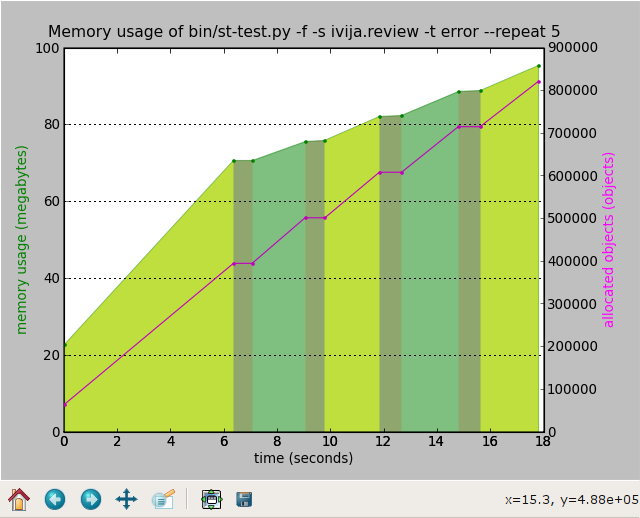
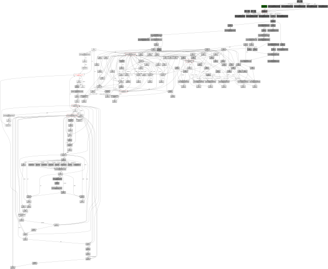
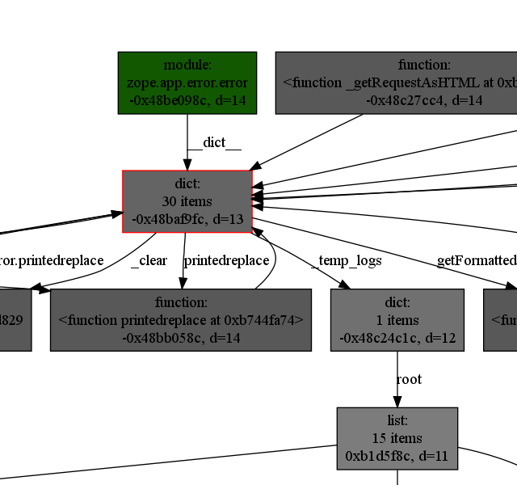
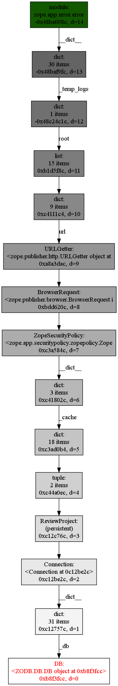
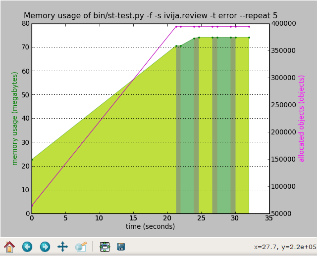

# Hunting memory leaks in Python

At work the functional test suite of our application used up quite a lot of RAM (over 500 megs). For a long time it was cheaper to buy the developers an extra gig of RAM than to spend time hunting down a possible memory leak, but finally curiosity overcame me and I started investigating.  在工作中，我们应用程序的功能测试套件消耗了大量的RAM（超过500兆）。 长期以来，购买开发人员额外的内存比花时间寻找可能的内存泄漏要便宜得多，但最终，好奇心克服了我，我开始调查。

> Warning: long post ahead. With pictures.

Running a subset of the tests in a loop quickly proved that the memory leak is real:  快速地在循环中运行测试的子集，证明内存泄漏是真实的：



The graph was produced by instrumenting the test runner to record the timestamp, memory usage (VmSize from /proc/$pid/status) and the number of objects being tracked by the garbage collector (len(gc.get_objects()) in a CSV file, and then writing a simple Python program to plot it with [matplotlib](http://matplotlib.sourceforge.net/).  该图是通过测试测试运行程序来记录的，以记录时间戳，内存使用情况（/proc/$pid/status 中的 VmSize）以及垃圾收集器正在跟踪的对象数（ CSV中的len(gc.get_objects()) ） 文件，然后编写一个简单的Python程序以使用matplotlib对其进行绘制。

I love matplotlib for the ease of use, even though sometimes I wish the docs were a bit nicer.  我喜欢matplotlib的易用性，尽管有时我希望文档更好一些。

*But wait!*, I hear you say, *Python is a garbage-collected language! How can it leak memory?*  但是，等等！，我听到你说，Python是一种垃圾收集语言！ 如何泄漏内存？

I'm glad you asked. The trouble is that sometimes an object created by the test is referenced from a global variable, and that keeps it from being collected. The tricky thing is to find where that reference comes from, and what is the object being referenced. There are 800 thousand live objects, how do you find the offending ones?  我很高兴你问。 问题在于，有时会从全局变量引用由测试创建的对象，从而无法收集该对象。 棘手的事情是找到该引用的来源以及所引用的对象是什么。 有80万个活物体，您如何找到有问题的物体？

It took quite a while to think of a solution. Finally my coworker Ignas suggested drawing object graphs with [graphviz](http://www.graphviz.org/), and I developed a module with a few convenient helper functions.  想了好一会儿才解决。 最后，我的同事Ignas建议使用graphviz绘制对象图，然后我开发了一个带有一些便捷帮助器功能的模块。

I put a breakpoint at the very end of the app and started looking around. Here's the number of in-memory object databases:  我在应用程序的最后放置了一个断点，并开始四处张望。 这是内存中对象数据库的数量：

```
(Pdb) checks.count('DB')
6
```

There shouldn't be any, or there should be at most one (a global in-memory RAM database used for tracking browser sessions or something like that)! Let's see what objects are pointing to the last one, limiting the referencing chains to 15 objects:  不应该有，或者最多应该有一个（用于跟踪浏览器会话之类的全局内存RAM数据库）！ 让我们看看什么对象指向最后一个对象，将引用链限制为15个对象：

```
(Pdb) checks.show_backrefs(checks.by_type('DB')[-1])
Graph written to objects.dot (185 nodes)
Image generated as objects.png
```

The image produces is nice, but large (9760 x 8008 pixels), so I'm not going to show it here in full. Here's a shrunken version:  生成的图像很好，但是很大（9760 x 8008像素），因此在这里我不会完整显示。 这是缩小的版本：



By the way, GIMP eats up a gig of RAM with it open.  顺便说一下，GIMP在打开它的情况下吞噬了一部分RAM。

If you could zoom in and pan around, and if you knew the colour code, you'd immediatelly notice the green box indicating a module in the top-right corner:  如果您可以放大和平移，并且知道颜色代码，则会立即注意到在右上角指示模块的绿色框：



Let me show you just the reference chain:

```
(Pdb) import inspect
(Pdb) chain = checks.find_backref_chain(checks.by_type('DB')[-1], inspect.ismodule)
(Pdb) in_chain = lambda x, ids=set(map(id, chain)): id(x) in ids
(Pdb) checks.show_backrefs(chain[-1], len(chain), filter=in_chain)
Graph written to objects.dot (15 nodes)
Image generated as objects.png
```



To get rid of this leak I had to clear zope.app.error.error._temp_logs in the test tear-down by calling zope.app.error.error._clear():  为了摆脱这种泄漏，我必须通过调用zope.app.error.error._clear() 清除测试拆解中的 zope.app.error.error._temp_logs：



I attribute the slight memory increase on the second repetition to memory fragmentation: new objects are allocated, old objects are freed, the total number of objects stays the same, but now there are some gaps in the memory arena. This effect disappears on the third and later repetitions, so I'm not worrying.  我将第二次重复的轻微内存增加归因于内存碎片：分配了新对象，释放了旧对象，对象总数保持不变，但是现在内存领域存在一些空白。 此效果在第三次及以后的重复中消失，因此我不必担心。

There were a couple of other, smaller memory leaks elsewhere. At the end of the day the full test suite fit in under 200 megs of RAM.  其他地方还有其他一些较小的内存泄漏。 最终，完整的测试套件可容纳200兆以下的RAM。

Don't let anyone tell you that [graph theory](http://en.wikipedia.org/wiki/Breadth-first_search) is useless in the real world. Also, Python's garbage collector's [introspection powers](http://python.org/doc/current/lib/module-gc.html) are awesome!  不要让任何人告诉您图论在现实世界中是无用的。 另外，Python的垃圾收集器的自省功能非常强大！

**Update:** see the [annotated source code for the 'checks' module](https://mg.pov.lt/blog/python-object-graphs.html).

**Update 2:** the 'checks' module was open-sourced as [objgraph](https://mg.pov.lt/objgraph/).

[参考](https://mg.pov.lt/blog/hunting-python-memleaks.html)
