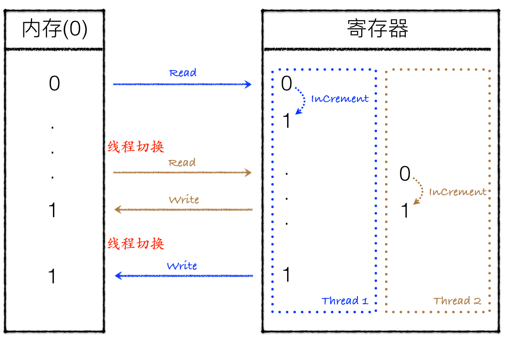

# 什么是线程安全问题

在多线程环境下，每一个线程均可以使用**所属进程**的**全局变量**。如果一个线程对全局变量进行了修改，将会影响到其他所有的线程。为了避免多个线程同时对全局变量进行修改，引入了线程同步机制，通过互斥锁，条件变量或者读写锁等来控制对全局变量的访问。

只用全局变量并不能满足多线程环境的需求，很多时候线程还需要拥有自己的私有数据，这些数据对于其他线程来说不可见。因此线程中也可以使用**局部变量**，局部变量只有线程自身可以访问，同一个进程下的其他线程不可访问。

有时候使用局部变量不太方便，因此 python 还提供了 ThreadLocal 变量，它本身是一个全局变量，但是每个线程却可以利用它来保存属于自己的私有数据，这些私有数据对其他线程也是不可见的。

## 全局变量 VS 局部变量

首先借助一个小程序来看看多线程环境下全局变量的同步问题。

```python
# -*- coding: utf-8 -*-

import threading

global_num = 0


def thread_cal():
    global global_num
    for _ in xrange(1000):
        global_num += 1

# Get 10 threads, run them and wait them all finished.
threads = []
for i in range(10):
    threads.append(threading.Thread(target=thread_cal))
    threads[i].start()

for i in range(10):
    threads[i].join()

# Value of global variable can be confused.
print global_num

"""
[root@huzhi-code]# python 11_test.py
7469
[root@huzhi-code]# python 11_test.py
8000
[root@huzhi-code]# python 11_test.py
6004
[root@huzhi-code]# python 11_test.py
10000
[root@huzhi-code]# python 11_test.py
9372
[root@huzhi-code]# python 11_test.py
8564
"""

```

这里我们创建了10个线程，每个线程均对全局变量 global_num 进行1000次的加1操作（循环1000次加1是为了延长单个线程执行时间，使线程执行时被中断切换），当10个线程执行完毕时，全局变量的值是多少呢？答案是不确定。简单来说是因为 `global_num += 1` 并不是一个原子操作，因此执行过程可能被其他线程中断，导致其他线程读到一个脏值。以两个线程执行 +1 为例，其中一个可能的执行序列如下（此情况下最后结果为1）：




[什么是线程安全问题](https://selfboot.cn/2016/08/22/threadlocal_overview/)


`线程安全`就是多线程访问时，采用了加锁机制，当一个线程访问该类的某个数据时，进行保护，其他线程不能进行访问直到该线程读取完，其他线程才可使用。不会出现数据不一致或者数据污染。

`线程不安全`就是不提供数据访问保护，有可能出现多个线程先后更改数据造成所得到的数据是脏数据

Python实现线程安全的方法
1. Lock 对象
2. Rlock 对象
3. 信号量和有边界的信号量
4. 事件
5. queue 模块
6. threading.local()

要想实现线程安全不一定要使用锁机制，threading.local 就没有采用加锁机制，threading.local 在内部使用字典存储每个线程的相关数据。字典的key就是线程ID，值就是相关线程的数据。

### threading.local 对象基本性质

```python
#!/usr/bin/env python
# -*- coding: utf-8 -*-

""" threading.local 对象基本性质
"""

from threading import Thread
from threading import local

# 在全局命名空间中实例化 local 对象
mydata = local()

# 为 local 对象上的属性赋值，该属性属于全局进程的相关数据
mydata.number = 42
print mydata.number  # 42
print mydata.__dict__  # {'number': 42}

# 为 local 对象上的属性赋值的另一种方式
mydata.__dict__.setdefault('widgets', [])
print mydata.widgets  # []

log = []

def f():
    # 在线程内部使用全局命名空间中的 local 对象 mydata
    # 但是该对象不会携带全局进程中的相关数据
    print mydata.__dict__  # {}
    items = mydata.__dict__.items()
    print items  # []
    items.sort()
    # 在线程中向 local 对象添加数据
    log.append(items)
    mydata.number = 11
    log.append(mydata.number)

# 启动线程
thread = Thread(target=f)
thread.start()
thread.join()
print log  # [[], 11]

# 在线程中添加的数据不会影响全局进程中的数据，实现线程安全
print mydata.number  # 42

```

### 继承 local 对象实现自定义类

```python
#!/usr/bin/env python
# -*- coding: utf-8 -*-

""" 继承 local 对象实现自定义类
"""

from threading import Thread
from threading import local

def f():
    print id(mydata)  # 140319450666808
    print mydata.__dict__  # {'color': 'red'}
    items = mydata.__dict__.items()
    print items  # [('color', 'red')]
    items.sort()
    log.append(items)
    print mydata.number  # 2
    # print mydata.other  # AttributeError: 'MyLocal' object has no attribute 'other'
    mydata.number = 11
    log.append(mydata.number)

class MyLocal(local):
    number = 2

    def __init__(self, **kw):
        # 这里会执行两次，在全局进程中执行一次，当该对象应用在线程中也要执行一次
        print "MyLocal init"
        self.__dict__.update(kw)
        print self.__dict__  # {'color': 'red'}

    def squared(self):
        return self.number ** 2

# 在全局命名空间中实例化 MyLocal 对象，MyLocal 对象继承自 local 对象
mydata = MyLocal(color='red')

# mydata 在全局进程中的地址和在线程中的地址一样，为什么会两次执行初始化方法 __init__??
print id(mydata)  # 140319450666808

# 实例化 MyLocal 对象后，添加相关属性，这些属性属于全局进程中的相关数据
# 其中 color 是实例化时添加的属性，number 是类变量，other 是动态添加的
# 所以 color 和 number 可以在线程中访问到，other 在线程中不能访问
print mydata.number  # 2
print mydata.color  # red

mydata.other = 5
print mydata.other  # 5

del mydata.color
print mydata.squared()  # 4

log = []
thread = Thread(target=f)
thread.start()
thread.join()
print log  # [[('color', 'red')], 11]
print mydata.number  # 2
# print mydata.color  # AttributeError: 'MyLocal' object has no attribute 'color'

```

### 继承 local 对象实现自定义类时的限制

```python
#!/usr/bin/env python
# -*- coding: utf-8 -*-

from threading import Thread
from threading import local

def f():
    print mydata.__dict__  # {}
    items = mydata.__dict__.items()
    print items  # []
    items.sort()
    log.append(items)
    mydata.number = 11
    log.append(mydata.number)


class MyLocal(local):
    __slots__ = 'number'

mydata = MyLocal()
mydata.number = 52
mydata.color = 'blue'  # __slots__ 的行为和普通对象中的 __slots__ 行为不一致，普通对象此时不能额外添加属性
print mydata.number  # 52
print mydata.color  # blue

log = []
thread = Thread(target=f)
thread.start()
thread.join()
print mydata.number  # 11
del mydata
```

### werkzeug.local.Local 对象基本性质

```python
#!/usr/bin/env python
# -*- coding: utf-8 -*-

from threading import Thread
from werkzeug.local import Local

request_global = '123'
request_local = '456'

locals = Local()
locals.request = '789'

class MyThread(Thread):
    def run(self):
        global request_global
        request_global = 'abc'

        request_local = 'def'

        locals.request = 'ghi'

        print 'child thread request: ', request_global  # child thread request:  abc
        print 'child thread request: ', request_local  # child thread request:  def
        print 'child thread request: ', locals.request  # child thread request:  ghi

mythread = MyThread()
mythread.start()
mythread.join()

print 'main thread request: ', request_global  # main thread request:  abc
print 'main thread request: ', request_local  # main thread request:  456
print 'main thread request: ', locals.request  # main thread request:  789

```
