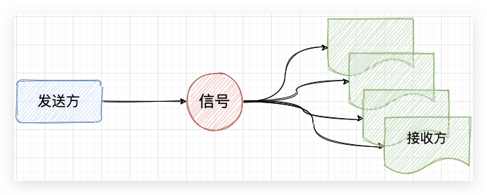
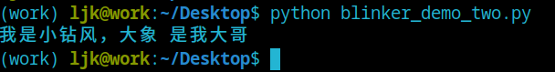
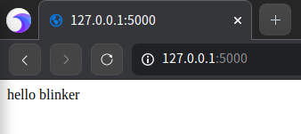
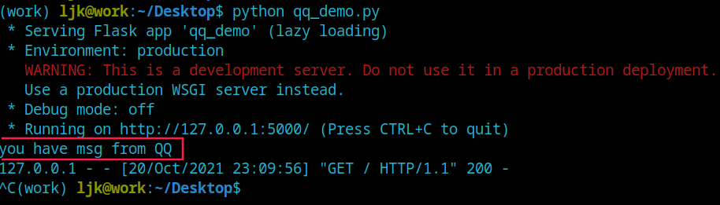
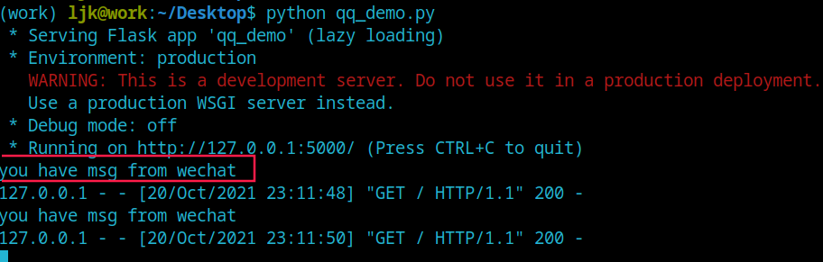

# python 中的信号通信 blinker

## 信号

信号是一种通知或者说通信的方式，信号分为发送方和接收方。发送方发送一种信号，接收方收到信号的进程会跳入信号处理函数，执行完后再跳回原来的位置继续执行。常见的 linux 中的信号，通过键盘输入Ctrl+C，就是发送给系统一个信号，告诉系统退出当前进程。

信号的特点就是发送端通知订阅者发生了什么。使用信号分为3步，定义信号，监听信号，发送信号




python中 提供了信号概念的通信模块，就是 blinker。

官方介绍：

Blinker 是一个基于 Python 的强大的信号库，它既支持简单的点对点通信，也支持点对多点的组播。Flask 的信号机制就是基于它建立的。Blinker 的内核虽然小巧，但是功能却非常强大，它支持以下特性：

* 支持注册全局命名信号
* 支持匿名信号
* 支持自定义命名信号
* 支持与接收者之间的持久连接与短暂连接
* 通过弱引用实现与接收者之间的自动断开连接
* 支持发送任意大小的数据
* 支持收集信号接收者的返回值
* 线程安全

## blinker 使用

### 安装方法

```bash
pip install blinker
```

### 命名信号

```python
from blinker import signal

# 定义一个信号
s = signal('king')

def animal(args):
    print('我是小钻风，大王回来了，我要去巡山')

# 信号注册一个接收者
s.connect(animal)

if "__main__" == __name__:
    # 发送信号
    s.send()

```


### 匿名信号

blinker 也支持匿名信号，就是不需要指定一个具体的信号值。创建的每一个匿名信号都是互相独立的。

```python
from blinker import Signal

s = Signal()

def animal(sender):
    print('我是小钻风，大王回来了，我要去巡山')

s.connect(animal)

if "__main__" == __name__:
    s.send()

```

### 组播信号

组播信号是比较能体现出信号优点的特征。多个接收者注册到信号上，发送者只需要发送一次就能传递信息到多个接收者。

```python
from blinker import signal

s = signal('king')

def animal_one(args):
    print(f'我是小钻风，今天的口号是: {args}')

def animal_two(args):
    print(f'我是大钻风，今天的口号是: {args}')

s.connect(animal_one)
s.connect(animal_two)

if "__main__" == __name__:
    s.send('大王叫我来巡山，抓个和尚做晚餐！')

```


### 接收方订阅主题

接受方支持订阅指定的主题，只有当指定的主题发送消息时才发送给接收方。这种方法很好的区分了不同的主题。

```python
from blinker import signal

s = signal('king')

def animal(args):
    print(f'我是小钻风，{args} 是我大哥')

s.connect(animal, sender='大象')

if "__main__" == __name__:
    for i in ['狮子', '大象', '大鹏']:
        s.send(i)

```



### 装饰器用法

除了可以函数注册之外还有更简单的信号注册方法，那就是装饰器。

```python
from blinker import signal

s = signal('king')

@s.connect
def animal_one(args):
    print(f'我是小钻风，今天的口号是: {args}')

@s.connect
def animal_two(args):
    print(f'我是大钻风，今天的口号是: {args}')

if "__main__" == __name__:
    s.send('大王叫我来巡山，抓个和尚做晚餐！')

```

### 可订阅主题的装饰器

connect 的注册方法用着装饰器时有一个弊端就是不能够订阅主题，所以有更高级的 connect_via 方法支持订阅主题。

```python
from blinker import signal

s = signal('king')

@s.connect_via('大象')
def animal(args):
    print(f'我是小钻风，{args} 是我大哥')

if "__main__" == __name__:
    for i in ['狮子', '大象', '大鹏']:
        s.send(i)

```

### 检查信号是否有接收者

如果对于一个发送者发送消息前要准备的耗时很长，为了避免没有接收者导致浪费性能的情况，所以可以先检查某一个信号是否有接收者，在确定有接收者的情况下才发送，做到精确。

```python
from blinker import signal

s = signal('king')
q = signal('queue')

def animal(sender):
    print('我是小钻风，大王回来了，我要去巡山')

s.connect(animal)

if "__main__" == __name__:
    
    res = s.receivers
    print(res)
    if res:
        s.send()
    
    res = q.receivers
    print(res)
    if res:
        q.send()
    else:
        print("孩儿们都出去巡山了")

```

```bash
{4511880240: <weakref at 0x10d02ae80; to 'function' at 0x10cedd430 (animal)>}
我是小钻风，大王回来了，我要去巡山
{}
孩儿们都出去巡山了
```

### 检查订阅者是否订阅了某个信号

也可以检查订阅者是否由某一个信号

```python
from blinker import signal

s = signal('king')
q = signal('queue')

def animal(sender):
    print('我是小钻风，大王回来了，我要去巡山')

s.connect(animal)

if "__main__" == __name__:
    
    res = s.has_receivers_for(animal)
    print(res)

    res = q.has_receivers_for(animal)
    print(res)

```

```bash
True
False
```

## 基于 blinker 的 Flask 信号

Flask 集成 blinker 作为解耦应用的解决方案。在 Flask 中，信号的使用场景如：请求到来之前，请求结束之后。同时 Flask 也支持自定义信号。

### 简单 Flask demo

```python
from flask import Flask

app = Flask(__name__)

@app.route('/', methods=['GET','POST'], endpoint='index')
def index():
    return 'hello blinker'

if __name__ == '__main__':
    app.run()

```

访问 127.0.0.1:5000 时，返回给浏览器 hello blinker。




### 自定义信号

因为 Flask 集成了信号，所以在 Flask 中使用信号时从 Flask 中引入。

```python
from flask import Flask
from flask.signals import _signals

app = Flask(__name__)

s = _signals.singal('msg')

def QQ(args):
    print('you have msg from QQ')

s.connect(QQ)

@app.route('/',methods=['GET','POST'],endpoint='index')
def index():
    s.send()
    return 'hello blinker'

if __name__ == '__main__':
    app.run()

```




### Flask 自带信号

在 Flask 中除了可以自定义信号，还可以使用自带信号。Flask 中自带的信号有很多种，具体如下：

```python
# 请求

# 请求到来前执行
request_started = _signals.signal('request-started')
# 请求结束后执行
request_finished = _signals.signal('request-finished')

# 模板渲染

# 模板渲染前执行
before_render_template = _signals.signal('before-render-template')
# 模板渲染后执行
template_rendered = _signals.signal('template-rendered')

# 请求执行

# 请求执行出现异常时执行
got_request_exception = _signals.signal('got-request-exception')
# 请求执行完毕后自动执行（无论成功与否）
request_tearing_down = _signals.signal('request-tearing-down')
# 请求上下文执行完毕后自动执行（无论成功与否）
appcontext_tearing_down = _signals.signal('appcontext-tearing-down')

# 请求上下文中

# 请求上下文push时执行
appcontext_pushed = _signals.signal('appcontext-pushed')
# 请求上下文pop时执行
appcontext_popped = _signals.signal('appcontext-popped')
# 调用flask在其中添加数据时，自动触发
message_flashed = _signals.signal('message-flashed')
```

下面以请求到来之前为例，看 flask 中信号如何使用

```python
from flask import Flask
from flask.signals import _signals, request_started
import time

app = Flask(__name__)

def wechat(args):
    print('you have msg from wechat')

# 从flask中引入已经定好的信号，注册一个函数
request_started.connect(wechat)

@app.route('/',methods=['GET','POST'],endpoint='index')
def index():
    return 'hello blinker'

if __name__ == '__main__':
    app.run()

```

当请求到来时，flask 会经过 request_started 通知接受方，就是函数 wechat，这时 wechat 函数先执行，然后才返回结果给浏览器。




但这种使用方法并不是很地道，因为信号并不支持异步方法，所以通常在生产环境中信号的接收者都是配置异步执行的框架，如 Python 中大名鼎鼎的异步框架 celery。

## 总结

信号的优点

* 解耦应用：将串行运行的耦合应用分解为多级执行
* 发布订阅者：减少调用者的使用，一次调用通知多个订阅者

信号的缺点

* 不支持异步
* 支持订阅主题的能力有限

