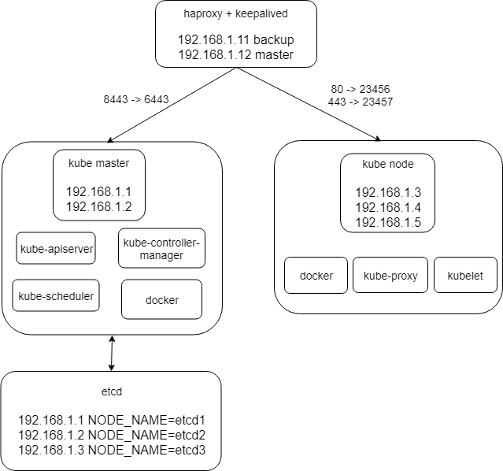
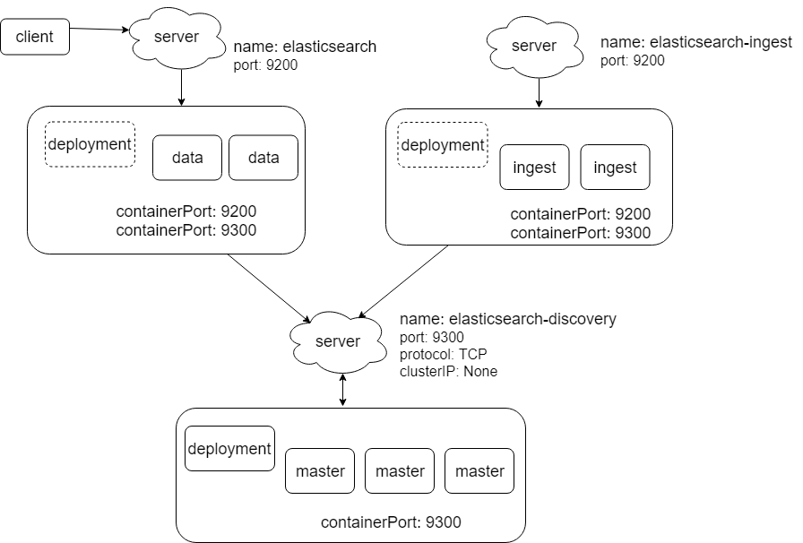
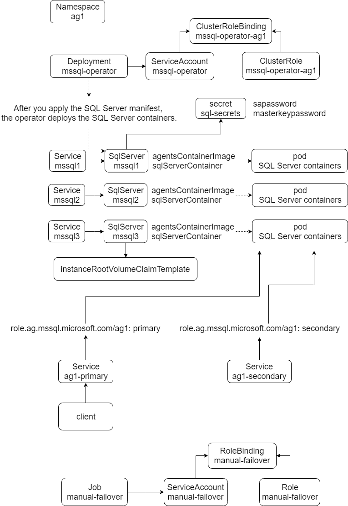
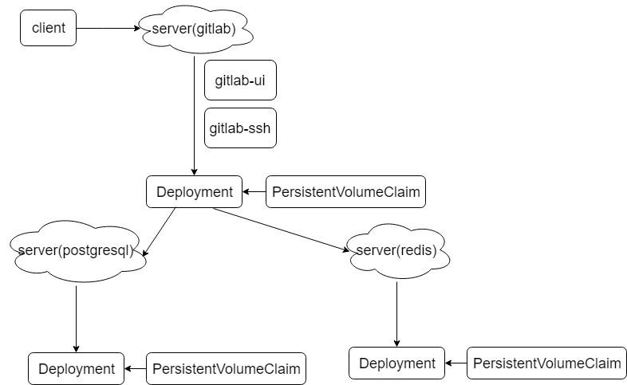
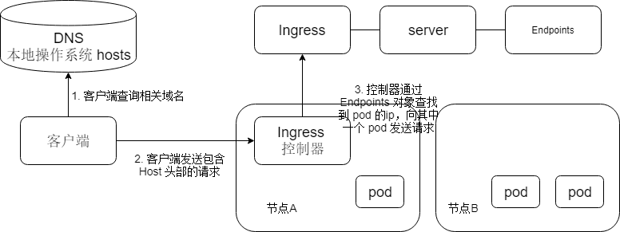
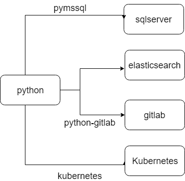

## 容器云平台构建

### 需求

1. 基于kubernetes 1.14版本构建高可用集群
2. Worker节点需要支持linux与windows主机
3. 节点网络互通
4. 支持ES集群部署、更新、回滚
5. 部署高可用sqlserver集群
6. 部署gitlab高可用集群
7. 编写服务python服务，可通过ingress方式访问此服务，并且此服务可以与es/sqlserver/gitlab交互

### 具体构建

* [直接以运行二进制文件的方式搭建 kubernetes 集群](./kubernetes_install.md)
* [将 windows 主节加入到集群作为 node 节点](./Windows_Nodes.md)
* [ES 集群](./elasticsearch.md)
* [sqlserver 构建说明](./sqlserver.md)
* [gitlab 构建说明](./gitlab.md)
* [通过 ingress 暴露 es、sqlserver、gitlab 服务](./Ingress.md)
* [python 客户端访问 kubernetes 服务](./python_client.md)


## kubernetes install

### 整体架构



* 所有节点以 centos7 为操作系统
* 整个集群包括 k8s 主节点、k8s node 节点、etcd、负载均衡节点
* 参照 ansible 的模式，设置一个工作节点，该工作节点不属于 kubernetes 集群
* 为了使部署过程快速完成，在部署之前将所有用到的二进制文件，docker 镜像等全部下载到工作节点，后续复制到集群的相关节点
* 架构的所有节点要求时间同步，所以需要 ntp 或者 chrony 服务
* 使用 harbor 作为私有镜像库，如果没有安装私有镜像库，就需要将 docker 镜像加载到 kubernetes 的 master 和 node 节点。
* 如图所示，客户端请求 haproxy 的 8443 端口，所以相关客户端（包括kubectl 和 kube-proxy）的配置文件中集群 apiserver 的地址应该使 192.168.1.12:8443 
* haproxy 对应的 80 和 443 端口用于向集群外部的客户端公开相关服务，用于 ingress ，此时该如何对应多个服务 ?
* kubernetes 主节点也可以安装 kube-proxy 和 kebuctl 等用于调度
* 工作节点和 k8s node 节点安装 kubectl 用于操作集群
* 相关插件采用离线 docker 镜像安装

### 集群每部分构建说明

* [工作节点的准备工作](./01_deploy.md)

* [所有节点的预配置](./02_prepare.md)

* [haproxy + keepalived 安装配置](./03_lb.md)

* [在 master 和 node 节点上安装 docker](./04_docker.md)

* [etcd](./05_etcd.md)

* [kubernetes 主节点安装配置](./06_kube_master.md)

* [kubernetes node 节点安装配置](./07_kube_node.md)

* [在主节点和 node 节点安装网络插件 flannel ](./08_kube_network.md)

* [安装 dns、metrics-server、dashboard、heapster、metallb、traefik、nginx-ingress](./09_kube_addon.md)

### 问题

* ntp 或者 chrony 服务的异同，该如何选择？
* kubernetes 是否需要知道镜像库的位置，还是只要在 docker 中指定？docker 配置文件可以指定
* 加入 windows 的 node 节点是否对 Linux 发行版有要求？
* haproxy + keepalived 部分配置参数的含义
* 在 systemd unit 文件中可以使用的相关变量有哪些？参见 haproxy + keepalived
* haproxy 对应的 80 和 443 端口用于向集群外部的客户端公开相关服务，用于 ingress ，此时该如何对应多个服务 ?
* 在主节点安装时的操作 `Making master nodes SchedulingDisabled` 和 `Setting master role name` 的作用？
* kubectl cordon 作用？
* 设置集群参数、设置客户端认证参数、设置上下文参数、选择默认上下文 相关选项有哪些 ？
* 启动 kubelet 服务时 cni 配置的作用，安装 flannel 插件为什么要删除默认 cni 配置？

[参考](https://github.com/gjmzj/kubeasz)

## 工作节点准备工作

### 工作节点执行下列操作

1. 下载所有用到的二进制文件，docker 镜像等
2. 生成 CA 证书、私钥、请求文件、配置文件
3. 为客户端 kubectl 创建 kubeconfig 文件 /root/.kube/config
	* 准备 kubectl 使用的 admin 证书签名请求
	* 创建 admin 证书与私钥
	* 设置集群参数，指定 CA 证书和 apiserver 地址
	* 设置客户端 kubectl 认证参数，指定使用 admin 证书和私钥
	* 设置上下文参数，说明使用 cluster 集群和用户 admin
	* 选择默认上下文

4. 为 kube-proxy 创建 kube-proxy.kubeconfig 配置文件 /root/kube-proxy.kubeconfig
	* 准备 kube-proxy 证书签名请求
	* 创建 kube-proxy 证书与私钥
	* 设置集群参数
	* 设置 kube-proxy 认证参数
	* 设置上下文参数
	* 选择默认上下文

### 相关操作的命令如下

```bash
# 建立相关目录
mkdir -p /opt/kube/bin/ /etc/kubernetes/ssl/ /etc/ansible/ /etc/kubernetes

# 事先已经将相关文件下载到 /etc/ansible 目录中
# 下载证书工具 cfssl 和 kubectl
cp /etc/ansible/bin/{cfssl, cfssl-certinfo, cfssljson, kubectl} /opt/kube/bin/

##### 生成 CA 证书、私钥、请求文件、配置文件 #####

# 准备 CA 配置文件
cat /etc/kubernetes/ssl/ca-config.json
{
  "signing": {
    "default": {
      "expiry": "87600h"
    },
    "profiles": {
      "kubernetes": {
        "usages": [
            "signing",
            "key encipherment",
            "server auth",
            "client auth"
        ],
        "expiry": "87600h"
      }
    }
  }
}

# 准备 CA 签名请求文件
cat /etc/kubernetes/ssl/ca-csr.json
{
  "CN": "kubernetes",
  "key": {
    "algo": "rsa",
    "size": 2048
  },
  "names": [
    {
      "C": "CN",
      "ST": "WH",
      "L": "XS",
      "O": "k8s",
      "OU": "System"
    }
  ],
  "ca": {
    "expiry": "131400h"
  }
}

# 生成 CA 证书和私钥
cd /etc/kubernetes/ssl && /opt/kube/bin/cfssl gencert -initca ca-csr.json | /opt/kube/bin/cfssljson -bare ca

##### 为客户端 kubectl 创建 kubeconfig 文件 /root/.kube/config #####

# 准备 kubectl 使用的 admin 证书签名请求
cat /etc/kubernetes/ssl/admin-csr.json
{
  "CN": "admin",
  "hosts": [],
  "key": {
    "algo": "rsa",
    "size": 2048
  },
  "names": [
    {
      "C": "CN",
      "ST": "WH",
      "L": "XS",
      "O": "system:masters",
      "OU": "System"
    }
  ]
}

# 创建 admin 证书与私钥
cd /etc/kubernetes/ssl && /opt/kube/bin/cfssl gencert \
        -ca=/etc/kubernetes/ssl/ca.pem \
        -ca-key=/etc/kubernetes/ssl/ca-key.pem \
        -config=/etc/kubernetes/ssl/ca-config.json \
        -profile=kubernetes admin-csr.json | /opt/kube/bin/cfssljson -bare admin

# 设置集群参数，指定 CA 证书和 apiserver 地址
/opt/kube/bin/kubectl config set-cluster kubernetes \
        --certificate-authority=/etc/kubernetes/ssl/ca.pem \
        --embed-certs=true \
        --server=https://192.168.1.12:8443

# 设置客户端 kubectl 认证参数，指定使用 admin 证书和私钥
/opt/kube/bin/kubectl config set-credentials admin \
        --client-certificate=/etc/kubernetes/ssl/admin.pem \
        --embed-certs=true \
        --client-key=/etc/kubernetes/ssl/admin-key.pem

# 设置上下文参数，说明使用 cluster 集群和用户 admin
/opt/kube/bin/kubectl config set-context kubernetes \
        --cluster=kubernetes --user=admin

# 选择默认上下文
/opt/kube/bin/kubectl config use-context kubernetes

##### 为 kube-proxy 创建 kube-proxy.kubeconfig 配置文件 /root/kube-proxy.kubeconfig #####

# 准备 kube-proxy 证书签名请求
cat /etc/kubernetes/ssl/kube-proxy-csr.json
{
  "CN": "system:kube-proxy",
  "hosts": [],
  "key": {
    "algo": "rsa",
    "size": 2048
  },
  "names": [
    {
      "C": "CN",
      "ST": "WH",
      "L": "XS",
      "O": "k8s",
      "OU": "System"
    }
  ]
}

# 创建 kube-proxy 证书与私钥
cd /etc/kubernetes/ssl && /opt/kube/bin/cfssl gencert \
        -ca=/etc/kubernetes/ssl/ca.pem \
        -ca-key=/etc/kubernetes/ssl/ca-key.pem \
        -config=/etc/kubernetes/ssl/ca-config.json \
        -profile=kubernetes kube-proxy-csr.json | /opt/kube/bin/cfssljson -bare kube-proxy

# 设置集群参数
/opt/kube/bin/kubectl config set-cluster kubernetes \
        --certificate-authority=/etc/kubernetes/ssl/ca.pem \
        --embed-certs=true \
        --server=https://192.168.1.12:8443 \
        --kubeconfig=kube-proxy.kubeconfig

# 设置 kube-proxy 认证参数
/opt/kube/bin/kubectl config set-credentials kube-proxy \
        --client-certificate=/etc/kubernetes/ssl/kube-proxy.pem \
        --client-key=/etc/kubernetes/ssl/kube-proxy-key.pem \
        --embed-certs=true \
        --kubeconfig=kube-proxy.kubeconfig

# 设置上下文参数
/opt/kube/bin/kubectl config set-context default \
        --cluster=kubernetes \
        --user=kube-proxy \
        --kubeconfig=kube-proxy.kubeconfig

# 选择默认上下文
/opt/kube/bin/kubectl config use-context default --kubeconfig=kube-proxy.kubeconfig

# 移动 kube-proxy.kubeconfig
mv /root/kube-proxy.kubeconfig /etc/kubernetes/

```


## 集群所有节点的预配置

* 关闭或者卸载相关防火墙
* 关闭 selinux
* 安装基础软件包
* 禁用系统 swap
* 加载相关内核模块
* 设置系统参数
* 设置系统 ulimits

### 相关操作命令如下

```bash
# 删除 centos/redhat 默认安装的 firewalld、python-firewall、firewalld-filesystem

# 添加 EPEL 仓库

# 安装基础软件包
yum install conntrack-tools psmisc nfs-utils jq socat bash-completion rsync ipset ipvsadm

# 临时或者永久关闭 selinux
setenforce 0

/etc/selinux/config
"SELINUX=disabled"

# 禁用系统 swap
swapoff -a && sysctl -w vm.swappiness=0

# 注释 /etc/fstab 中的 swap 相关配置

# 加载相关内核模块
br_netfilter、ip_vs、ip_vs_rr、ip_vs_wrr、ip_vs_sh、nf_conntrack_ipv4、nf_conntrack

# 启用 systemd 自动加载模块服务

# 增加内核模块开机加载配置
cat /etc/modules-load.d/10-k8s-modules.conf
br_netfilter
ip_vs
ip_vs_rr
ip_vs_wrr
ip_vs_sh
nf_conntrack_ipv4
nf_conntrack

# 设置系统参数
cat /etc/sysctl.d/95-k8s-sysctl.conf
net.ipv4.ip_forward = 1
net.bridge.bridge-nf-call-iptables = 1
net.bridge.bridge-nf-call-ip6tables = 1
net.bridge.bridge-nf-call-arptables = 1
# 
net.netfilter.nf_conntrack_max=1000000
vm.swappiness = 0
vm.max_map_count=655360
fs.file-max=655360

# 生效系统参数
sysctl -p /etc/sysctl.d/95-k8s-sysctl.conf

# 设置系统 ulimits
cat /etc/security/limits.d/30-k8s-ulimits.conf
* soft nofile 65536
* hard nofile 65536
* soft nproc 65536
* hard nproc 65536

mkdir -p /opt/kube/bin /etc/kubernetes/ssl

# 下载或者拷贝证书工具 CFSSL 到 /opt/kube/bin 目录

export PATH=/opt/kube/bin:$PATH

```

### haproxy + keepalived

```bash
192.168.1.11 LB_ROLE=backup
192.168.1.12 LB_ROLE=master

# 安装 haproxy
yum install haproxy -y

# 创建 haproxy 配置目录
mkdir /etc/haproxy

# 修改 centos 的 haproxy.service
cat /usr/lib/systemd/system/haproxy.service
[Unit]
Description=HAProxy Load Balancer
After=syslog.target network.target

[Service]
EnvironmentFile=/etc/sysconfig/haproxy
ExecStartPre=/usr/bin/mkdir -p /run/haproxy
ExecStart=/usr/sbin/haproxy-systemd-wrapper -f /etc/haproxy/haproxy.cfg -p /run/haproxy.pid $OPTIONS
ExecReload=/bin/kill -USR2 $MAINPID
KillMode=mixed

[Install]
WantedBy=multi-user.target

# 配置 haproxy
cat /etc/haproxy/haproxy.cfg
global
        log /dev/log    local0
        log /dev/log    local1 notice
        chroot /var/lib/haproxy
        stats socket /run/haproxy/admin.sock mode 660 level admin
        stats timeout 30s
        user haproxy
        group haproxy
        daemon
        nbproc 1

defaults
        log     global
        timeout connect 5000
        timeout client  10m
        timeout server  10m

listen kube-master
        bind 0.0.0.0:8443
        mode tcp
        option tcplog
        balance roundrobin
        server 192.168.1.1 192.168.1.1:6443 check inter 2000 fall 2 rise 2 weight 1
        server 192.168.1.2 192.168.1.2:6443 check inter 2000 fall 2 rise 2 weight 1

listen ingress-node
	bind 0.0.0.0:80
	mode tcp
        option tcplog
        balance roundrobin
        server 192.168.1.3 192.168.1.3:23456 check inter 2000 fall 2 rise 2 weight 1
        server 192.168.1.4 192.168.1.4:23456 check inter 2000 fall 2 rise 2 weight 1
        server 192.168.1.5 192.168.1.5:23456 check inter 2000 fall 2 rise 2 weight 1

listen ingress-node-tls
	bind 0.0.0.0:443
	mode tcp
        option tcplog
        balance {{ BALANCE_ALG }}
        server 192.168.1.3 192.168.1.3:23457 check inter 2000 fall 2 rise 2 weight 1
        server 192.168.1.4 192.168.1.4:23457 check inter 2000 fall 2 rise 2 weight 1
        server 192.168.1.5 192.168.1.5:23457 check inter 2000 fall 2 rise 2 weight 1

# 安装 keepalived
yum install keepalived

# 创建keepalived配置目录
mkdir /etc/keepalived

# 配置 keepalived 主节点 192.168.1.12
cat /etc/keepalived/keepalived.conf
global_defs {
    router_id lb-master-192.168.1.12
}

vrrp_script check-haproxy {
    script "killall -0 haproxy"
    interval 5
    weight -60
}

vrrp_instance VI-kube-master {
    state MASTER
    priority 120
    unicast_src_ip 192.168.1.12
    unicast_peer {
        192.168.1.11
    }
    dont_track_primary
    interface 192.168.1.12
    virtual_router_id 111
    advert_int 3
    track_script {
        check-haproxy
    }
    virtual_ipaddress {
        192.168.1.12
    }
}

# 配置 keepalived 备节点 192.168.1.11
cat /etc/keepalived/keepalived.conf 
global_defs {
    router_id lb-backup-192.168.1.11
}

vrrp_script check-haproxy {
    script "killall -0 haproxy"
    interval 5
    weight -60
}

vrrp_instance VI-kube-master {
    state BACKUP
    priority {{ 119 | random(61, 1) }}
    unicast_src_ip 192.168.1.11
    unicast_peer {
        192.168.1.12
    }
    dont_track_primary
    interface 192.168.1.11
    virtual_router_id 111
    advert_int 3
    track_script {
        check-haproxy
    }
    virtual_ipaddress {
       192.168.1.12
    }
}

# 
systemctl daemon-reload
systemctl enable haproxy
systemctl restart haproxy

systemctl enable keepalived
systemctl restart keepalived

```

## docker 

安装方式：

* 二进制文件安装
* 包管理

### 二进制文件安装示例

```bash
[kube-master]
192.168.1.1
192.168.1.2

[kube-node]
192.168.1.3
192.168.1.4
192.168.1.5

mkdir -p /opt/kube/bin /etc/kubernetes/ssl

# 从工作节点拷贝 docker 二进制文件，也可以直接 yum 安装
scp /etc/ansible/bin/docker-containerd /opt/kube/bin/docker-containerd
scp /etc/ansible/bin/docker-containerd-shim /opt/kube/bin/docker-containerd-shim
scp /etc/ansible/bin/docker-init /opt/kube/bin/docker-init
scp /etc/ansible/bin/docker-runc /opt/kube/bin/docker-runc
scp /etc/ansible/bin/docker /opt/kube/bin/docker
scp /etc/ansible/bin/docker-containerd-ctr /opt/kube/bin/docker-containerd-ctr
scp /etc/ansible/bin/dockerd /opt/kube/bin/dockerd
scp /etc/ansible/bin/docker-proxy /opt/kube/bin/docker-proxy

# docker命令自动补全???

# docker配置
cat /etc/docker/daemon.json
{
  "registry-mirrors": ["https://registry.docker-cn.com", "https://docker.mirrors.ustc.edu.cn"], 
  "max-concurrent-downloads": 10,
  "log-driver": "json-file",
  "log-level": "warn",
  "log-opts": {
    "max-size": "10m",
    "max-file": "3"
    },
  "data-root": "/var/lib/docker"
}

# 清理 iptables 统计
iptables -P INPUT ACCEPT \
&& iptables -F && iptables -X \
&& iptables -F -t nat && iptables -X -t nat \
&& iptables -F -t raw && iptables -X -t raw \
&& iptables -F -t mangle && iptables -X -t mangle

# 创建docker的systemd unit文件
cat /etc/systemd/system/docker.service
[Unit]
Description=Docker Application Container Engine
Documentation=http://docs.docker.io

[Service]
Environment="PATH=/opt/kube/bin:/bin:/sbin:/usr/bin:/usr/sbin"
ExecStart=/opt/kube/bin/dockerd 
ExecStartPost=/sbin/iptables -I FORWARD -s 0.0.0.0/0 -j ACCEPT
ExecReload=/bin/kill -s HUP $MAINPID
Restart=on-failure
RestartSec=5
LimitNOFILE=infinity
LimitNPROC=infinity
LimitCORE=infinity
Delegate=yes
KillMode=process

[Install]
WantedBy=multi-user.target

# 安装docker查询镜像tag的小工具
```

## 安装 etcd

```bash

192.168.1.1 NODE_NAME=etcd1
192.168.1.2 NODE_NAME=etcd2
192.168.1.3 NODE_NAME=etcd3

mkdir -p /opt/kube/bin /etc/kubernetes/ssl /etc/etcd/ssl /var/lib/etcd

# 从工作节点拷贝 etcd 二进制文件
scp /etc/ansible/bin/etcd /opt/kube/bin/etcd
scp /etc/ansible/bin/etcdctl /opt/kube/bin/etcdctl

# 从工作节点拷贝 CA 证书和私钥
scp /etc/kubernetes/ssl/ca.pem /etc/kubernetes/ssl/ca.pem
scp /etc/kubernetes/ssl/ca-key.pem /etc/kubernetes/ssl/ca-key.pem
scp /etc/kubernetes/ssl/ca.csr /etc/kubernetes/ssl/ca.csr
scp /etc/kubernetes/ssl/ca-config.json /etc/kubernetes/ssl/ca-config.json

# 创建 etcd 证书请求文件，以 192.168.1.1 为例
cat /etc/etcd/ssl/etcd-csr.json
{
  "CN": "etcd",
  "hosts": [
    "127.0.0.1",
    "192.168.1.1"
  ],
  "key": {
    "algo": "rsa",
    "size": 2048
  },
  "names": [
    {
      "C": "CN",
      "ST": "WH",
      "L": "XS",
      "O": "k8s",
      "OU": "System"
    }
  ]
}

# 创建 etcd 证书和私钥
cd /etc/etcd/ssl && /opt/kube/bin/cfssl gencert \
        -ca=/etc/kubernetes/ssl/ca.pem \
        -ca-key=/etc/kubernetes/ssl/ca-key.pem \
        -config=/etc/kubernetes/ssl/ca-config.json \
        -profile=kubernetes etcd-csr.json | \  
        /opt/kube/bin/cfssl/cfssljson -bare etcd
        
# 创建etcd的 systemd unit 文件，以 192.168.1.1 NODE_NAME=etcd1 为例
cat /etc/systemd/system/etcd.service
[Unit]
Description=Etcd Server
After=network.target
After=network-online.target
Wants=network-online.target
Documentation=https://github.com/coreos

[Service]
Type=notify
WorkingDirectory=/var/lib/etcd/
ExecStart=/opt/kube/bin/etcd \
  --name=etcd1 \
  --cert-file=/etc/etcd/ssl/etcd.pem \
  --key-file=/etc/etcd/ssl/etcd-key.pem \
  --peer-cert-file=/etc/etcd/ssl/etcd.pem \
  --peer-key-file=/etc/etcd/ssl/etcd-key.pem \
  --trusted-ca-file=/etc/kubernetes/ssl/ca.pem \
  --peer-trusted-ca-file=/etc/kubernetes/ssl/ca.pem \
  --initial-advertise-peer-urls=https://192.168.1.1:2380 \
  --listen-peer-urls=https://192.168.1.1:2380 \
  --listen-client-urls=https://192.168.1.1:2379,http://127.0.0.1:2379 \
  --advertise-client-urls=https://192.168.1.1:2379 \
  --initial-cluster-token=etcd-cluster-0 \
  --initial-cluster=etcd1=https://192.168.1.1:2380,etcd02=http://192.168.1.2:2380,etcd03=http://192.168.13:2380 \
  --initial-cluster-state=new \
  --data-dir=/var/lib/etcd
Restart=on-failure
RestartSec=5
LimitNOFILE=65536

[Install]
WantedBy=multi-user.target

# 开机启用etcd服务
systemctl enable etcd
# 开启etcd服务
systemctl daemon-reload
systemctl restart etcd
systemctl status etcd.service
```

## kubernetes master

### kubernetes master 节点安装配置步骤

1. 下载或者拷贝相关二进制文件
2. 从工作节点拷贝 CA 证书和私钥，admin 证书和私钥
3. 生成 kubernetes、aggregator proxy 证书和私钥
4. 创建 basic-auth.csv
5. 创建 kube-apiserver、kube-controller-manager、kube-scheduler 的 systemd unit 文件
6. 启动服务
7. Making master nodes SchedulingDisabled
8. Setting master role name
9. 安装相关插件

### 相关配置说明如下

```bash
# 集群网络插件，可以支持calico, flannel, kube-router, cilium
CLUSTER_NETWORK="flannel"

# 服务网段 (Service CIDR），注意不要与内网已有网段冲突
SERVICE_CIDR="10.68.0.0/16"

# kubernetes 服务 IP (预分配，一般是 SERVICE_CIDR 中第一个IP)
CLUSTER_KUBERNETES_SVC_IP="10.68.0.1"

# 集群 DNS 服务 IP (从 SERVICE_CIDR 中预分配)
CLUSTER_DNS_SVC_IP="10.68.0.2"

# POD 网段 (Cluster CIDR），注意不要与内网已有网段冲突
CLUSTER_CIDR="172.20.0.0/16"

# 服务端口范围 (NodePort Range)
NODE_PORT_RANGE="20000-40000"

# 集群 DNS 域名
CLUSTER_DNS_DOMAIN="cluster.local."

# 需要说明的是集群的 apiserver 地址应该是负载均衡的地址
# MASTER_IP 为负载均衡主节点地址
MASTER_IP="192.168.1.12"
KUBE_APISERVER="https://192.168.1.12:8443"

# 集群 basic auth 使用的用户名和密码，用于 basic-auth.csv
BASIC_AUTH_USER="admin"
BASIC_AUTH_PASS="test1234"

```

### apiserver 参数说明

```bash
--requestheader-client-ca-file=/etc/kubernetes/ssl/ca.pem

--client-ca-file=/etc/kubernetes/ssl/ca.pem
--service-account-key-file=/etc/kubernetes/ssl/ca-key.pem

--kubelet-client-certificate=/etc/kubernetes/ssl/admin.pem
--kubelet-client-key=/etc/kubernetes/ssl/admin-key.pem

--tls-cert-file=/etc/kubernetes/ssl/kubernetes.pem
--tls-private-key-file=/etc/kubernetes/ssl/kubernetes-key.pem

--proxy-client-cert-file=/etc/kubernetes/ssl/aggregator-proxy.pem
--proxy-client-key-file=/etc/kubernetes/ssl/aggregator-proxy-key.pem

--basic-auth-file=/etc/kubernetes/ssl/basic-auth.csv

# --service-cluster-ip-range={{ SERVICE_CIDR }}
--service-cluster-ip-range=10.68.0.0/16

# --service-node-port-range={{ NODE_PORT_RANGE }}
--service-node-port-range=20000-40000

# etcd
--etcd-cafile=/etc/kubernetes/ssl/ca.pem
--etcd-certfile=/etc/kubernetes/ssl/kubernetes.pem
--etcd-keyfile=/etc/kubernetes/ssl/kubernetes-key.pem
--etcd-servers=https://192.168.1.1:2379,https://192.168.1.2:2379,https://192.168.1.2:2379

```

### kube-controller-manager 配置参数说明

```bash
# --service-cluster-ip-range={{ SERVICE_CIDR }}
--service-cluster-ip-range=10.68.0.0/16

# --cluster-cidr={{ CLUSTER_CIDR }}
--cluster-cidr=172.20.0.0/16

--cluster-signing-cert-file=/etc/kubernetes/ssl/ca.pem
--cluster-signing-key-file=/etc/kubernetes/ssl/ca-key.pem
--service-account-private-key-file=/etc/kubernetes/ssl/ca-key.pem
--root-ca-file=/etc/kubernetes/ssl/ca.pem

```

### kube-scheduler 配置参数说明

### kube master 相关命令

```bash
192.168.1.1
192.168.1.2

mkdir -p /opt/kube/bin /etc/kubernetes/ssl

# 从工作节点拷贝 kube-master 相关二进制文件
scp /etc/ansible/bin/kube-apiserver /opt/kube/bin/kube-apiserver
scp /etc/ansible/bin/kube-controller-manager /opt/kube/bin/kube-controller-manager
scp /etc/ansible/bin/kube-scheduler /opt/kube/bin/kube-scheduler

# 从工作节点拷贝 CA 证书和私钥
scp /etc/kubernetes/ssl/ca.pem /etc/kubernetes/ssl/ca.pem
scp /etc/kubernetes/ssl/ca-key.pem /etc/kubernetes/ssl/ca-key.pem
scp /etc/kubernetes/ssl/ca.csr /etc/kubernetes/ssl/ca.csr
scp /etc/kubernetes/ssl/ca-config.json /etc/kubernetes/ssl/ca-config.json
scp /etc/kubernetes/ssl/admin.pem /etc/kubernetes/ssl/admin.pem
scp /etc/kubernetes/ssl/admin-key.pem /etc/kubernetes/ssl/admin-key.pem

# 创建 kubernetes 证书签名请求，以 192.168.1.1 为例
# 在 hosts 中配置 k8s 集群 master 节点证书配置，可以添加多个ip和域名
# 需要添加负载均衡的两个 ip
cat /etc/kubernetes/ssl/kubernetes-csr.json
{
  "CN": "kubernetes",
  "hosts": [
    "127.0.0.1",
    "192.168.1.12",
    "192.168.1.11",
    "192.168.1.1",
    "10.68.0.2",
    "kubernetes",
    "kubernetes.default",
    "kubernetes.default.svc",
    "kubernetes.default.svc.cluster",
    "kubernetes.default.svc.cluster.local"
  ],
  "key": {
    "algo": "rsa",
    "size": 2048
  },
  "names": [
    {
      "C": "CN",
      "ST": "WH",
      "L": "XS",
      "O": "k8s",
      "OU": "System"
    }
  ]
}

# 创建 kubernetes 证书和私钥
cd /etc/kubernetes/ssl && /opt/kube/bin/cfssl gencert \
        -ca=/etc/kubernetes/ssl/ca.pem \
        -ca-key=/etc/kubernetes/ssl/ca-key.pem \
        -config=/etc/kubernetes/ssl/ca-config.json \
        -profile=kubernetes kubernetes-csr.json | /opt/kube/bin/cfssljson -bare kubernetes

# 创建 aggregator proxy 证书签名请求
cat /etc/kubernetes/ssl/aggregator-proxy-csr.json
{
  "CN": "aggregator",
  "hosts": [],
  "key": {
    "algo": "rsa",
    "size": 2048
  },
  "names": [
    {
      "C": "CN",
      "ST": "HangZhou",
      "L": "XS",
      "O": "k8s",
      "OU": "System"
    }
  ]
}

# 创建 aggregator-proxy 证书和私钥
cd /etc/kubernetes/ssl && /opt/kube/bin/cfssl gencert \
        -ca=/etc/kubernetes/ssl/ca.pem \
        -ca-key=/etc/kubernetes/ssl/ca-key.pem \
        -config=/etc/kubernetes/ssl/ca-config.json \
        -profile=kubernetes aggregator-proxy-csr.json | /opt/kube/bin/cfssljson -bare aggregator-proxy
        
# 创建 basic-auth.csv
cat /etc/kubernetes/ssl/basic-auth.csv
test1234,admin,1
readonly,readonly,2

# 创建 kube-apiserver 的 systemd unit 文件，以 192.168.1.1 为例
cat /etc/systemd/system/kube-apiserver.service
[Unit]
Description=Kubernetes API Server
Documentation=https://github.com/GoogleCloudPlatform/kubernetes
After=network.target

[Service]
ExecStart=/opt/kube/bin/kube-apiserver \
  --admission-control=NamespaceLifecycle,LimitRanger,ServiceAccount,DefaultStorageClass,ResourceQuota,NodeRestriction,MutatingAdmissionWebhook,ValidatingAdmissionWebhook \
  --bind-address=192.168.1.1 \
  --insecure-bind-address=127.0.0.1 \
  --authorization-mode=Node,RBAC \
  --kubelet-https=true \
  --kubelet-client-certificate=/etc/kubernetes/ssl/admin.pem \
  --kubelet-client-key=/etc/kubernetes/ssl/admin-key.pem \
  --anonymous-auth=false \
  --basic-auth-file=/etc/kubernetes/ssl/basic-auth.csv \
  --service-cluster-ip-range=10.68.0.0/16 \
  --service-node-port-range=20000-40000 \
  --tls-cert-file=/etc/kubernetes/ssl/kubernetes.pem \
  --tls-private-key-file=/etc/kubernetes/ssl/kubernetes-key.pem \
  --client-ca-file=/etc/kubernetes/ssl/ca.pem \
  --service-account-key-file=/etc/kubernetes/ssl/ca-key.pem \
  --etcd-cafile=/etc/kubernetes/ssl/ca.pem \
  --etcd-certfile=/etc/kubernetes/ssl/kubernetes.pem \
  --etcd-keyfile=/etc/kubernetes/ssl/kubernetes-key.pem \
  --etcd-servers=https://192.168.1.1:2379,https://192.168.1.2:2379,https://192.168.1.2:2379 \
  --enable-swagger-ui=true \
  --endpoint-reconciler-type=lease \
  --allow-privileged=true \
  --audit-log-maxage=30 \
  --audit-log-maxbackup=3 \
  --audit-log-maxsize=100 \
  --audit-log-path=/var/lib/audit.log \
  --event-ttl=1h \
  --requestheader-client-ca-file=/etc/kubernetes/ssl/ca.pem \
  --requestheader-allowed-names= \
  --requestheader-extra-headers-prefix=X-Remote-Extra- \
  --requestheader-group-headers=X-Remote-Group \
  --requestheader-username-headers=X-Remote-User \
  --proxy-client-cert-file=/etc/kubernetes/ssl/aggregator-proxy.pem \
  --proxy-client-key-file=/etc/kubernetes/ssl/aggregator-proxy-key.pem \
  --enable-aggregator-routing=true \
  --runtime-config=batch/v2alpha1=true \
  --v=2
Restart=on-failure
RestartSec=5
Type=notify
LimitNOFILE=65536

[Install]
WantedBy=multi-user.target


# 创建 kube-controller-manager 的 systemd unit 文件
cat /etc/systemd/system/kube-controller-manager.service
[Unit]
Description=Kubernetes Controller Manager
Documentation=https://github.com/GoogleCloudPlatform/kubernetes

[Service]
ExecStart=/opt/kube/bin/kube-controller-manager \
  --address=127.0.0.1 \
  --master=http://127.0.0.1:8080 \
  --allocate-node-cidrs=true \
  --service-cluster-ip-range=10.68.0.0/16 \
  --cluster-cidr=172.20.0.0/16 \
  --cluster-name=kubernetes \
  --cluster-signing-cert-file=/etc/kubernetes/ssl/ca.pem \
  --cluster-signing-key-file=/etc/kubernetes/ssl/ca-key.pem \
  --service-account-private-key-file=/etc/kubernetes/ssl/ca-key.pem \
  --root-ca-file=/etc/kubernetes/ssl/ca.pem \
  --horizontal-pod-autoscaler-use-rest-clients=true \
  --leader-elect=true \
  --v=2
Restart=on-failure
RestartSec=5

[Install]
WantedBy=multi-user.target

# 创建 kube-scheduler 的 systemd unit 文件
cat /etc/systemd/system/kube-scheduler.service
[Unit]
Description=Kubernetes Scheduler
Documentation=https://github.com/GoogleCloudPlatform/kubernetes

[Service]
ExecStart=/opt/kube/bin/kube-scheduler \
  --address=127.0.0.1 \
  --master=http://127.0.0.1:8080 \
  --leader-elect=true \
  --v=2
Restart=on-failure
RestartSec=5

[Install]
WantedBy=multi-user.target

systemctl enable kube-apiserver kube-controller-manager kube-scheduler
systemctl daemon-reload
systemctl restart kube-apiserver
systemctl restart kube-controller-manager
systemctl restart kube-scheduler

kubectl get node

# Making master nodes SchedulingDisabled，以 192.168.1.1 为例
/opt/kube/bin/kubectl cordon 192.168.1.1

# Setting master role name，以 192.168.1.1 为例
/opt/kube/bin/kubectl label node 192.168.1.1 kubernetes.io/role=master --overwrite

```


## kubernetes node

### kubernetes node 节点安装配置步骤

1. 下载或者拷贝相关文件
2. kubelet 相关
	* 生成证书和私钥
	* 设置集群参数、认证参数、上下文等
	* 配置 cni
	* 创建 kubelet 的systemd unit文件
	* 启动服务

3. kube-proxy 相关
4. 设置 node 节点 role

### 相关配置说明如下

```bash
# 集群网络插件，可以支持calico, flannel, kube-router, cilium
CLUSTER_NETWORK="flannel"

# 服务网段 (Service CIDR），注意不要与内网已有网段冲突
SERVICE_CIDR="10.68.0.0/16"

# kubernetes 服务 IP (预分配，一般是 SERVICE_CIDR 中第一个IP)
CLUSTER_KUBERNETES_SVC_IP="10.68.0.1"

# 集群 DNS 服务 IP (从 SERVICE_CIDR 中预分配)
CLUSTER_DNS_SVC_IP="10.68.0.2"

# POD 网段 (Cluster CIDR），注意不要与内网已有网段冲突
CLUSTER_CIDR="172.20.0.0/16"

# 服务端口范围 (NodePort Range)
NODE_PORT_RANGE="20000-40000"

# 集群 DNS 域名
CLUSTER_DNS_DOMAIN="cluster.local."

# 需要说明的是集群的 apiserver 地址应该是负载均衡的地址
# MASTER_IP 为负载均衡主节点地址
MASTER_IP="192.168.1.12"
KUBE_APISERVER="https://192.168.1.12:8443"

# 集群 basic auth 使用的用户名和密码，用于 basic-auth.csv
BASIC_AUTH_USER="admin"
BASIC_AUTH_PASS="test1234"
```

### kubelet cni 配置选择

```bash
# "subnet": "{{ CLUSTER_CIDR }}"
"subnet": "172.20.0.0/16"
```

### kubelet cni 配置选择

```bash
--client-ca-file=/etc/kubernetes/ssl/ca.pem

--tls-cert-file=/etc/kubernetes/ssl/kubelet.pem
--tls-private-key-file=/etc/kubernetes/ssl/kubelet-key.pem

# --cluster-dns={{ CLUSTER_DNS_SVC_IP }}
--cluster-dns=10.68.0.2

# --cluster-domain={{ CLUSTER_DNS_DOMAIN }}
--cluster-domain=cluster.local.

```

### kube node 相关命令

```bash
192.168.1.3
192.168.1.4
192.168.1.5

# 相关目录
mkdir -p /opt/kube/bin /etc/kubernetes/ssl
mkdir -p /var/lib/kubelet /var/lib/kube-proxy /etc/cni/net.d /root/.kube

# 从工作节点拷贝 kubelet,kube-proxy 二进制和基础 cni plugins
scp /etc/ansible/bin/kubectl /opt/kube/bin/kubectl
scp /etc/ansible/bin/kubelet /opt/kube/bin/kubelet
scp /etc/ansible/bin/kube-proxy /opt/kube/bin/kube-proxy
scp /etc/ansible/bin/bridge /opt/kube/bin/bridge
scp /etc/ansible/bin/host-local /opt/kube/bin/host-local
scp /etc/ansible/bin/loopback /opt/kube/bin/loopback

# 从工作节点拷贝 kubectl 的配置文件
scp /root/.kube/config /root/.kube/config

# 添加 kubectl 命令自动补全

# 从工作节点拷贝证书
scp /etc/kubernetes/ssl/ca.pem /etc/kubernetes/ssl/ca.pem
scp /etc/kubernetes/ssl/ca-key.pem /etc/kubernetes/ssl/ca-key.pem
scp /etc/kubernetes/ssl/ca.csr /etc/kubernetes/ssl/ca.csr
scp /etc/kubernetes/ssl/ca-config.json /etc/kubernetes/ssl/ca-config.json

##### kubelet 相关 ##### 

# 准备 kubelet 证书签名请求，以 192.168.1.3 为例
cat /etc/kubernetes/ssl/kubelet-csr.json
{
  "CN": "system:node:192.168.1.3",
  "hosts": [
    "127.0.0.1",
    "192.168.1.3"
  ],
  "key": {
    "algo": "rsa",
    "size": 2048
  },
  "names": [
    {
      "C": "CN",
      "ST": "WH",
      "L": "XS",
      "O": "system:nodes",
      "OU": "System"
    }
  ]
}

# 创建 kubelet 证书与私钥
cd /etc/kubernetes/ssl && /opt/kube/bin/cfssl gencert \
        -ca=/etc/kubernetes/ssl/ca.pem \
        -ca-key=/etc/kubernetes/ssl/ca-key.pem \
        -config=/etc/kubernetes/ssl/ca-config.json \
        -profile=kubernetes kubelet-csr.json | /opt/kube/bin/cfssljson -bare kubelet

# 设置 kubelet 集群参数
/opt/kube/bin/kubectl config set-cluster kubernetes \
        --certificate-authority=/etc/kubernetes/ssl/ca.pem \
        --embed-certs=true \
        --server=https://192.168.1.12:8443 \
	--kubeconfig=kubelet.kubeconfig

# 设置 kubelet 客户端认证参数
/opt/kube/bin/kubectl config set-credentials system:node:192.168.1.3 \
        --client-certificate=/etc/kubernetes/ssl/kubelet.pem \
        --embed-certs=true \
        --client-key=/etc/kubernetes/ssl/kubelet-key.pem \
	--kubeconfig=kubelet.kubeconfig

# 设置 kubelet 上下文参数
/opt/kube/bin/kubectl config set-context default \
        --cluster=kubernetes \
	--user=system:node:192.168.1.3 \
	--kubeconfig=kubelet.kubeconfig"

# 选择默认上下文
/opt/kube/bin/kubectl config use-context default \
	--kubeconfig=kubelet.kubeconfig

# 移动 kubelet.kubeconfig
mv /root/kubelet.kubeconfig /etc/kubernetes/

# cni 配置文件
cat /etc/cni/net.d/10-default.conf
{
	"name": "mynet",
	"type": "bridge",
	"bridge": "mynet0",
	"isDefaultGateway": true,
	"ipMasq": true,
	"hairpinMode": true,
	"ipam": {
		"type": "host-local",
		"subnet": "172.20.0.0/16"
	}
}

# 创建 kubelet 的systemd unit文件，以 192.168.1.3 为例
cat /etc/systemd/system/kubelet.service
[Unit]
Description=Kubernetes Kubelet
Documentation=https://github.com/GoogleCloudPlatform/kubernetes
After=docker.service
Requires=docker.service

[Service]
WorkingDirectory=/var/lib/kubelet
ExecStart=/opt/kube/bin/kubelet \
  --address=192.168.1.3 \
  --allow-privileged=true \
  --anonymous-auth=false \
  --authentication-token-webhook \
  --authorization-mode=Webhook \
  --client-ca-file=/etc/kubernetes/ssl/ca.pem \
  --cluster-dns=10.68.0.2 \
  --cluster-domain=cluster.local. \
  --cni-bin-dir=/opt/kube/bin \
  --cni-conf-dir=/etc/cni/net.d \
  --fail-swap-on=false \
  --hairpin-mode hairpin-veth \
  --hostname-override=192.168.1.3 \
  --kubeconfig=/etc/kubernetes/kubelet.kubeconfig \
  --max-pods=110 \
  --network-plugin=cni \
  --pod-infra-container-image=mirrorgooglecontainers/pause-amd64:3.1 \
  --register-node=true \
  --root-dir=/var/lib/kubelet \
  --tls-cert-file=/etc/kubernetes/ssl/kubelet.pem \
  --tls-private-key-file=/etc/kubernetes/ssl/kubelet-key.pem \
  --v=2
#kubelet cAdvisor 默认在所有接口监听 4194 端口的请求, 以下iptables限制内网访问
ExecStartPost=/sbin/iptables -A INPUT -s 10.0.0.0/8 -p tcp --dport 4194 -j ACCEPT
ExecStartPost=/sbin/iptables -A INPUT -s 172.16.0.0/12 -p tcp --dport 4194 -j ACCEPT
ExecStartPost=/sbin/iptables -A INPUT -s 192.168.0.0/16 -p tcp --dport 4194 -j ACCEPT
ExecStartPost=/sbin/iptables -A INPUT -p tcp --dport 4194 -j DROP
Restart=on-failure
RestartSec=5

[Install]
WantedBy=multi-user.target

systemctl enable kubelet
systemctl daemon-reload && systemctl restart kubelet

##### kube-proxy 相关 #####

# 从工作节点拷贝 kube-proxy.kubeconfig 配置文件
cp /etc/kubernetes/kube-proxy.kubeconfig /etc/kubernetes/kube-proxy.kubeconfig

# 创建 kube-proxy 服务文件，以 192.168.1.3 为例
cat /etc/systemd/system/kube-proxy.service
[Unit]
Description=Kubernetes Kube-Proxy Server
Documentation=https://github.com/GoogleCloudPlatform/kubernetes
After=network.target

[Service]
# kube-proxy 根据 --cluster-cidr 判断集群内部和外部流量，指定 --cluster-cidr 或 --masquerade-all 选项后
# kube-proxy 会对访问 Service IP 的请求做 SNAT，这个特性与calico 实现 network policy冲突，因此禁用
WorkingDirectory=/var/lib/kube-proxy
ExecStart=/opt/kube/bin/kube-proxy \
  --bind-address=192.168.1.3 \
  --hostname-override=192.168.1.3 \
  --kubeconfig=/etc/kubernetes/kube-proxy.kubeconfig \
  --logtostderr=true \
  --proxy-mode=iptables
Restart=on-failure
RestartSec=5
LimitNOFILE=65536

[Install]
WantedBy=multi-user.target

systemctl enable kube-proxy
systemctl daemon-reload && systemctl restart kube-proxy

# 设置 node 节点 role，以 192.168.1.3 为例
/opt/kube/bin/kubectl label node 192.168.1.3 kubernetes.io/role=node --overwrite

```


## Kubernetes on Windows

- [将 windows 作为 kubernetes 的 node 节点](#为什么要将-windows-作为-kubernetes-的-node-节点)
- [准备工作](#准备工作)
	- [规划相关 ip使用默认值](#规划相关-ip使用默认值)
- [在 Linux 创建 kubernetes master 节点](#创建-kubernetes-master-节点)
- [修改节点标签使资源可以在 linux 或者 windows 上调度](#修改节点标签使资源可以在-linux-或者-windows-上调度)
- [确定网络模型](#确定网络模型)
- [将 windows server 加入集群](#将-windows-server-加入集群)
	- 安装 docker
	- 安装成功后重启系统
	- 启动 docker 服务
	- Create the "pause" (infrastructure) image（作用是什么？）
	- 拷贝相关证书和私钥
	- 下载 kubectl, kubelet, kube-proxy
	- 根据网络模型使用特定的脚本将 windows 加入集群

### 为什么要将 Windows 作为 Kubernetes 的 node 节点

将 Windows 作为 Kubernetes 的 node 节点的好处如下：

* overlay networking
* simplified network management
* scalability improvements
* hyper-v isolation (alpha)
* storage plugins

要想得到 overlay networking 好处需要满足如下条件：

* requires either Windows Server 2019 with KB4489899 installed or Windows Server vNext Insider Preview Build 18317+
* requires Kubernetes v1.14 (or above) with WinOverlay feature gate enabled
* requires Flannel v0.11.0 (or above)

### 准备工作

#### 规划相关 IP（使用默认值）

| Subnet / Address range    | Value                          |
| ------------------------- | ------------------------------ |
| Service Subnet            | SERVICE_CIDR="10.68.0.0/16"    |
| Cluster Subnet            | CLUSTER_CIDR="172.20.0.0/16"   |
| Kubernetes DNS Service IP | CLUSTER_DNS_SVC_IP="10.68.0.2" |

### 创建 Kubernetes Master 节点

* Kubernetes v1.13  v1.14

### 修改节点标签使资源可以在 Linux 或者 Windows 上调度

```bash
mkdir -p kube/yaml && cd kube/yaml

# Confirm that the update strategy of kube-proxy DaemonSet is set to RollingUpdate:
kubectl get ds/kube-proxy -o go-template='{{.spec.updateStrategy.type}}{{"\n"}}' --namespace=kube-system

# 下载 yaml 文件，修改 node 的标签
wget https://raw.githubusercontent.com/Microsoft/SDN/master/Kubernetes/flannel/l2bridge/manifests/node-selector-patch.yml
kubectl patch ds/kube-proxy --patch "$(cat node-selector-patch.yml)" -n=kube-system

kubectl get ds -n kube-system
```

### 确定网络模型

可选的网络模型有三种：

* Flannel in vxlan mode
* Flannel in host-gateway mode
* ToR switch

以 Flannel in vxlan mode 为例：

```bash
# enable bridged IPv4 traffic to iptables chains
sysctl net.bridge.bridge-nf-call-iptables=1

# download
wget https://raw.githubusercontent.com/coreos/flannel/master/Documentation/kube-flannel.yml

# 应用 Flannel
kubectl apply -f kube-flannel.yml

```

### 将 Windows Server 加入集群

```PowerShell
# 安装 docker
Install-Module -Name DockerMsftProvider -Repository PSGallery -Force
Install-Package -Name Docker -ProviderName DockerMsftProvider
Restart-Computer -Force

# 安装成功后重启系统

# 启动 docker 服务
Start-Service docker

# Create the "pause" (infrastructure) image
docker pull mcr.microsoft.com/windows/nanoserver:1809
docker tag mcr.microsoft.com/windows/nanoserver:1809 microsoft/nanoserver:latest
docker run microsoft/nanoserver:latest


mkdir c:\k
# 将相关认证证书和私钥复制到 c:\k 目录

# 下载 kubectl, kubelet, kube-proxy

# 确认 kubectl 可以正常使用
kubectl config view

# 下载  Flannel start.ps1，使用该脚本将 windows 加入集群
[Net.ServicePointManager]::SecurityProtocol = [Net.SecurityProtocolType]::Tls12
wget https://raw.githubusercontent.com/Microsoft/SDN/master/Kubernetes/flannel/start.ps1 -o c:\k\start.ps1

cd c:\k
.\start.ps1 -ManagementIP <Windows Node IP> -NetworkMode <network mode>  -ClusterCIDR <Cluster CIDR> -ServiceCIDR <Service CIDR> -KubeDnsServiceIP <Kube-dns Service IP> -LogDir <Log directory>

```

[参考](https://docs.microsoft.com/en-us/virtualization/windowscontainers/kubernetes/getting-started-kubernetes-windows)


## 在 Kubernetes 集群上部署 ElasticSearch

- [整体部署说明](#整体部署说明)
- [部署过程](#部署过程)
- [相关 yaml 文件参考](#相关-yaml-文件参考)
- [elasticsearch 配置文件](#elasticsearch-配置文件-elasticsearchyml)
- [master 节点相关服务和 deployment](#master-节点相关服务和-deployment)
- [data 节点服务和 deployment](#data-节点服务和-deployment)
- [ingest 节点服务和 deployment](#ingest-节点服务和-deployment)
- [statefulset 资源使用说明](#statefulset-资源使用说明)

### 整体部署说明



* 整个 ES 集群有 3 个主节点，2 个数据节点， 2 个 ignest 节点
* 每个 pod 中运行一个容器
* 使用 三个 deployment 管理相关 pod
* 部署 3 个 service 分别对于三种节点的服务
* 节点之间的发现使用 service/elasticsearch-discovery 服务，不需要容器之间的直接通信
* 客户端访问 service/elasticsearch 服务后转发到数据节点
* 因为有 3 个主节点，为防止网络原因产生脑裂，设置 minimum_master_nodes 为 2
* 数据持久化暂时使用本地目录，后续要改成 pv 和 pvc
* 为了保证集群的高可用，在对集群进行升级、更新、回滚时需要有最低限度的 pod 可用，使用 PodDisruptionBudget 资源保障最低限度的 pod 可用


### 部署过程

1. 构建 ElasticSearch 镜像，构建镜像的过程参考 [docker-elasticsearch-kubernetes](https://github.com/pires/docker-elasticsearch-kubernetes)

2. 由于没有私有镜像库，将构建好的镜像上传到 Kubernetes 的所有节点上

3. 编写相关的 yaml 文件在 Kubernetes 集群上创建资源

### 相关 yaml 文件（[参考](https://github.com/pires/kubernetes-elasticsearch-cluster)）

```bash
$ tree -a .
.
├── es-curator-config.yaml # curator 的 ConfigMap
├── es-curator.yaml # 使用 curator 计划任务定期管理集群中的所有
├── es-data-pdb.yaml # 使用 PodDisruptionBudget 资源保证数据 pod 最小可用
├── es-data.yaml # 数据节点 Deployment
├── es-discovery-svc.yaml # master 节点 Service
├── es-ingest-svc.yaml # ingest 节点 Service
├── es-ingest.yaml # ingest 节点 Deployment
├── es-master-pdb.yaml # 使用 PodDisruptionBudget 资源保证主节点 pod 最小可用
├── es-master.yaml # master 节点 Deployment
├── es-svc.yaml # 数据节点 Service
├── kibana-cm.yaml # kibana 相关
├── kibana-svc.yaml
├── kibana.yaml
├── LICENSE
├── README.md
└── stateful
    ├── es-data-stateful.yaml # 数据节点 StatefulSet
    ├── es-data-svc.yaml # 数据节点 Service
    ├── es-master-stateful.yaml # 主节点 StatefulSet
    ├── es-master-svc.yaml # 数据节点 Service
    └── README.md

17 directories, 44 files
$ 

```

### ElasticSearch 配置文件 elasticsearch.yml

ElasticSearch 的配置文件中使用了很多环境变量来配置相关选项，因此在相关的 Deployment 或者 StatefulSet 中要提供必要的环境变量。ElasticSearch 配置文件如下：

* 其中 ${DISCOVERY_SERVICE} 和 ${MEMORY_LOCK} 两个环境变量在 Dockerfile 中已经初始化了。${DISCOVERY_SERVICE} = elasticsearch-discovery 知道节点之间通过 elasticsearch-discovery 服务互相发现。
* 如果没有提供相应的环境变量，则配置选项使用默认值

```
cluster:
  name: ${CLUSTER_NAME}

node:
  master: ${NODE_MASTER}
  data: ${NODE_DATA}
  name: ${NODE_NAME}
  ingest: ${NODE_INGEST}
  max_local_storage_nodes: ${MAX_LOCAL_STORAGE_NODES}

processors: ${PROCESSORS:1}

network.host: ${NETWORK_HOST}

path:
  data: /data/data
  logs: /data/log
  repo: ${REPO_LOCATIONS}

bootstrap:
  memory_lock: ${MEMORY_LOCK}  # 在 Dockerfile 中定义 MEMORY_LOCK false

http:
  enabled: ${HTTP_ENABLE}
  compression: true
  cors:
    enabled: ${HTTP_CORS_ENABLE}
    allow-origin: ${HTTP_CORS_ALLOW_ORIGIN}

discovery:
  zen:
    ping.unicast.hosts: ${DISCOVERY_SERVICE}  # 在 Dockerfile 中定义 DISCOVERY_SERVICE elasticsearch-discovery，通过 elasticsearch-discovery 服务发现其他节点
    minimum_master_nodes: ${NUMBER_OF_MASTERS}

xpack.ml.enabled: false
```

### master 节点相关服务和 deployment

```
apiVersion: v1
kind: Service
metadata:
  name: elasticsearch-discovery
  labels:
    component: elasticsearch  # 用于筛选与 elasticsearch 有关的资源
    role: master
spec:
  selector:
    component: elasticsearch
    role: master
  ports:
  - name: transport
    port: 9300
    protocol: TCP
  clusterIP: None

# 使用 component 和 role = master 管理主节点 pod
# 服务监听 9300 端口
# 将 clusterIP 设置为 None，创建 headless 服务连接到所有的主节点 pod

---

apiVersion: apps/v1beta1
kind: Deployment
metadata:
  name: es-master
  labels:
    component: elasticsearch
    role: master
spec:
  replicas: 3
  template:
    metadata:
      labels:
        component: elasticsearch
        role: master
    spec:
      initContainers:
      - name: init-sysctl
        image: busybox:1.27.2
        command:
        - sysctl
        - -w
        - vm.max_map_count=262144
        securityContext:
          privileged: true
      containers:
      - name: es-master
        image: quay.io/pires/docker-elasticsearch-kubernetes:6.3.2
        env:
        - name: NAMESPACE  # 该环境变量暂时没有用到
          valueFrom:
            fieldRef:
              fieldPath: metadata.namespace
        - name: NODE_NAME
          valueFrom:
            fieldRef:
              fieldPath: metadata.name
        - name: CLUSTER_NAME
          value: myesdb
        - name: NUMBER_OF_MASTERS
          value: "2"
        - name: NODE_MASTER
          value: "true"
        - name: NODE_INGEST
          value: "false"
        - name: NODE_DATA
          value: "false"
        - name: HTTP_ENABLE
          value: "false"
        - name: ES_JAVA_OPTS  # 该环境变量暂时没有用到
          value: -Xms256m -Xmx256m
        - name: PROCESSORS
          valueFrom:
            resourceFieldRef:
              resource: limits.cpu
        resources:
          requests:
            cpu: 0.25
          limits:
            cpu: 1
        ports:
        - containerPort: 9300
          name: transport
        livenessProbe:
          tcpSocket:
            port: transport
          initialDelaySeconds: 20
          periodSeconds: 10
        volumeMounts:
        - name: storage
          mountPath: /data
      volumes:  # 需要提供持久化处理
          - emptyDir:
              medium: ""
            name: "storage"

# 在 Deployment 设置了相关标签
# 启动容器之前调整了内核参数
# 设置了相关环境变量
# 使用 tcp 套接字存活探针检测容器是否在运行
# 使用本地文件系统存储数据，需要改成持久化存储

#######################################
# 使用环境变量填充的配置文件如下：
# 该节点作为主节点

cluster:
  name: ${CLUSTER_NAME}  # myesdb

node:
  master: ${NODE_MASTER}  # true
  data: ${NODE_DATA}  # false
  name: ${NODE_NAME}  # es-master
  ingest: ${NODE_INGEST}  # false
  max_local_storage_nodes: ${MAX_LOCAL_STORAGE_NODES}

processors: ${PROCESSORS:1}  # 1

network.host: ${NETWORK_HOST}

path:
  data: /data/data
  logs: /data/log
  repo: ${REPO_LOCATIONS}

bootstrap:
  memory_lock: ${MEMORY_LOCK}  # 在 Dockerfile 中定义 MEMORY_LOCK false

http:
  enabled: ${HTTP_ENABLE}  # false
  compression: true
  cors:
    enabled: ${HTTP_CORS_ENABLE}
    allow-origin: ${HTTP_CORS_ALLOW_ORIGIN}

discovery:
  zen:
    ping.unicast.hosts: ${DISCOVERY_SERVICE}  # 在 Dockerfile 中定义 DISCOVERY_SERVICE = elasticsearch-discovery，通过 elasticsearch-discovery 服务发现其他节点
    minimum_master_nodes: ${NUMBER_OF_MASTERS}  # 2

xpack.ml.enabled: false

```

### data 节点服务和 deployment

```
apiVersion: v1
kind: Service
metadata:
  name: elasticsearch
  labels:
    component: elasticsearch
    role: data
spec:
  selector:
    component: elasticsearch
    role: data
  ports:
  - name: http
    port: 9200
#type: LoadBalancer

# 服务监听 9200 端口，将请求转发到后端的数据节点

---

apiVersion: apps/v1beta1
kind: Deployment
metadata:
  name: es-data
  labels:
    component: elasticsearch
    role: data
spec:
  replicas: 2
  template:
    metadata:
      labels:
        component: elasticsearch
        role: data
    spec:
      initContainers:
      - name: init-sysctl
        image: busybox:1.27.2
        command:
        - sysctl
        - -w
        - vm.max_map_count=262144
        securityContext:
          privileged: true
      containers:
      - name: es-data
        image: quay.io/pires/docker-elasticsearch-kubernetes:6.3.2
        env:
        - name: NAMESPACE
          valueFrom:
            fieldRef:
              fieldPath: metadata.namespace
        - name: NODE_NAME
          valueFrom:
            fieldRef:
              fieldPath: metadata.name
        - name: CLUSTER_NAME
          value: myesdb
        - name: NODE_MASTER
          value: "false"
        - name: NODE_INGEST
          value: "false"
        - name: HTTP_ENABLE
          value: "true"
        - name: ES_JAVA_OPTS
          value: -Xms256m -Xmx256m
        - name: PROCESSORS
          valueFrom:
            resourceFieldRef:
              resource: limits.cpu
        resources:
          requests:
            cpu: 0.25
          limits:
            cpu: 1
        ports:
        - containerPort: 9200
          name: http
        - containerPort: 9300
          name: transport
        livenessProbe:
          tcpSocket:
            port: transport
          initialDelaySeconds: 20
          periodSeconds: 10
        readinessProbe:
          httpGet:
            path: /_cluster/health
            port: http
          initialDelaySeconds: 20
          timeoutSeconds: 5
        volumeMounts:
        - name: storage
          mountPath: /data
      volumes:
          - emptyDir:
              medium: ""
            name: storage

# 在 Deployment 中使用  http get 就绪探针检测容器是否可以正常提供服务

###########################################

# 使用环境变量填充的配置文件如下：

cluster:
  name: ${CLUSTER_NAME}  # myesdb

node:
  master: ${NODE_MASTER}  # false
  data: ${NODE_DATA}
  name: ${NODE_NAME}  # es-data
  ingest: ${NODE_INGEST}  # false
  max_local_storage_nodes: ${MAX_LOCAL_STORAGE_NODES}

processors: ${PROCESSORS:1}  # 1

network.host: ${NETWORK_HOST}

path:
  data: /data/data
  logs: /data/log
  repo: ${REPO_LOCATIONS}

bootstrap:
  memory_lock: ${MEMORY_LOCK}  # 在 Dockerfile 中定义 MEMORY_LOCK false

http:
  enabled: ${HTTP_ENABLE}  # true
  compression: true
  cors:
    enabled: ${HTTP_CORS_ENABLE}
    allow-origin: ${HTTP_CORS_ALLOW_ORIGIN}

discovery:
  zen:
    ping.unicast.hosts: ${DISCOVERY_SERVICE}  # 在 Dockerfile 中定义 DISCOVERY_SERVICE elasticsearch-discovery，通过 elasticsearch-discovery 服务发现其他节点
    minimum_master_nodes: ${NUMBER_OF_MASTERS}

xpack.ml.enabled: false

```

### ingest 节点服务和 Deployment

```
apiVersion: v1
kind: Service
metadata:
  name: elasticsearch-ingest
  labels:
    component: elasticsearch
    role: ingest
spec:
  selector:
    component: elasticsearch
    role: ingest
  ports:
  - name: http
    port: 9200
#type: LoadBalancer

---

apiVersion: apps/v1beta1
kind: Deployment
metadata:
  name: es-ingest
  labels:
    component: elasticsearch
    role: ingest
spec:
  replicas: 2
  template:
    metadata:
      labels:
        component: elasticsearch
        role: ingest
    spec:
      initContainers:
      - name: init-sysctl
        image: busybox:1.27.2
        command:
        - sysctl
        - -w
        - vm.max_map_count=262144
        securityContext:
          privileged: true
      containers:
      - name: es-ingest
        image: quay.io/pires/docker-elasticsearch-kubernetes:6.3.2
        env:
        - name: NAMESPACE
          valueFrom:
            fieldRef:
              fieldPath: metadata.namespace
        - name: NODE_NAME
          valueFrom:
            fieldRef:
              fieldPath: metadata.name
        - name: CLUSTER_NAME
          value: myesdb
        - name: NODE_MASTER
          value: "false"
        - name: NODE_DATA
          value: "false"
        - name: HTTP_ENABLE
          value: "true"
        - name: ES_JAVA_OPTS
          value: -Xms256m -Xmx256m
        - name: NETWORK_HOST
          value: _site_,_lo_
        - name: PROCESSORS
          valueFrom:
            resourceFieldRef:
              resource: limits.cpu
        resources:
          requests:
            cpu: 0.25
          limits:
            cpu: 1
        ports:
        - containerPort: 9200
          name: http
        - containerPort: 9300
          name: transport
        livenessProbe:
          tcpSocket:
            port: transport
          initialDelaySeconds: 20
          periodSeconds: 10
        readinessProbe:
          httpGet:
            path: /_cluster/health
            port: http
          initialDelaySeconds: 20
          timeoutSeconds: 5
        volumeMounts:
        - name: storage
          mountPath: /data
      volumes:
          - emptyDir:
              medium: ""
            name: storage

###############################################

cluster:
  name: ${CLUSTER_NAME}  # myesdb

node:
  master: ${NODE_MASTER}  # false
  data: ${NODE_DATA}  # false
  name: ${NODE_NAME}  # es-ingest
  ingest: ${NODE_INGEST}
  max_local_storage_nodes: ${MAX_LOCAL_STORAGE_NODES}

processors: ${PROCESSORS:1}  # 1

network.host: ${NETWORK_HOST}  # NETWORK_HOST = _site_,_lo_

path:
  data: /data/data
  logs: /data/log
  repo: ${REPO_LOCATIONS}

bootstrap:
  memory_lock: ${MEMORY_LOCK}  # 在 Dockerfile 中定义 MEMORY_LOCK false

http:
  enabled: ${HTTP_ENABLE}  # true
  compression: true
  cors:
    enabled: ${HTTP_CORS_ENABLE}
    allow-origin: ${HTTP_CORS_ALLOW_ORIGIN}

discovery:
  zen:
    ping.unicast.hosts: ${DISCOVERY_SERVICE}  # 在 Dockerfile 中定义 DISCOVERY_SERVICE elasticsearch-discovery，通过 elasticsearch-discovery 服务发现其他节点
    minimum_master_nodes: ${NUMBER_OF_MASTERS}

xpack.ml.enabled: false

```

### StatefulSet 资源使用说明

1. 为每个 StatefulSet 创建相关的 Service 和持久化存储
2. 直接使用 volumeClaimTemplates 创建持久化存储
3. 其他配置和 Deployment 差不多

volumeClaimTemplates 使用方法如下：

```
.....
        volumeMounts:
        - name: storage
          mountPath: /data
  volumeClaimTemplates:
  - metadata:
      name: storage
    spec:
      storageClassName: standard
      accessModes: [ ReadWriteOnce ]
      resources:
        requests:
          storage: 12Gi
```

* [参考1](https://github.com/pires/kubernetes-elasticsearch-cluster)
* [参考2](https://github.com/pires/docker-elasticsearch-kubernetes)


## Deploy a SQL Server Always On availability group on a Kubernetes cluster

### 前提条件

* SQL Server 2019

### 整体部署说明


### 部署 sqlserver 使用到的 Kubernetes资源



### 部署步骤

1. Create the Kubernetes cluster
2. Deploy the operator
3. Configure the storage
4. Deploy the StatefulSet
5. Create the databases and attach them to the availability group

### 问题

* sqlserver operator 注册了 sqlserver 资源，也创建了 sqlserver 实例，是怎样做到的？
* sqlserver 资源的作用？
* 怎样构建在 windows 上运行的 docker 镜像??
* sqlserver 在 Windows 节点和 Linux 节点上运行有没有区别，是否要选择只在 Windows 上运行？

### 参考

* [SQL Server 部署参考](https://docs.microsoft.com/en-us/sql/linux/sql-server-ag-kubernetes?view=sqlallproducts-allversions)
* [Operators 概念说明](https://coreos.com/blog/introducing-operators.html)

### 相关文件

#### operator.yaml

```
apiVersion: v1
kind: Namespace
metadata: {name: ag1}
---
apiVersion: v1
kind: ServiceAccount
metadata: {name: mssql-operator, namespace: ag1}
---
apiVersion: rbac.authorization.k8s.io/v1
kind: ClusterRole
metadata: {name: mssql-operator-ag1}
rules:
- apiGroups: ['']
  resources: [serviceaccounts, services]
  verbs: [create, get, update, delete]
- apiGroups: [batch]
  resources: [jobs]
  verbs: [create, get, update, delete]
- apiGroups: [rbac.authorization.k8s.io]
  resources: [roles, rolebindings]
  verbs: [create, get, update, delete]
- apiGroups: [apps]
  resources: [statefulsets]
  verbs: [create, delete, get, update]
- apiGroups: ['']
  resources: [configmaps, endpoints, secrets]
  verbs: [create, get, update, watch, delete]
- apiGroups: ['']
  resources: [pods]
  verbs: [get, list, update]
- apiGroups: [apiextensions.k8s.io]
  resources: [customresourcedefinitions]
  verbs: [create]
- apiGroups: [apiextensions.k8s.io]
  resourceNames: [sqlservers.mssql.microsoft.com]
  resources: [customresourcedefinitions]
  verbs: [delete, get, update]
- apiGroups: [mssql.microsoft.com]
  resources: [sqlservers]
  verbs: [get, list, watch]
---
apiVersion: rbac.authorization.k8s.io/v1
kind: ClusterRoleBinding
metadata: {name: mssql-operator-ag1}
roleRef: {apiGroup: rbac.authorization.k8s.io, kind: ClusterRole, name: mssql-operator-ag1}
subjects:
- {kind: ServiceAccount, name: mssql-operator, namespace: ag1}
---
apiVersion: apps/v1beta2
kind: Deployment
metadata: {name: mssql-operator, namespace: ag1}
spec:
  replicas: 1
  selector:
    matchLabels: {app: mssql-operator}
  template:
    metadata:
      labels: {app: mssql-operator}
    spec:
      containers:
      - command: [/mssql-server-k8s-operator]
        env:
        - name: MSSQL_K8S_NAMESPACE
          valueFrom:
            fieldRef: {fieldPath: metadata.namespace}
        image: mcr.microsoft.com/mssql/ha:2019-CTP2.1-ubuntu
        name: mssql-operator
      serviceAccount: mssql-operator
```
### Create a secret

```
kubectl create secret generic sql-secrets --from-literal=sapassword="<>" --from-literal=masterkeypassword="<>"  --namespace ag1
```

### sqlserver.yaml

```
apiVersion: mssql.microsoft.com/v1
kind: SqlServer
metadata:
  labels: {name: mssql1, type: sqlservr}
  name: mssql1
  namespace: ag1
spec:
  acceptEula: true
  agentsContainerImage: mcr.microsoft.com/mssql/ha:2019-CTP2.1-ubuntu
  availabilityGroups: [ag1]
  instanceRootVolumeClaimTemplate:
    accessModes: [ReadWriteOnce]
    resources:
      requests: {storage: 5Gi}
    storageClass: default
  saPassword:
    secretKeyRef: {key: sapassword, name: sql-secrets}
  sqlServerContainer: {image: 'mcr.microsoft.com/mssql/server:2019-CTP2.1-ubuntu'}
---
apiVersion: v1
kind: Service
metadata: {name: mssql1, namespace: ag1}
spec:
  ports:
  - {name: tds, port: 1433}
  selector: {name: mssql1, type: sqlservr}
  type: LoadBalancer
---
apiVersion: mssql.microsoft.com/v1
kind: SqlServer
metadata:
  labels: {name: mssql2, type: sqlservr}
  name: mssql2
  namespace: ag1
spec:
  acceptEula: true
  agentsContainerImage: mcr.microsoft.com/mssql/ha:2019-CTP2.1-ubuntu
  availabilityGroups: [ag1]
  instanceRootVolumeClaimTemplate:
    accessModes: [ReadWriteOnce]
    resources:
      requests: {storage: 5Gi}
    storageClass: default
  saPassword:
    secretKeyRef: {key: sapassword, name: sql-secrets}
  sqlServerContainer: {image: 'mcr.microsoft.com/mssql/server:2019-CTP2.1-ubuntu'}
---
apiVersion: v1
kind: Service
metadata: {name: mssql2, namespace: ag1}
spec:
  ports:
  - {name: tds, port: 1433}
  selector: {name: mssql2, type: sqlservr}
  type: LoadBalancer
---
apiVersion: mssql.microsoft.com/v1
kind: SqlServer
metadata:
  labels: {name: mssql3, type: sqlservr}
  name: mssql3
  namespace: ag1
spec:
  acceptEula: true
  agentsContainerImage: mcr.microsoft.com/mssql/ha:2019-CTP2.1-ubuntu
  availabilityGroups: [ag1]
  instanceRootVolumeClaimTemplate:
    accessModes: [ReadWriteOnce]
    resources:
      requests: {storage: 5Gi}
    storageClass: default
  saPassword:
    secretKeyRef: {key: sapassword, name: sql-secrets}
  sqlServerContainer: {image: 'mcr.microsoft.com/mssql/server:2019-CTP2.1-ubuntu'}
---
apiVersion: v1
kind: Service
metadata: {name: mssql3, namespace: ag1}
spec:
  ports:
  - {name: tds, port: 1433}
  selector: {name: mssql3, type: sqlservr}
  type: LoadBalancer
```

### ag-services.yaml

```
apiVersion: v1
kind: Service
metadata: {annotations: null, name: ag1-primary, namespace: ag1}
spec:
  ports:
  - {name: tds, port: 1433, targetPort: 1433}
  selector: {role.ag.mssql.microsoft.com/ag1: primary, type: sqlservr}
  type: LoadBalancer
---
apiVersion: v1
kind: Service
metadata: {annotations: null, name: ag1-secondary, namespace: ag1}
spec:
  ports:
  - {name: tds, port: 1433}
  selector: {role.ag.mssql.microsoft.com/ag1: secondary,
    type: sqlservr}
  type: LoadBalancer
---
```

## gitlab

### gitlab 基本构成元素和执行流程

gitlab 基本构成元素如下图所示：


gitlab 基本执行流程：

1. The user interacts with GitLab via the web interface or by pushing code to a GitHub repository. The GitLab container runs the main Ruby on Rails application behind NGINX and gitlab-workhorse, which is a reverse proxy for large HTTP requests like file downloads and Git push/pull. While serving repositories over HTTP/HTTPS, GitLab utilizes the GitLab API to resolve authorization and access and serves Git objects.
2. After authentication and authorization, the GitLab Rails application puts the incoming jobs, job information, and metadata on the Redis job queue that acts as a non-persistent database.
3. Repositories are created in a local file system.
4. The user creates users, roles, merge requests, groups, and more—all are then stored in PostgreSQL.
5. The user accesses the repository by going through the Git shell.

结论：

1. 搭建 gitlab 集群需要三个容器，分别运行 Ruby on Rails 应用，Redis 和 PostgreSQL
2. 运行 Ruby on Rails 应用的容器还需要 nginx 和 gitlab-workhorse 的支持
3. Redis 和 PostgreSQL 都需要提供持久化的支持
4. 运行 Ruby on Rails 应用的容器需要在集群外部访问，所以需要 NodePort 类型的服务
5. 运行 Ruby on Rails 应用的容器提供 web 和 ssh 的访问方式，所以相应的服务需要提供两个端口

### gitlab 集群架构



架构说明：

* gitlab 服务的类型为 NodePort，运行集群外部的客户端访问。该服务提供两个两组端口，分别用于访问 web 和 ssh
* gitlab 服务后端对应的 Deployment 控制的 pod 运行  Ruby on Rails 应用，对这些容器提供持久化支持
* redis 服务对应与 redis pod，这些 redis pod 也由 Deployment 控制。对 redis 容器也提供持久化处理
* postgresql 服务对应与 postgresql pod，这些 postgresql pod 也由 Deployment 控制。对 postgresql 容器也提供持久化处理

### 问题

* github 怎样和 gitlab 交互？
* 相关容器为什么选择 Deployment，而不选择 StatefulSet ？
* Ruby on Rails 应用是怎样读取 redis 服务 和 postgresql 服务的相关信息的？
* gitlab/gitlab-ce 镜像的 Dockerfile 文件显示需要挂载 "/etc/gitlab", "/var/opt/gitlab", "/var/log/gitlab"，yaml 文件中只挂载了两个？


### 相关代码示例

部署 gitlab 服务和相应的 Deployment ：

```bash
---
apiVersion: v1
kind: Service
metadata:
  name: gitlab
  labels:
    app: gitlab
spec:
  ports:
    - name: gitlab-ui
      port: 80
      protocol: TCP
      targetPort: 30080
      nodePort: 30080
    - name: gitlab-ssh
      port: 22
      protocol: TCP
      targetPort: 22
      nodePort: 30022
  selector:
    app: gitlab
    tier: frontend
  type: NodePort
---
apiVersion: v1
kind: PersistentVolumeClaim
metadata:
  name: gitlab-claim
  labels:
    app: gitlab
spec:
  accessModes:
    - ReadWriteOnce
  resources:
    requests:
      storage: 10Gi
---
apiVersion: extensions/v1beta1
kind: Deployment
metadata:
  name: gitlab
  labels:
    app: gitlab
spec:
  strategy:
    type: Recreate
  template:
    metadata:
      labels:
        app: gitlab
        tier: frontend
    spec:
      containers:
        - image: gitlab/gitlab-ce:9.1.0-ce.0
          name: gitlab
          env:
            - name: GITLAB_OMNIBUS_CONFIG
              value: |
                postgresql['enable'] = false
                gitlab_rails['db_username'] = "gitlab"
                gitlab_rails['db_password'] = "gitlab"
                gitlab_rails['db_host'] = "postgresql"
                gitlab_rails['db_port'] = "5432"
                gitlab_rails['db_database'] = "gitlabhq_production"
                gitlab_rails['db_adapter'] = 'postgresql'
                gitlab_rails['db_encoding'] = 'utf8'
                redis['enable'] = false
                gitlab_rails['redis_host'] = 'redis'
                gitlab_rails['redis_port'] = '6379'
                gitlab_rails['gitlab_shell_ssh_port'] = 30022
                external_url 'http://gitlab.example.com:30080'
          ports:
            - containerPort: 30080
              name: gitlab
          volumeMounts:
            - name: gitlab
              mountPath: /var/opt/gitlab
              subPath: gitlab_data
            - name: gitlab
              mountPath: /etc/gitlab
              subPath: gitlab_configuration
      volumes:
        - name: gitlab
          persistentVolumeClaim:
            claimName: gitlab-claim

```

部署 redis 服务和相应的 Deployment ：

```bash
---
apiVersion: v1
kind: Service
metadata:
  name: redis
  labels:
    app: gitlab
spec:
  ports:
    - port: 6379
      targetPort: 6379
  selector:
    app: gitlab
    tier: backend
---
apiVersion: v1
kind: PersistentVolumeClaim
metadata:
  name: redis-claim
  labels:
    app: gitlab
spec:
  accessModes:
    - ReadWriteOnce
  resources:
    requests:
      storage: 10Gi
---
apiVersion: extensions/v1beta1
kind: Deployment
metadata:
  name: redis
  labels:
    app: gitlab
spec:
  strategy:
    type: Recreate
  template:
    metadata:
      labels:
        app: gitlab
        tier: backend
    spec:
      containers:
        - image: redis:3.0.7-alpine
          name: redis
          ports:
            - containerPort: 6379
              name: redis
          volumeMounts:
            - name: redis
              mountPath: /data
      volumes:
        - name: redis
          persistentVolumeClaim:
            claimName: redis-claim

```

部署 postgresql 服务和相应的 Deployment ：

```bash
---
apiVersion: v1
kind: Service
metadata:
  name: postgresql
  labels:
    app: gitlab
spec:
  ports:
    - port: 5432
  selector:
    app: gitlab
    tier: postgreSQL
---
apiVersion: v1
kind: PersistentVolumeClaim
metadata:
  name: postgres-claim
  labels:
    app: gitlab
spec:
  accessModes:
    - ReadWriteOnce
  resources:
    requests:
      storage: 10Gi
---
apiVersion: extensions/v1beta1
kind: Deployment
metadata:
  name: postgresql
  labels:
    app: gitlab
spec:
  strategy:
    type: Recreate
  template:
    metadata:
      labels:
        app: gitlab
        tier: postgreSQL
    spec:
      containers:
        - image: postgres:9.6.2-alpine
          name: postgresql
          env:
            - name: POSTGRES_USER
              value: gitlab
            - name: POSTGRES_DB
              value: gitlabhq_production
            - name: POSTGRES_PASSWORD
              value: gitlab
          ports:
            - containerPort: 5432
              name: postgresql
          volumeMounts:
            - name: postgresql
              mountPath: /var/lib/postgresql/data
      volumes:
        - name: postgresql
          persistentVolumeClaim:
            claimName: postgres-claim

```

[参考](https://github.com/IBM/Kubernetes-container-service-GitLab-sample)


## Ingress 

### 使用 ingress 资源的步骤

1. 安装 Ingress 控制器，使用 nginx-ingress 作为 ingress 控制器
2. 创建 ingress 资源
3. 获取 ingress 的 ip 地址
4. 访问对应的应用

### Ingress 原理



### 通过 ingress 暴露 es、sqlserver、gitlab 服务

```bash
apiVersion: extensions/v1beta1
kind: Ingress
metadata:
  name: ingress_es_sqlserver_gitlab
spec:
  rules:
  - host: test.es.com
    http:
      paths:
      - path: /  # 匹配全部就不需要这个字段或者使用正则表达式
        backend:
          serviceName: elasticsearch
          servicePort: 9200
  - host: test.sqlserver.com
    http:
      paths:
      - path: /
        backend:
          serviceName: ag1-primary
          servicePort: 1433
  - host: test.gitlab.com
    http:
      paths:
      - path: /
        backend:
          serviceName: gitlab
          servicePort: 80

```


## kubernetes python

### python 驱动相关组件



### kubernetes python client 基本使用

1. 在 kubernetes 集群上创建管理员账号
2. 获取账号对应的 token
3. 获取 apiserver 地址 apiserver_url
4. 使用 token 和 apiserver_url 连接集群
5. 调用相关 api 进行操作

### 服务发现方式

pod 访问集群内部的 pod

1. 通过环境变量发现服务（服务要早于 pod 创建）
2. 通过 DNS 发现服务（修改容器的 dnsPolicy 属性）
	* 使用 DNS 方法怎么发现 port

pod 连接外部的服务

1. endpoint
2. ExternalName

将服务暴露给外部客户端

1. NodePort
2. LoadBalancer
3. Ingress

* 由于 python 相关容器也运行在 pod 中，所以使用域名配置相关 ip，port 暂时写死。
* 账号密码统一用 secret 共享

### 问题

* SQL server、ES 等如果长时间无法返回结果或者在连接时pod被重新调度，应该如何重试？

### kubernetes python client 基本使用方法

```python
#!/usr/bin/python
# -*- coding: utf-8 -*-

from kubernetes import client, config

def main():
    # Define the barer token we are going to use to authenticate.
    # See here to create the token:
    # https://kubernetes.io/docs/tasks/access-application-cluster/access-cluster/
    Token = ''

    APISERVER = 'https://192.168.1.12:8443'

    # Create a configuration object
    configuration = client.Configuration()

    # Specify the endpoint of your Kube cluster
    configuration.host = APISERVER

    # Security part.
    # In this simple example we are not going to verify the SSL certificate of
    # the remote cluster (for simplicity reason)
    # Nevertheless if you want to do it you can with these 2 parameters
    # configuration.verify_ssl=True
    # ssl_ca_cert is the filepath to the file that contains the certificate.
    # configuration.ssl_ca_cert="certificate"
    # configuration.ssl_ca_cert = 'ca.crt'
    configuration.verify_ssl = False

    # configuration.api_key["authorization"] = "bearer " + Token
    # configuration.api_key_prefix['authorization'] = 'Bearer'
    configuration.api_key = {"authorization": "Bearer " + Token}

    # Create a ApiClient with our config
    client.Configuration.set_default(configuration)

    # Do calls
    v1 = client.CoreV1Api()
    print("Listing pods with their IPs:")
    ret = v1.list_pod_for_all_namespaces(watch=False)
    for i in ret.items:
        print("%s\t%s\t%s" %
              (i.status.pod_ip, i.metadata.namespace, i.metadata.name))


if __name__ == '__main__':
    main()
    
```


```bash
cat CreateServiceAccount.yaml
apiVersion: v1
kind: ServiceAccount
metadata:
  name: admin-user
  namespace: kube-system

cat RoleBinding.yaml
apiVersion: rbac.authorization.k8s.io/v1beta1
kind: ClusterRoleBinding
metadata:
  name: admin-user
roleRef:
  apiGroup: rbac.authorization.k8s.io
  kind: ClusterRole
  name: cluster-admin
subjects:
- kind: ServiceAccount
  name: admin-user
  namespace: kube-system

kubectl create -f CreateServiceAccount.yaml
kubectl create -f RoleBinding.yaml

# 获取 admin-user token
kubectl describe secret $(kubectl get secret -n kube-system | grep ^admin-user | awk '{print $1}') -n kube-system | grep -E '^token'| awk '{print $2}'

# 获取 apiserver 地址
kubectl config view --minify | grep server | cut -f 2- -d ":" | tr -d " "
```

### 参考

* https://github.com/kubernetes-client/python
* https://kubernetes.io/docs/reference/using-api/client-libraries/


