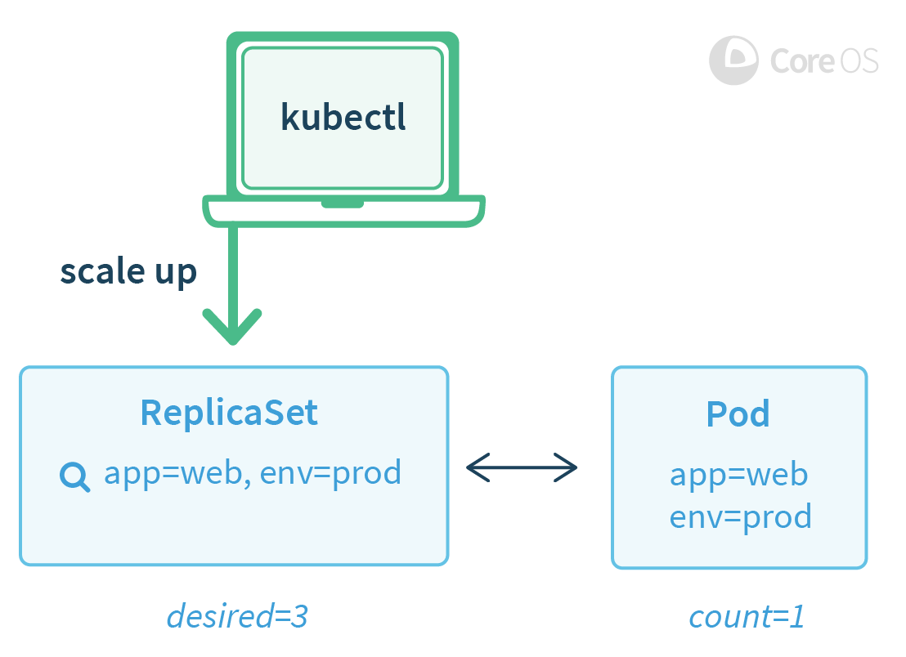
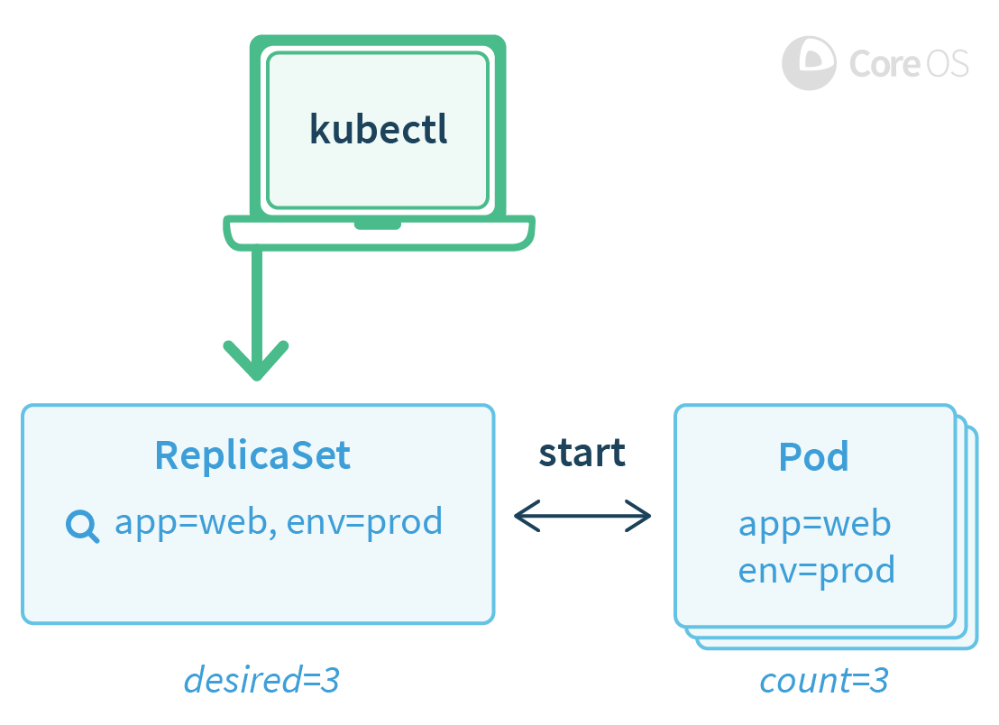
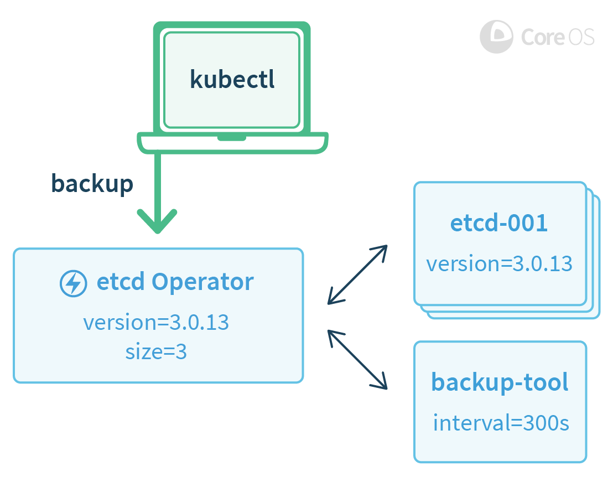

## Introducing Operators: Putting Operational Knowledge into Software

A Site Reliability Engineer (SRE) is a person that operates an application by writing software. They are an engineer, a developer, who knows how to develop software specifically for a particular application domain. The resulting piece of software has an application's operational domain knowledge programmed into it.  站点可靠性工程师（SRE）是通过编写软件来运行应用程序的人员。 他们是工程师，开发人员，知道如何专门为特定应用程序域开发软件。 由此产生的软件具有编程到其中的应用程序的操作领域知识。

Our team has been busy in the Kubernetes community designing and implementing this concept to reliably create, configure, and manage complex application instances atop Kubernetes.  我们的团队一直忙于Kubernetes社区，设计和实现这一概念，以便在Kubernetes上可靠地创建，配置和管理复杂的应用程序实例。

We call this new class of software Operators. An Operator is an application-specific controller that extends the Kubernetes API to create, configure, and manage instances of complex stateful applications on behalf of a Kubernetes user. It builds upon the basic Kubernetes resource and controller concepts but includes domain or application-specific knowledge to automate common tasks.  我们将这类新的软件称为操作员。 Operator是一个特定于应用程序的控制器，它扩展了Kubernetes API，以代表Kubernetes用户创建，配置和管理复杂有状态应用程序的实例。 它建立在基本的Kubernetes资源和控制器概念的基础上，但包括领域或特定于应用程序的知识，以自动执行常见任务。

### Stateless is Easy, Stateful is Hard

With Kubernetes, it is relatively easy to manage and scale web apps, mobile backends, and API services right out of the box. Why? Because these applications are generally stateless, so the basic Kubernetes APIs, like Deployments, can scale and recover from failures without additional knowledge.  使用Kubernetes，开箱即用地管理和扩展Web应用程序，移动后端和API服务相对容易。 为什么？ 由于这些应用程序通常是无状态的，因此基本的Kubernetes API（如部署）可以在没有其他知识的情况下从故障中扩展和恢复。

A larger challenge is managing stateful applications, like databases, caches, and monitoring systems. These systems require application domain knowledge to correctly scale, upgrade, and reconfigure while protecting against data loss or unavailability. We want this application-specific operational knowledge encoded into software that leverages the powerful Kubernetes abstractions to run and manage the application correctly.  更大的挑战是管理有状态的应用程序，如数据库，缓存和监视系统。 这些系统需要应用领域知识才能正确扩展，升级和重新配置，同时防止数据丢失或不可用。 我们希望将这种特定于应用程序的操作知识编码到软件中，利用功能强大的Kubernetes抽象来正确运行和管理应用程序。

An Operator is software that encodes this domain knowledge and extends the Kubernetes API through the third party resources mechanism, enabling users to create, configure, and manage applications. Like Kubernetes's built-in resources, an Operator doesn't manage just a single instance of the application, but multiple instances across the cluster.  运营商是对该领域知识进行编码并通过第三方资源机制扩展Kubernetes API的软件，使用户能够创建，配置和管理应用程序。 与Kubernetes的内置资源一样，运营商不仅管理应用程序的单个实例，而是管理群集中的多个实例。

To demonstrate the Operator concept in running code, we have two concrete examples to announce as open source projects today:  为了演示运行代码中的Operator概念，我们今天有两个具体的例子宣布为开源项目：

1. The etcd Operator creates, configures, and manages etcd clusters. etcd is a reliable, distributed key-value store introduced by CoreOS for sustaining the most critical data in a distributed system, and is the primary configuration datastore of Kubernetes itself.
2. The Prometheus Operator creates, configures, and manages Prometheus monitoring instances. Prometheus is a powerful monitoring, metrics, and alerting tool, and a Cloud Native Computing Foundation (CNCF) project supported by the CoreOS team.

### How is an Operator Built?

Operators build upon two central Kubernetes concepts: Resources and Controllers. As an example, the built-in ReplicaSet resource lets users set a desired number number of Pods to run, and controllers inside Kubernetes ensure the desired state set in the ReplicaSet resource remains true by creating or removing running Pods. There are many fundamental controllers and resources in Kubernetes that work in this manner, including Services, Deployments, and Daemon Sets.  运营商基于两个核心的Kubernetes概念：资源和控制器。 例如，内置的ReplicaSet资源允许用户设置要运行的所需数量的Pod，而Kubernetes中的控制器通过创建或删除正在运行的Pod来确保ReplicaSet资源中设置的所需状态保持为真。 Kubernetes中有许多以这种方式工作的基本控制器和资源，包括服务，部署和守护程序集。

Example 1a: A single pod is running, and the user updates the desired Pod count to 3.

Example 1b: A few moments later and controllers inside of Kubernetes have created new Pods to meet the user's request.

An Operator builds upon the basic Kubernetes resource and controller concepts and adds a set of knowledge or configuration that allows the Operator to execute common application tasks. For example, when scaling an etcd cluster manually, a user has to perform a number of steps: create a DNS name for the new etcd member, launch the new etcd instance, and then use the etcd administrative tools (etcdctl member add) to tell the existing cluster about this new member. Instead with the etcd Operator a user can simply increase the etcd cluster size field by 1.  运算符基于Kubernetes的基本资源和控制器概念，并添加一组知识或配置，允许操作员执行常见的应用程序任务。 例如，当手动扩展etcd集群时，用户必须执行许多步骤：为新的etcd成员创建DNS名称，启动新的etcd实例，然后使用etcd管理工具（etcdctl成员添加）来告诉 关于这个新成员的现有集群。 而使用etcd运算符，用户可以简单地将etcd簇大小字段增加1。

Example 2: A backup is triggered by a user with kubectl

Other examples of complex administrative tasks that an Operator might handle include safe coordination of application upgrades, configuration of backups to offsite storage, service discovery via native Kubernetes APIs, application TLS certificate configuration, and disaster recovery.

### How can you create an Operator?

Operators, by their nature, are application-specific, so the hard work is going to be encoding all of the application operational domain knowledge into a reasonable configuration resource and control loop. There are some common patterns that we have found while building operators that we think are important for any application:  操作员本质上是特定于应用程序的，因此艰苦的工作是将所有应用程序操作领域知识编码到合理的配置资源和控制循环中。 在构建我们认为对任何应用程序都很重要的运算符时，我们发现了一些常见的模式：

1. Operators should install as a single deployment e.g. 
   `kubectl create -f https://coreos.com/operators/etcd/latest/deployment.yaml` and take no additional action once installed.

2. Operators should create a new third party type when installed into Kubernetes. A user will create new application instance using this type.

3. Operators should leverage built-in Kubernetes primitives like Services and Replica Sets when possible to leverage well-tested and well-understood code.  运营商应尽可能利用内置的Kubernetes原语（如服务和副本集）来利用经过充分测试和易于理解的代码。

4. Operators should be backwards compatible and always understand previous versions of resources a user has created.  操作员应向后兼容，并始终了解用户创建的以前版本的资源。

5. Operators should be designed so application instances continue to run unaffected if the Operator is stopped or removed.  应设计运算符，以便在停止或删除运算符时，应用程序实例继续不受影响。

6. Operators should give users the ability to declare a desired version and orchestrate application upgrades based on the desired version. Not upgrading software is a common source of operational bugs and security issues and Operators can help users more confidently address this burden.  操作员应该让用户能够声明所需的版本并根据所需的版本协调应用程序升级。 不升级软件是操作错误和安全问题的常见来源，操作员可以帮助用户更自信地解决这一负担。

7. Operators should be tested against a "Chaos Monkey" test suite that simulates potential failures of Pods, configuration, and networking.  运营商应该针对“混沌猴”测试套件进行测试，该套件模拟Pod，配置和网络的潜在故障。

### The Future of Operators

The etcd Operator and Prometheus Operator introduced by CoreOS today showcase the power of the Kubernetes platform. For the last year, we have worked alongside the wider Kubernetes community, laser-focused on making Kubernetes stable, secure, easy to manage, and quick to install.  今天CoreOS推出的etcd Operator和Prometheus Operator展示了Kubernetes平台的强大功能。 去年，我们与更广泛的Kubernetes社区合作，专注于使Kubernetes稳定，安全，易于管理和快速安装。

Now, as the foundation for Kubernetes has been laid, our new focus is the system to be built on top: software that extends Kubernetes with new capabilities. We envision a future where users install Postgres Operators, Cassandra Operators, or Redis Operators on their Kubernetes clusters, and operate scalable instances of these programs as easily they deploy replicas of their stateless web applications today.   现在，作为Kubernetes的基础，我们的新焦点是建立在顶层的系统：用新功能扩展Kubernetes的软件。 我们设想未来用户可以在其Kubernetes集群上安装Postgres Operators，Cassandra Operators或Redis Operators，并且可以轻松地运行这些程序的可扩展实例，从而轻松部署其无状态Web应用程序的副本。 

[参考](https://coreos.com/blog/introducing-operators.html)
